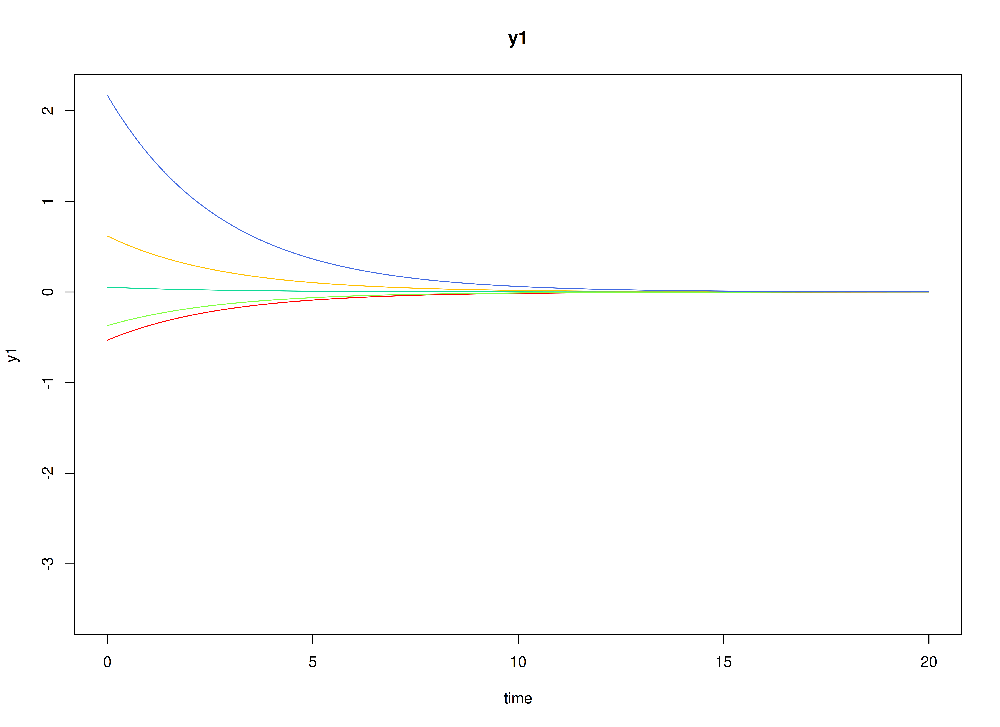
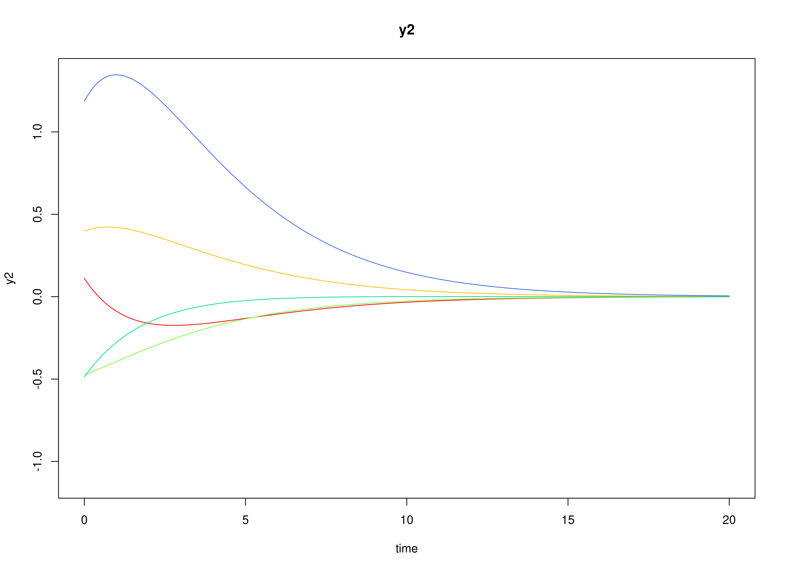
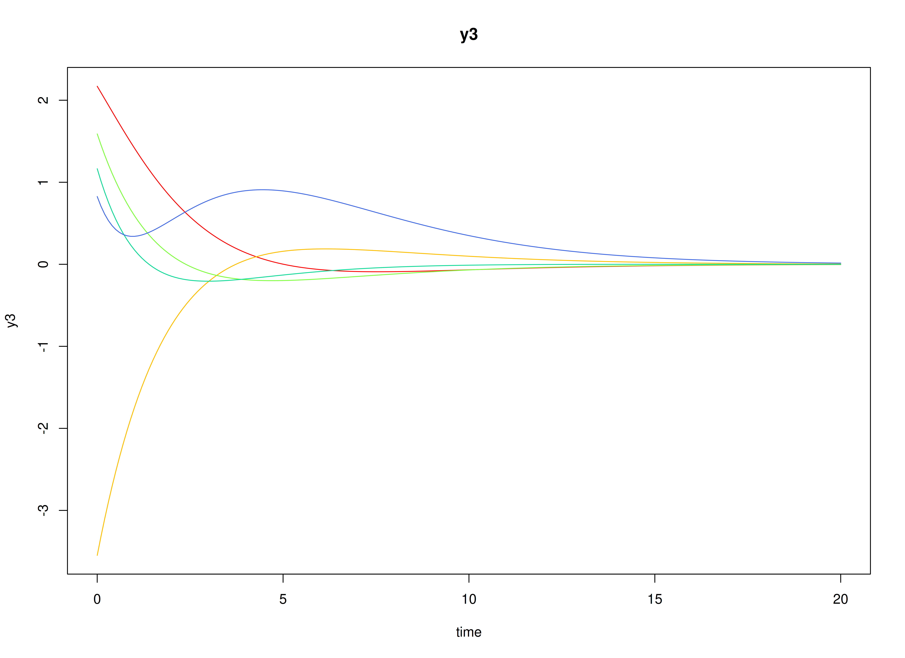
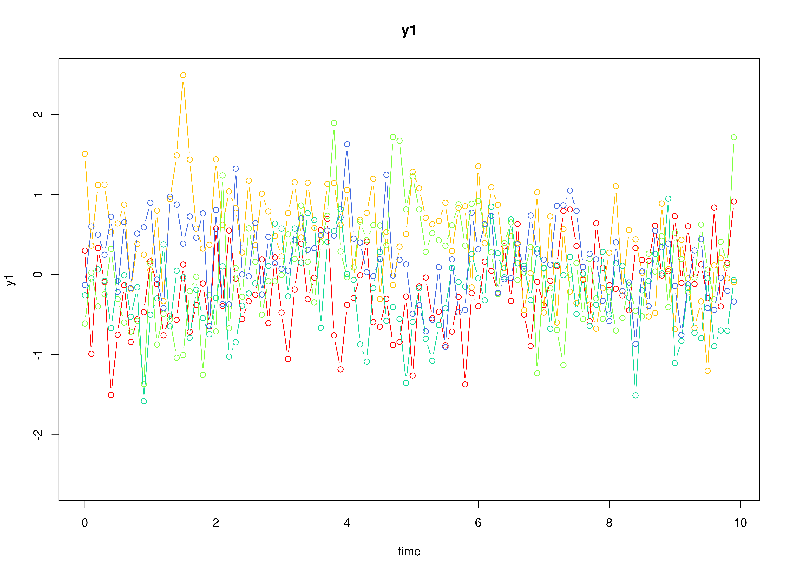
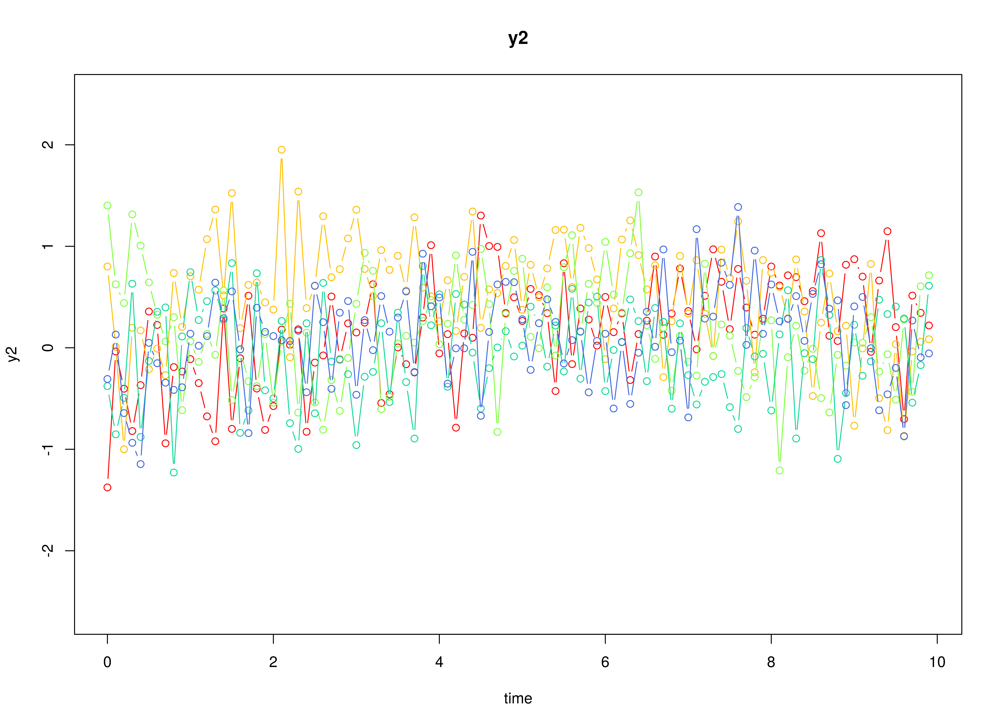
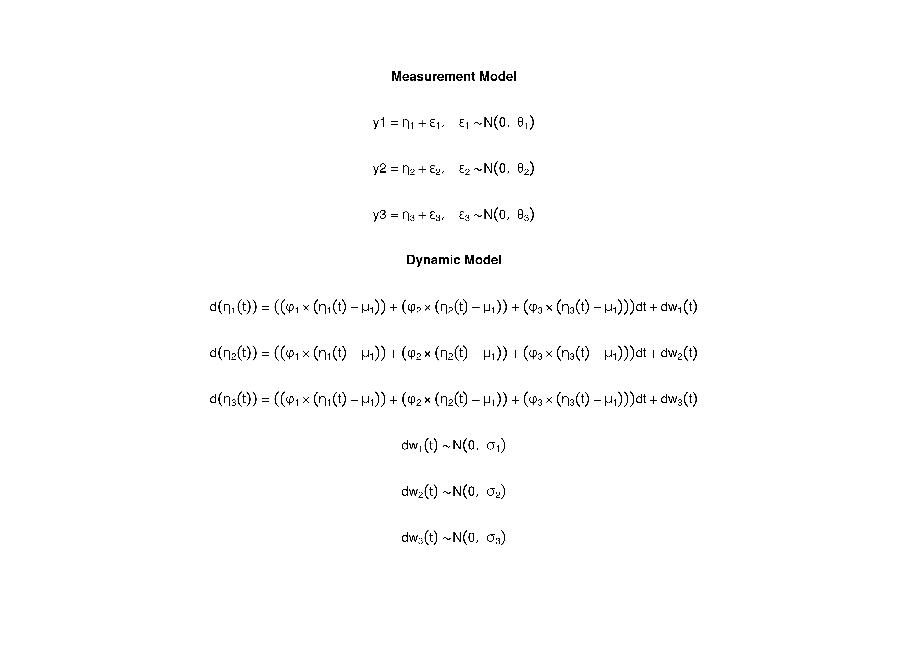

# The Ornstein-Uhlenbeck Model

## Model

The measurement model is given by
``` math
\begin{equation}
  \mathbf{y}_{i, t}
  =
  \boldsymbol{\nu}
  +
  \boldsymbol{\Lambda}
  \boldsymbol{\eta}_{i, t}
  +
  \boldsymbol{\varepsilon}_{i, t},
  \quad
  \mathrm{with}
  \quad
  \boldsymbol{\varepsilon}_{i, t}
  \sim
  \mathcal{N}
  \left(
  \mathbf{0},
  \boldsymbol{\Theta}
  \right)
\end{equation}
```
where $`\mathbf{y}_{i, t}`$, $`\boldsymbol{\eta}_{i, t}`$, and
$`\boldsymbol{\varepsilon}_{i, t}`$ are random variables and
$`\boldsymbol{\nu}`$, $`\boldsymbol{\Lambda}`$, and
$`\boldsymbol{\Theta}`$ are model parameters. $`\mathbf{y}_{i, t}`$
represents a vector of observed random variables,
$`\boldsymbol{\eta}_{i, t}`$ a vector of latent random variables, and
$`\boldsymbol{\varepsilon}_{i, t}`$ a vector of random measurement
errors, at time $`t`$ and individual $`i`$. $`\boldsymbol{\nu}`$ denotes
a vector of intercepts, $`\boldsymbol{\Lambda}`$ a matrix of factor
loadings, and $`\boldsymbol{\Theta}`$ the covariance matrix of
$`\boldsymbol{\varepsilon}`$.

An alternative representation of the measurement error is given by
``` math
\begin{equation}
  \boldsymbol{\varepsilon}_{i, t}
  =
  \boldsymbol{\Theta}^{\frac{1}{2}}
  \mathbf{z}_{i, t},
  \quad
  \mathrm{with}
  \quad
  \mathbf{z}_{i, t}
  \sim
  \mathcal{N}
  \left(
  \mathbf{0},
  \mathbf{I}
  \right)
\end{equation}
```
where $`\mathbf{z}_{i, t}`$ is a vector of independent standard normal
random variables and
$`\left( \boldsymbol{\Theta}^{\frac{1}{2}} \right) \left( \boldsymbol{\Theta}^{\frac{1}{2}} \right)^{\prime} = \boldsymbol{\Theta}`$
.

The dynamic structure is given by
``` math
\begin{equation}
  \mathrm{d} \boldsymbol{\eta}_{i, t}
  =
  \boldsymbol{\Phi}
  \left(
  \boldsymbol{\eta}_{i, t}
  -
  \boldsymbol{\mu}
  \right)
  \mathrm{d}t
  +
  \boldsymbol{\Sigma}^{\frac{1}{2}}
  \mathrm{d}
  \mathbf{W}_{i, t}
\end{equation}
```
where $`\boldsymbol{\mu}`$ is the long-term mean or equilibrium level,
$`\boldsymbol{\Phi}`$ is the rate of mean reversion, determining how
quickly the variable returns to its mean, $`\boldsymbol{\Sigma}`$ is the
matrix of volatility or randomness in the process, and
$`\mathrm{d}\boldsymbol{W}`$ is a Wiener process or Brownian motion,
which represents random fluctuations.

## Data Generation

### Notation

Let $`t = 500`$ be the number of time points and $`n = 100`$ be the
number of individuals.

Let the measurement model intecept vector $`\boldsymbol{\nu}`$ be given
by

``` math
\begin{equation}
\boldsymbol{\nu}
=
\left(
\begin{array}{c}
  0 \\
  0 \\
  0 \\
\end{array}
\right) .
\end{equation}
```

Let the factor loadings matrix $`\boldsymbol{\Lambda}`$ be given by

``` math
\begin{equation}
\boldsymbol{\Lambda}
=
\left(
\begin{array}{ccc}
  1 & 0 & 0 \\
  0 & 1 & 0 \\
  0 & 0 & 1 \\
\end{array}
\right) .
\end{equation}
```

Let the measurement error covariance matrix $`\boldsymbol{\Theta}`$ be
given by

``` math
\begin{equation}
\boldsymbol{\Theta}
=
\left(
\begin{array}{ccc}
  0.2 & 0 & 0 \\
  0 & 0.2 & 0 \\
  0 & 0 & 0.2 \\
\end{array}
\right) .
\end{equation}
```

Let the initial condition $`\boldsymbol{\eta}_{0}`$ be given by

``` math
\begin{equation}
\boldsymbol{\eta}_{0} \sim \mathcal{N} \left( \boldsymbol{\mu}_{\boldsymbol{\eta} \mid 0}, \boldsymbol{\Sigma}_{\boldsymbol{\eta} \mid 0} \right)
\end{equation}
```

``` math
\begin{equation}
\boldsymbol{\mu}_{\boldsymbol{\eta} \mid 0}
=
\left(
\begin{array}{c}
  0 \\
  0 \\
  0 \\
\end{array}
\right)
\end{equation}
```

``` math
\begin{equation}
\boldsymbol{\Sigma}_{\boldsymbol{\eta} \mid 0}
=
\left(
\begin{array}{ccc}
  0.3425148 & 0.3296023 & 0.0343817 \\
  0.3296023 & 0.5664625 & 0.2545955 \\
  0.0343817 & 0.2545955 & 0.2999909 \\
\end{array}
\right) .
\end{equation}
```

Let the long-term mean vector $`\boldsymbol{\mu}`$ be given by

``` math
\begin{equation}
\boldsymbol{\mu}
=
\left(
\begin{array}{c}
  0 \\
  0 \\
  0 \\
\end{array}
\right) .
\end{equation}
```

Let the rate of mean reversion matrix $`\boldsymbol{\Phi}`$ be given by

``` math
\begin{equation}
\boldsymbol{\Phi}
=
\left(
\begin{array}{ccc}
  -0.357 & 0 & 0 \\
  0.771 & -0.511 & 0 \\
  -0.45 & 0.729 & -0.693 \\
\end{array}
\right) .
\end{equation}
```

Let the dynamic process noise covariance matrix $`\boldsymbol{\Sigma}`$
be given by

``` math
\begin{equation}
\boldsymbol{\Sigma}
=
\left(
\begin{array}{ccc}
  0.2445556 & 0.0220159 & -0.0500476 \\
  0.0220159 & 0.070678 & 0.0153946 \\
  -0.0500476 & 0.0153946 & 0.0755306 \\
\end{array}
\right) .
\end{equation}
```

Let $`\Delta t = 0.1`$.

### R Function Arguments

``` r

n
#> [1] 100
time
#> [1] 500
delta_t
#> [1] 0.1
mu0
#> [1] 0 0 0
sigma0
#>           [,1]      [,2]      [,3]
#> [1,] 0.3425148 0.3296023 0.0343817
#> [2,] 0.3296023 0.5664625 0.2545955
#> [3,] 0.0343817 0.2545955 0.2999909
sigma0_l # sigma0_l <- t(chol(sigma0))
#>            [,1]      [,2]      [,3]
#> [1,] 0.58524763 0.0000000 0.0000000
#> [2,] 0.56318429 0.4992855 0.0000000
#> [3,] 0.05874726 0.4436540 0.3157701
mu
#> [1] 0 0 0
phi
#>        [,1]   [,2]   [,3]
#> [1,] -0.357  0.000  0.000
#> [2,]  0.771 -0.511  0.000
#> [3,] -0.450  0.729 -0.693
sigma
#>             [,1]       [,2]        [,3]
#> [1,]  0.24455556 0.02201587 -0.05004762
#> [2,]  0.02201587 0.07067800  0.01539456
#> [3,] -0.05004762 0.01539456  0.07553061
sigma_l # sigma_l <- t(chol(sigma))
#>             [,1]      [,2]     [,3]
#> [1,]  0.49452559 0.0000000 0.000000
#> [2,]  0.04451917 0.2620993 0.000000
#> [3,] -0.10120330 0.0759256 0.243975
nu
#> [1] 0 0 0
lambda
#>      [,1] [,2] [,3]
#> [1,]    1    0    0
#> [2,]    0    1    0
#> [3,]    0    0    1
theta
#>      [,1] [,2] [,3]
#> [1,]  0.2  0.0  0.0
#> [2,]  0.0  0.2  0.0
#> [3,]  0.0  0.0  0.2
theta_l # theta_l <- t(chol(theta))
#>           [,1]      [,2]      [,3]
#> [1,] 0.4472136 0.0000000 0.0000000
#> [2,] 0.0000000 0.4472136 0.0000000
#> [3,] 0.0000000 0.0000000 0.4472136
```

### Visualizing the Dynamics Without Measurement Error and Process Noise (n = 5 with Different Initial Condition)



### Using the `SimSSMOUFixed` Function from the `simStateSpace` Package to Simulate Data

``` r

library(simStateSpace)
sim <- SimSSMOUFixed(
  n = n,
  time = time,
  delta_t = delta_t,
  mu0 = mu0,
  sigma0_l = sigma0_l,
  mu = mu,
  phi = phi,
  sigma_l = sigma_l,
  nu = nu,
  lambda = lambda,
  theta_l = theta_l,
  type = 0
)
data <- as.data.frame(sim)
head(data)
#>   id time          y1         y2         y3
#> 1  1  0.0  0.45047365 -1.2185550  0.6708638
#> 2  1  0.1 -0.84190461  0.1242594  0.1813493
#> 3  1  0.2  0.47289651 -0.2398710  0.5995107
#> 4  1  0.3  0.04089817 -0.6547109  0.4674929
#> 5  1  0.4 -1.37222946 -0.2010512 -0.3341885
#> 6  1  0.5 -0.62410106  0.5262251 -0.1892906
summary(data)
#>        id              time             y1                  y2            
#>  Min.   :  1.00   Min.   : 0.00   Min.   :-3.088974   Min.   :-3.3705197  
#>  1st Qu.: 25.75   1st Qu.:12.47   1st Qu.:-0.495395   1st Qu.:-0.5869853  
#>  Median : 50.50   Median :24.95   Median :-0.001893   Median :-0.0004440  
#>  Mean   : 50.50   Mean   :24.95   Mean   : 0.001892   Mean   : 0.0001166  
#>  3rd Qu.: 75.25   3rd Qu.:37.42   3rd Qu.: 0.499799   3rd Qu.: 0.5876892  
#>  Max.   :100.00   Max.   :49.90   Max.   : 3.381345   Max.   : 3.4729591  
#>        y3           
#>  Min.   :-2.909151  
#>  1st Qu.:-0.479502  
#>  Median :-0.005854  
#>  Mean   :-0.002427  
#>  3rd Qu.: 0.471538  
#>  Max.   : 2.847363
plot(sim)
```



## Model Fitting

### Prepare Data

``` r

dynr_data <- dynr::dynr.data(
  dataframe = data,
  id = "id",
  time = "time",
  observed = c("y1", "y2", "y3")
)
```

### Prepare Initial Condition

``` r

dynr_initial <- dynr::prep.initial(
  values.inistate = mu0,
  params.inistate = c("mu0_1_1", "mu0_2_1", "mu0_3_1"),
  values.inicov = sigma0,
  params.inicov = matrix(
    data = c(
      "sigma0_1_1", "sigma0_2_1", "sigma0_3_1",
      "sigma0_2_1", "sigma0_2_2", "sigma0_3_2",
      "sigma0_3_1", "sigma0_3_2", "sigma0_3_3"
    ),
    nrow = 3
  )
)
```

### Prepare Measurement Model

``` r

dynr_measurement <- dynr::prep.measurement(
  values.load = diag(3),
  params.load = matrix(data = "fixed", nrow = 3, ncol = 3),
  state.names = c("eta_1", "eta_2", "eta_3"),
  obs.names = c("y1", "y2", "y3")
)
```

### Prepare Dynamic Process

``` r

dynr_dynamics <- dynr::prep.formulaDynamics(
  formula = list(  
    eta_1 ~ (phi_1_1 * (eta_1 - mu_1_1)) + (phi_1_2 * (eta_2 - mu_2_1)) + (phi_1_3 * (eta_3 - mu_3_1)),
    eta_2 ~ (phi_2_1 * (eta_1 - mu_1_1)) + (phi_2_2 * (eta_2 - mu_2_1)) + (phi_2_3 * (eta_3 - mu_3_1)),
    eta_3 ~ (phi_3_1 * (eta_1 - mu_1_1)) + (phi_3_2 * (eta_2 - mu_2_1)) + (phi_3_3 * (eta_3 - mu_3_1))
  ),
  startval = c(
    mu_1_1 = mu[1], mu_2_1 = mu[2], mu_3_1 = mu[3],
    phi_1_1 = phi[1, 1], phi_1_2 = phi[1, 2], phi_1_3 = phi[1, 3],
    phi_2_1 = phi[2, 1], phi_2_2 = phi[2, 2], phi_2_3 = phi[2, 3],
    phi_3_1 = phi[3, 1], phi_3_2 = phi[3, 2], phi_3_3 = phi[3, 3]
  ),
  isContinuousTime = TRUE
)
```

### Prepare Process Noise

``` r

dynr_noise <- dynr::prep.noise(
  values.latent = sigma,
  params.latent = matrix(
    data = c(
      "sigma_1_1", "sigma_2_1", "sigma_3_1",
      "sigma_2_1", "sigma_2_2", "sigma_3_2",
      "sigma_3_1", "sigma_3_2", "sigma_3_3"
    ),
    nrow = 3
  ),
  values.observed = theta,
  params.observed = matrix(
    data = c(
      "theta_1_1", "fixed", "fixed",
      "fixed", "theta_2_2", "fixed",
      "fixed", "fixed", "theta_3_3"
    ),
    nrow = 3
  )
)
```

### Prepare the Model

``` r

model <- dynr::dynr.model(
  data = dynr_data,
  initial = dynr_initial,
  measurement = dynr_measurement,
  dynamics = dynr_dynamics,
  noise = dynr_noise,
  outfile = "ou.c"
)
```

Add lower and upper bounds to aid in the optimization.

``` r

model$lb[
  c(
    "phi_1_1",
    "phi_1_2",
    "phi_1_3",
    "phi_2_1",
    "phi_2_2",
    "phi_2_3",
    "phi_3_1",
    "phi_3_2",
    "phi_3_3"
  )
] <- -1.5
model$ub[
  c(
    "phi_1_1",
    "phi_1_2",
    "phi_1_3",
    "phi_2_1",
    "phi_2_2",
    "phi_2_3",
    "phi_3_1",
    "phi_3_2",
    "phi_3_3"
  )
] <- +1.5
```



### Fit the Model

``` r

results <- dynr::dynr.cook(
  model,
  debug_flag = TRUE,
  verbose = FALSE
)
#> [1] "Get ready!!!!"
#> using C compiler: ‘gcc (Ubuntu 13.3.0-6ubuntu2~24.04) 13.3.0’
#> Optimization function called.
#> Starting Hessian calculation ...
#> Finished Hessian calculation.
#> Original exit flag:  3 
#> Modified exit flag:  3 
#> Optimization terminated successfully: ftol_rel or ftol_abs was reached. 
#> Original fitted parameters:  0.0003601474 0.0005084053 0.001608575 -0.3219241 
#> -0.02788176 0.01542201 0.7628195 -0.5073321 0.01114979 -0.4479966 0.7295014 
#> -0.6992285 -1.421929 0.0879919 -0.2133477 -2.668744 0.2834391 -2.863673 
#> -1.607219 -1.615048 -1.605471 -0.03091122 -0.03188498 -0.01945298 -1.185041 
#> 1.151406 0.2899886 -1.512262 0.9287701 -1.887663 
#> 
#> Transformed fitted parameters:  0.0003601474 0.0005084053 0.001608575 
#> -0.3219241 -0.02788176 0.01542201 0.7628195 -0.5073321 0.01114979 -0.4479966 
#> 0.7295014 -0.6992285 0.2412483 0.02122789 -0.05146976 0.07120711 0.01512453 
#> 0.07361031 0.2004442 0.1988811 0.200795 -0.03091122 -0.03188498 -0.01945298 
#> 0.3057336 0.3520235 0.08865926 0.6257328 0.3067938 0.367265 
#> 
#> Doing end processing
#> Successful trial
#> Total Time: 1.16646 
#> Backend Time: 1.166255
```

## Summary

``` r

summary(results)
#> Coefficients:
#>              Estimate Std. Error t value   ci.lower   ci.upper Pr(>|t|)    
#> mu_1_1      0.0003601  0.0200307   0.018 -0.0388994  0.0396197   0.4928    
#> mu_2_1      0.0005084  0.0324819   0.016 -0.0631550  0.0641718   0.4938    
#> mu_3_1      0.0016086  0.0210399   0.076 -0.0396289  0.0428460   0.4695    
#> phi_1_1    -0.3219241  0.0667150  -4.825 -0.4526831 -0.1911650   <2e-16 ***
#> phi_1_2    -0.0278818  0.0587554  -0.475 -0.1430403  0.0872768   0.3176    
#> phi_1_3     0.0154220  0.0441210   0.350 -0.0710537  0.1018977   0.3633    
#> phi_2_1     0.7628195  0.0355593  21.452  0.6931245  0.8325146   <2e-16 ***
#> phi_2_2    -0.5073321  0.0316662 -16.021 -0.5693966 -0.4452675   <2e-16 ***
#> phi_2_3     0.0111498  0.0241232   0.462 -0.0361307  0.0584303   0.3220    
#> phi_3_1    -0.4479966  0.0357654 -12.526 -0.5180956 -0.3778977   <2e-16 ***
#> phi_3_2     0.7295014  0.0319361  22.842  0.6669077  0.7920951   <2e-16 ***
#> phi_3_3    -0.6992285  0.0247002 -28.309 -0.7476400 -0.6508170   <2e-16 ***
#> sigma_1_1   0.2412483  0.0113787  21.202  0.2189464  0.2635502   <2e-16 ***
#> sigma_2_1   0.0212279  0.0039539   5.369  0.0134785  0.0289773   <2e-16 ***
#> sigma_3_1  -0.0514698  0.0040527 -12.700 -0.0594129 -0.0435266   <2e-16 ***
#> sigma_2_2   0.0712071  0.0028219  25.234  0.0656764  0.0767379   <2e-16 ***
#> sigma_3_2   0.0151245  0.0019996   7.564  0.0112054  0.0190436   <2e-16 ***
#> sigma_3_3   0.0736103  0.0030179  24.391  0.0676952  0.0795254   <2e-16 ***
#> theta_1_1   0.2004442  0.0017368 115.408  0.1970401  0.2038483   <2e-16 ***
#> theta_2_2   0.1988811  0.0014141 140.645  0.1961096  0.2016526   <2e-16 ***
#> theta_3_3   0.2007950  0.0014361 139.821  0.1979803  0.2036097   <2e-16 ***
#> mu0_1_1    -0.0309112  0.0615052  -0.503 -0.1514591  0.0896367   0.3076    
#> mu0_2_1    -0.0318850  0.0829510  -0.384 -0.1944660  0.1306960   0.3503    
#> mu0_3_1    -0.0194530  0.0649109  -0.300 -0.1466760  0.1077701   0.3822    
#> sigma0_1_1  0.3057336  0.0554809   5.511  0.1969929  0.4144742   <2e-16 ***
#> sigma0_2_1  0.3520235  0.0637923   5.518  0.2269930  0.4770540   <2e-16 ***
#> sigma0_3_1  0.0886593  0.0431988   2.052  0.0039911  0.1733274   0.0201 *  
#> sigma0_2_2  0.6257328  0.0944587   6.624  0.4405971  0.8108685   <2e-16 ***
#> sigma0_3_2  0.3067938  0.0603123   5.087  0.1885839  0.4250036   <2e-16 ***
#> sigma0_3_3  0.3672650  0.0580801   6.323  0.2534300  0.4810999   <2e-16 ***
#> ---
#> Signif. codes:  0 '***' 0.001 '**' 0.01 '*' 0.05 '.' 0.1 ' ' 1
#> 
#> -2 log-likelihood value at convergence = 214846.05
#> AIC = 214906.05
#> BIC = 215170.65
```

### Parameter Estimates

``` r

mu_hat
#> [1] 0.0003601474 0.0005084053 0.0016085750
phi_hat
#>            [,1]        [,2]        [,3]
#> [1,] -0.3219241 -0.02788176  0.01542201
#> [2,]  0.7628195 -0.50733206  0.01114979
#> [3,] -0.4479966  0.72950140 -0.69922850
sigma_hat
#>             [,1]       [,2]        [,3]
#> [1,]  0.24124829 0.02122789 -0.05146976
#> [2,]  0.02122789 0.07120711  0.01512453
#> [3,] -0.05146976 0.01512453  0.07361031
theta_hat
#>           [,1]      [,2]     [,3]
#> [1,] 0.2004442 0.0000000 0.000000
#> [2,] 0.0000000 0.1988811 0.000000
#> [3,] 0.0000000 0.0000000 0.200795
mu0_hat
#> [1] -0.03091122 -0.03188498 -0.01945298
sigma0_hat
#>            [,1]      [,2]       [,3]
#> [1,] 0.30573358 0.3520235 0.08865926
#> [2,] 0.35202350 0.6257328 0.30679379
#> [3,] 0.08865926 0.3067938 0.36726495
beta_var1_hat <- expm::expm(phi_hat)
beta_var1_hat
#>            [,1]        [,2]        [,3]
#> [1,]  0.7162158 -0.01500407 0.009187208
#> [2,]  0.5015827  0.59846277 0.009626653
#> [3,] -0.1022063  0.40207435 0.498004354
```

## References

Chow, S.-M., Ho, M. R., Hamaker, E. L., & Dolan, C. V. (2010).
Equivalence and differences between structural equation modeling and
state-space modeling techniques. *Structural Equation Modeling: A
Multidisciplinary Journal*, *17*(2), 303–332.
<https://doi.org/10.1080/10705511003661553>

Chow, S.-M., Losardo, D., Park, J., & Molenaar, P. C. M. (2023).
Continuous-time dynamic models: Connections to structural equation
models and other discrete-time models. In R. H. Hoyle (Ed.), *Handbook
of structural equation modeling* (2nd ed.). The Guilford Press.

Deboeck, P. R., & Preacher, K. J. (2015). No need to be discrete: A
method for continuous time mediation analysis. *Structural Equation
Modeling: A Multidisciplinary Journal*, *23*(1), 61–75.
<https://doi.org/10.1080/10705511.2014.973960>

Oravecz, Z., Tuerlinckx, F., & Vandekerckhove, J. (2011). A hierarchical
latent stochastic differential equation model for affective dynamics.
*Psychological Methods*, *16*(4), 468–490.
<https://doi.org/10.1037/a0024375>

Ou, L., Hunter, M. D., & Chow, S.-M. (2019). What’s for dynr: A package
for linear and nonlinear dynamic modeling in R. *The R Journal*,
*11*(1), 91. <https://doi.org/10.32614/rj-2019-012>

Pesigan, I. J. A., Russell, M. A., & Chow, S.-M. (2025). Inferences and
effect sizes for direct, indirect, and total effects in continuous-time
mediation models. *Psychological Methods*.
<https://doi.org/10.1037/met0000779>

R Core Team. (2024). *R: A language and environment for statistical
computing*. R Foundation for Statistical Computing.
<https://www.R-project.org/>

Uhlenbeck, G. E., & Ornstein, L. S. (1930). On the theory of the
brownian motion. *Physical Review*, *36*(5), 823–841.
<https://doi.org/10.1103/physrev.36.823>
