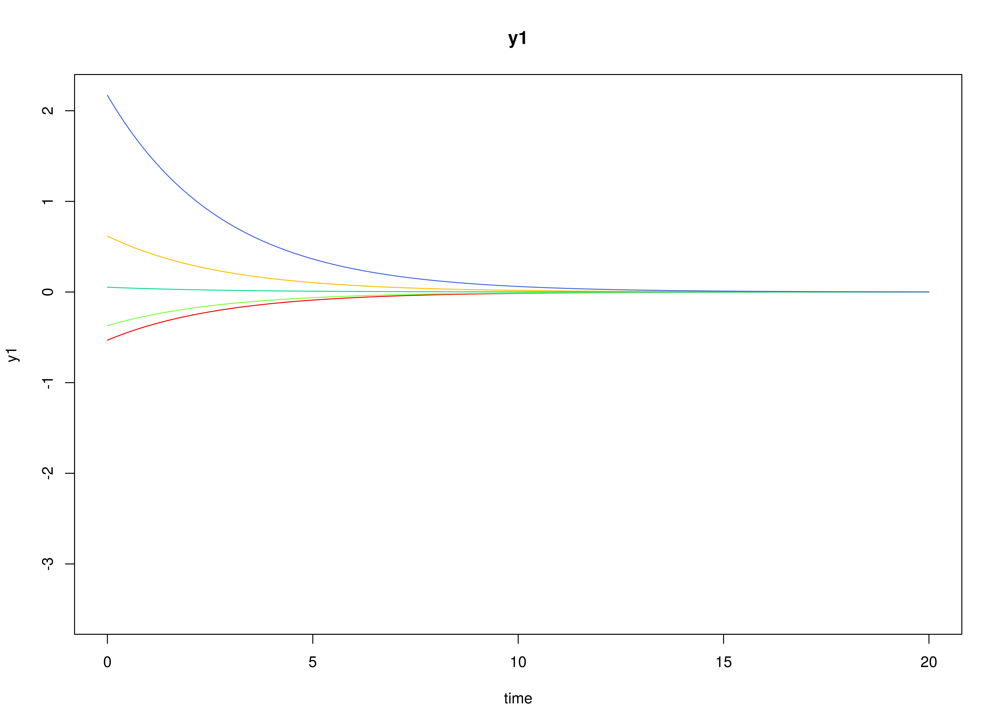
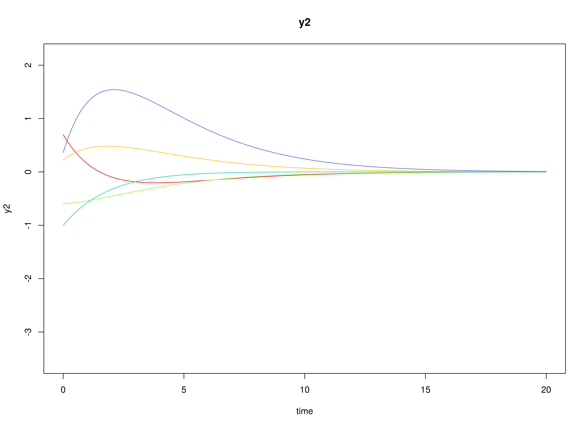
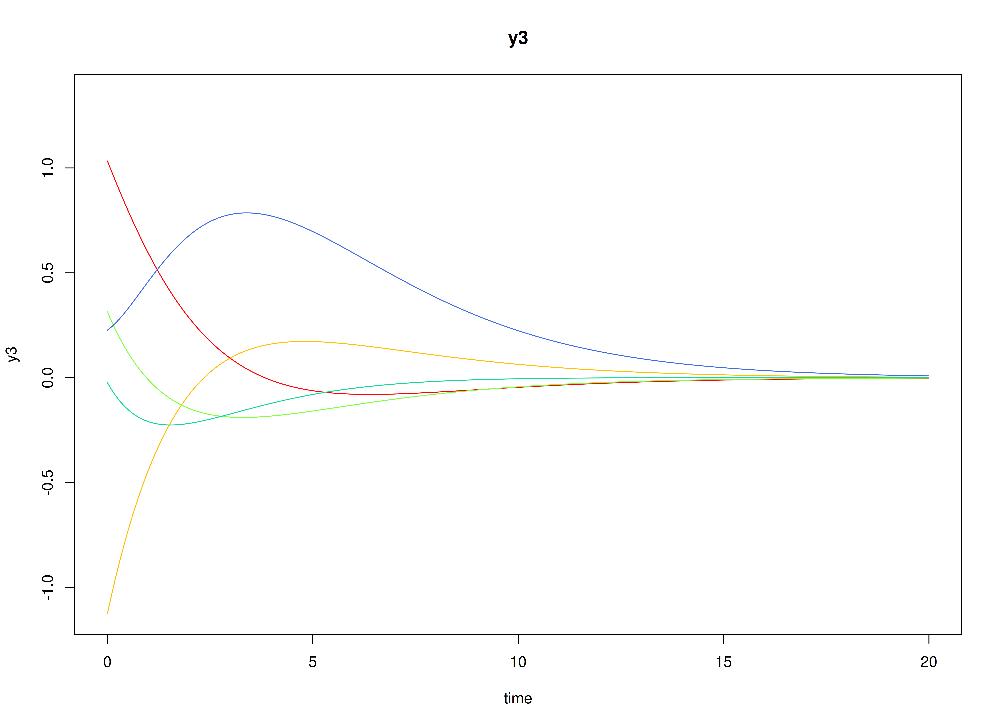
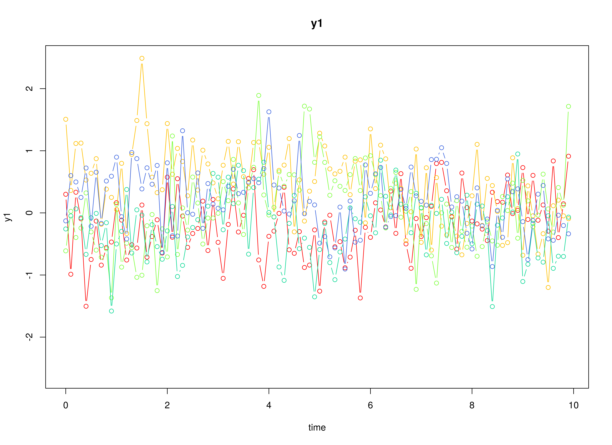
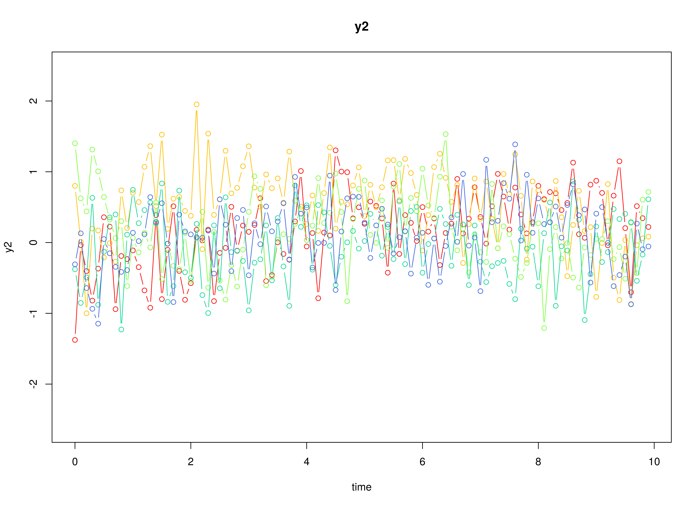
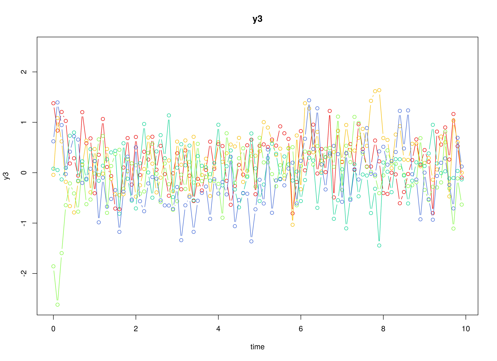
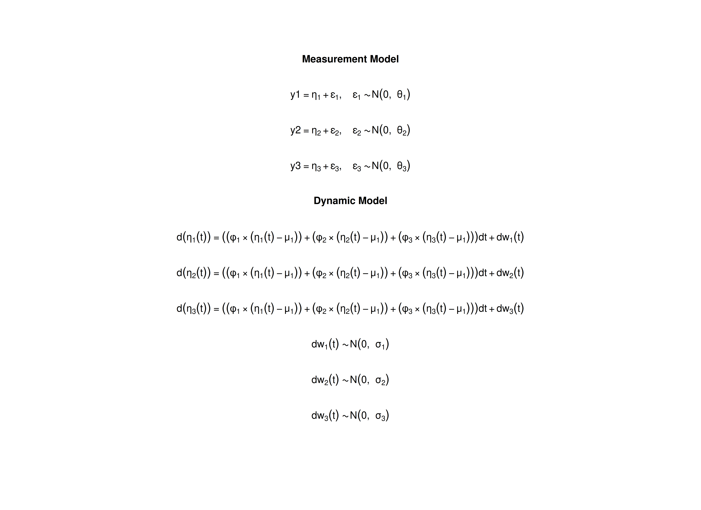

# The Ornstein-Uhlenbeck Model

## Model

The measurement model is given by
``` math
\begin{equation}
  \mathbf{y}_{i, t}
  =
  \boldsymbol{\nu}
  +
  \boldsymbol{\Lambda}
  \boldsymbol{\eta}_{i, t}
  +
  \boldsymbol{\varepsilon}_{i, t},
  \quad
  \mathrm{with}
  \quad
  \boldsymbol{\varepsilon}_{i, t}
  \sim
  \mathcal{N}
  \left(
  \mathbf{0},
  \boldsymbol{\Theta}
  \right)
\end{equation}
```
where $`\mathbf{y}_{i, t}`$, $`\boldsymbol{\eta}_{i, t}`$, and
$`\boldsymbol{\varepsilon}_{i, t}`$ are random variables and
$`\boldsymbol{\nu}`$, $`\boldsymbol{\Lambda}`$, and
$`\boldsymbol{\Theta}`$ are model parameters. $`\mathbf{y}_{i, t}`$
represents a vector of observed random variables,
$`\boldsymbol{\eta}_{i, t}`$ a vector of latent random variables, and
$`\boldsymbol{\varepsilon}_{i, t}`$ a vector of random measurement
errors, at time $`t`$ and individual $`i`$. $`\boldsymbol{\nu}`$ denotes
a vector of intercepts, $`\boldsymbol{\Lambda}`$ a matrix of factor
loadings, and $`\boldsymbol{\Theta}`$ the covariance matrix of
$`\boldsymbol{\varepsilon}`$.

An alternative representation of the measurement error is given by
``` math
\begin{equation}
  \boldsymbol{\varepsilon}_{i, t}
  =
  \boldsymbol{\Theta}^{\frac{1}{2}}
  \mathbf{z}_{i, t},
  \quad
  \mathrm{with}
  \quad
  \mathbf{z}_{i, t}
  \sim
  \mathcal{N}
  \left(
  \mathbf{0},
  \mathbf{I}
  \right)
\end{equation}
```
where $`\mathbf{z}_{i, t}`$ is a vector of independent standard normal
random variables and
$`\left( \boldsymbol{\Theta}^{\frac{1}{2}} \right) \left( \boldsymbol{\Theta}^{\frac{1}{2}} \right)^{\prime} = \boldsymbol{\Theta}`$
.

The dynamic structure is given by
``` math
\begin{equation}
  \mathrm{d} \boldsymbol{\eta}_{i, t}
  =
  \boldsymbol{\Phi}
  \left(
  \boldsymbol{\eta}_{i, t}
  -
  \boldsymbol{\mu}
  \right)
  \mathrm{d}t
  +
  \boldsymbol{\Sigma}^{\frac{1}{2}}
  \mathrm{d}
  \mathbf{W}_{i, t}
\end{equation}
```
where $`\boldsymbol{\mu}`$ is the long-term mean or equilibrium level,
$`\boldsymbol{\Phi}`$ is the rate of mean reversion, determining how
quickly the variable returns to its mean, $`\boldsymbol{\Sigma}`$ is the
matrix of volatility or randomness in the process, and
$`\mathrm{d}\boldsymbol{W}`$ is a Wiener process or Brownian motion,
which represents random fluctuations.

## Data Generation

### Notation

Let $`t = 100`$ be the number of time points and $`n = 50`$ be the
number of individuals.

Let the measurement model intecept vector $`\boldsymbol{\nu}`$ be given
by

``` math
\begin{equation}
\boldsymbol{\nu}
=
\left(
\begin{array}{c}
  0 \\
  0 \\
  0 \\
\end{array}
\right) .
\end{equation}
```

Let the factor loadings matrix $`\boldsymbol{\Lambda}`$ be given by

``` math
\begin{equation}
\boldsymbol{\Lambda}
=
\left(
\begin{array}{ccc}
  1 & 0 & 0 \\
  0 & 1 & 0 \\
  0 & 0 & 1 \\
\end{array}
\right) .
\end{equation}
```

Let the measurement error covariance matrix $`\boldsymbol{\Theta}`$ be
given by

``` math
\begin{equation}
\boldsymbol{\Theta}
=
\left(
\begin{array}{ccc}
  0.2 & 0 & 0 \\
  0 & 0.2 & 0 \\
  0 & 0 & 0.2 \\
\end{array}
\right) .
\end{equation}
```

Let the initial condition $`\boldsymbol{\eta}_{0}`$ be given by

``` math
\begin{equation}
\boldsymbol{\eta}_{0} \sim \mathcal{N} \left( \boldsymbol{\mu}_{\boldsymbol{\eta} \mid 0}, \boldsymbol{\Sigma}_{\boldsymbol{\eta} \mid 0} \right)
\end{equation}
```

``` math
\begin{equation}
\boldsymbol{\mu}_{\boldsymbol{\eta} \mid 0}
=
\left(
\begin{array}{c}
  0 \\
  0 \\
  0 \\
\end{array}
\right)
\end{equation}
```

``` math
\begin{equation}
\boldsymbol{\Sigma}_{\boldsymbol{\eta} \mid 0}
=
\left(
\begin{array}{ccc}
  0.3425148 & 0.3296023 & 0.0343817 \\
  0.3296023 & 0.5664625 & 0.2545955 \\
  0.0343817 & 0.2545955 & 0.2999909 \\
\end{array}
\right) .
\end{equation}
```

Let the long-term mean vector $`\boldsymbol{\mu}`$ be given by

``` math
\begin{equation}
\boldsymbol{\mu}
=
\left(
\begin{array}{c}
  0 \\
  0 \\
  0 \\
\end{array}
\right) .
\end{equation}
```

Let the rate of mean reversion matrix $`\boldsymbol{\Phi}`$ be given by

``` math
\begin{equation}
\boldsymbol{\Phi}
=
\left(
\begin{array}{ccc}
  -0.357 & 0 & 0 \\
  0.771 & -0.511 & 0 \\
  -0.45 & 0.729 & -0.693 \\
\end{array}
\right) .
\end{equation}
```

Let the dynamic process noise covariance matrix $`\boldsymbol{\Sigma}`$
be given by

``` math
\begin{equation}
\boldsymbol{\Sigma}
=
\left(
\begin{array}{ccc}
  0.2445556 & 0.0220159 & -0.0500476 \\
  0.0220159 & 0.070678 & 0.0153946 \\
  -0.0500476 & 0.0153946 & 0.0755306 \\
\end{array}
\right) .
\end{equation}
```

Let $`\Delta t = 0.1`$.

### R Function Arguments

``` r

n
#> [1] 50
time
#> [1] 100
delta_t
#> [1] 0.1
mu0
#> [1] 0 0 0
sigma0
#>           [,1]      [,2]      [,3]
#> [1,] 0.3425148 0.3296023 0.0343817
#> [2,] 0.3296023 0.5664625 0.2545955
#> [3,] 0.0343817 0.2545955 0.2999909
sigma0_l # sigma0_l <- t(chol(sigma0))
#>            [,1]      [,2]      [,3]
#> [1,] 0.58524763 0.0000000 0.0000000
#> [2,] 0.56318429 0.4992855 0.0000000
#> [3,] 0.05874726 0.4436540 0.3157701
mu
#> [1] 0 0 0
phi
#>        [,1]   [,2]   [,3]
#> [1,] -0.357  0.000  0.000
#> [2,]  0.771 -0.511  0.000
#> [3,] -0.450  0.729 -0.693
sigma
#>             [,1]       [,2]        [,3]
#> [1,]  0.24455556 0.02201587 -0.05004762
#> [2,]  0.02201587 0.07067800  0.01539456
#> [3,] -0.05004762 0.01539456  0.07553061
sigma_l # sigma_l <- t(chol(sigma))
#>             [,1]      [,2]     [,3]
#> [1,]  0.49452559 0.0000000 0.000000
#> [2,]  0.04451917 0.2620993 0.000000
#> [3,] -0.10120330 0.0759256 0.243975
nu
#> [1] 0 0 0
lambda
#>      [,1] [,2] [,3]
#> [1,]    1    0    0
#> [2,]    0    1    0
#> [3,]    0    0    1
theta
#>      [,1] [,2] [,3]
#> [1,]  0.2  0.0  0.0
#> [2,]  0.0  0.2  0.0
#> [3,]  0.0  0.0  0.2
theta_l # theta_l <- t(chol(theta))
#>           [,1]      [,2]      [,3]
#> [1,] 0.4472136 0.0000000 0.0000000
#> [2,] 0.0000000 0.4472136 0.0000000
#> [3,] 0.0000000 0.0000000 0.4472136
```

### Visualizing the Dynamics Without Measurement Error and Process Noise (n = 5 with Different Initial Condition)



### Using the `SimSSMOUFixed` Function from the `simStateSpace` Package to Simulate Data

``` r

library(simStateSpace)
sim <- SimSSMOUFixed(
  n = n,
  time = time,
  delta_t = delta_t,
  mu0 = mu0,
  sigma0_l = sigma0_l,
  mu = mu,
  phi = phi,
  sigma_l = sigma_l,
  nu = nu,
  lambda = lambda,
  theta_l = theta_l,
  type = 0
)
data <- as.data.frame(sim)
head(data)
#>   id time          y1         y2         y3
#> 1  1  0.0  0.45047365 -1.2185550  0.6708638
#> 2  1  0.1 -0.84190461  0.1242594  0.1813493
#> 3  1  0.2  0.47289651 -0.2398710  0.5995107
#> 4  1  0.3  0.04089817 -0.6547109  0.4674929
#> 5  1  0.4 -1.37222946 -0.2010512 -0.3341885
#> 6  1  0.5 -0.62410106  0.5262251 -0.1892906
summary(data)
#>        id            time             y1                 y2          
#>  Min.   : 1.0   Min.   :0.000   Min.   :-2.36243   Min.   :-3.31594  
#>  1st Qu.:13.0   1st Qu.:2.475   1st Qu.:-0.47845   1st Qu.:-0.61906  
#>  Median :25.5   Median :4.950   Median :-0.02298   Median :-0.05820  
#>  Mean   :25.5   Mean   :4.950   Mean   :-0.01314   Mean   :-0.07213  
#>  3rd Qu.:38.0   3rd Qu.:7.425   3rd Qu.: 0.44723   3rd Qu.: 0.46320  
#>  Max.   :50.0   Max.   :9.900   Max.   : 2.83007   Max.   : 3.34025  
#>        y3          
#>  Min.   :-2.41876  
#>  1st Qu.:-0.56395  
#>  Median :-0.08017  
#>  Mean   :-0.09880  
#>  3rd Qu.: 0.37233  
#>  Max.   : 2.07987
plot(sim)
```



## Model Fitting

### Prepare Data

``` r

dynr_data <- dynr::dynr.data(
  dataframe = data,
  id = "id",
  time = "time",
  observed = c("y1", "y2", "y3")
)
```

### Prepare Initial Condition

``` r

dynr_initial <- dynr::prep.initial(
  values.inistate = mu0,
  params.inistate = c("mu0_1_1", "mu0_2_1", "mu0_3_1"),
  values.inicov = sigma0,
  params.inicov = matrix(
    data = c(
      "sigma0_1_1", "sigma0_2_1", "sigma0_3_1",
      "sigma0_2_1", "sigma0_2_2", "sigma0_3_2",
      "sigma0_3_1", "sigma0_3_2", "sigma0_3_3"
    ),
    nrow = 3
  )
)
```

### Prepare Measurement Model

``` r

dynr_measurement <- dynr::prep.measurement(
  values.load = diag(3),
  params.load = matrix(data = "fixed", nrow = 3, ncol = 3),
  state.names = c("eta_1", "eta_2", "eta_3"),
  obs.names = c("y1", "y2", "y3")
)
```

### Prepare Dynamic Process

``` r

dynr_dynamics <- dynr::prep.formulaDynamics(
  formula = list(  
    eta_1 ~ (phi_1_1 * (eta_1 - mu_1_1)) + (phi_1_2 * (eta_2 - mu_2_1)) + (phi_1_3 * (eta_3 - mu_3_1)),
    eta_2 ~ (phi_2_1 * (eta_1 - mu_1_1)) + (phi_2_2 * (eta_2 - mu_2_1)) + (phi_2_3 * (eta_3 - mu_3_1)),
    eta_3 ~ (phi_3_1 * (eta_1 - mu_1_1)) + (phi_3_2 * (eta_2 - mu_2_1)) + (phi_3_3 * (eta_3 - mu_3_1))
  ),
  startval = c(
    mu_1_1 = mu[1], mu_2_1 = mu[2], mu_3_1 = mu[3],
    phi_1_1 = phi[1, 1], phi_1_2 = phi[1, 2], phi_1_3 = phi[1, 3],
    phi_2_1 = phi[2, 1], phi_2_2 = phi[2, 2], phi_2_3 = phi[2, 3],
    phi_3_1 = phi[3, 1], phi_3_2 = phi[3, 2], phi_3_3 = phi[3, 3]
  ),
  isContinuousTime = TRUE
)
```

### Prepare Process Noise

``` r

dynr_noise <- dynr::prep.noise(
  values.latent = sigma,
  params.latent = matrix(
    data = c(
      "sigma_1_1", "sigma_2_1", "sigma_3_1",
      "sigma_2_1", "sigma_2_2", "sigma_3_2",
      "sigma_3_1", "sigma_3_2", "sigma_3_3"
    ),
    nrow = 3
  ),
  values.observed = theta,
  params.observed = matrix(
    data = c(
      "theta_1_1", "fixed", "fixed",
      "fixed", "theta_2_2", "fixed",
      "fixed", "fixed", "theta_3_3"
    ),
    nrow = 3
  )
)
```

### Prepare the Model

``` r

model <- dynr::dynr.model(
  data = dynr_data,
  initial = dynr_initial,
  measurement = dynr_measurement,
  dynamics = dynr_dynamics,
  noise = dynr_noise,
  outfile = "ou.c"
)
```

Add lower and upper bounds to aid in the optimization.

``` r

model$lb[
  c(
    "phi_1_1",
    "phi_1_2",
    "phi_1_3",
    "phi_2_1",
    "phi_2_2",
    "phi_2_3",
    "phi_3_1",
    "phi_3_2",
    "phi_3_3"
  )
] <- -1.5
model$ub[
  c(
    "phi_1_1",
    "phi_1_2",
    "phi_1_3",
    "phi_2_1",
    "phi_2_2",
    "phi_2_3",
    "phi_3_1",
    "phi_3_2",
    "phi_3_3"
  )
] <- +1.5
```



### Fit the Model

``` r

results <- dynr::dynr.cook(
  model,
  debug_flag = TRUE,
  verbose = FALSE
)
#> [1] "Get ready!!!!"
#> using C compiler: ‘gcc (Ubuntu 13.3.0-6ubuntu2~24.04.1) 13.3.0’
#> Optimization function called.
#> Starting Hessian calculation ...
#> Finished Hessian calculation.
#> Original exit flag:  3 
#> Modified exit flag:  3 
#> Optimization terminated successfully: ftol_rel or ftol_abs was reached. 
#> Original fitted parameters:  0.05887604 0.1025797 0.06397981 -0.3687667 
#> -0.02227531 0.00169303 0.7719205 -0.5432442 0.05032411 -0.3215021 0.6021695 
#> -0.5873861 -1.433523 0.1035302 -0.2761997 -2.509798 0.2192377 -2.933248 
#> -1.620418 -1.680077 -1.592697 -0.2299201 -0.2611112 -0.1028494 -1.336121 
#> 0.8398698 0.05032384 -1.315044 0.7185671 -2.076037 
#> 
#> Transformed fitted parameters:  0.05887604 0.1025797 0.06397981 -0.3687667 
#> -0.02227531 0.00169303 0.7719205 -0.5432442 0.05032411 -0.3215021 0.6021695 
#> -0.5873861 0.2384672 0.02468855 -0.06586457 0.08384069 0.0110017 0.07532263 
#> 0.1978161 0.1863597 0.2033763 -0.2299201 -0.2611112 -0.1028494 0.2628634 
#> 0.220771 0.0132283 0.4538813 0.2040183 0.2647096 
#> 
#> Doing end processing
#> Successful trial
#> Total Time: 5.217595 
#> Backend Time: 5.208293
```

## Summary

``` r

summary(results)
#> Coefficients:
#>              Estimate Std. Error t value   ci.lower   ci.upper Pr(>|t|)    
#> mu_1_1      0.0588760  0.0606704   0.970 -0.0600359  0.1777879   0.1659    
#> mu_2_1      0.1025797  0.0991544   1.035 -0.0917593  0.2969187   0.1505    
#> mu_3_1      0.0639798  0.0676673   0.946 -0.0686458  0.1966054   0.1722    
#> phi_1_1    -0.3687667  0.1768377  -2.085 -0.7153622 -0.0221712   0.0185 *  
#> phi_1_2    -0.0222753  0.1508276  -0.148 -0.3178919  0.2733413   0.4413    
#> phi_1_3     0.0016930  0.1186521   0.014 -0.2308609  0.2342470   0.4943    
#> phi_2_1     0.7719205  0.1139467   6.774  0.5485890  0.9952520   <2e-16 ***
#> phi_2_2    -0.5432442  0.0992889  -5.471 -0.7378470 -0.3486415   <2e-16 ***
#> phi_2_3     0.0503241  0.0783423   0.642 -0.1032241  0.2038723   0.2603    
#> phi_3_1    -0.3215021  0.1099967  -2.923 -0.5370916 -0.1059125   0.0017 ** 
#> phi_3_2     0.6021695  0.0954469   6.309  0.4150969  0.7892420   <2e-16 ***
#> phi_3_3    -0.5873861  0.0754636  -7.784 -0.7352920 -0.4394801   <2e-16 ***
#> sigma_1_1   0.2384672  0.0309324   7.709  0.1778408  0.2990937   <2e-16 ***
#> sigma_2_1   0.0246885  0.0125207   1.972  0.0001485  0.0492286   0.0243 *  
#> sigma_3_1  -0.0658646  0.0127550  -5.164 -0.0908640 -0.0408651   <2e-16 ***
#> sigma_2_2   0.0838407  0.0104351   8.034  0.0633882  0.1042932   <2e-16 ***
#> sigma_3_2   0.0110017  0.0068828   1.598 -0.0024883  0.0244917   0.0550 .  
#> sigma_3_3   0.0753226  0.0098777   7.626  0.0559627  0.0946825   <2e-16 ***
#> theta_1_1   0.1978161  0.0052706  37.532  0.1874858  0.2081463   <2e-16 ***
#> theta_2_2   0.1863597  0.0042911  43.429  0.1779492  0.1947702   <2e-16 ***
#> theta_3_3   0.2033763  0.0046289  43.936  0.1943038  0.2124489   <2e-16 ***
#> mu0_1_1    -0.2299201  0.0807595  -2.847 -0.3882058 -0.0716345   0.0022 ** 
#> mu0_2_1    -0.2611112  0.1000629  -2.609 -0.4572308 -0.0649915   0.0045 ** 
#> mu0_3_1    -0.1028494  0.0790133  -1.302 -0.2577126  0.0520139   0.0965 .  
#> sigma0_1_1  0.2628634  0.0649110   4.050  0.1356401  0.3900867   <2e-16 ***
#> sigma0_2_1  0.2207710  0.0649050   3.401  0.0935596  0.3479825   0.0003 ***
#> sigma0_3_1  0.0132283  0.0448304   0.295 -0.0746377  0.1010943   0.3840    
#> sigma0_2_2  0.4538813  0.1008363   4.501  0.2562459  0.6515167   <2e-16 ***
#> sigma0_3_2  0.2040183  0.0631861   3.229  0.0801759  0.3278607   0.0006 ***
#> sigma0_3_3  0.2647096  0.0625201   4.234  0.1421724  0.3872467   <2e-16 ***
#> ---
#> Signif. codes:  0 '***' 0.001 '**' 0.01 '*' 0.05 '.' 0.1 ' ' 1
#> 
#> -2 log-likelihood value at convergence = 21363.17
#> AIC = 21423.17
#> BIC = 21618.68
```

### Parameter Estimates

``` r

mu_hat
#> [1] 0.05887604 0.10257968 0.06397981
phi_hat
#>            [,1]        [,2]        [,3]
#> [1,] -0.3687667 -0.02227531  0.00169303
#> [2,]  0.7719205 -0.54324424  0.05032411
#> [3,] -0.3215021  0.60216946 -0.58738607
sigma_hat
#>             [,1]       [,2]        [,3]
#> [1,]  0.23846721 0.02468855 -0.06586457
#> [2,]  0.02468855 0.08384069  0.01100170
#> [3,] -0.06586457 0.01100170  0.07532263
theta_hat
#>           [,1]      [,2]      [,3]
#> [1,] 0.1978161 0.0000000 0.0000000
#> [2,] 0.0000000 0.1863597 0.0000000
#> [3,] 0.0000000 0.0000000 0.2033763
mu0_hat
#> [1] -0.2299201 -0.2611112 -0.1028494
sigma0_hat
#>           [,1]      [,2]      [,3]
#> [1,] 0.2628634 0.2207710 0.0132283
#> [2,] 0.2207710 0.4538813 0.2040183
#> [3,] 0.0132283 0.2040183 0.2647096
beta_var1_hat <- expm::expm(phi_hat)
beta_var1_hat
#>             [,1]        [,2]       [,3]
#> [1,]  0.68591149 -0.01385282 0.00071298
#> [2,]  0.48587164  0.58435473 0.02904933
#> [3,] -0.05880822  0.34502268 0.56428365
```

## References

Chow, S.-M., Ho, M. R., Hamaker, E. L., & Dolan, C. V. (2010).
Equivalence and differences between structural equation modeling and
state-space modeling techniques. *Structural Equation Modeling: A
Multidisciplinary Journal*, *17*(2), 303–332.
<https://doi.org/10.1080/10705511003661553>

Chow, S.-M., Losardo, D., Park, J., & Molenaar, P. C. M. (2023).
Continuous-time dynamic models: Connections to structural equation
models and other discrete-time models. In R. H. Hoyle (Ed.), *Handbook
of structural equation modeling* (2nd ed.). The Guilford Press.

Deboeck, P. R., & Preacher, K. J. (2015). No need to be discrete: A
method for continuous time mediation analysis. *Structural Equation
Modeling: A Multidisciplinary Journal*, *23*(1), 61–75.
<https://doi.org/10.1080/10705511.2014.973960>

Oravecz, Z., Tuerlinckx, F., & Vandekerckhove, J. (2011). A hierarchical
latent stochastic differential equation model for affective dynamics.
*Psychological Methods*, *16*(4), 468–490.
<https://doi.org/10.1037/a0024375>

Ou, L., Hunter, M. D., & Chow, S.-M. (2019). What’s for dynr: A package
for linear and nonlinear dynamic modeling in R. *The R Journal*,
*11*(1), 91. <https://doi.org/10.32614/rj-2019-012>

R Core Team. (2025). *R: A language and environment for statistical
computing*. R Foundation for Statistical Computing.
<https://www.R-project.org/>

Uhlenbeck, G. E., & Ornstein, L. S. (1930). On the theory of the
brownian motion. *Physical Review*, *36*(5), 823–841.
<https://doi.org/10.1103/physrev.36.823>
