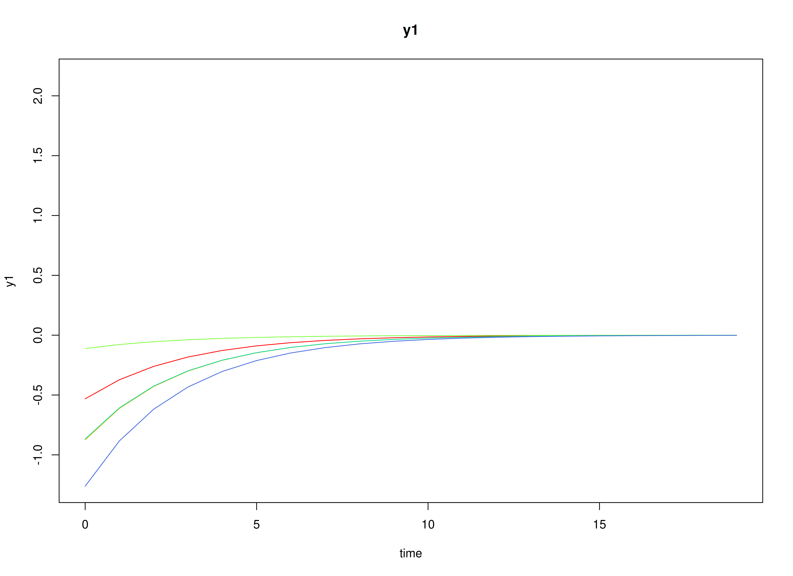
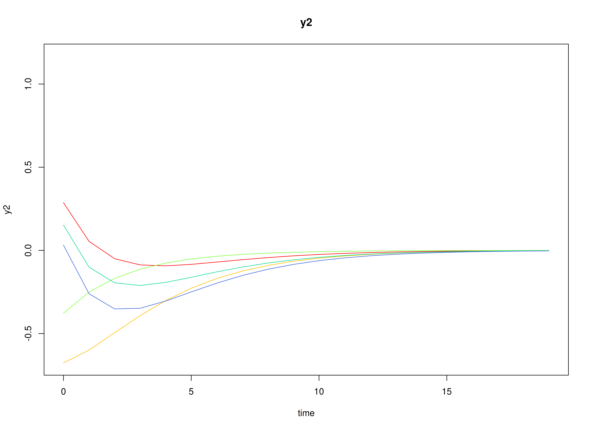
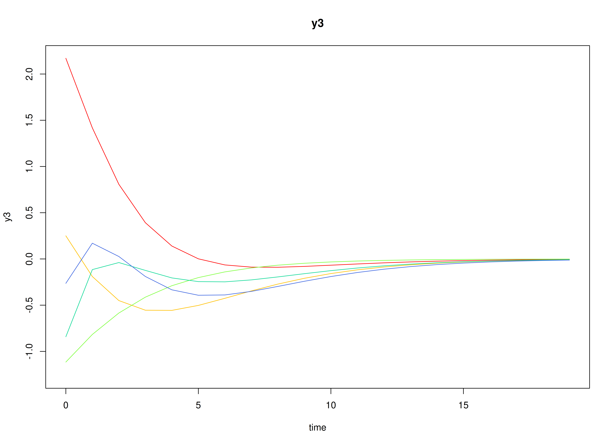
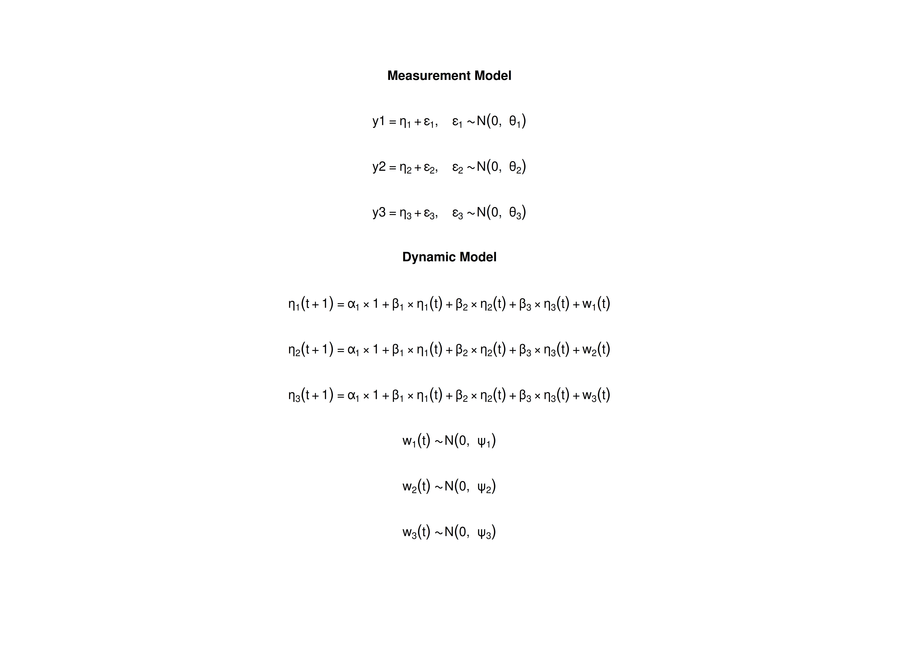

# The State Space Model

## Model

The measurement model is given by
``` math
\begin{equation}
  \mathbf{y}_{i, t}
  =
  \boldsymbol{\nu}
  +
  \boldsymbol{\Lambda}
  \boldsymbol{\eta}_{i, t}
  +
  \boldsymbol{\varepsilon}_{i, t},
  \quad
  \mathrm{with}
  \quad
  \boldsymbol{\varepsilon}_{i, t}
  \sim
  \mathcal{N}
  \left(
  \mathbf{0},
  \boldsymbol{\Theta}
  \right)
\end{equation}
```
where $`\mathbf{y}_{i, t}`$, $`\boldsymbol{\eta}_{i, t}`$, and
$`\boldsymbol{\varepsilon}_{i, t}`$ are random variables and
$`\boldsymbol{\nu}`$, $`\boldsymbol{\Lambda}`$, and
$`\boldsymbol{\Theta}`$ are model parameters. $`\mathbf{y}_{i, t}`$
represents a vector of observed random variables,
$`\boldsymbol{\eta}_{i, t}`$ a vector of latent random variables, and
$`\boldsymbol{\varepsilon}_{i, t}`$ a vector of random measurement
errors, at time $`t`$ and individual $`i`$. $`\boldsymbol{\nu}`$ denotes
a vector of intercepts, $`\boldsymbol{\Lambda}`$ a matrix of factor
loadings, and $`\boldsymbol{\Theta}`$ the covariance matrix of
$`\boldsymbol{\varepsilon}`$.

An alternative representation of the measurement error is given by
``` math
\begin{equation}
  \boldsymbol{\varepsilon}_{i, t}
  =
  \boldsymbol{\Theta}^{\frac{1}{2}}
  \mathbf{z}_{i, t},
  \quad
  \mathrm{with}
  \quad
  \mathbf{z}_{i, t}
  \sim
  \mathcal{N}
  \left(
  \mathbf{0},
  \mathbf{I}
  \right)
\end{equation}
```
where $`\mathbf{z}_{i, t}`$ is a vector of independent standard normal
random variables and
$`\left( \boldsymbol{\Theta}^{\frac{1}{2}} \right) \left( \boldsymbol{\Theta}^{\frac{1}{2}} \right)^{\prime} = \boldsymbol{\Theta}`$
.

The dynamic structure is given by
``` math
\begin{equation}
  \boldsymbol{\eta}_{i, t}
  =
  \boldsymbol{\alpha}
  +
  \boldsymbol{\beta}
  \boldsymbol{\eta}_{i, t - 1}
  +
  \boldsymbol{\zeta}_{i, t},
  \quad
  \mathrm{with}
  \quad
  \boldsymbol{\zeta}_{i, t}
  \sim
  \mathcal{N}
  \left(
  \mathbf{0},
  \boldsymbol{\Psi}
  \right)
\end{equation}
```
where $`\boldsymbol{\eta}_{i, t}`$, $`\boldsymbol{\eta}_{i, t - 1}`$,
and $`\boldsymbol{\zeta}_{i, t}`$ are random variables, and
$`\boldsymbol{\alpha}`$, $`\boldsymbol{\beta}`$, and
$`\boldsymbol{\Psi}`$ are model parameters. Here,
$`\boldsymbol{\eta}_{i, t}`$ is a vector of latent variables at time
$`t`$ and individual $`i`$, $`\boldsymbol{\eta}_{i, t - 1}`$ represents
a vector of latent variables at time $`t - 1`$ and individual $`i`$, and
$`\boldsymbol{\zeta}_{i, t}`$ represents a vector of dynamic noise at
time $`t`$ and individual $`i`$. $`\boldsymbol{\alpha}`$ denotes a
vector of intercepts, $`\boldsymbol{\beta}`$ a matrix of autoregression
and cross regression coefficients, and $`\boldsymbol{\Psi}`$ the
covariance matrix of $`\boldsymbol{\zeta}_{i, t}`$.

An alternative representation of the dynamic noise is given by
``` math
\begin{equation}
  \boldsymbol{\zeta}_{i, t}
  =
  \boldsymbol{\Psi}^{\frac{1}{2}}
  \mathbf{z}_{i, t},
  \quad
  \mathrm{with}
  \quad
  \mathbf{z}_{i, t}
  \sim
  \mathcal{N}
  \left(
  \mathbf{0},
  \mathbf{I}
  \right)
\end{equation}
```
where
$`\left( \boldsymbol{\Psi}^{\frac{1}{2}} \right) \left( \boldsymbol{\Psi}^{\frac{1}{2}} \right)^{\prime} = \boldsymbol{\Psi}`$
.

## Data Generation

### Notation

Let $`t = 100`$ be the number of time points and $`n = 50`$ be the
number of individuals.

Let the measurement model intecept vector $`\boldsymbol{\nu}`$ be given
by

``` math
\begin{equation}
\boldsymbol{\nu}
=
\left(
\begin{array}{c}
  0 \\
  0 \\
  0 \\
\end{array}
\right) .
\end{equation}
```

Let the factor loadings matrix $`\boldsymbol{\Lambda}`$ be given by

``` math
\begin{equation}
\boldsymbol{\Lambda}
=
\left(
\begin{array}{ccc}
  1 & 0 & 0 \\
  0 & 1 & 0 \\
  0 & 0 & 1 \\
\end{array}
\right) .
\end{equation}
```

Let the measurement error covariance matrix $`\boldsymbol{\Theta}`$ be
given by

``` math
\begin{equation}
\boldsymbol{\Theta}
=
\left(
\begin{array}{ccc}
  0.2 & 0 & 0 \\
  0 & 0.2 & 0 \\
  0 & 0 & 0.2 \\
\end{array}
\right) .
\end{equation}
```

Let the initial condition $`\boldsymbol{\eta}_{0}`$ be given by

``` math
\begin{equation}
\boldsymbol{\eta}_{0} \sim \mathcal{N} \left( \boldsymbol{\mu}_{\boldsymbol{\eta} \mid 0}, \boldsymbol{\Sigma}_{\boldsymbol{\eta} \mid 0} \right)
\end{equation}
```

``` math
\begin{equation}
\boldsymbol{\mu}_{\boldsymbol{\eta} \mid 0}
=
\left(
\begin{array}{c}
  0 \\
  0 \\
  0 \\
\end{array}
\right)
\end{equation}
```

``` math
\begin{equation}
\boldsymbol{\Sigma}_{\boldsymbol{\eta} \mid 0}
=
\left(
\begin{array}{ccc}
  0.1960784 & 0.1183232 & 0.0298539 \\
  0.1183232 & 0.3437711 & 0.1381855 \\
  0.0298539 & 0.1381855 & 0.2663828 \\
\end{array}
\right) .
\end{equation}
```

Let the constant vector $`\boldsymbol{\alpha}`$ be given by

``` math
\begin{equation}
\boldsymbol{\alpha}
=
\left(
\begin{array}{c}
  0 \\
  0 \\
  0 \\
\end{array}
\right) .
\end{equation}
```

Let the transition matrix $`\boldsymbol{\beta}`$ be given by

``` math
\begin{equation}
\boldsymbol{\beta}
=
\left(
\begin{array}{ccc}
  0.7 & 0 & 0 \\
  0.5 & 0.6 & 0 \\
  -0.1 & 0.4 & 0.5 \\
\end{array}
\right) .
\end{equation}
```

Let the dynamic process noise $`\boldsymbol{\Psi}`$ be given by

``` math
\begin{equation}
\boldsymbol{\Psi}
=
\left(
\begin{array}{ccc}
  0.1 & 0 & 0 \\
  0 & 0.1 & 0 \\
  0 & 0 & 0.1 \\
\end{array}
\right) .
\end{equation}
```

### R Function Arguments

``` r

n
#> [1] 50
time
#> [1] 100
mu0
#> [1] 0 0 0
sigma0
#>            [,1]      [,2]       [,3]
#> [1,] 0.19607843 0.1183232 0.02985385
#> [2,] 0.11832319 0.3437711 0.13818551
#> [3,] 0.02985385 0.1381855 0.26638284
sigma0_l # sigma0_l <- t(chol(sigma0))
#>            [,1]      [,2]     [,3]
#> [1,] 0.44280744 0.0000000 0.000000
#> [2,] 0.26721139 0.5218900 0.000000
#> [3,] 0.06741949 0.2302597 0.456966
alpha
#> [1] 0 0 0
beta
#>      [,1] [,2] [,3]
#> [1,]  0.7  0.0  0.0
#> [2,]  0.5  0.6  0.0
#> [3,] -0.1  0.4  0.5
psi
#>      [,1] [,2] [,3]
#> [1,]  0.1  0.0  0.0
#> [2,]  0.0  0.1  0.0
#> [3,]  0.0  0.0  0.1
psi_l # psi_l <- t(chol(psi))
#>           [,1]      [,2]      [,3]
#> [1,] 0.3162278 0.0000000 0.0000000
#> [2,] 0.0000000 0.3162278 0.0000000
#> [3,] 0.0000000 0.0000000 0.3162278
nu
#> [1] 0 0 0
lambda
#>      [,1] [,2] [,3]
#> [1,]    1    0    0
#> [2,]    0    1    0
#> [3,]    0    0    1
theta
#>      [,1] [,2] [,3]
#> [1,]  0.2  0.0  0.0
#> [2,]  0.0  0.2  0.0
#> [3,]  0.0  0.0  0.2
theta_l # theta_l <- t(chol(theta))
#>           [,1]      [,2]      [,3]
#> [1,] 0.4472136 0.0000000 0.0000000
#> [2,] 0.0000000 0.4472136 0.0000000
#> [3,] 0.0000000 0.0000000 0.4472136
```

### Visualizing the Dynamics Without Process Noise (n = 5 with Different Initial Condition)



### Using the `SimSSMFixed` Function from the `simStateSpace` Package to Simulate Data

``` r

library(simStateSpace)
sim <- SimSSMFixed(
  n = n,
  time = time,
  mu0 = mu0,
  sigma0_l = sigma0_l,
  alpha = alpha,
  beta = beta,
  psi_l = psi_l,
  nu = nu,
  lambda = lambda,
  theta_l = theta_l,
  type = 0
)
data <- as.data.frame(sim)
head(data)
#>   id time          y1         y2         y3
#> 1  1    0 -0.66908807 0.16178434  0.2955693
#> 2  1    1 -0.23021811 0.22873073 -0.2540210
#> 3  1    2  0.93689389 0.09496693 -0.9267506
#> 4  1    3  0.04445794 0.67521289 -0.1792168
#> 5  1    4  0.15413707 0.82591676  0.8976536
#> 6  1    5 -0.09943698 0.67154173  0.2853507
summary(data)
#>        id            time             y1                  y2          
#>  Min.   : 1.0   Min.   : 0.00   Min.   :-2.315283   Min.   :-2.59732  
#>  1st Qu.:13.0   1st Qu.:24.75   1st Qu.:-0.419280   1st Qu.:-0.48785  
#>  Median :25.5   Median :49.50   Median : 0.013478   Median : 0.03301  
#>  Mean   :25.5   Mean   :49.50   Mean   : 0.005377   Mean   : 0.01850  
#>  3rd Qu.:38.0   3rd Qu.:74.25   3rd Qu.: 0.421270   3rd Qu.: 0.52017  
#>  Max.   :50.0   Max.   :99.00   Max.   : 2.209104   Max.   : 2.82920  
#>        y3          
#>  Min.   :-2.35791  
#>  1st Qu.:-0.41956  
#>  Median : 0.02900  
#>  Mean   : 0.02677  
#>  3rd Qu.: 0.46670  
#>  Max.   : 2.55393
plot(sim)
```


## Model Fitting

### Prepare Data

``` r

dynr_data <- dynr::dynr.data(
  data = data,
  id = "id",
  time = "time",
  observed = c("y1", "y2", "y3")
)
```

### Prepare Initial Condition

``` r

dynr_initial <- dynr::prep.initial(
  values.inistate = mu0,
  params.inistate = c("mu0_1_1", "mu0_2_1", "mu0_3_1"),
  values.inicov = sigma0,
  params.inicov = matrix(
    data = c(
      "sigma0_1_1", "sigma0_2_1", "sigma0_3_1",
      "sigma0_2_1", "sigma0_2_2", "sigma0_3_2",
      "sigma0_3_1", "sigma0_3_2", "sigma0_3_3"
    ),
    nrow = 3
  )
)
```

### Prepare Measurement Model

``` r

dynr_measurement <- dynr::prep.measurement(
  values.load = diag(3),
  params.load = matrix(data = "fixed", nrow = 3, ncol = 3),
  state.names = c("eta_1", "eta_2", "eta_3"),
  obs.names = c("y1", "y2", "y3")
)
```

### Prepare Dynamic Process

``` r

dynr_dynamics <- dynr::prep.formulaDynamics(
  formula = list(
    eta_1 ~ alpha_1_1 * 1 + beta_1_1 * eta_1 + beta_1_2 * eta_2 + beta_1_3 * eta_3,
    eta_2 ~ alpha_2_1 * 1 + beta_2_1 * eta_1 + beta_2_2 * eta_2 + beta_2_3 * eta_3,
    eta_3 ~ alpha_3_1 * 1 + beta_3_1 * eta_1 + beta_3_2 * eta_2 + beta_3_3 * eta_3
  ),
  startval = c(
    alpha_1_1 = alpha[1], alpha_2_1 = alpha[2], alpha_3_1 = alpha[3],
    beta_1_1 = beta[1, 1], beta_1_2 = beta[1, 2], beta_1_3 = beta[1, 3],
    beta_2_1 = beta[2, 1], beta_2_2 = beta[2, 2], beta_2_3 = beta[2, 3],
    beta_3_1 = beta[3, 1], beta_3_2 = beta[3, 2], beta_3_3 = beta[3, 3]
  ),
  isContinuousTime = FALSE
)
```

### Prepare Process Noise

``` r

dynr_noise <- dynr::prep.noise(
  values.latent = psi,
  params.latent = matrix(
    data = c(
      "psi_1_1", "psi_2_1", "psi_3_1",
      "psi_2_1", "psi_2_2", "psi_3_2",
      "psi_3_1", "psi_3_2", "psi_3_3"
    ),
    nrow = 3
  ),
  values.observed = theta,
  params.observed = matrix(
    data = c(
      "theta_1_1", "fixed", "fixed",
      "fixed", "theta_2_2", "fixed",
      "fixed", "fixed", "theta_3_3"
    ),
    nrow = 3
  )
)
```

### Prepare the Model

``` r

model <- dynr::dynr.model(
  data = dynr_data,
  initial = dynr_initial,
  measurement = dynr_measurement,
  dynamics = dynr_dynamics,
  noise = dynr_noise,
  outfile = "ssm.c"
)
```



### Fit the Model

``` r

results <- dynr::dynr.cook(
  model,
  debug_flag = TRUE,
  verbose = FALSE
)
#> [1] "Get ready!!!!"
#> using C compiler: ‘gcc (Ubuntu 13.3.0-6ubuntu2~24.04.1) 13.3.0’
#> Optimization function called.
#> Starting Hessian calculation ...
#> Finished Hessian calculation.
#> Original exit flag:  3 
#> Modified exit flag:  3 
#> Optimization terminated successfully: ftol_rel or ftol_abs was reached. 
#> Original fitted parameters:  0.002305557 0.004079545 0.006105962 0.6912019 
#> -0.01138488 0.001780962 0.4598536 0.6269283 -0.008786464 -0.05127745 0.3662852 
#> 0.4733914 -2.216907 0.05657798 -0.1369814 -2.256298 0.0254946 -2.21456 
#> -1.662424 -1.65876 -1.680193 -0.05038907 0.01306129 0.1535455 -1.821081 
#> 0.5856715 0.03470936 -0.6332694 0.1619125 -2.034801 
#> 
#> Transformed fitted parameters:  0.002305557 0.004079545 0.006105962 0.6912019 
#> -0.01138488 0.001780962 0.4598536 0.6269283 -0.008786464 -0.05127745 0.3662852 
#> 0.4733914 0.1089455 0.006163917 -0.01492351 0.1050863 0.0018259 0.1113138 
#> 0.1896786 0.1903749 0.1863381 -0.05038907 0.01306129 0.1535455 0.1618506 
#> 0.09479129 0.005617732 0.58637 0.08924197 0.1448181 
#> 
#> Doing end processing
#> Successful trial
#> Total Time: 3.221639 
#> Backend Time: 3.213359
```

## Summary

``` r

summary(results)
#> Coefficients:
#>              Estimate Std. Error t value   ci.lower   ci.upper Pr(>|t|)    
#> alpha_1_1   0.0023056  0.0051113   0.451 -0.0077125  0.0123236   0.3260    
#> alpha_2_1   0.0040795  0.0059274   0.688 -0.0075380  0.0156970   0.2457    
#> alpha_3_1   0.0061060  0.0062257   0.981 -0.0060961  0.0183081   0.1634    
#> beta_1_1    0.6912019  0.0443653  15.580  0.6042476  0.7781563   <2e-16 ***
#> beta_1_2   -0.0113849  0.0272809  -0.417 -0.0648545  0.0420847   0.3382    
#> beta_1_3    0.0017810  0.0222164   0.080 -0.0417625  0.0453244   0.4681    
#> beta_2_1    0.4598536  0.0428419  10.734  0.3758850  0.5438221   <2e-16 ***
#> beta_2_2    0.6269283  0.0335534  18.685  0.5611650  0.6926917   <2e-16 ***
#> beta_2_3   -0.0087865  0.0261884  -0.336 -0.0601149  0.0425419   0.3686    
#> beta_3_1   -0.0512774  0.0323600  -1.585 -0.1147019  0.0121470   0.0566 .  
#> beta_3_2    0.3662852  0.0324468  11.289  0.3026907  0.4298797   <2e-16 ***
#> beta_3_3    0.4733914  0.0354507  13.354  0.4039093  0.5428735   <2e-16 ***
#> psi_1_1     0.1089455  0.0148070   7.358  0.0799244  0.1379666   <2e-16 ***
#> psi_2_1     0.0061639  0.0049789   1.238 -0.0035945  0.0159223   0.1079    
#> psi_3_1    -0.0149235  0.0047161  -3.164 -0.0241669 -0.0056801   0.0008 ***
#> psi_2_2     0.1050863  0.0111471   9.427  0.0832383  0.1269343   <2e-16 ***
#> psi_3_2     0.0018259  0.0046732   0.391 -0.0073335  0.0109853   0.3480    
#> psi_3_3     0.1113138  0.0158722   7.013  0.0802048  0.1424229   <2e-16 ***
#> theta_1_1   0.1896786  0.0121966  15.552  0.1657737  0.2135835   <2e-16 ***
#> theta_2_2   0.1903749  0.0107378  17.729  0.1693291  0.2114206   <2e-16 ***
#> theta_3_3   0.1863381  0.0154322  12.075  0.1560916  0.2165845   <2e-16 ***
#> mu0_1_1    -0.0503891  0.0758496  -0.664 -0.1990516  0.0982735   0.2533    
#> mu0_2_1     0.0130613  0.1204303   0.108 -0.2229777  0.2491003   0.4568    
#> mu0_3_1     0.1535455  0.0785707   1.954 -0.0004502  0.3075411   0.0254 *  
#> sigma0_1_1  0.1618506  0.0589334   2.746  0.0463433  0.2773579   0.0030 ** 
#> sigma0_2_1  0.0947913  0.0647130   1.465 -0.0320438  0.2216264   0.0715 .  
#> sigma0_3_1  0.0056177  0.0419561   0.134 -0.0766147  0.0878502   0.4467    
#> sigma0_2_2  0.5863700  0.1456709   4.025  0.3008602  0.8718797   <2e-16 ***
#> sigma0_3_2  0.0892420  0.0677731   1.317 -0.0435909  0.2220748   0.0940 .  
#> sigma0_3_3  0.1448181  0.0625760   2.314  0.0221715  0.2674648   0.0103 *  
#> ---
#> Signif. codes:  0 '***' 0.001 '**' 0.01 '*' 0.05 '.' 0.1 ' ' 1
#> 
#> -2 log-likelihood value at convergence = 26336.29
#> AIC = 26396.29
#> BIC = 26591.81
```

### Parameter Estimates

``` r

alpha_hat
#> [1] 0.002305557 0.004079545 0.006105962
beta_hat
#>             [,1]        [,2]         [,3]
#> [1,]  0.69120191 -0.01138488  0.001780962
#> [2,]  0.45985359  0.62692831 -0.008786464
#> [3,] -0.05127745  0.36628519  0.473391396
psi_hat
#>              [,1]        [,2]        [,3]
#> [1,]  0.108945506 0.006163917 -0.01492351
#> [2,]  0.006163917 0.105086287  0.00182590
#> [3,] -0.014923506 0.001825900  0.11131383
theta_hat
#>           [,1]      [,2]      [,3]
#> [1,] 0.1896786 0.0000000 0.0000000
#> [2,] 0.0000000 0.1903749 0.0000000
#> [3,] 0.0000000 0.0000000 0.1863381
mu0_hat
#> [1] -0.05038907  0.01306129  0.15354546
sigma0_hat
#>             [,1]       [,2]        [,3]
#> [1,] 0.161850621 0.09479129 0.005617732
#> [2,] 0.094791289 0.58636995 0.089241969
#> [3,] 0.005617732 0.08924197 0.144818122
```

## References

Chow, S.-M., Ho, M. R., Hamaker, E. L., & Dolan, C. V. (2010).
Equivalence and differences between structural equation modeling and
state-space modeling techniques. *Structural Equation Modeling: A
Multidisciplinary Journal*, *17*(2), 303–332.
<https://doi.org/10.1080/10705511003661553>

Ou, L., Hunter, M. D., & Chow, S.-M. (2019). What’s for dynr: A package
for linear and nonlinear dynamic modeling in R. *The R Journal*,
*11*(1), 91. <https://doi.org/10.32614/rj-2019-012>

Pesigan, I. J. A., Russell, M. A., & Chow, S.-M. (2025). Inferences and
effect sizes for direct, indirect, and total effects in continuous-time
mediation models. *Psychological Methods*.
<https://doi.org/10.1037/met0000779>

R Core Team. (2025). *R: A language and environment for statistical
computing*. R Foundation for Statistical Computing.
<https://www.R-project.org/>
