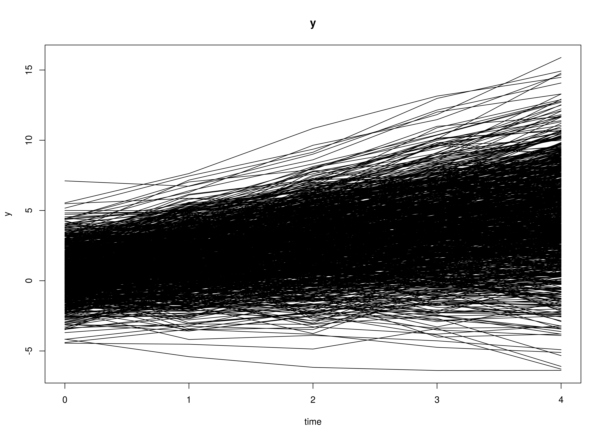

## Model

The measurement model is given by
\begin{equation}
  y_{i, t}
  =
  \left(
  \begin{array}{cc}
    1 & 0 \\
  \end{array}
  \right)
  \left(
  \begin{array}{c}
    \eta_{0_{i, t}} \\
    \eta_{1_{i, t}} \\
  \end{array}
  \right)
  +
  \boldsymbol{\varepsilon}_{i, t}
  \quad
  \mathrm{with}
  \quad
  \boldsymbol{\varepsilon}_{i, t}
  \sim
  \mathcal{N}
  \left(
  0,
  \theta^{2}
  \right)
\end{equation}
where $y_{i, t}$, $\eta_{0_{i, t}}$,
$\eta_{1_{i, t}}$,
and $\boldsymbol{\varepsilon}_{i, t}$
are random variables and
and $\theta^{2}$ is a model parameter.
$y_{i, t}$ is a vector of observed random variables
at time $t$ and individual $i$,
$\eta_{0_{i, t}}$ (intercept)
and
$\eta_{1_{i, t}}$ (slope) form a vector of latent random variables
at time $t$ and individual $i$,
and $\boldsymbol{\varepsilon}_{i, t}$
is a vector of random measurement errors
at time $t$ and individual $i$,
and $\theta^{2}$ is the variance of
$\boldsymbol{\varepsilon}$.

The dynamic structure is given by
\begin{equation}
  \left(
  \begin{array}{c}
  \eta_{0_{i, t}} \\
  \eta_{1_{i, t}} \\
  \end{array}
  \right)
  =
  \left(
  \begin{array}{cc}
    1 & 1 \\
    0 & 1 \\
  \end{array}
  \right)
  \left(
  \begin{array}{c}
  \eta_{0_{i, t - 1}} \\
  \eta_{1_{i, t - 1}} \\
  \end{array}
  \right) .
\end{equation}

The mean vector and covariance matrix of the intercept and slope
are captured in the mean vector and covariance matrix
of the initial condition given by
\begin{equation}
  \boldsymbol{\mu}_{\boldsymbol{\eta} \mid 0}
  =
  \left(
  \begin{array}{c}
    \mu_{\eta_{0}} \\
    \mu_{\eta_{1}} \\
  \end{array}
  \right) \quad \mathrm{and,}
\end{equation}

\begin{equation}
  \boldsymbol{\Sigma}_{\boldsymbol{\eta} \mid 0}
  =
  \left(
  \begin{array}{cc}
    \sigma^{2}_{\eta_{0}} &
    \sigma_{\eta_{0}, \eta_{1}} \\
    \sigma_{\eta_{1}, \eta_{0}} &
    \sigma^{2}_{\eta_{1}} \\
  \end{array}
  \right) .
\end{equation}

## Data Generation

### Notation


Let $t = 5$ be the number of time points and $n = 1000$ be the number of individuals.

Let the measurement error variance $\theta^{2}$ be given by

\begin{equation}
\theta^{2}
=
0.6 .
\end{equation}

Let the initial condition
$\boldsymbol{\eta}_{0}$
be given by

\begin{equation}
\boldsymbol{\eta}_{0} \sim \mathcal{N} \left( \boldsymbol{\mu}_{\boldsymbol{\eta} \mid 0}, \boldsymbol{\Sigma}_{\boldsymbol{\eta} \mid 0} \right)
\end{equation}

\begin{equation}
\boldsymbol{\mu}_{\boldsymbol{\eta} \mid 0}
=
\left(
\begin{array}{c}
  0.615 \\
  1.006 \\
\end{array}
\right)
\end{equation}

\begin{equation}
\boldsymbol{\Sigma}_{\boldsymbol{\eta} \mid 0}
=
\left(
\begin{array}{ccc}
  1.932 & 0.618 \\
  0.618 & 0.587 \\
\end{array}
\right) .
\end{equation}

### R Function Arguments


```r
n
#> [1] 1000
time
#> [1] 5
mu0
#> [1] 0.615 1.006
sigma0
#>       [,1]  [,2]
#> [1,] 1.932 0.618
#> [2,] 0.618 0.587
theta
#> [1] 0.6
```

### Using the SimSSMLinGrowth Function to Simulate Data


```r
library(simStateSpace)
sim <- SimSSMLinGrowth(
  n = n,
  mu0 = mu0,
  sigma0_sqrt = sigma0_sqrt,
  theta_sqrt = theta_sqrt,
  type = 0,
  time = time
)
data <- Sim2Matrix(sim)
head(data)
#>             y time id
#> [1,] 1.915757    0  1
#> [2,] 1.305294    1  1
#> [3,] 3.436058    2  1
#> [4,] 6.014244    3  1
#> [5,] 6.317083    4  1
#> [6,] 1.305813    0  2
```

### Plots



## Model Fitting

### Prepare Data


```r
dynr_data <- dynr::dynr.data(
  dataframe = data,
  id = "id",
  time = "time",
  observed = "y"
)
```

### Prepare Initial Condition


```r
dynr_initial <- dynr::prep.initial(
  values.inistate = c(0, 0),
  params.inistate = c("mu0_0", "mu0_1"),
  values.inicov = diag(2),
  params.inicov = matrix(
    data = c(
      "sigma0_00", "sigma0_01",
      "sigma0_01", "sigma0_11"
    ),
    nrow = 2
  )
)
```

### Prepare Measurement Model


```r
dynr_measurement <- dynr::prep.measurement(
  values.load = matrix(data = c(1, 0), nrow = 1),
  params.load = matrix(data = "fixed", nrow = 1, ncol = 2),
  state.names = c("eta_0", "eta_1"),
  obs.names = "y"
)
```

### Prepare Dynamic Process


```r
dynr_dynamics <- dynr::prep.matrixDynamics(
  values.dyn = matrix(
    data = c(1, 0, 1, 1),
    nrow = 2
  ),
  params.dyn = matrix(
    data = "fixed",
    nrow = 2,
    ncol = 2
  ),
  isContinuousTime = FALSE
)
```

### Prepare Process Noise


```r
dynr_noise <- dynr::prep.noise(
  values.latent = matrix(data = 0, nrow = 2, ncol = 2),
  params.latent = matrix(data = "fixed", nrow = 2, ncol = 2),
  values.observed = 1,
  params.observed = "theta"
)
```

### Prepare the Model


```r
model <- dynr::dynr.model(
  data = dynr_data,
  initial = dynr_initial,
  measurement = dynr_measurement,
  dynamics = dynr_dynamics,
  noise = dynr_noise,
  outfile = "lin-growth.c"
)
model@options$maxeval <- 10000
```

### Fit the Model


```r
results <- dynr::dynr.cook(
  model,
  debug_flag = TRUE,
  verbose = FALSE
)
#> [1] "Get ready!!!!"
#> using C compiler: ‘gcc (Ubuntu 11.4.0-1ubuntu1~22.04) 11.4.0’
#> Optimization function called.
#> Starting Hessian calculation ...
#> Finished Hessian calculation.
#> Original exit flag:  3 
#> Modified exit flag:  3 
#> Optimization terminated successfully: ftol_rel or ftol_abs was reached. 
#> Original fitted parameters:  -0.4945748 0.6121045 0.9977651 0.761445 0.1499416 
#> -1.033342 
#> 
#> Transformed fitted parameters:  0.6098302 0.6121045 0.9977651 2.141368 
#> 0.3210802 0.4039591 
#> 
#> Doing end processing
#> Successful trial
#> Total Time: 6.541451 
#> Backend Time: 6.139456
```

## Summary


```r
summary(results)
#> Coefficients:
#>           Estimate Std. Error t value ci.lower ci.upper Pr(>|t|)    
#> theta      0.60983    0.01574   38.74  0.57897  0.64069   <2e-16 ***
#> mu0_0      0.61210    0.05008   12.22  0.51395  0.71025   <2e-16 ***
#> mu0_1      0.99777    0.02156   46.27  0.95550  1.04003   <2e-16 ***
#> sigma0_00  2.14137    0.11245   19.04  1.92097  2.36177   <2e-16 ***
#> sigma0_01  0.32108    0.03486    9.21  0.25275  0.38941   <2e-16 ***
#> sigma0_11  0.40396    0.02085   19.37  0.36308  0.44483   <2e-16 ***
#> ---
#> Signif. codes:  0 '***' 0.001 '**' 0.01 '*' 0.05 '.' 0.1 ' ' 1
#> 
#> -2 log-likelihood value at convergence = 16736.57
#> AIC = 16748.57
#> BIC = 16787.67
```


```
#> [1] 0.6121045 0.9977651
```

### Estimated Coefficients


```r
mu0_hat
#> [1] 0.6121045 0.9977651
sigma0_hat
#>           [,1]      [,2]
#> [1,] 2.1413682 0.3210802
#> [2,] 0.3210802 0.4039591
```

### Discrepancy Between Estimated and Population Coefficients


```r
abs(mu0 - mu0_hat)
#> [1] 0.002895493 0.008234886
abs(sigma0 - sigma0_hat)
#>           [,1]      [,2]
#> [1,] 0.2093682 0.2969198
#> [2,] 0.2969198 0.1830409
```

## Linear Growth Curve Model in Structural Equation Modeling

### Wide Data Set


```r
data <- Sim2Matrix(sim, long = FALSE)
head(data)
#>   id         y_0        y_1      y_2      y_3      y_4
#> 1  1  1.91575677  1.3052940 3.436058 6.014244 6.317083
#> 2  2  1.30581284  3.4806749 3.839332 4.781646 7.146112
#> 3  3  2.61808318  3.5764470 4.560234 3.987751 5.379530
#> 4  4  0.99854759  2.4104447 2.971037 4.360065 6.022609
#> 5  5 -0.06708377 -0.1874741 1.475034 1.919038 2.659579
#> 6  6  2.06343882  3.1439674 4.059181 4.054417 4.392294
```

### Model


```r
model <- "
  # factor loadings
  eta0 =~ 1 * y_0 + 1 * y_1 + 1 * y_2 + 1 * y_3 + 1 * y_4
  eta1 =~ 0 * y_0 + 1 * y_1 + 2 * y_2 + 3 * y_3 + 4 * y_4
  # means of latent variables
  eta0 ~ mu0 * 1
  eta1 ~ mu1 * 1
  # variances and covariances of latent variables
  eta0 ~~ sigma00 * eta0
  eta0 ~~ sigma01 * eta1
  eta1 ~~ sigma11 * eta1
  # constrain error variance theta to be equal
  y_0 ~~ theta * y_0
  y_1 ~~ theta * y_1
  y_2 ~~ theta * y_2
  y_3 ~~ theta * y_3
  y_4 ~~ theta * y_4
"
```


```r
fit <- lavaan::growth(
  model = model,
  data = as.data.frame(data)
)
lavaan::summary(fit)
#> lavaan 0.6.16 ended normally after 28 iterations
#> 
#>   Estimator                                         ML
#>   Optimization method                           NLMINB
#>   Number of model parameters                        10
#>   Number of equality constraints                     4
#> 
#>   Number of observations                          1000
#> 
#> Model Test User Model:
#>                                                       
#>   Test statistic                                14.846
#>   Degrees of freedom                                14
#>   P-value (Chi-square)                           0.389
#> 
#> Parameter Estimates:
#> 
#>   Standard errors                             Standard
#>   Information                                 Expected
#>   Information saturated (h1) model          Structured
#> 
#> Latent Variables:
#>                    Estimate  Std.Err  z-value  P(>|z|)
#>   eta0 =~                                             
#>     y_0               1.000                           
#>     y_1               1.000                           
#>     y_2               1.000                           
#>     y_3               1.000                           
#>     y_4               1.000                           
#>   eta1 =~                                             
#>     y_0               0.000                           
#>     y_1               1.000                           
#>     y_2               2.000                           
#>     y_3               3.000                           
#>     y_4               4.000                           
#> 
#> Covariances:
#>                    Estimate  Std.Err  z-value  P(>|z|)
#>   eta0 ~~                                             
#>     eta1    (sg01)    0.321    0.035    9.213    0.000
#> 
#> Intercepts:
#>                    Estimate  Std.Err  z-value  P(>|z|)
#>     eta0     (mu0)    0.612    0.050   12.226    0.000
#>     eta1     (mu1)    0.998    0.022   46.275    0.000
#>    .y_0               0.000                           
#>    .y_1               0.000                           
#>    .y_2               0.000                           
#>    .y_3               0.000                           
#>    .y_4               0.000                           
#> 
#> Variances:
#>                    Estimate  Std.Err  z-value  P(>|z|)
#>     eta0    (sg00)    2.141    0.113   19.030    0.000
#>     eta1    (sg11)    0.404    0.021   19.372    0.000
#>    .y_0     (thet)    0.610    0.016   38.730    0.000
#>    .y_1     (thet)    0.610    0.016   38.730    0.000
#>    .y_2     (thet)    0.610    0.016   38.730    0.000
#>    .y_3     (thet)    0.610    0.016   38.730    0.000
#>    .y_4     (thet)    0.610    0.016   38.730    0.000
```

## References
