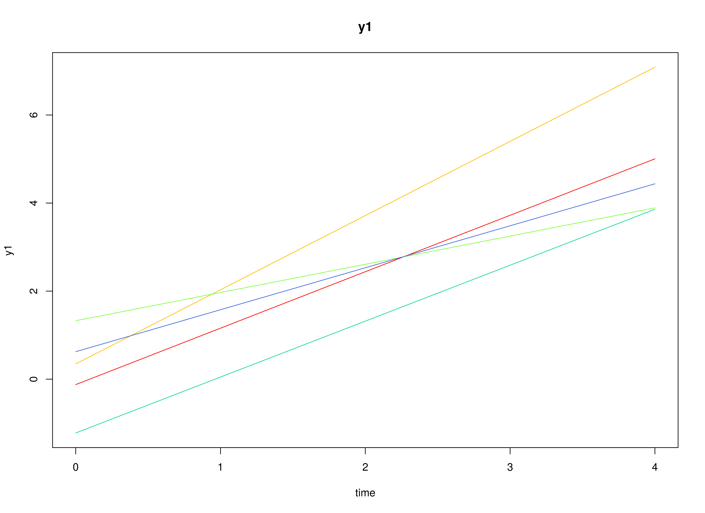
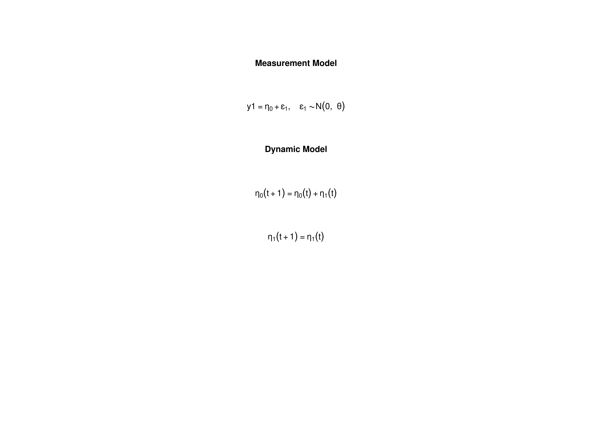

## Model

The measurement model is given by
\begin{equation}
  Y_{i, t}
  =
  \left(
  \begin{array}{cc}
    1 & 0 \\
  \end{array}
  \right)
  \left(
  \begin{array}{c}
    \eta_{0_{i, t}} \\
    \eta_{1_{i, t}} \\
  \end{array}
  \right)
  +
  \boldsymbol{\varepsilon}_{i, t},
  \quad
  \mathrm{with}
  \quad
  \boldsymbol{\varepsilon}_{i, t}
  \sim
  \mathcal{N}
  \left(
  0,
  \theta
  \right)
\end{equation}
where $Y_{i, t}$, $\eta_{0_{i, t}}$,
$\eta_{1_{i, t}}$,
and $\boldsymbol{\varepsilon}_{i, t}$
are random variables and
$\theta$ is a model parameter.
$Y_{i, t}$ is the observed random variable
at time $t$ and individual $i$,
$\eta_{0_{i, t}}$ (intercept)
and
$\eta_{1_{i, t}}$ (slope)
form a vector of latent random variables
at time $t$ and individual $i$,
and $\boldsymbol{\varepsilon}_{i, t}$
a vector of random measurement errors
at time $t$ and individual $i$.
$\theta$ is the variance of
$\boldsymbol{\varepsilon}$.

The dynamic structure is given by
\begin{equation}
  \left(
  \begin{array}{c}
  \eta_{0_{i, t}} \\
  \eta_{1_{i, t}} \\
  \end{array}
  \right)
  =
  \left(
  \begin{array}{cc}
    1 & 1 \\
    0 & 1 \\
  \end{array}
  \right)
  \left(
  \begin{array}{c}
  \eta_{0_{i, t - 1}} \\
  \eta_{1_{i, t - 1}} \\
  \end{array}
  \right) .
\end{equation}

The mean vector and covariance matrix of the intercept and slope
are captured in the mean vector and covariance matrix
of the initial condition given by
\begin{equation}
  \boldsymbol{\mu}_{\boldsymbol{\eta} \mid 0}
  =
  \left(
  \begin{array}{c}
    \mu_{\eta_{0}} \\
    \mu_{\eta_{1}} \\
  \end{array}
  \right) \quad \mathrm{and,}
\end{equation}

\begin{equation}
  \boldsymbol{\Sigma}_{\boldsymbol{\eta} \mid 0}
  =
  \left(
  \begin{array}{cc}
    \sigma^{2}_{\eta_{0}} &
    \sigma_{\eta_{0}, \eta_{1}} \\
    \sigma_{\eta_{1}, \eta_{0}} &
    \sigma^{2}_{\eta_{1}} \\
  \end{array}
  \right) .
\end{equation}

## Data Generation

### Notation

Let $t = 5$ be the number of time points and $n = 10<sup>4</sup>$ be the number of individuals.

Let the measurement error variance $\theta$ be given by

\begin{equation}
\theta
=
0.6 .
\end{equation}

Let the initial condition
$\boldsymbol{\eta}_{0}$
be given by

\begin{equation}
\boldsymbol{\eta}_{0}
\sim
\mathcal{N}
\left(
\boldsymbol{\mu}_{\boldsymbol{\eta} \mid 0},
\boldsymbol{\Sigma}_{\boldsymbol{\eta} \mid 0}
\right)
\end{equation}

\begin{equation}
\boldsymbol{\mu}_{\boldsymbol{\eta} \mid 0}
=
\left(
\begin{array}{c}
  0.615 \\
  1.006 \\
\end{array}
\right)
\end{equation}

\begin{equation}
\boldsymbol{\Sigma}_{\boldsymbol{\eta} \mid 0}
=
\left(
\begin{array}{ccc}
  1.932 & 0.618 \\
  0.618 & 0.587 \\
\end{array}
\right) .
\end{equation}

### R Function Arguments


``` r
n
#> [1] 10000
time
#> [1] 5
mu0
#> [1] 0.615 1.006
sigma0
#>       [,1]  [,2]
#> [1,] 1.932 0.618
#> [2,] 0.618 0.587
sigma0_l
#>           [,1]      [,2]
#> [1,] 1.3899640 0.0000000
#> [2,] 0.4446158 0.6239525
theta
#> [1] 0.6
theta_l
#> [1] 0.7745967
```

### Visualizing the Dynamics Without Measurement Error (n = 5 with Different Initial Condition)



### Using the `SimSSMLinGrowth` Function from the `simStateSpace` Package to Simulate Data


``` r
library(simStateSpace)
sim <- SimSSMLinGrowth(
  n = n,
  time = time,
  mu0 = mu0,
  sigma0_l = sigma0_l,
  theta_l = theta_l,
  type = 0
)
data <- as.data.frame(sim)
head(data)
#>   id time       y1
#> 1  1    0 1.723564
#> 2  1    1 2.148702
#> 3  1    2 3.384974
#> 4  1    3 6.225426
#> 5  1    4 5.993965
#> 6  2    0 1.951861
summary(data)
#>        id             time         y1          
#>  Min.   :    1   Min.   :0   Min.   :-10.7863  
#>  1st Qu.: 2501   1st Qu.:1   1st Qu.:  0.3943  
#>  Median : 5000   Median :2   Median :  2.1839  
#>  Mean   : 5000   Mean   :2   Mean   :  2.5978  
#>  3rd Qu.: 7500   3rd Qu.:3   3rd Qu.:  4.4536  
#>  Max.   :10000   Max.   :4   Max.   : 21.0250
plot(sim)
```


## Model Fitting

### Prepare Data


``` r
dynr_data <- dynr::dynr.data(
  dataframe = data,
  id = "id",
  time = "time",
  observed = "y1"
)
```

### Prepare Initial Condition


``` r
dynr_initial <- dynr::prep.initial(
  values.inistate = mu0,
  params.inistate = c("mu0_0", "mu0_1"),
  values.inicov = sigma0,
  params.inicov = matrix(
    data = c(
      "sigma0_00", "sigma0_01",
      "sigma0_01", "sigma0_11"
    ),
    nrow = 2
  )
)
```

### Prepare Measurement Model


``` r
dynr_measurement <- dynr::prep.measurement(
  values.load = matrix(data = c(1, 0), nrow = 1),
  params.load = matrix(data = "fixed", nrow = 1, ncol = 2),
  state.names = c("eta_0", "eta_1"),
  obs.names = "y1"
)
```

### Prepare Dynamic Process


``` r
dynr_dynamics <- dynr::prep.formulaDynamics(
  formula = list(
    eta_0 ~ eta_0 + eta_1,
    eta_1 ~ eta_1
  ),
  isContinuousTime = FALSE
)
#> Warning in dynr::prep.formulaDynamics(formula = list(eta_0 ~ eta_0 + eta_1, :
#> You provided no start values: length(startval)==0. If you have no free
#> parameters, keep calm and carry on.
```

### Prepare Process Noise


``` r
dynr_noise <- dynr::prep.noise(
  values.latent = matrix(data = 0, nrow = 2, ncol = 2),
  params.latent = matrix(data = "fixed", nrow = 2, ncol = 2),
  values.observed = theta,
  params.observed = "theta"
)
```

### Prepare the Model


``` r
model <- dynr::dynr.model(
  data = dynr_data,
  initial = dynr_initial,
  measurement = dynr_measurement,
  dynamics = dynr_dynamics,
  noise = dynr_noise,
  outfile = "lin-growth.c"
)
```



### Fit the Model


``` r
results <- dynr::dynr.cook(
  model,
  debug_flag = TRUE,
  verbose = FALSE
)
#> [1] "Get ready!!!!"
#> using C compiler: ‘gcc (Ubuntu 11.4.0-1ubuntu1~22.04) 11.4.0’
#> Optimization function called.
#> Starting Hessian calculation ...
#> Finished Hessian calculation.
#> Original exit flag:  3 
#> Modified exit flag:  3 
#> Optimization terminated successfully: ftol_rel or ftol_abs was reached. 
#> Original fitted parameters:  -0.5089635 0.60732 0.9952181 0.6477021 0.3152438 
#> -0.9463643 
#> 
#> Transformed fitted parameters:  0.6011183 0.60732 0.9952181 1.911144 0.6024764 
#> 0.5780766 
#> 
#> Doing end processing
#> Successful trial
#> Total Time: 1.498272 
#> Backend Time: 1.488382
```

## Summary


``` r
summary(results)
#> Coefficients:
#>           Estimate Std. Error t value ci.lower ci.upper Pr(>|t|)    
#> theta     0.601118   0.004914  122.34 0.591488 0.610749   <2e-16 ***
#> mu0_0     0.607320   0.015112   40.19 0.577701 0.636939   <2e-16 ***
#> mu0_1     0.995218   0.007992  124.53 0.979554 1.010882   <2e-16 ***
#> sigma0_00 1.911144   0.032346   59.08 1.847747 1.974541   <2e-16 ***
#> sigma0_01 0.602476   0.013016   46.29 0.576966 0.627987   <2e-16 ***
#> sigma0_11 0.578077   0.009046   63.90 0.560347 0.595807   <2e-16 ***
#> ---
#> Signif. codes:  0 '***' 0.001 '**' 0.01 '*' 0.05 '.' 0.1 ' ' 1
#> 
#> -2 log-likelihood value at convergence = 167712.56
#> AIC = 167724.56
#> BIC = 167777.48
```


```
#> [1] 0.6073200 0.9952181
```

### Estimated Parameters


``` r
mu0_hat
#> [1] 0.6073200 0.9952181
sigma0_hat
#>           [,1]      [,2]
#> [1,] 1.9111442 0.6024764
#> [2,] 0.6024764 0.5780766
theta_hat
#>     theta 
#> 0.6011183
```

## Linear Growth Curve Model in Structural Equation Modeling

### Wide Data Set


``` r
data <- as.data.frame(sim, long = FALSE)
head(data)
#>   id        y1_0       y1_1        y1_2        y1_3       y1_4
#> 1  1  1.72356430  2.1487019  3.38497364  6.22542609  5.9939649
#> 2  2  1.95186051  2.6140623  5.60107919  5.59791920  7.6881040
#> 3  3  0.07909854 -1.1410633 -0.02940765  0.07103948 -0.4998955
#> 4  4 -0.14827866 -0.6478676 -0.33440620 -0.29683127 -0.6950588
#> 5  5  1.14625267  2.3844799  0.39101270 -0.76159166  1.6750324
#> 6  6  1.02604168  2.1852479  2.55168739  2.13223414  4.1499727
```

### Model


``` r
model <- "
  # factor loadings
  eta0 =~ 1 * y1_0 + 1 * y1_1 + 1 * y1_2 + 1 * y1_3 + 1 * y1_4
  eta1 =~ 0 * y1_0 + 1 * y1_1 + 2 * y1_2 + 3 * y1_3 + 4 * y1_4
  # means of latent variables
  eta0 ~ mu0_0 * 1
  eta1 ~ mu0_1 * 1
  # variances and covariances of latent variables
  eta0 ~~ sigma0_00 * eta0
  eta0 ~~ sigma0_01 * eta1
  eta1 ~~ sigma0_11 * eta1
  # constrain error variance theta to be equal
  y1_0 ~~ theta * y1_0
  y1_1 ~~ theta * y1_1
  y1_2 ~~ theta * y1_2
  y1_3 ~~ theta * y1_3
  y1_4 ~~ theta * y1_4
"
```


``` r
fit <- lavaan::growth(
  model = model,
  data = data
)
lavaan::summary(fit)
#> lavaan 0.6-19 ended normally after 34 iterations
#> 
#>   Estimator                                         ML
#>   Optimization method                           NLMINB
#>   Number of model parameters                        10
#>   Number of equality constraints                     4
#> 
#>   Number of observations                         10000
#> 
#> Model Test User Model:
#>                                                       
#>   Test statistic                                 5.386
#>   Degrees of freedom                                14
#>   P-value (Chi-square)                           0.980
#> 
#> Parameter Estimates:
#> 
#>   Standard errors                             Standard
#>   Information                                 Expected
#>   Information saturated (h1) model          Structured
#> 
#> Latent Variables:
#>                    Estimate  Std.Err  z-value  P(>|z|)
#>   eta0 =~                                             
#>     y1_0              1.000                           
#>     y1_1              1.000                           
#>     y1_2              1.000                           
#>     y1_3              1.000                           
#>     y1_4              1.000                           
#>   eta1 =~                                             
#>     y1_0              0.000                           
#>     y1_1              1.000                           
#>     y1_2              2.000                           
#>     y1_3              3.000                           
#>     y1_4              4.000                           
#> 
#> Covariances:
#>                    Estimate  Std.Err  z-value  P(>|z|)
#>   eta0 ~~                                             
#>     eta1    (s0_0)    0.602    0.013   46.317    0.000
#> 
#> Intercepts:
#>                    Estimate  Std.Err  z-value  P(>|z|)
#>     eta0    (m0_0)    0.607    0.015   40.295    0.000
#>     eta1    (m0_1)    0.995    0.008  124.582    0.000
#> 
#> Variances:
#>                    Estimate  Std.Err  z-value  P(>|z|)
#>     eta0    (s0_0)    1.911    0.032   59.235    0.000
#>     eta1    (s0_1)    0.578    0.009   63.955    0.000
#>    .y1_0    (thet)    0.601    0.005  122.474    0.000
#>    .y1_1    (thet)    0.601    0.005  122.474    0.000
#>    .y1_2    (thet)    0.601    0.005  122.474    0.000
#>    .y1_3    (thet)    0.601    0.005  122.474    0.000
#>    .y1_4    (thet)    0.601    0.005  122.474    0.000
```


```
#> [1] 0.6073200 0.9952181
```

### Estimated Parameters


``` r
mu0_hat
#> [1] 0.6073200 0.9952181
sigma0_hat
#>           [,1]      [,2]
#> [1,] 1.9111442 0.6024764
#> [2,] 0.6024764 0.5780766
theta_hat
#> [1] 0.6011183
```

## References


