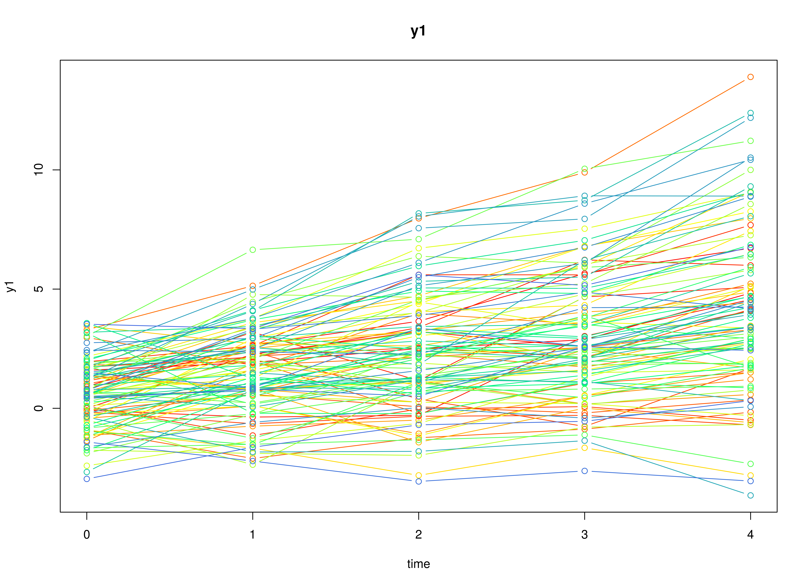

## Model

The measurement model is given by
\begin{equation}
  Y_{i, t}
  =
  \left(
  \begin{array}{cc}
    1 & 0 \\
  \end{array}
  \right)
  \left(
  \begin{array}{c}
    \eta_{0_{i, t}} \\
    \eta_{1_{i, t}} \\
  \end{array}
  \right)
  +
  \boldsymbol{\varepsilon}_{i, t},
  \quad
  \mathrm{with}
  \quad
  \boldsymbol{\varepsilon}_{i, t}
  \sim
  \mathcal{N}
  \left(
  0,
  \theta
  \right)
\end{equation}
where $Y_{i, t}$, $\eta_{0_{i, t}}$,
$\eta_{1_{i, t}}$,
and $\boldsymbol{\varepsilon}_{i, t}$
are random variables and
$\theta$ is a model parameter.
$Y_{i, t}$ is the observed random variable
at time $t$ and individual $i$,
$\eta_{0_{i, t}}$ (intercept)
and
$\eta_{1_{i, t}}$ (slope) form a vector of latent random variables
at time $t$ and individual $i$,
and $\boldsymbol{\varepsilon}_{i, t}$
is a vector of random measurement errors
at time $t$ and individual $i$.
$\theta$ is the variance of
$\boldsymbol{\varepsilon}$.

The dynamic structure is given by
\begin{equation}
  \left(
  \begin{array}{c}
  \eta_{0_{i, t}} \\
  \eta_{1_{i, t}} \\
  \end{array}
  \right)
  =
  \left(
  \begin{array}{cc}
    1 & 1 \\
    0 & 1 \\
  \end{array}
  \right)
  \left(
  \begin{array}{c}
  \eta_{0_{i, t - 1}} \\
  \eta_{1_{i, t - 1}} \\
  \end{array}
  \right) .
\end{equation}

The mean vector and covariance matrix of the intercept and slope
are captured in the mean vector and covariance matrix
of the initial condition given by
\begin{equation}
  \boldsymbol{\mu}_{\boldsymbol{\eta} \mid 0}
  =
  \left(
  \begin{array}{c}
    \mu_{\eta_{0}} \\
    \mu_{\eta_{1}} \\
  \end{array}
  \right) \quad \mathrm{and,}
\end{equation}

\begin{equation}
  \boldsymbol{\Sigma}_{\boldsymbol{\eta} \mid 0}
  =
  \left(
  \begin{array}{cc}
    \sigma^{2}_{\eta_{0}} &
    \sigma_{\eta_{0}, \eta_{1}} \\
    \sigma_{\eta_{1}, \eta_{0}} &
    \sigma^{2}_{\eta_{1}} \\
  \end{array}
  \right) .
\end{equation}

## Data Generation

### Notation


Let $t = 5$ be the number of time points and $n = 100$ be the number of individuals.

Let the measurement error variance $\theta$ be given by

\begin{equation}
\theta
=
0.6 .
\end{equation}

Let the initial condition
$\boldsymbol{\eta}_{0}$
be given by

\begin{equation}
\boldsymbol{\eta}_{0}
\sim
\mathcal{N}
\left(
\boldsymbol{\mu}_{\boldsymbol{\eta} \mid 0},
\boldsymbol{\Sigma}_{\boldsymbol{\eta} \mid 0}
\right)
\end{equation}

\begin{equation}
\boldsymbol{\mu}_{\boldsymbol{\eta} \mid 0}
=
\left(
\begin{array}{c}
  0.615 \\
  1.006 \\
\end{array}
\right)
\end{equation}

\begin{equation}
\boldsymbol{\Sigma}_{\boldsymbol{\eta} \mid 0}
=
\left(
\begin{array}{ccc}
  1.932 & 0.618 \\
  0.618 & 0.587 \\
\end{array}
\right) .
\end{equation}

### R Function Arguments


```r
n
#> [1] 100
time
#> [1] 5
mu0
#> [1] 0.615 1.006
sigma0
#>       [,1]  [,2]
#> [1,] 1.932 0.618
#> [2,] 0.618 0.587
sigma0_l
#>           [,1]      [,2]
#> [1,] 1.3899640 0.0000000
#> [2,] 0.4446158 0.6239525
theta
#> [1] 0.6
theta_l
#> [1] 0.7745967
```

### Using the SimSSMLinGrowth Function from the simStateSpace Package to Simulate Data


```r
library(simStateSpace)
sim <- SimSSMLinGrowth(
  n = n,
  time = time,
  mu0 = mu0,
  sigma0_l = sigma0_l,
  theta_l = theta_l,
  type = 0
)
data <- as.data.frame(sim)
head(data)
#>   id time        y1
#> 1  1    0 1.1817036
#> 2  1    1 2.3401803
#> 3  1    2 2.8058973
#> 4  1    3 3.3574565
#> 5  1    4 5.0413381
#> 6  2    0 0.6774161
plot(sim)
```



## Model Fitting

### Prepare Data


```r
dynr_data <- dynr::dynr.data(
  dataframe = data,
  id = "id",
  time = "time",
  observed = "y1"
)
```

### Prepare Initial Condition


```r
dynr_initial <- dynr::prep.initial(
  values.inistate = mu0,
  params.inistate = c("mu0_0", "mu0_1"),
  values.inicov = sigma0,
  params.inicov = matrix(
    data = c(
      "sigma0_00", "sigma0_01",
      "sigma0_01", "sigma0_11"
    ),
    nrow = 2
  )
)
```

### Prepare Measurement Model


```r
dynr_measurement <- dynr::prep.measurement(
  values.load = matrix(data = c(1, 0), nrow = 1),
  params.load = matrix(data = "fixed", nrow = 1, ncol = 2),
  state.names = c("eta_0", "eta_1"),
  obs.names = "y1"
)
```

### Prepare Dynamic Process


```r
dynr_dynamics <- dynr::prep.formulaDynamics(
  formula = list(
    eta_0 ~ eta_0 + eta_1,
    eta_1 ~ eta_1
  ),
  isContinuousTime = FALSE
)
#> Warning in dynr::prep.formulaDynamics(formula = list(eta_0 ~ eta_0 + eta_1, :
#> You provided no start values: length(startval)==0. If you have no free
#> parameters, keep calm and carry on.
```

### Prepare Process Noise


```r
dynr_noise <- dynr::prep.noise(
  values.latent = matrix(data = 0, nrow = 2, ncol = 2),
  params.latent = matrix(data = "fixed", nrow = 2, ncol = 2),
  values.observed = theta,
  params.observed = "theta"
)
```

### Prepare the Model


```r
model <- dynr::dynr.model(
  data = dynr_data,
  initial = dynr_initial,
  measurement = dynr_measurement,
  dynamics = dynr_dynamics,
  noise = dynr_noise,
  outfile = "lin-growth.c"
)
```


### Fit the Model


```r
results <- dynr::dynr.cook(
  model,
  debug_flag = TRUE,
  verbose = FALSE
)
#> [1] "Get ready!!!!"
#> using C compiler: ‘gcc (Ubuntu 11.4.0-1ubuntu1~22.04) 11.4.0’
#> Optimization function called.
#> Starting Hessian calculation ...
#> Finished Hessian calculation.
#> Original exit flag:  3 
#> Modified exit flag:  3 
#> Optimization terminated successfully: ftol_rel or ftol_abs was reached. 
#> Original fitted parameters:  -0.5498359 0.7153894 1.039108 0.3541278 0.2688659 
#> -0.9068893 
#> 
#> Transformed fitted parameters:  0.5770445 0.7153894 1.039108 1.424937 0.3831171 
#> 0.5067854 
#> 
#> Doing end processing
#> Successful trial
#> Total Time: 0.8712623 
#> Backend Time: 0.4577963
```

## Summary


```r
summary(results)
#> Coefficients:
#>           Estimate Std. Error t value ci.lower ci.upper Pr(>|t|)    
#> theta      0.57704    0.04712  12.247  0.48470  0.66939  < 2e-16 ***
#> mu0_0      0.71539    0.13308   5.376  0.45456  0.97622    6e-08 ***
#> mu0_1      1.03911    0.07513  13.830  0.89185  1.18636  < 2e-16 ***
#> sigma0_00  1.42494    0.25207   5.653  0.93089  1.91899    1e-08 ***
#> sigma0_01  0.38312    0.10394   3.686  0.17939  0.58684 0.000127 ***
#> sigma0_11  0.50679    0.07997   6.337  0.35005  0.66352  < 2e-16 ***
#> ---
#> Signif. codes:  0 '***' 0.001 '**' 0.01 '*' 0.05 '.' 0.1 ' ' 1
#> 
#> -2 log-likelihood value at convergence = 1637.76
#> AIC = 1649.76
#> BIC = 1675.04
```


```
#> [1] 0.7153894 1.0391077
```

### Estimated Parameters


```r
mu0_hat
#> [1] 0.7153894 1.0391077
sigma0_hat
#>           [,1]      [,2]
#> [1,] 1.4249373 0.3831171
#> [2,] 0.3831171 0.5067854
theta_hat
#>     theta 
#> 0.5770445
```

## Linear Growth Curve Model in Structural Equation Modeling

### Wide Data Set


```r
data <- as.data.frame(sim, long = FALSE)
head(data)
#>   id      y1_0      y1_1      y1_2      y1_3        y1_4
#> 1  1 1.1817036 2.3401803 2.8058973 3.3574565  5.04133811
#> 2  2 0.6774161 3.4783860 5.6666714 7.3385796  7.81178611
#> 3  3 1.6375721 3.7131237 6.9572364 9.2573667 10.93384353
#> 4  4 0.4256857 0.7907345 3.0068337 6.8307500  7.09579271
#> 5  5 1.3415343 1.1290045 0.6398178 0.3380987  0.01889009
#> 6  6 0.6019119 1.8582531 3.5358314 4.6208478  7.05338208
```

### Model


```r
model <- "
  # factor loadings
  eta0 =~ 1 * y1_0 + 1 * y1_1 + 1 * y1_2 + 1 * y1_3 + 1 * y1_4
  eta1 =~ 0 * y1_0 + 1 * y1_1 + 2 * y1_2 + 3 * y1_3 + 4 * y1_4
  # means of latent variables
  eta0 ~ mu0_0 * 1
  eta1 ~ mu0_1 * 1
  # variances and covariances of latent variables
  eta0 ~~ sigma0_00 * eta0
  eta0 ~~ sigma0_01 * eta1
  eta1 ~~ sigma0_11 * eta1
  # constrain error variance theta to be equal
  y1_0 ~~ theta * y1_0
  y1_1 ~~ theta * y1_1
  y1_2 ~~ theta * y1_2
  y1_3 ~~ theta * y1_3
  y1_4 ~~ theta * y1_4
"
```


```r
fit <- lavaan::growth(
  model = model,
  data = data
)
lavaan::summary(fit)
#> lavaan 0.6.17 ended normally after 23 iterations
#> 
#>   Estimator                                         ML
#>   Optimization method                           NLMINB
#>   Number of model parameters                        10
#>   Number of equality constraints                     4
#> 
#>   Number of observations                           100
#> 
#> Model Test User Model:
#>                                                       
#>   Test statistic                                18.966
#>   Degrees of freedom                                14
#>   P-value (Chi-square)                           0.166
#> 
#> Parameter Estimates:
#> 
#>   Standard errors                             Standard
#>   Information                                 Expected
#>   Information saturated (h1) model          Structured
#> 
#> Latent Variables:
#>                    Estimate  Std.Err  z-value  P(>|z|)
#>   eta0 =~                                             
#>     y1_0              1.000                           
#>     y1_1              1.000                           
#>     y1_2              1.000                           
#>     y1_3              1.000                           
#>     y1_4              1.000                           
#>   eta1 =~                                             
#>     y1_0              0.000                           
#>     y1_1              1.000                           
#>     y1_2              2.000                           
#>     y1_3              3.000                           
#>     y1_4              4.000                           
#> 
#> Covariances:
#>                    Estimate  Std.Err  z-value  P(>|z|)
#>   eta0 ~~                                             
#>     eta1    (s0_0)    0.383    0.104    3.686    0.000
#> 
#> Intercepts:
#>                    Estimate  Std.Err  z-value  P(>|z|)
#>     eta0    (m0_0)    0.715    0.133    5.376    0.000
#>     eta1    (m0_1)    1.039    0.075   13.831    0.000
#> 
#> Variances:
#>                    Estimate  Std.Err  z-value  P(>|z|)
#>     eta0    (s0_0)    1.425    0.252    5.653    0.000
#>     eta1    (s0_1)    0.507    0.080    6.337    0.000
#>    .y1_0    (thet)    0.577    0.047   12.247    0.000
#>    .y1_1    (thet)    0.577    0.047   12.247    0.000
#>    .y1_2    (thet)    0.577    0.047   12.247    0.000
#>    .y1_3    (thet)    0.577    0.047   12.247    0.000
#>    .y1_4    (thet)    0.577    0.047   12.247    0.000
```


```
#> [1] 0.7153894 1.0391077
```

### Estimated Parameters


```r
mu0_hat
#> [1] 0.7153894 1.0391077
sigma0_hat
#>           [,1]      [,2]
#> [1,] 1.4249373 0.3831171
#> [2,] 0.3831171 0.5067854
theta_hat
#> [1] 0.5770445
```

## References
