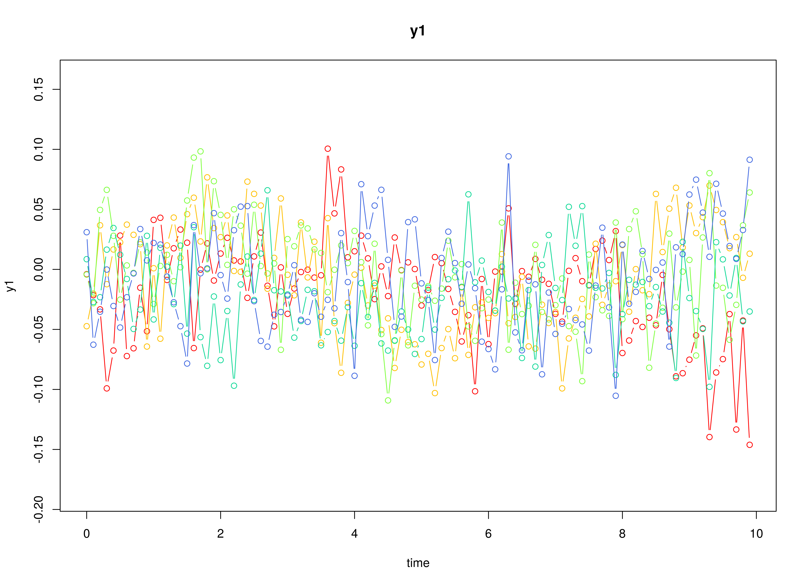
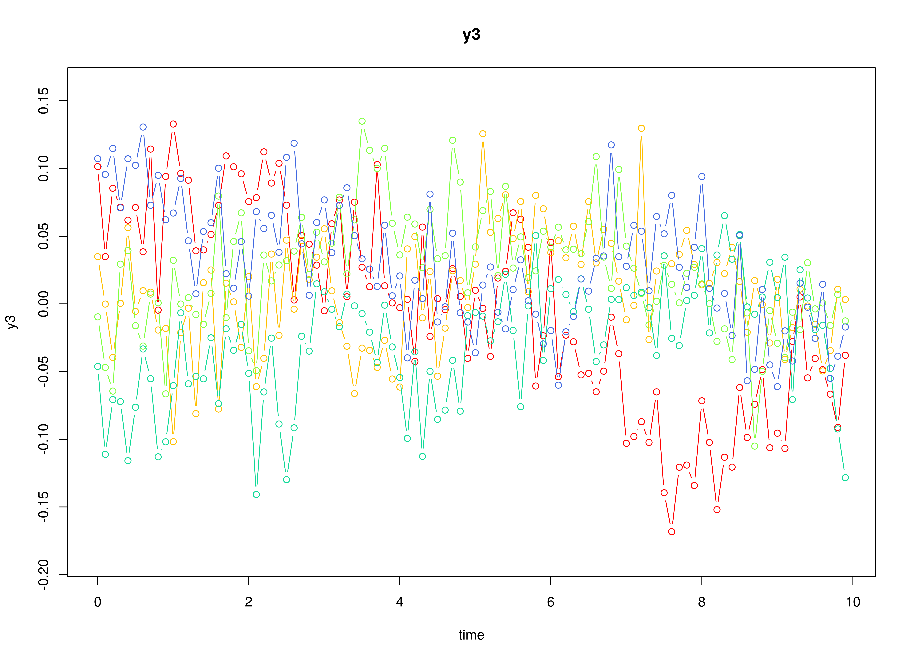
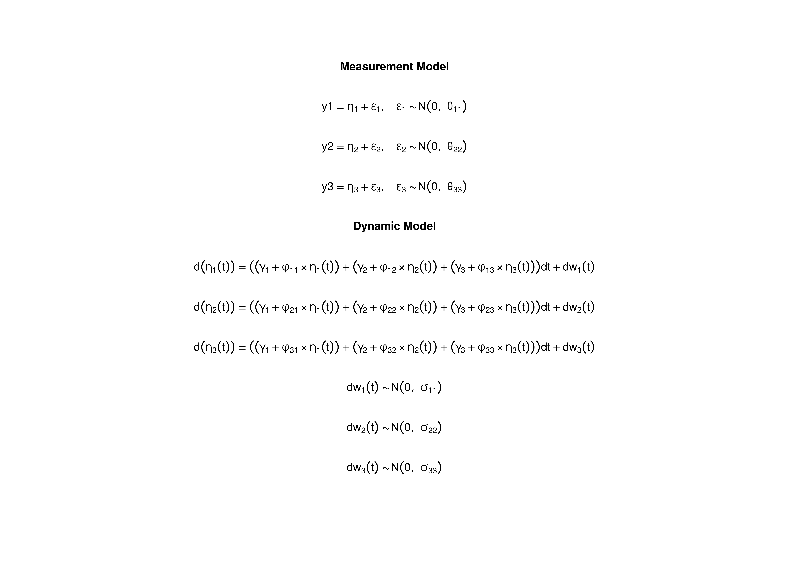

## Model

The measurement model is given by

\begin{equation}
  \mathbf{y}_{i, t}
  =
  \boldsymbol{\nu}
  +
  \boldsymbol{\Lambda}
  \boldsymbol{\eta}_{i, t} 
  +
  \boldsymbol{\varepsilon}_{i, t},
  \quad
  \mathrm{with}
  \quad
  \boldsymbol{\varepsilon}_{i, t}
  \sim
  \mathcal{N}
  \left(
  \mathbf{0},
  \boldsymbol{\Theta}
  \right)
\end{equation}

where $\mathbf{y}_{i, t}$, $\boldsymbol{\eta}_{i, t}$,
and $\boldsymbol{\varepsilon}_{i, t}$
are random variables and $\boldsymbol{\nu}$,
$\boldsymbol{\Lambda}$,
and $\boldsymbol{\Theta}$ are model parameters.
$\mathbf{y}_{i, t}$ is a vector of observed random variables
at time $t$ and individual $i$,
$\boldsymbol{\eta}_{i, t}$ is a vector of latent random variables
at time $t$ and individual $i$,
and $\boldsymbol{\varepsilon}_{i, t}$
is a vector of random measurement errors
at time $t$ and individual $i$,
while $\boldsymbol{\nu}$ is a vector of intercept,
$\boldsymbol{\Lambda}$ is a matrix of factor loadings,
and $\boldsymbol{\Theta}$ is the covariance matrix of
$\boldsymbol{\varepsilon}$.
An alternative representation of the measurement error
is given by

\begin{equation}
  \boldsymbol{\varepsilon}_{i, t}
  =
  \boldsymbol{\Theta}^{\frac{1}{2}}
  \mathbf{z}_{i, t},
  \quad
  \mathrm{with}
  \quad
  \mathbf{z}_{i, t}
  \sim
  \mathcal{N}
  \left(
  \mathbf{0},
  \mathbf{I}
  \right)
\end{equation}

where
$\mathbf{z}_{i, t}$ is a vector of
independent standard normal random variables and
$\left( \boldsymbol{\Theta}^{\frac{1}{2}} \right) \left( \boldsymbol{\Theta}^{\frac{1}{2}} \right)^{\prime} = \boldsymbol{\Theta} .$

The dynamic structure is given by

\begin{equation}
  \mathrm{d} \boldsymbol{\eta}_{i, t}
  =
  \left(
  \boldsymbol{\gamma}
  +
  \boldsymbol{\Phi}
  \boldsymbol{\eta}_{i, t}
  \right)
  \mathrm{d}t
  +
  \boldsymbol{\Sigma}^{\frac{1}{2}}
  \mathrm{d}
  \mathbf{W}_{i, t}
\end{equation}

where
$\boldsymbol{\gamma}$
is a term which is unobserved and constant over time,
$\boldsymbol{\Phi}$
is the drift matrix
which represents the rate of change of the solution
in the absence of any random fluctuations,
$\boldsymbol{\Sigma}$
is the matrix of volatility
or randomness in the process, and
$\mathrm{d}\boldsymbol{W}$
is a Wiener process or Brownian motion,
which represents random fluctuations.

## Data Generation

### Notation


Let $t = 991$ be the number of time points and $n = 5$ be the number of individuals.

Let the measurement model intecept vector $\boldsymbol{\nu}$ be given by

\begin{equation}
\boldsymbol{\nu}
=
\left(
\begin{array}{c}
  0 \\
  0 \\
  0 \\
\end{array}
\right) .
\end{equation}

Let the factor loadings matrix $\boldsymbol{\Lambda}$ be given by

\begin{equation}
\boldsymbol{\Lambda}
=
\left(
\begin{array}{ccc}
  1 & 0 & 0 \\
  0 & 1 & 0 \\
  0 & 0 & 1 \\
\end{array}
\right) .
\end{equation}

Let the measurement error covariance matrix $\boldsymbol{\Theta}$ be given by

\begin{equation}
\boldsymbol{\Theta}
=
\left(
\begin{array}{ccc}
  0.5 & 0 & 0 \\
  0 & 0.5 & 0 \\
  0 & 0 & 0.5 \\
\end{array}
\right) .
\end{equation}

Let the initial condition
$\boldsymbol{\eta}_{0}$
be given by

\begin{equation}
\boldsymbol{\eta}_{0} \sim \mathcal{N} \left( \boldsymbol{\mu}_{\boldsymbol{\eta} \mid 0}, \boldsymbol{\Sigma}_{\boldsymbol{\eta} \mid 0} \right)
\end{equation}

\begin{equation}
\boldsymbol{\mu}_{\boldsymbol{\eta} \mid 0}
=
\left(
\begin{array}{c}
  0 \\
  0 \\
  0 \\
\end{array}
\right)
\end{equation}

\begin{equation}
\boldsymbol{\Sigma}_{\boldsymbol{\eta} \mid 0}
=
\left(
\begin{array}{ccc}
  1 & 0 & 0 \\
  0 & 1 & 0 \\
  0 & 0 & 1 \\
\end{array}
\right) .
\end{equation}

Let the constant vector $\boldsymbol{\gamma}$ be given by

\begin{equation}
\boldsymbol{\gamma}
=
\left(
\begin{array}{c}
  0 \\
  0 \\
  0 \\
\end{array}
\right) .
\end{equation}

Let the drift matrix $\boldsymbol{\Phi}$ be given by

\begin{equation}
- \boldsymbol{\Phi}
=
\left(
\begin{array}{ccc}
  -0.357 & 0 & 0 \\
  0.771 & -0.511 & 0 \\
  -0.45 & 0.729 & -0.693 \\
\end{array}
\right) .
\end{equation}

Let the dynamic process noise covariance matrix $\boldsymbol{\Sigma}$ be given by

\begin{equation}
\boldsymbol{\Sigma}
=
\left(
\begin{array}{ccc}
  1 & 0 & 0 \\
  0 & 1 & 0 \\
  0 & 0 & 1 \\
\end{array}
\right) .
\end{equation}

Let $\Delta_{t} = 0.1$.

### R Function Arguments


```r
n
#> [1] 5
time
#> [1] 991
delta_t
#> [1] 0.1
mu0
#> [1] 0 0 0
sigma0
#>      [,1] [,2] [,3]
#> [1,]    1    0    0
#> [2,]    0    1    0
#> [3,]    0    0    1
gamma
#> [1] 0 0 0
phi
#>        [,1]   [,2]   [,3]
#> [1,] -0.357  0.000  0.000
#> [2,]  0.771 -0.511  0.000
#> [3,] -0.450  0.729 -0.693
sigma
#>      [,1] [,2] [,3]
#> [1,]    1    0    0
#> [2,]    0    1    0
#> [3,]    0    0    1
nu
#> [1] 0 0 0
lambda
#>      [,1] [,2] [,3]
#> [1,]    1    0    0
#> [2,]    0    1    0
#> [3,]    0    0    1
theta
#>      [,1] [,2] [,3]
#> [1,]  0.5  0.0  0.0
#> [2,]  0.0  0.5  0.0
#> [3,]  0.0  0.0  0.5
```

### Using the SimSSMOUFixed Function from the simStateSpace Package to Simulate Data


```r
library(simStateSpace)
sim <- SimSSMLinSDEFixed(
  n = n,
  time = time,
  delta_t = delta_t,
  mu0 = mu0,
  sigma0_l = sigma0_l,
  gamma = gamma,
  phi = phi,
  sigma_l = sigma_l,
  nu = nu,
  lambda = lambda,
  theta_l = theta_l,
  type = 0
)
data <- as.data.frame(sim)
head(data)
#>   id time         y1        y2       y3
#> 1  1  0.0 -0.2452235 0.3791894 2.916196
#> 2  1  0.1 -0.6610908 1.7775329 1.422248
#> 3  1  0.2 -0.9968450 2.0374791 2.524553
#> 4  1  0.3 -2.5458219 0.7624756 2.282397
#> 5  1  0.4 -1.7543358 0.6112899 2.094935
#> 6  1  0.5  0.4426151 1.3197169 2.138647
plot(sim)
```



## Model Fitting

### Prepare Data


```r
dynr_data <- dynr::dynr.data(
  dataframe = data,
  id = "id",
  time = "time",
  observed = c("y1", "y2", "y3")
)
```

### Prepare Initial Condition


```r
dynr_initial <- dynr::prep.initial(
  values.inistate = mu0,
  params.inistate = c("mu0_1", "mu0_2", "mu0_3"),
  values.inicov = sigma0,
  params.inicov = matrix(
    data = c(
      "sigma0_11", "sigma0_12", "sigma0_13",
      "sigma0_12", "sigma0_22", "sigma0_23",
      "sigma0_13", "sigma0_23", "sigma0_33"
    ),
    nrow = 3
  )
)
```

### Prepare Measurement Model


```r
dynr_measurement <- dynr::prep.measurement(
  values.load = diag(3),
  params.load = matrix(data = "fixed", nrow = 3, ncol = 3),
  state.names = c("eta_1", "eta_2", "eta_3"),
  obs.names = c("y1", "y2", "y3")
)
```

### Prepare Dynamic Process


```r
dynr_dynamics <- dynr::prep.formulaDynamics(
  formula = list(  
    eta_1 ~ (gamma_1 + phi_11 * eta_1) + (gamma_2 + phi_12 * eta_2) + (gamma_3 + phi_13 * eta_3),
    eta_2 ~ (gamma_1 + phi_21 * eta_1) + (gamma_2 + phi_22 * eta_2) + (gamma_3 + phi_23 * eta_3),
    eta_3 ~ (gamma_1 + phi_31 * eta_1) + (gamma_2 + phi_32 * eta_2) + (gamma_3 + phi_33 * eta_3)
  ),
  startval = c(
    gamma_1 = 0, gamma_2 = 0, gamma_3 = 0,
    phi_11 = 0, phi_12 = 0, phi_13 = 0,
    phi_21 = 0, phi_22 = 0, phi_23 = 0,
    phi_31 = 0, phi_32 = 0, phi_33 = 0
  ),
  isContinuousTime = TRUE
)
```

### Prepare Process Noise


```r
dynr_noise <- dynr::prep.noise(
  values.latent = sigma,
  params.latent = matrix(
    data = c(
      "sigma_11", "sigma_12", "sigma_13",
      "sigma_12", "sigma_22", "sigma_23",
      "sigma_13", "sigma_23", "sigma_33"
    ),
    nrow = 3
  ),
  values.observed = theta,
  params.observed = matrix(
    data = c(
      "theta_11", "fixed", "fixed",
      "fixed", "theta_22", "fixed",
      "fixed", "fixed", "theta_33"
    ),
    nrow = 3
  )
)
```

### Prepare the Model


```r
model <- dynr::dynr.model(
  data = dynr_data,
  initial = dynr_initial,
  measurement = dynr_measurement,
  dynamics = dynr_dynamics,
  noise = dynr_noise,
  outfile = "linsde.c"
)
```

Add lower and upper bounds to aid in the optimization.


```r
model$lb[
  c(
    "phi_11",
    "phi_12",
    "phi_13",
    "phi_21",
    "phi_22",
    "phi_23",
    "phi_31",
    "phi_32",
    "phi_33"
  )
] <- -1.5
model$ub[
  c(
    "phi_11",
    "phi_12",
    "phi_13",
    "phi_21",
    "phi_22",
    "phi_23",
    "phi_31",
    "phi_32",
    "phi_33"
  )
] <- +1.5
model$lb[
  c(
    "sigma_11",
    "sigma_22",
    "sigma_33",
    "theta_11",
    "theta_22",
    "theta_33"
  )
] <- .Machine$double.xmin
```



### Fit the Model


```r
results <- dynr::dynr.cook(
  model,
  debug_flag = TRUE,
  verbose = FALSE
)
#> [1] "Get ready!!!!"
#> using C compiler: ‘gcc (Ubuntu 11.4.0-1ubuntu1~22.04) 11.4.0’
#> Optimization function called.
#> Starting Hessian calculation ...
#> Finished Hessian calculation.
#> Original exit flag:  3 
#> Modified exit flag:  3 
#> Optimization terminated successfully: ftol_rel or ftol_abs was reached. 
#> Original fitted parameters:  0.007304743 0.007304752 0.007304752 -0.4156199 
#> -0.03272155 0.02700971 0.681228 -0.4813584 0.03323709 -0.4255086 0.6664323 
#> -0.6700265 0.07158153 -0.007998348 -0.09462432 0.06264102 -0.05565892 
#> -0.08493228 -0.7094544 -0.7463543 -0.6964461 -0.363638 1.106084 1.113627 
#> 0.3160029 -0.335927 -0.1325638 -0.6548259 0.008498094 -0.8999752 
#> 
#> Transformed fitted parameters:  0.007304743 0.007304752 0.007304752 -0.4156199 
#> -0.03272155 0.02700971 0.681228 -0.4813584 0.03323709 -0.4255086 0.6664323 
#> -0.6700265 1.074206 -0.008591872 -0.101646 1.064713 -0.05844397 0.9314908 
#> 0.4919125 0.4740918 0.4983532 -0.363638 1.106084 1.113627 1.371634 -0.4607689 
#> -0.181829 0.6743172 0.06549631 0.4307212 
#> 
#> Doing end processing
#> Successful trial
#> Total Time: 3.853545 
#> Backend Time: 3.844809
```

## Summary


```r
summary(results)
#> Coefficients:
#>            Estimate Std. Error t value  ci.lower  ci.upper Pr(>|t|)    
#> gamma_1    0.007305   0.972749   0.008 -1.899248  1.913857   0.4970    
#> gamma_2    0.007305   0.972646   0.008 -1.899046  1.913655   0.4970    
#> gamma_3    0.007305   0.972659   0.008 -1.899072  1.913682   0.4970    
#> phi_11    -0.415620   0.080093  -5.189 -0.572598 -0.258641   <2e-16 ***
#> phi_12    -0.032722   0.062673  -0.522 -0.155558  0.090115   0.3008    
#> phi_13     0.027010   0.057845   0.467 -0.086363  0.140383   0.3203    
#> phi_21     0.681228   0.076171   8.943  0.531935  0.830521   <2e-16 ***
#> phi_22    -0.481358   0.064204  -7.497 -0.607196 -0.355521   <2e-16 ***
#> phi_23     0.033237   0.058611   0.567 -0.081638  0.148112   0.2853    
#> phi_31    -0.425509   0.071202  -5.976 -0.565062 -0.285955   <2e-16 ***
#> phi_32     0.666432   0.058680  11.357  0.551422  0.781443   <2e-16 ***
#> phi_33    -0.670027   0.056370 -11.886 -0.780509 -0.559544   <2e-16 ***
#> sigma_11   1.074206   0.092561  11.605  0.892789  1.255623   <2e-16 ***
#> sigma_12  -0.008592   0.056032  -0.153 -0.118412  0.101228   0.4391    
#> sigma_13  -0.101646   0.052813  -1.925 -0.205157  0.001865   0.0272 *  
#> sigma_22   1.064713   0.085838  12.404  0.896474  1.232952   <2e-16 ***
#> sigma_23  -0.058444   0.051086  -1.144 -0.158571  0.041683   0.1263    
#> sigma_33   0.931491   0.075614  12.319  0.783291  1.079691   <2e-16 ***
#> theta_11   0.491913   0.013854  35.506  0.464758  0.519067   <2e-16 ***
#> theta_22   0.474092   0.013287  35.680  0.448049  0.500134   <2e-16 ***
#> theta_33   0.498353   0.013454  37.043  0.471985  0.524722   <2e-16 ***
#> mu0_1     -0.363638   0.543935  -0.669 -1.429731  0.702455   0.2519    
#> mu0_2      1.106084   0.406796   2.719  0.308778  1.903391   0.0033 ** 
#> mu0_3      1.113627   0.353480   3.150  0.420819  1.806435   0.0008 ***
#> sigma0_11  1.371634   0.968059   1.417 -0.525727  3.268995   0.0783 .  
#> sigma0_12 -0.460769   0.556964  -0.827 -1.552399  0.630861   0.2041    
#> sigma0_13 -0.181829   0.447953  -0.406 -1.059801  0.696143   0.3424    
#> sigma0_22  0.674317   0.551640   1.222 -0.406878  1.755512   0.1108    
#> sigma0_23  0.065496   0.322109   0.203 -0.565825  0.696818   0.4194    
#> sigma0_33  0.430721   0.374627   1.150 -0.303534  1.164976   0.1252    
#> ---
#> Signif. codes:  0 '***' 0.001 '**' 0.01 '*' 0.05 '.' 0.1 ' ' 1
#> 
#> -2 log-likelihood value at convergence = 37570.95
#> AIC = 37630.95
#> BIC = 37826.19
```


```
#> [1] -0.363638  1.106084  1.113627
```

### Parameter Estimates


```r
gamma_hat
#> [1] 0.007304743 0.007304752 0.007304752
phi_hat
#>            [,1]        [,2]        [,3]
#> [1,] -0.4156199 -0.03272155  0.02700971
#> [2,]  0.6812280 -0.48135842  0.03323709
#> [3,] -0.4255086  0.66643226 -0.67002652
sigma_hat
#>              [,1]         [,2]        [,3]
#> [1,]  1.074205726 -0.008591872 -0.10164599
#> [2,] -0.008591872  1.064713309 -0.05844397
#> [3,] -0.101645985 -0.058443972  0.93149085
mu0_hat
#> [1] -0.363638  1.106084  1.113627
sigma0_hat
#>            [,1]        [,2]        [,3]
#> [1,]  1.3716342 -0.46076893 -0.18182904
#> [2,] -0.4607689  0.67431724  0.06549631
#> [3,] -0.1818290  0.06549631  0.43072119
beta_var1_hat <- as.matrix(
  Matrix::expm(phi_hat)
)
beta_var1_hat
#>            [,1]        [,2]       [,3]
#> [1,]  0.6505458 -0.01552526 0.01538933
#> [2,]  0.4302260  0.61860739 0.02414631
#> [3,] -0.1128067  0.37880755 0.51574025
```

## References
