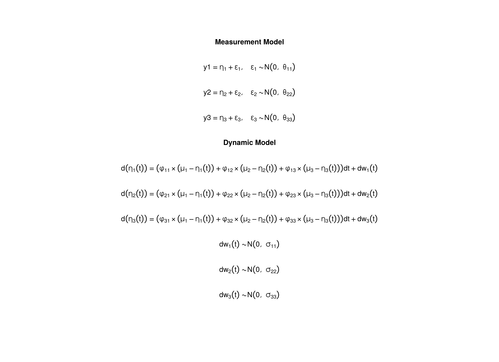

In this example,
data is generated from the the Ornstein–Uhlenbeck Model with $\Delta_{t} = 0.10$ 
(see the [OU](ou.html) article).
Then cases with non-integer `time` values are replaced with `NA`
to simulate the situation where data is measured in discrete time.

## Data Generation

### Notation


### R Function Arguments


```r
n
#> [1] 5
time
#> [1] 991
delta_t
#> [1] 0.1
mu0
#> [1] 0 0 0
sigma0
#>      [,1] [,2] [,3]
#> [1,]    1    0    0
#> [2,]    0    1    0
#> [3,]    0    0    1
mu
#> [1] 0 0 0
phi
#>        [,1]   [,2]  [,3]
#> [1,]  0.357  0.000 0.000
#> [2,] -0.771  0.511 0.000
#> [3,]  0.450 -0.729 0.693
sigma
#>      [,1] [,2] [,3]
#> [1,]    1    0    0
#> [2,]    0    1    0
#> [3,]    0    0    1
nu
#> [1] 0 0 0
lambda
#>      [,1] [,2] [,3]
#> [1,]    1    0    0
#> [2,]    0    1    0
#> [3,]    0    0    1
theta
#>      [,1] [,2] [,3]
#> [1,]  0.5  0.0  0.0
#> [2,]  0.0  0.5  0.0
#> [3,]  0.0  0.0  0.5
```

### Using the SimSSMOUFixed Function from the simStateSpace Package to Simulate Data


```r
library(simStateSpace)
sim <- SimSSMOUFixed(
  n = n,
  mu0 = mu0,
  sigma0 = sigma0,
  mu = mu,
  phi = phi,
  sigma = sigma,
  nu = nu,
  lambda = lambda,
  theta = theta,
  delta_t = delta_t,
  time = time,
  burn_in = 0
)
data <- as.data.frame(sim)
head(data)
#>   id time         y1        y2       y3
#> 1  1  0.0 -0.2452235 0.3791894 2.916196
#> 2  1  0.1 -0.6408937 1.7824870 1.400803
#> 3  1  0.2 -0.9755917 2.0512793 2.498214
#> 4  1  0.3 -2.5120801 0.7969752 2.234649
#> 5  1  0.4 -1.7204259 0.6404276 2.053562
#> 6  1  0.5  0.4753620 1.3252011 2.114403
plot(sim)
```


### Retain Discrete Time Cases


```r
for (i in seq_len(time)) {
  if (!(data[i, "time"] %in% time_discrete)) {
    data[i, "y1"] <- data[i, "y2"] <- data[i, "y3"] <- NA
  }
}
head(data)
#>   id time         y1        y2       y3
#> 1  1  0.0 -0.2452235 0.3791894 2.916196
#> 2  1  0.1         NA        NA       NA
#> 3  1  0.2         NA        NA       NA
#> 4  1  0.3         NA        NA       NA
#> 5  1  0.4         NA        NA       NA
#> 6  1  0.5         NA        NA       NA
plot(sim)
```


## Model Fitting

### Prepare Data


```r
dynr_data <- dynr::dynr.data(
  dataframe = data,
  id = "id",
  time = "time",
  observed = c("y1", "y2", "y3")
)
```

### Prepare Initial Condition


```r
dynr_initial <- dynr::prep.initial(
  values.inistate = mu0,
  params.inistate = c("mu0_1", "mu0_2", "mu0_3"),
  values.inicov = sigma0,
  params.inicov = matrix(
    data = c(
      "sigma0_11", "sigma0_12", "sigma0_13",
      "sigma0_12", "sigma0_22", "sigma0_23",
      "sigma0_13", "sigma0_23", "sigma0_33"
    ),
    nrow = 3
  )
)
```

### Prepare Measurement Model


```r
dynr_measurement <- dynr::prep.measurement(
  values.load = diag(3),
  params.load = matrix(data = "fixed", nrow = 3, ncol = 3),
  state.names = c("eta_1", "eta_2", "eta_3"),
  obs.names = c("y1", "y2", "y3")
)
```

### Prepare Dynamic Process


```r
dynr_dynamics <- dynr::prep.formulaDynamics(
  formula = list(  
    eta_1 ~ phi_11 * (mu_1 - eta_1) + phi_12 * (mu_2 - eta_2) + phi_13 * (mu_3 - eta_3),
    eta_2 ~ phi_21 * (mu_1 - eta_1) + phi_22 * (mu_2 - eta_2) + phi_23 * (mu_3 - eta_3),
    eta_3 ~ phi_31 * (mu_1 - eta_1) + phi_32 * (mu_2 - eta_2) + phi_33 * (mu_3 - eta_3)
  ),
  startval = c(
    mu_1 = 0, mu_2 = 0, mu_3 = 0,
    phi_11 = 0, phi_12 = 0, phi_13 = 0,
    phi_21 = 0, phi_22 = 0, phi_23 = 0,
    phi_31 = 0, phi_32 = 0, phi_33 = 0
  ),
  isContinuousTime = TRUE
)
```

### Prepare Process Noise


```r
dynr_noise <- dynr::prep.noise(
  values.latent = sigma,
  params.latent = matrix(
    data = c(
      "sigma_11", "sigma_12", "sigma_13",
      "sigma_12", "sigma_22", "sigma_23",
      "sigma_13", "sigma_23", "sigma_33"
    ),
    nrow = 3
  ),
  values.observed = theta,
  params.observed = matrix(
    data = c(
      "theta_11", "fixed", "fixed",
      "fixed", "theta_22", "fixed",
      "fixed", "fixed", "theta_33"
    ),
    nrow = 3
  )
)
```

### Prepare the Model


```r
model <- dynr::dynr.model(
  data = dynr_data,
  initial = dynr_initial,
  measurement = dynr_measurement,
  dynamics = dynr_dynamics,
  noise = dynr_noise,
  outfile = "ou.c"
)
```

Add lower and upper bounds to aid in the optimization.


```r
model$lb[
  c(
    "phi_11",
    "phi_12",
    "phi_13",
    "phi_21",
    "phi_22",
    "phi_23",
    "phi_31",
    "phi_32",
    "phi_33"
  )
] <- -1.5
model$ub[
  c(
    "phi_11",
    "phi_12",
    "phi_13",
    "phi_21",
    "phi_22",
    "phi_23",
    "phi_31",
    "phi_32",
    "phi_33"
  )
] <- +1.5
model$lb[
  c(
    "sigma_11",
    "sigma_22",
    "sigma_33",
    "theta_11",
    "theta_22",
    "theta_33"
  )
] <- .Machine$double.xmin
```



### Fit the Model


```r
results <- dynr::dynr.cook(
  model,
  debug_flag = TRUE,
  verbose = FALSE
)
#> [1] "Get ready!!!!"
#> using C compiler: ‘gcc (Ubuntu 11.4.0-1ubuntu1~22.04) 11.4.0’
#> Optimization function called.
#> Starting Hessian calculation ...
#> Finished Hessian calculation.
#> Original exit flag:  3 
#> Modified exit flag:  3 
#> Optimization terminated successfully: ftol_rel or ftol_abs was reached. 
#> Original fitted parameters:  0.02788626 0.1325717 0.1367556 0.3921689 
#> 0.03155314 -0.03409058 -0.6974243 0.4834635 -0.0330835 0.4222046 -0.6669876 
#> 0.6857552 0.0332539 -0.03302106 -0.08384834 0.06676525 -0.05187938 -0.06903997 
#> -0.6968097 -0.7592397 -0.6833183 -0.2180805 0.9926448 1.224743 0.3026227 
#> -0.3409811 0.001245531 -0.5660732 -0.2139719 -0.2259869 
#> 
#> Transformed fitted parameters:  0.02788626 0.1325717 0.1367556 0.3921689 
#> 0.03155314 -0.03409058 -0.6974243 0.4834635 -0.0330835 0.4222046 -0.6669876 
#> 0.6857552 1.033813 -0.0341376 -0.0866835 1.070172 -0.05259899 0.9434349 
#> 0.4981721 0.4680221 0.5049387 -0.2180805 0.9926448 1.224743 1.353404 -0.461485 
#> 0.001685707 0.7251082 -0.1220575 0.8237246 
#> 
#> Doing end processing
#> Successful trial
#> Total Time: 3.77782 
#> Backend Time: 3.769027
```

## Summary


```r
summary(results)
#> Coefficients:
#>            Estimate Std. Error t value  ci.lower  ci.upper Pr(>|t|)    
#> mu_1       0.027886   0.112739   0.247 -0.193078  0.248850   0.4023    
#> mu_2       0.132572   0.195020   0.680 -0.249661  0.514804   0.2483    
#> mu_3       0.136756   0.149260   0.916 -0.155789  0.429300   0.1798    
#> phi_11     0.392169   0.083444   4.700  0.228622  0.555716   <2e-16 ***
#> phi_12     0.031553   0.066224   0.476 -0.098244  0.161350   0.3169    
#> phi_13    -0.034091   0.061104  -0.558 -0.153853  0.085672   0.2885    
#> phi_21    -0.697424   0.081240  -8.585 -0.856652 -0.538197   <2e-16 ***
#> phi_22     0.483464   0.068623   7.045  0.348965  0.617962   <2e-16 ***
#> phi_23    -0.033084   0.063364  -0.522 -0.157275  0.091107   0.3008    
#> phi_31     0.422205   0.078104   5.406  0.269124  0.575285   <2e-16 ***
#> phi_32    -0.666988   0.065337 -10.208 -0.795046 -0.538929   <2e-16 ***
#> phi_33     0.685755   0.062654  10.945  0.562956  0.808554   <2e-16 ***
#> sigma_11   1.033813   0.098591  10.486  0.840578  1.227048   <2e-16 ***
#> sigma_12  -0.034138   0.060481  -0.564 -0.152679  0.084403   0.2862    
#> sigma_13  -0.086684   0.057775  -1.500 -0.199920  0.026553   0.0668 .  
#> sigma_22   1.070172   0.093102  11.495  0.887694  1.252649   <2e-16 ***
#> sigma_23  -0.052599   0.056425  -0.932 -0.163190  0.057992   0.1756    
#> sigma_33   0.943435   0.086229  10.941  0.774430  1.112440   <2e-16 ***
#> theta_11   0.498172   0.015430  32.287  0.467930  0.528414   <2e-16 ***
#> theta_22   0.468022   0.014605  32.045  0.439396  0.496648   <2e-16 ***
#> theta_33   0.504939   0.015357  32.880  0.474839  0.535038   <2e-16 ***
#> mu0_1     -0.218080   0.564696  -0.386 -1.324865  0.888704   0.3497    
#> mu0_2      0.992645   0.438169   2.265  0.133850  1.851440   0.0118 *  
#> mu0_3      1.224743   0.463840   2.640  0.315634  2.133852   0.0042 ** 
#> sigma0_11  1.353404   0.991314   1.365 -0.589537  3.296344   0.0861 .  
#> sigma0_12 -0.461485   0.581510  -0.794 -1.601223  0.678253   0.2137    
#> sigma0_13  0.001686   0.584280   0.003 -1.143483  1.146854   0.4988    
#> sigma0_22  0.725108   0.588376   1.232 -0.428087  1.878304   0.1089    
#> sigma0_23 -0.122057   0.465260  -0.262 -1.033951  0.789836   0.3965    
#> sigma0_33  0.823725   0.753816   1.093 -0.653729  2.301178   0.1373    
#> ---
#> Signif. codes:  0 '***' 0.001 '**' 0.01 '*' 0.05 '.' 0.1 ' ' 1
#> 
#> -2 log-likelihood value at convergence = 31012.43
#> AIC = 31072.43
#> BIC = 31267.68
```


```
#> [1] -0.2180805  0.9926448  1.2247429
```

### Parameter Estimates


```r
mu_hat
#> [1] 0.02788626 0.13257167 0.13675559
phi_hat
#>            [,1]        [,2]        [,3]
#> [1,]  0.3921689  0.03155314 -0.03409058
#> [2,] -0.6974243  0.48346352 -0.03308350
#> [3,]  0.4222046 -0.66698758  0.68575519
sigma_hat
#>            [,1]        [,2]        [,3]
#> [1,]  1.0338130 -0.03413760 -0.08668350
#> [2,] -0.0341376  1.07017175 -0.05259899
#> [3,] -0.0866835 -0.05259899  0.94343494
mu0_hat
#> [1] -0.2180805  0.9926448  1.2247429
sigma0_hat
#>              [,1]       [,2]         [,3]
#> [1,]  1.353403703 -0.4614850  0.001685707
#> [2,] -0.461485032  0.7251082 -0.122057467
#> [3,]  0.001685707 -0.1220575  0.823724564
beta_var1_hat <- as.matrix(
  Matrix::expm(-1 * phi_hat)
)
beta_var1_hat
#>            [,1]        [,2]       [,3]
#> [1,]  0.6656383 -0.01357283 0.01960860
#> [2,]  0.4453037  0.61764527 0.02550267
#> [3,] -0.1083622  0.37557260 0.50720264
```

## References
