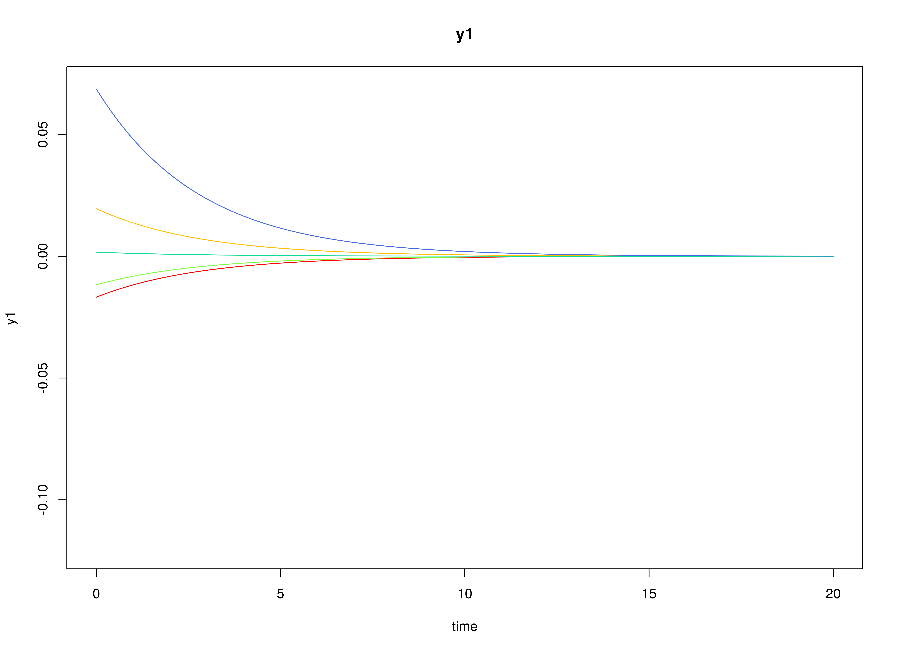
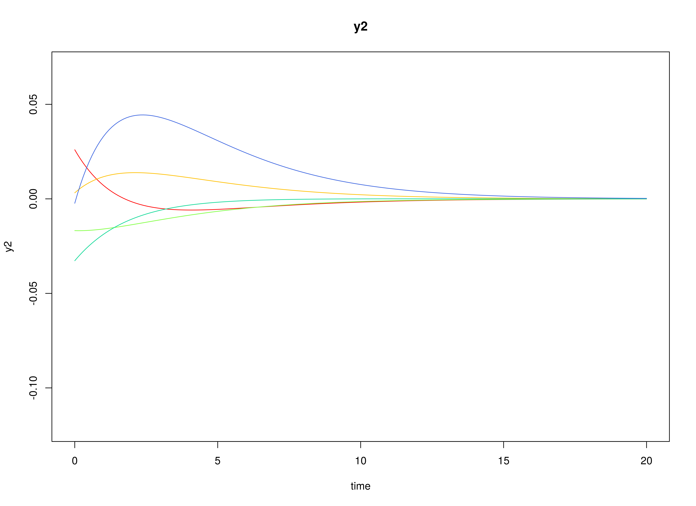
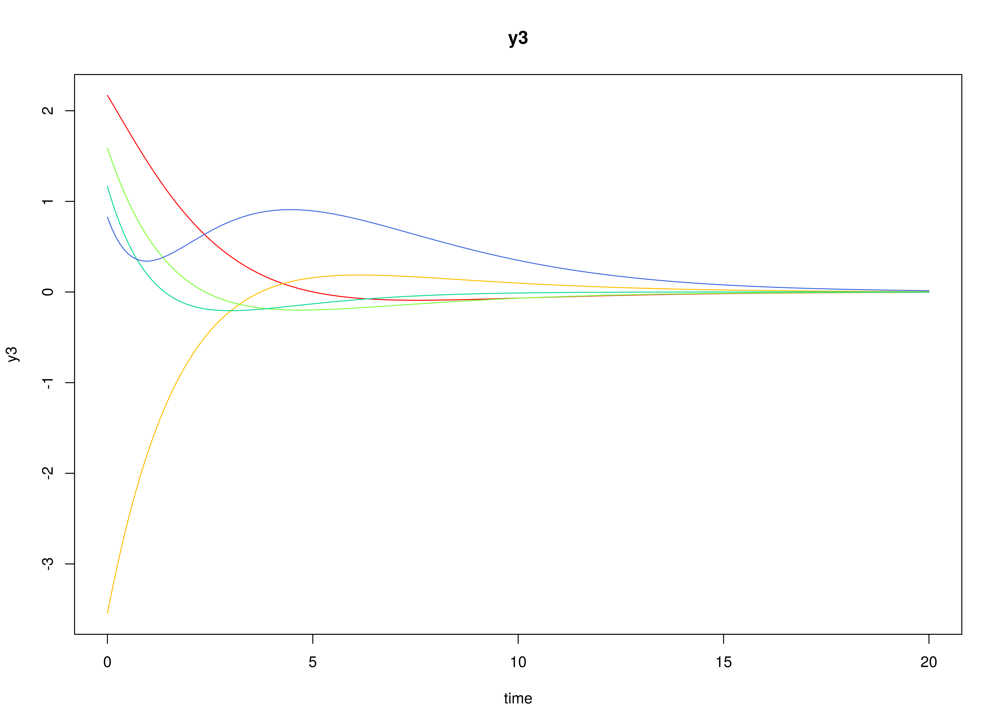
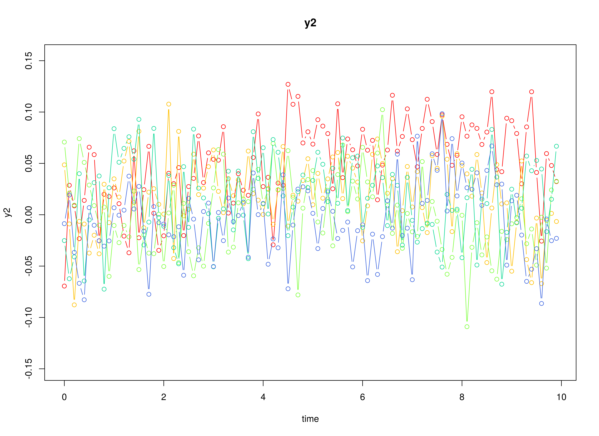
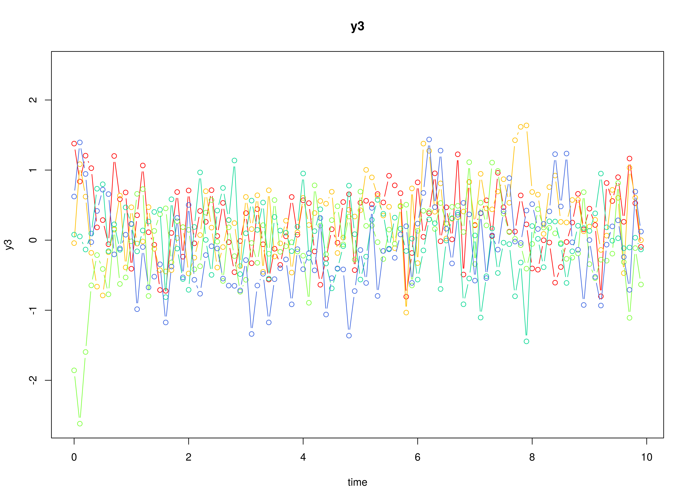
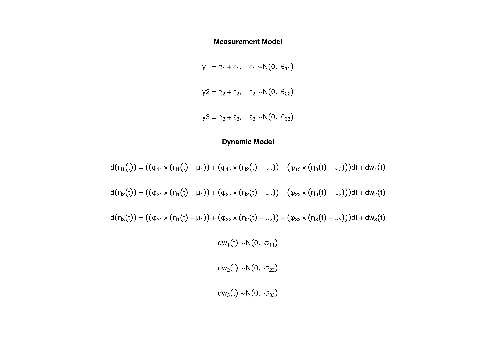

## Model

The measurement model is given by
\begin{equation}
  \mathbf{y}_{i, t}
  =
  \boldsymbol{\nu}
  +
  \boldsymbol{\Lambda}
  \boldsymbol{\eta}_{i, t}
  +
  \boldsymbol{\varepsilon}_{i, t},
  \quad
  \mathrm{with}
  \quad
  \boldsymbol{\varepsilon}_{i, t}
  \sim
  \mathcal{N}
  \left(
  \mathbf{0},
  \boldsymbol{\Theta}
  \right)
\end{equation}
where
$\mathbf{y}_{i, t}$,
$\boldsymbol{\eta}_{i, t}$,
and
$\boldsymbol{\varepsilon}_{i, t}$
are random variables
and
$\boldsymbol{\nu}$,
$\boldsymbol{\Lambda}$,
and
$\boldsymbol{\Theta}$
are model parameters.
$\mathbf{y}_{i, t}$
represents a vector of observed random variables,
$\boldsymbol{\eta}_{i, t}$
a vector of latent random variables,
and
$\boldsymbol{\varepsilon}_{i, t}$
a vector of random measurement errors,
at time $t$ and individual $i$.
$\boldsymbol{\nu}$
denotes a vector of intercepts,
$\boldsymbol{\Lambda}$
a matrix of factor loadings,
and
$\boldsymbol{\Theta}$
the covariance matrix of
$\boldsymbol{\varepsilon}$.

An alternative representation of the measurement error
is given by
\begin{equation}
  \boldsymbol{\varepsilon}_{i, t}
  =
  \boldsymbol{\Theta}^{\frac{1}{2}}
  \mathbf{z}_{i, t},
  \quad
  \mathrm{with}
  \quad
  \mathbf{z}_{i, t}
  \sim
  \mathcal{N}
  \left(
  \mathbf{0},
  \mathbf{I}
  \right)
\end{equation}
where
$\mathbf{z}_{i, t}$ is a vector of
independent standard normal random variables and
$\left( \boldsymbol{\Theta}^{\frac{1}{2}} \right) \left( \boldsymbol{\Theta}^{\frac{1}{2}} \right)^{\prime} = \boldsymbol{\Theta}$ .

The dynamic structure is given by
\begin{equation}
  \mathrm{d} \boldsymbol{\eta}_{i, t}
  =
  \boldsymbol{\Phi}
  \left(
  \boldsymbol{\eta}_{i, t}
  -
  \boldsymbol{\mu}
  \right)
  \mathrm{d}t
  +
  \boldsymbol{\Sigma}^{\frac{1}{2}}
  \mathrm{d}
  \mathbf{W}_{i, t}
\end{equation}
where
$\boldsymbol{\mu}$
is the long-term mean or equilibrium level,
$\boldsymbol{\Phi}$
is the rate of mean reversion,
determining how quickly the variable returns to its mean,
$\boldsymbol{\Sigma}$
is the matrix of volatility
or randomness in the process, and
$\mathrm{d}\boldsymbol{W}$
is a Wiener process or Brownian motion,
which represents random fluctuations.

## Data Generation

### Notation

Let $t = 100$ be the number of time points and $n = 5$ be the number of individuals.

Let the measurement model intecept vector $\boldsymbol{\nu}$ be given by

\begin{equation}
\boldsymbol{\nu}
=
\left(
\begin{array}{c}
  0 \\
  0 \\
  0 \\
\end{array}
\right) .
\end{equation}

Let the factor loadings matrix $\boldsymbol{\Lambda}$ be given by

\begin{equation}
\boldsymbol{\Lambda}
=
\left(
\begin{array}{ccc}
  1 & 0 & 0 \\
  0 & 1 & 0 \\
  0 & 0 & 1 \\
\end{array}
\right) .
\end{equation}

Let the measurement error covariance matrix $\boldsymbol{\Theta}$ be given by

\begin{equation}
\boldsymbol{\Theta}
=
\left(
\begin{array}{ccc}
  0.2 & 0 & 0 \\
  0 & 0.2 & 0 \\
  0 & 0 & 0.2 \\
\end{array}
\right) .
\end{equation}

Let the initial condition
$\boldsymbol{\eta}_{0}$
be given by

\begin{equation}
\boldsymbol{\eta}_{0} \sim \mathcal{N} \left( \boldsymbol{\mu}_{\boldsymbol{\eta} \mid 0}, \boldsymbol{\Sigma}_{\boldsymbol{\eta} \mid 0} \right)
\end{equation}

\begin{equation}
\boldsymbol{\mu}_{\boldsymbol{\eta} \mid 0}
=
\left(
\begin{array}{c}
  0 \\
  0 \\
  0 \\
\end{array}
\right)
\end{equation}

\begin{equation}
\boldsymbol{\Sigma}_{\boldsymbol{\eta} \mid 0}
=
\left(
\begin{array}{ccc}
  1 & 0.2 & 0.2 \\
  0.2 & 1 & 0.2 \\
  0.2 & 0.2 & 1 \\
\end{array}
\right) .
\end{equation}

Let the long-term mean vector $\boldsymbol{\mu}$ be given by

\begin{equation}
\boldsymbol{\mu}
=
\left(
\begin{array}{c}
  0 \\
  0 \\
  0 \\
\end{array}
\right) .
\end{equation}

Let the rate of mean reversion matrix $\boldsymbol{\Phi}$ be given by

\begin{equation}
\boldsymbol{\Phi}
=
\left(
\begin{array}{ccc}
  -0.357 & 0 & 0 \\
  0.771 & -0.511 & 0 \\
  -0.45 & 0.729 & -0.693 \\
\end{array}
\right) .
\end{equation}

Let the dynamic process noise covariance matrix $\boldsymbol{\Sigma}$ be given by

\begin{equation}
\boldsymbol{\Sigma}
=
\left(
\begin{array}{ccc}
  0.2445556 & 0.0220159 & -0.0500476 \\
  0.0220159 & 0.070678 & 0.0153946 \\
  -0.0500476 & 0.0153946 & 0.0755306 \\
\end{array}
\right) .
\end{equation}

Let $\Delta t = 0.1$.

### R Function Arguments


``` r
n
#> [1] 5
```

``` r
time
#> [1] 100
```

``` r
delta_t
#> [1] 0.1
```

``` r
mu0
#> [1] 0 0 0
```

``` r
sigma0
#>      [,1] [,2] [,3]
#> [1,]  1.0  0.2  0.2
#> [2,]  0.2  1.0  0.2
#> [3,]  0.2  0.2  1.0
```

``` r
mu
#> [1] 0 0 0
```

``` r
phi
#>        [,1]   [,2]   [,3]
#> [1,] -0.357  0.000  0.000
#> [2,]  0.771 -0.511  0.000
#> [3,] -0.450  0.729 -0.693
```

``` r
sigma
#>             [,1]       [,2]        [,3]
#> [1,]  0.24455556 0.02201587 -0.05004762
#> [2,]  0.02201587 0.07067800  0.01539456
#> [3,] -0.05004762 0.01539456  0.07553061
```

``` r
nu
#> [1] 0 0 0
```

``` r
lambda
#>      [,1] [,2] [,3]
#> [1,]    1    0    0
#> [2,]    0    1    0
#> [3,]    0    0    1
```

``` r
theta
#>      [,1] [,2] [,3]
#> [1,]  0.2  0.0  0.0
#> [2,]  0.0  0.2  0.0
#> [3,]  0.0  0.0  0.2
```

### Visualizing the Dynamics Without Measurement Error and Process Noise (n = 5 with Different Initial Condition)



### Using the SimSSMOUFixed Function from the simStateSpace Package to Simulate Data


``` r
library(simStateSpace)
sim <- SimSSMOUFixed(
  n = n,
  time = time,
  delta_t = delta_t,
  mu0 = mu0,
  sigma0_l = sigma0_l,
  mu = mu,
  phi = phi,
  sigma_l = sigma_l,
  nu = nu,
  lambda = lambda,
  theta_l = theta_l,
  type = 0
)
data <- as.data.frame(sim)
head(data)
#>   id time          y1          y2        y3
#> 1  1  0.0  0.29937539 -1.37581548 1.3779071
#> 2  1  0.1 -0.98770381 -0.03632195 0.8363080
#> 3  1  0.2  0.33221051 -0.40321664 1.2054318
#> 4  1  0.3 -0.09485392 -0.82030556 1.0272653
#> 5  1  0.4 -1.50322069 -0.36841853 0.1821731
#> 6  1  0.5 -0.75049839  0.35752476 0.2862544
```

``` r
plot(sim)
```



## Model Fitting

### Prepare Data


``` r
dynr_data <- dynr::dynr.data(
  dataframe = data,
  id = "id",
  time = "time",
  observed = c("y1", "y2", "y3")
)
```

### Prepare Initial Condition


``` r
dynr_initial <- dynr::prep.initial(
  values.inistate = mu0,
  params.inistate = c("mu0_1", "mu0_2", "mu0_3"),
  values.inicov = sigma0,
  params.inicov = matrix(
    data = c(
      "sigma0_11", "sigma0_12", "sigma0_13",
      "sigma0_12", "sigma0_22", "sigma0_23",
      "sigma0_13", "sigma0_23", "sigma0_33"
    ),
    nrow = 3
  )
)
```

### Prepare Measurement Model


``` r
dynr_measurement <- dynr::prep.measurement(
  values.load = diag(3),
  params.load = matrix(data = "fixed", nrow = 3, ncol = 3),
  state.names = c("eta_1", "eta_2", "eta_3"),
  obs.names = c("y1", "y2", "y3")
)
```

### Prepare Dynamic Process


``` r
dynr_dynamics <- dynr::prep.formulaDynamics(
  formula = list(  
    eta_1 ~ (phi_11 * (eta_1 - mu_1)) + (phi_12 * (eta_2 - mu_2)) + (phi_13 * (eta_3 - mu_3)),
    eta_2 ~ (phi_21 * (eta_1 - mu_1)) + (phi_22 * (eta_2 - mu_2)) + (phi_23 * (eta_3 - mu_3)),
    eta_3 ~ (phi_31 * (eta_1 - mu_1)) + (phi_32 * (eta_2 - mu_2)) + (phi_33 * (eta_3 - mu_3))
  ),
  startval = c(
    mu_1 = mu[1], mu_2 = mu[2], mu_3 = mu[3],
    phi_11 = phi[1, 1], phi_12 = phi[1, 2], phi_13 = phi[1, 3],
    phi_21 = phi[2, 1], phi_22 = phi[2, 2], phi_23 = phi[2, 3],
    phi_31 = phi[3, 1], phi_32 = phi[3, 2], phi_33 = phi[3, 3]
  ),
  isContinuousTime = TRUE
)
```

### Prepare Process Noise


``` r
dynr_noise <- dynr::prep.noise(
  values.latent = sigma,
  params.latent = matrix(
    data = c(
      "sigma_11", "sigma_12", "sigma_13",
      "sigma_12", "sigma_22", "sigma_23",
      "sigma_13", "sigma_23", "sigma_33"
    ),
    nrow = 3
  ),
  values.observed = theta,
  params.observed = matrix(
    data = c(
      "theta_11", "fixed", "fixed",
      "fixed", "theta_22", "fixed",
      "fixed", "fixed", "theta_33"
    ),
    nrow = 3
  )
)
```

### Prepare the Model


``` r
model <- dynr::dynr.model(
  data = dynr_data,
  initial = dynr_initial,
  measurement = dynr_measurement,
  dynamics = dynr_dynamics,
  noise = dynr_noise,
  outfile = "ou.c"
)
```

Add lower and upper bounds to aid in the optimization.


``` r
model$lb[
  c(
    "phi_11",
    "phi_12",
    "phi_13",
    "phi_21",
    "phi_22",
    "phi_23",
    "phi_31",
    "phi_32",
    "phi_33"
  )
] <- -1.5
model$ub[
  c(
    "phi_11",
    "phi_12",
    "phi_13",
    "phi_21",
    "phi_22",
    "phi_23",
    "phi_31",
    "phi_32",
    "phi_33"
  )
] <- +1.5
```



### Fit the Model


``` r
results <- dynr::dynr.cook(
  model,
  debug_flag = TRUE,
  verbose = FALSE
)
#> [1] "Get ready!!!!"
#> using C compiler: ‘gcc (Ubuntu 11.4.0-1ubuntu1~22.04) 11.4.0’
#> Optimization function called.
#> Starting Hessian calculation ...
#> Finished Hessian calculation.
#> Original exit flag:  3 
#> Modified exit flag:  3 
#> Optimization terminated successfully: ftol_rel or ftol_abs was reached. 
#> Original fitted parameters:  0.05485504 0.1965642 0.1128742 -0.2600782 
#> -0.2739041 0.02599383 0.7412146 -1.002955 0.2049505 -0.9824315 1.5 -1.091145 
#> -2.165581 0.1369349 0.1205417 -3.228082 0.03768164 -3.136258 -1.525 -1.617376 
#> -1.617816 0.007096018 -0.08813474 0.19355 -1.572231 -0.3089916 0.7340555 
#> -0.8958999 -1.792513 -19.57305 
#> 
#> Transformed fitted parameters:  0.05485504 0.1965642 0.1128742 -0.2600782 
#> -0.2739041 0.02599383 0.7412146 -1.002955 0.2049505 -0.9824315 1.5 -1.091145 
#> 0.1146833 0.01570415 0.01382413 0.04178387 0.003386458 0.04516774 0.2176211 
#> 0.1984187 0.1983315 0.007096018 -0.08813474 0.19355 0.2075815 -0.06414093 
#> 0.1523763 0.4280591 -0.7788586 1.42357 
#> 
#> Doing end processing
#> Warning in sqrt(diag(x$inv.hessian)): NaNs produced
#> Successful trial
#> Total Time: 35.65567 
#> Backend Time: 35.00647
```

## Summary


``` r
summary(results)
#> Coefficients:
#>            Estimate Std. Error t value  ci.lower  ci.upper Pr(>|t|)    
#> mu_1       0.054855   0.106835   0.513 -0.154538  0.264248   0.3039    
#> mu_2       0.196564   0.096105   2.045  0.008202  0.384926   0.0207 *  
#> mu_3       0.112874   0.081009   1.393 -0.045901  0.271649   0.0821 .  
#> phi_11    -0.260078   0.288558  -0.901 -0.825641  0.305485   0.1839    
#> phi_12    -0.273904   0.336839  -0.813 -0.934096  0.386288   0.2083    
#> phi_13     0.025994   0.243493   0.107 -0.451244  0.503231   0.4575    
#> phi_21     0.741215   0.207232   3.577  0.335047  1.147382   0.0002 ***
#> phi_22    -1.002955   0.235198  -4.264 -1.463935 -0.541976   <2e-16 ***
#> phi_23     0.204950   0.195182   1.050 -0.177599  0.587500   0.1471    
#> phi_31    -0.982431   0.270772  -3.628 -1.513134 -0.451729   0.0002 ***
#> phi_32     1.500000   0.314152   4.775  0.884273  2.115727   <2e-16 ***
#> phi_33    -1.091145   0.261609  -4.171 -1.603890 -0.578400   <2e-16 ***
#> sigma_11   0.114683   0.045976   2.494  0.024572  0.204795   0.0065 ** 
#> sigma_12   0.015704   0.020872   0.752 -0.025204  0.056612   0.2261    
#> sigma_13   0.013824   0.028047   0.493 -0.041147  0.068796   0.3112    
#> sigma_22   0.041784   0.020217   2.067  0.002160  0.081408   0.0197 *  
#> sigma_23   0.003386   0.020082   0.169 -0.035973  0.042745   0.4331    
#> sigma_33   0.045168   0.039737   1.137 -0.032715  0.123050   0.1281    
#> theta_11   0.217621   0.016232  13.407  0.185808  0.249435   <2e-16 ***
#> theta_22   0.198419   0.013582  14.608  0.171798  0.225040   <2e-16 ***
#> theta_33   0.198331   0.014608  13.577  0.169701  0.226962   <2e-16 ***
#> mu0_1      0.007096   0.230500   0.031 -0.444676  0.458868   0.4877    
#> mu0_2     -0.088135   0.308098  -0.286 -0.691996  0.515727   0.3875    
#> mu0_3      0.193550   0.544578   0.355 -0.873803  1.260903   0.3612    
#> sigma0_11  0.207581   0.166659   1.246 -0.119064  0.534227   0.1068    
#> sigma0_12 -0.064141   0.164276  -0.390 -0.386115  0.257833   0.3482    
#> sigma0_13  0.152376   0.297928   0.511 -0.431551  0.736304   0.3046    
#> sigma0_22  0.428059   0.316653   1.352 -0.192569  1.048687   0.0885 .  
#> sigma0_23 -0.778859   0.524908  -1.484 -1.807659  0.249942   0.0693 .  
#> sigma0_33  1.423570   0.954929   1.491 -0.448056  3.295196   0.0683 .  
#> ---
#> Signif. codes:  0 '***' 0.001 '**' 0.01 '*' 0.05 '.' 0.1 ' ' 1
#> 
#> -2 log-likelihood value at convergence = 2088.54
#> AIC = 2148.54
#> BIC = 2274.97
```


```
#> [1]  0.007096018 -0.088134745  0.193550032
```

### Parameter Estimates


``` r
mu_hat
#> [1] 0.05485504 0.19656423 0.11287416
```

``` r
phi_hat
#>            [,1]       [,2]        [,3]
#> [1,] -0.2600782 -0.2739041  0.02599383
#> [2,]  0.7412146 -1.0029554  0.20495046
#> [3,] -0.9824315  1.5000000 -1.09114523
```

``` r
sigma_hat
#>            [,1]        [,2]        [,3]
#> [1,] 0.11468333 0.015704147 0.013824128
#> [2,] 0.01570415 0.041783870 0.003386458
#> [3,] 0.01382413 0.003386458 0.045167741
```

``` r
mu0_hat
#> [1]  0.007096018 -0.088134745  0.193550032
```

``` r
sigma0_hat
#>             [,1]        [,2]       [,3]
#> [1,]  0.20758149 -0.06414093  0.1523763
#> [2,] -0.06414093  0.42805907 -0.7788586
#> [3,]  0.15237633 -0.77885855  1.4235698
```

``` r
beta_var1_hat <- expm::expm(phi_hat)
beta_var1_hat
#>            [,1]       [,2]         [,3]
#> [1,]  0.7085381 -0.1409337 0.0006113401
#> [2,]  0.3590318  0.3792894 0.0770293603
#> [3,] -0.2586161  0.5936355 0.3894687885
```

## References


