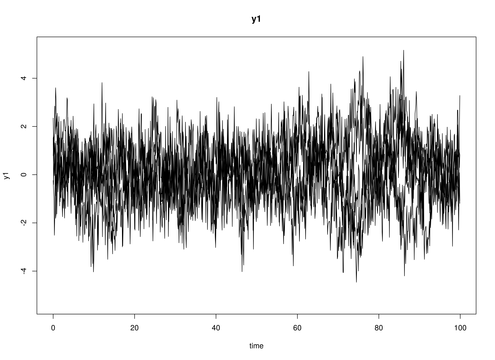
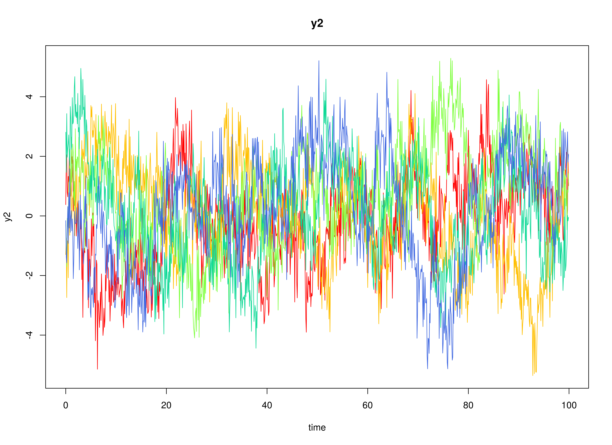
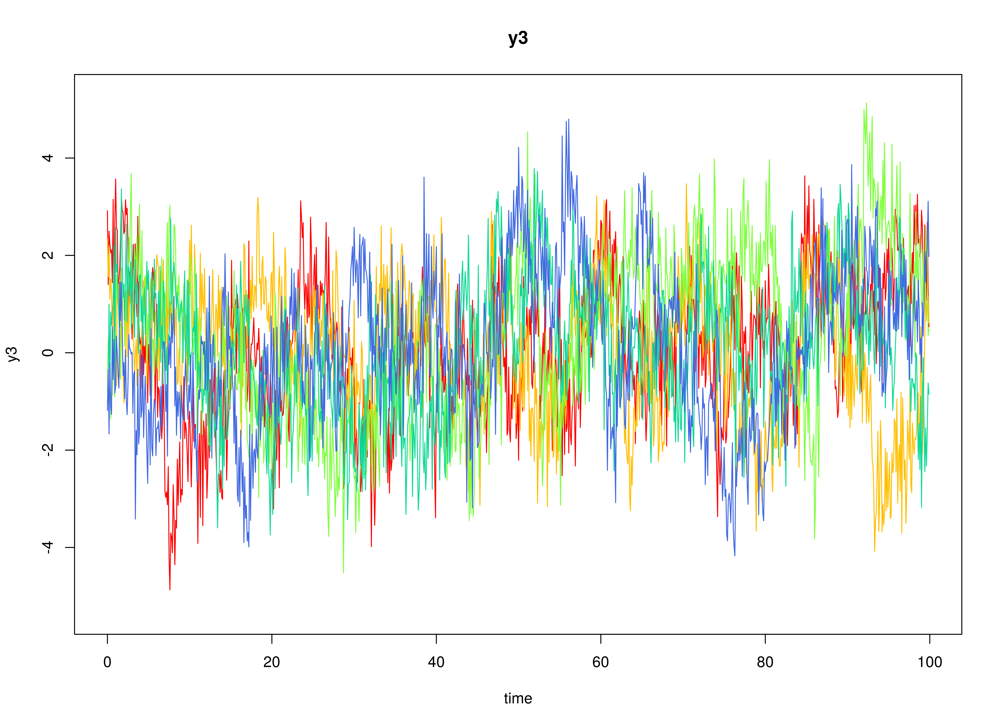

## Model

The measurement model is given by

\begin{equation}
  \mathbf{y}_{i, t}
  =
  \boldsymbol{\nu}
  +
  \boldsymbol{\Lambda}
  \boldsymbol{\eta}_{i, t} 
  +
  \boldsymbol{\varepsilon}_{i, t}
  \quad
  \mathrm{with}
  \quad
  \boldsymbol{\varepsilon}_{i, t}
  \sim
  \mathcal{N}
  \left(
  \mathbf{0},
  \boldsymbol{\Theta}
  \right)
\end{equation}

where $\mathbf{y}_{i, t}$, $\boldsymbol{\eta}_{i, t}$,
and $\boldsymbol{\varepsilon}_{i, t}$
are random variables and $\boldsymbol{\nu}$,
$\boldsymbol{\Lambda}$,
and $\boldsymbol{\Theta}$ are model parameters.
$\mathbf{y}_{i, t}$ is a vector of observed random variables
at time $t$ and individual $i$,
$\boldsymbol{\eta}_{i, t}$ is a vector of latent random variables
at time $t$ and individual $i$,
and $\boldsymbol{\varepsilon}_{i, t}$
is a vector of random measurement errors
at time $t$ and individual $i$,
while $\boldsymbol{\nu}$ is a vector of intercept,
$\boldsymbol{\Lambda}$ is a matrix of factor loadings,
and $\boldsymbol{\Theta}$ is the covariance matrix of
$\boldsymbol{\varepsilon}$.

The dynamic structure is given by

\begin{equation}
  \mathrm{d} \boldsymbol{\eta}_{i, t}
  =
  \boldsymbol{\Phi}
  \left(
  \boldsymbol{\mu}
  -
  \boldsymbol{\eta}_{i, t}
  \right)
  \mathrm{d}t
  +
  \boldsymbol{\Sigma}^{\frac{1}{2}}
  \mathrm{d}
  \mathbf{W}_{i, t}
\end{equation}

where $\boldsymbol{\mu}$ is the long-term mean or equilibrium level,
$\boldsymbol{\Phi}$ is the rate of mean reversion,
determining how quickly the variable returns to its mean,
$\boldsymbol{\Sigma}$ is the matrix of volatility
or randomness in the process, and $\mathrm{d}\boldsymbol{W}$
is a Wiener process or Brownian motion,
which represents random fluctuations.

## Data Generation

### Notation


Let $t = 1000$ be the number of time points and $n = 5$ be the number of individuals.

Let the measurement model intecept vector $\boldsymbol{\nu}$ be given by

\begin{equation}
\boldsymbol{\nu}
=
\left(
\begin{array}{c}
  0 \\
  0 \\
  0 \\
\end{array}
\right) .
\end{equation}

Let the factor loadings matrix $\boldsymbol{\Lambda}$ be given by

\begin{equation}
\boldsymbol{\Lambda}
=
\left(
\begin{array}{ccc}
  1 & 0 & 0 \\
  0 & 1 & 0 \\
  0 & 0 & 1 \\
\end{array}
\right) .
\end{equation}

Let the measurement error covariance matrix $\boldsymbol{\Theta}$ be given by

\begin{equation}
\boldsymbol{\Theta}
=
\left(
\begin{array}{ccc}
  0.5 & 0 & 0 \\
  0 & 0.5 & 0 \\
  0 & 0 & 0.5 \\
\end{array}
\right) .
\end{equation}

Let the initial condition
$\boldsymbol{\eta}_{0}$
be given by

\begin{equation}
\boldsymbol{\eta}_{0} \sim \mathcal{N} \left( \boldsymbol{\mu}_{\boldsymbol{\eta} \mid 0}, \boldsymbol{\Sigma}_{\boldsymbol{\eta} \mid 0} \right)
\end{equation}

\begin{equation}
\boldsymbol{\mu}_{\boldsymbol{\eta} \mid 0}
=
\left(
\begin{array}{c}
  0 \\
  0 \\
  0 \\
\end{array}
\right)
\end{equation}

\begin{equation}
\boldsymbol{\Sigma}_{\boldsymbol{\eta} \mid 0}
=
\left(
\begin{array}{ccc}
  1 & 0 & 0 \\
  0 & 1 & 0 \\
  0 & 0 & 1 \\
\end{array}
\right) .
\end{equation}

Let the long-term mean vector $\boldsymbol{\mu}$ be given by

\begin{equation}
\boldsymbol{\mu}
=
\left(
\begin{array}{c}
  0 \\
  0 \\
  0 \\
\end{array}
\right) .
\end{equation}

Let the rate of mean reversion matrix $\boldsymbol{\Phi}$ be given by

\begin{equation}
\boldsymbol{\Phi}
=
\left(
\begin{array}{ccc}
  0.357 & 0 & 0 \\
  -0.771 & 0.511 & 0 \\
  0.45 & -0.729 & 0.693 \\
\end{array}
\right) .
\end{equation}

Let the dynamic process noise covariance matrix $\boldsymbol{\Sigma}$ be given by

\begin{equation}
\boldsymbol{\Sigma}
=
\left(
\begin{array}{ccc}
  1 & 0 & 0 \\
  0 & 1 & 0 \\
  0 & 0 & 1 \\
\end{array}
\right) .
\end{equation}

Let $\Delta_{t} = 0.1$.

### R Function Arguments


```r
n
#> [1] 5
time
#> [1] 1000
delta_t
#> [1] 0.1
mu0
#> [1] 0 0 0
sigma0
#>      [,1] [,2] [,3]
#> [1,]    1    0    0
#> [2,]    0    1    0
#> [3,]    0    0    1
mu
#> [1] 0 0 0
phi
#>        [,1]   [,2]  [,3]
#> [1,]  0.357  0.000 0.000
#> [2,] -0.771  0.511 0.000
#> [3,]  0.450 -0.729 0.693
sigma
#>      [,1] [,2] [,3]
#> [1,]    1    0    0
#> [2,]    0    1    0
#> [3,]    0    0    1
nu
#> [1] 0 0 0
lambda
#>      [,1] [,2] [,3]
#> [1,]    1    0    0
#> [2,]    0    1    0
#> [3,]    0    0    1
theta
#>      [,1] [,2] [,3]
#> [1,]  0.5  0.0  0.0
#> [2,]  0.0  0.5  0.0
#> [3,]  0.0  0.0  0.5
```

### Using the SimSSMOUFixed Function to Simulate Data


```r
library(simStateSpace)
data <- Sim2Matrix(
  SimSSMOUFixed(
    n = n,
    mu0 = mu0,
    sigma0_sqrt = chol(sigma0),
    mu = mu,
    phi = phi,
    sigma_sqrt = chol(sigma),
    nu = nu,
    lambda = lambda,
    theta_sqrt = chol(theta),
    delta_t = delta_t,
    time = time,
    burn_in = 0
  )
)
head(data)
#>              y1        y2       y3 time id
#> [1,] -0.2452235 0.3791894 2.916196  0.0  1
#> [2,] -0.6408937 1.7824870 1.400803  0.1  1
#> [3,] -0.9755917 2.0512793 2.498214  0.2  1
#> [4,] -2.5120801 0.7969752 2.234649  0.3  1
#> [5,] -1.7204259 0.6404276 2.053562  0.4  1
#> [6,]  0.4753620 1.3252011 2.114403  0.5  1
```

### Plots



## Model Fitting

### Prepare Data


```r
dynr_data <- dynr::dynr.data(
  dataframe = data,
  id = "id",
  time = "time",
  observed = c("y1", "y2", "y3")
)
```

### Prepare Initial Condition


```r
dynr_initial <- dynr::prep.initial(
  values.inistate = c(0, 0, 0),
  params.inistate = c("mu0_1", "mu0_2", "mu0_3"),
  values.inicov = diag(3),
  params.inicov = matrix(
    data = c(
      "sigma0_11", "sigma0_12", "sigma0_13",
      "sigma0_12", "sigma0_22", "sigma0_23",
      "sigma0_13", "sigma0_23", "sigma0_33"
    ),
    nrow = 3
  )
)
```

### Prepare Measurement Model


```r
dynr_measurement <- dynr::prep.measurement(
  values.load = diag(3),
  params.load = matrix(data = "fixed", nrow = 3, ncol = 3),
  state.names = c("eta_1", "eta_2", "eta_3"),
  obs.names = c("y1", "y2", "y3")
)
```

### Prepare Dynamic Process


```r
dynr_dynamics <- dynr::prep.formulaDynamics(
  formula = list(  
    eta_1 ~ phi_11 * (mu_1 - eta_1) + phi_12 * (mu_2 - eta_2) + phi_13 * (mu_3 - eta_3),
    eta_2 ~ phi_21 * (mu_1 - eta_1) + phi_22 * (mu_2 - eta_2) + phi_23 * (mu_3 - eta_3),
    eta_3 ~ phi_31 * (mu_1 - eta_1) + phi_32 * (mu_2 - eta_2) + phi_33 * (mu_3 - eta_3)
  ),
  startval = c(
    mu_1 = 0, mu_2 = 0, mu_3 = 0,
    phi_11 = 0, phi_12 = 0, phi_13 = 0,
    phi_21 = 0, phi_22 = 0, phi_23 = 0,
    phi_31 = 0, phi_32 = 0, phi_33 = 0
  ),
  isContinuousTime = TRUE
)
```

### Prepare Process Noise


```r
dynr_noise <- dynr::prep.noise(
  values.latent = diag(3),
  params.latent = matrix(
    data = c(
      "sigma_11", "sigma_12", "sigma_13",
      "sigma_12", "sigma_22", "sigma_23",
      "sigma_13", "sigma_23", "sigma_33"
    ),
    nrow = 3
  ),
  values.observed = diag(3),
  params.observed = matrix(
    data = c(
      "theta_11", "fixed", "fixed",
      "fixed", "theta_22", "fixed",
      "fixed", "fixed", "theta_33"
    ),
    nrow = 3
  )
)
```

### Prepare the Model


```r
model <- dynr::dynr.model(
  data = dynr_data,
  initial = dynr_initial,
  measurement = dynr_measurement,
  dynamics = dynr_dynamics,
  noise = dynr_noise,
  outfile = "ou.c"
)
model@options$maxeval <- 100000
```

Add lower and upper bounds to aid in the optimization.


```r
model$lb[
  c(
    "phi_11",
    "phi_12",
    "phi_13",
    "phi_21",
    "phi_22",
    "phi_23",
    "phi_31",
    "phi_32",
    "phi_33"
  )
] <- -1.5
model$ub[
  c(
    "phi_11",
    "phi_12",
    "phi_13",
    "phi_21",
    "phi_22",
    "phi_23",
    "phi_31",
    "phi_32",
    "phi_33"
  )
] <- +1.5
model$lb[
  c(
    "sigma_11",
    "sigma_22",
    "sigma_33",
    "theta_11",
    "theta_22",
    "theta_33"
  )
] <- .Machine$double.xmin
```


### Fit the Model


```r
results <- dynr::dynr.cook(
  model,
  debug_flag = TRUE,
  verbose = FALSE
)
#> [1] "Get ready!!!!"
#> using C compiler: ‘gcc (Ubuntu 11.4.0-1ubuntu1~22.04) 11.4.0’
#> Optimization function called.
#> Starting Hessian calculation ...
#> Finished Hessian calculation.
#> Original exit flag:  3 
#> Modified exit flag:  3 
#> Optimization terminated successfully: ftol_rel or ftol_abs was reached. 
#> Original fitted parameters:  0.06168021 0.1539363 0.1503121 0.4471767 
#> 0.006879585 -0.02237329 -0.7085227 0.4865766 -0.02689054 0.4085284 -0.6572629 
#> 0.6798472 0.08773326 -0.02515724 -0.09408798 0.07673025 -0.05644125 -0.07154494 
#> -0.7087432 -0.7459187 -0.7041477 0.8984507 0.1541821 0.6063904 -0.339931 
#> 0.04206888 -1.211567 0.6763584 -0.09310204 -0.4365633 
#> 
#> Transformed fitted parameters:  0.06168021 0.1539363 0.1503121 0.4471767 
#> 0.006879585 -0.02237329 -0.7085227 0.4865766 -0.02689054 0.4085284 -0.6572629 
#> 0.6798472 1.091697 -0.02746408 -0.1027156 1.080442 -0.05835844 0.9440584 
#> 0.4922625 0.4742983 0.4945299 0.8984507 0.1541821 0.6063904 0.7118195 
#> 0.02994545 -0.8624171 1.967962 -0.219385 1.708177 
#> 
#> Doing end processing
#> Successful trial
#> Total Time: 4.427677 
#> Backend Time: 4.419281
```

## Summary


```r
summary(results)
#> Coefficients:
#>            Estimate Std. Error t value  ci.lower  ci.upper Pr(>|t|)    
#> mu_1       0.061680   0.105910   0.582 -0.145899  0.269260   0.2802    
#> mu_2       0.153936   0.186609   0.825 -0.211810  0.519683   0.2047    
#> mu_3       0.150312   0.142693   1.053 -0.129360  0.429984   0.1461    
#> phi_11     0.447177   0.081640   5.477  0.287165  0.607188   <2e-16 ***
#> phi_12     0.006880   0.062198   0.111 -0.115026  0.128785   0.4560    
#> phi_13    -0.022373   0.058216  -0.384 -0.136474  0.091727   0.3504    
#> phi_21    -0.708523   0.077018  -9.199 -0.859476 -0.557570   <2e-16 ***
#> phi_22     0.486577   0.063205   7.698  0.362697  0.610456   <2e-16 ***
#> phi_23    -0.026891   0.058729  -0.458 -0.141997  0.088216   0.3235    
#> phi_31     0.408528   0.071761   5.693  0.267879  0.549178   <2e-16 ***
#> phi_32    -0.657263   0.057825 -11.366 -0.770597 -0.543928   <2e-16 ***
#> phi_33     0.679847   0.056853  11.958  0.568417  0.791278   <2e-16 ***
#> sigma_11   1.091697   0.094763  11.520  0.905965  1.277429   <2e-16 ***
#> sigma_12  -0.027464   0.056712  -0.484 -0.138617  0.083689   0.3141    
#> sigma_13  -0.102716   0.053452  -1.922 -0.207480  0.002049   0.0274 *  
#> sigma_22   1.080442   0.086095  12.549  0.911698  1.249185   <2e-16 ***
#> sigma_23  -0.058358   0.051293  -1.138 -0.158892  0.042175   0.1276    
#> sigma_33   0.944058   0.076756  12.300  0.793620  1.094497   <2e-16 ***
#> theta_11   0.492262   0.013861  35.514  0.465096  0.519429   <2e-16 ***
#> theta_22   0.474298   0.013276  35.727  0.448279  0.500318   <2e-16 ***
#> theta_33   0.494530   0.013370  36.989  0.468326  0.520734   <2e-16 ***
#> mu0_1      0.898451   0.433104   2.074  0.049583  1.747319   0.0190 *  
#> mu0_2      0.154182   0.671200   0.230 -1.161345  1.469709   0.4092    
#> mu0_3      0.606390   0.631689   0.960 -0.631697  1.844478   0.1686    
#> sigma0_11  0.711819   0.587691   1.211 -0.440033  1.863672   0.1129    
#> sigma0_12  0.029945   0.687905   0.044 -1.318323  1.378214   0.4826    
#> sigma0_13 -0.862417   0.723398  -1.192 -2.280251  0.555416   0.1166    
#> sigma0_22  1.967962   1.388836   1.417 -0.754106  4.690031   0.0783 .  
#> sigma0_23 -0.219385   0.961332  -0.228 -2.103561  1.664791   0.4097    
#> sigma0_33  1.708177   1.233948   1.384 -0.710315  4.126670   0.0832 .  
#> ---
#> Signif. codes:  0 '***' 0.001 '**' 0.01 '*' 0.05 '.' 0.1 ' ' 1
#> 
#> -2 log-likelihood value at convergence = 37920.34
#> AIC = 37980.34
#> BIC = 38175.86
```


```
#> [1] 0.8984507 0.1541821 0.6063904
```

### Estimated Coefficients


```r
mu_hat
#> [1] 0.06168021 0.15393635 0.15031210
phi_hat
#>            [,1]         [,2]        [,3]
#> [1,]  0.4471767  0.006879585 -0.02237329
#> [2,] -0.7085227  0.486576563 -0.02689054
#> [3,]  0.4085284 -0.657262868  0.67984715
sigma_hat
#>             [,1]        [,2]        [,3]
#> [1,]  1.09169688 -0.02746408 -0.10271556
#> [2,] -0.02746408  1.08044170 -0.05835844
#> [3,] -0.10271556 -0.05835844  0.94405841
mu0_hat
#> [1] 0.8984507 0.1541821 0.6063904
sigma0_hat
#>             [,1]        [,2]       [,3]
#> [1,]  0.71181947  0.02994545 -0.8624171
#> [2,]  0.02994545  1.96796249 -0.2193850
#> [3,] -0.86241713 -0.21938495  1.7081772
beta_var1_hat <- as.matrix(
  Matrix::expm(-1 * phi_hat)
)
beta_var1_hat
#>            [,1]          [,2]       [,3]
#> [1,]  0.6362288 -1.624116e-05 0.01272221
#> [2,]  0.4414447  6.193453e-01 0.01968275
#> [3,] -0.0970772  3.685791e-01 0.50995721
```

### Discrepancy Between Estimated and Population Coefficients


```r
abs(mu - mu_hat)
#> [1] 0.06168021 0.15393635 0.15031210
abs(phi - phi_hat)
#>            [,1]        [,2]       [,3]
#> [1,] 0.09017673 0.006879585 0.02237329
#> [2,] 0.06247730 0.024423437 0.02689054
#> [3,] 0.04147161 0.071737132 0.01315285
abs(beta_var1 - beta_var1_hat)
#>             [,1]         [,2]        [,3]
#> [1,] 0.063543713 1.624116e-05 0.012722213
#> [2,] 0.058589445 1.944990e-02 0.019682748
#> [3,] 0.002961173 3.125651e-02 0.009883619
abs(sigma - sigma_hat)
#>            [,1]       [,2]       [,3]
#> [1,] 0.09169688 0.02746408 0.10271556
#> [2,] 0.02746408 0.08044170 0.05835844
#> [3,] 0.10271556 0.05835844 0.05594159
```


## References
