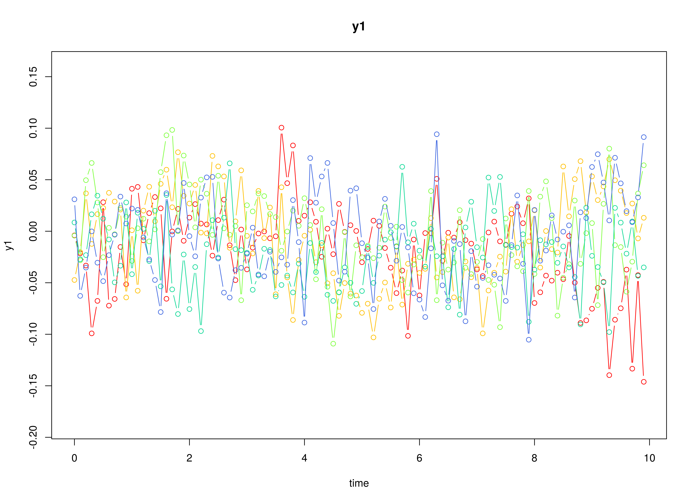
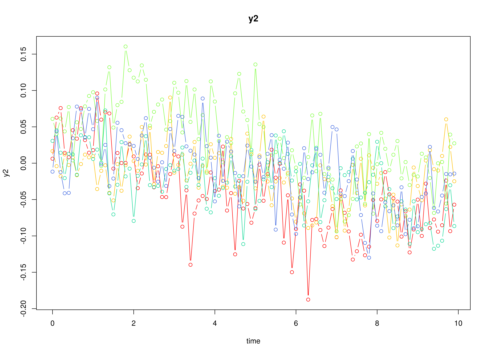
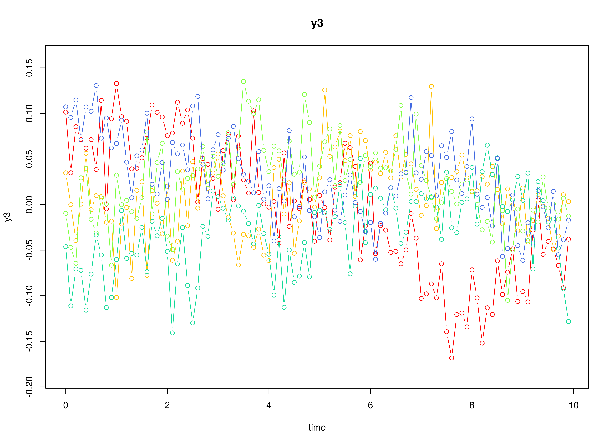

## Model

The measurement model is given by

\begin{equation}
  \mathbf{y}_{i, t}
  =
  \boldsymbol{\nu}
  +
  \boldsymbol{\Lambda}
  \boldsymbol{\eta}_{i, t} 
  +
  \boldsymbol{\varepsilon}_{i, t}
  \quad
  \mathrm{with}
  \quad
  \boldsymbol{\varepsilon}_{i, t}
  \sim
  \mathcal{N}
  \left(
  \mathbf{0},
  \boldsymbol{\Theta}
  \right)
\end{equation}

where $\mathbf{y}_{i, t}$, $\boldsymbol{\eta}_{i, t}$,
and $\boldsymbol{\varepsilon}_{i, t}$
are random variables and $\boldsymbol{\nu}$,
$\boldsymbol{\Lambda}$,
and $\boldsymbol{\Theta}$ are model parameters.
$\mathbf{y}_{i, t}$ is a vector of observed random variables
at time $t$ and individual $i$,
$\boldsymbol{\eta}_{i, t}$ is a vector of latent random variables
at time $t$ and individual $i$,
and $\boldsymbol{\varepsilon}_{i, t}$
is a vector of random measurement errors
at time $t$ and individual $i$,
while $\boldsymbol{\nu}$ is a vector of intercept,
$\boldsymbol{\Lambda}$ is a matrix of factor loadings,
and $\boldsymbol{\Theta}$ is the covariance matrix of
$\boldsymbol{\varepsilon}$.

The dynamic structure is given by

\begin{equation}
  \mathrm{d} \boldsymbol{\eta}_{i, t}
  =
  \boldsymbol{\Phi}
  \left(
  \boldsymbol{\mu}
  -
  \boldsymbol{\eta}_{i, t}
  \right)
  \mathrm{d}t
  +
  \boldsymbol{\Sigma}^{\frac{1}{2}}
  \mathrm{d}
  \mathbf{W}_{i, t}
\end{equation}

where $\boldsymbol{\mu}$ is the long-term mean or equilibrium level,
$\boldsymbol{\Phi}$ is the rate of mean reversion,
determining how quickly the variable returns to its mean,
$\boldsymbol{\Sigma}$ is the matrix of volatility
or randomness in the process, and $\mathrm{d}\boldsymbol{W}$
is a Wiener process or Brownian motion,
which represents random fluctuations.

## Data Generation

### Notation


Let $t = 1000$ be the number of time points and $n = 5$ be the number of individuals.

Let the measurement model intecept vector $\boldsymbol{\nu}$ be given by

\begin{equation}
\boldsymbol{\nu}
=
\left(
\begin{array}{c}
  0 \\
  0 \\
  0 \\
\end{array}
\right) .
\end{equation}

Let the factor loadings matrix $\boldsymbol{\Lambda}$ be given by

\begin{equation}
\boldsymbol{\Lambda}
=
\left(
\begin{array}{ccc}
  1 & 0 & 0 \\
  0 & 1 & 0 \\
  0 & 0 & 1 \\
\end{array}
\right) .
\end{equation}

Let the measurement error covariance matrix $\boldsymbol{\Theta}$ be given by

\begin{equation}
\boldsymbol{\Theta}
=
\left(
\begin{array}{ccc}
  0.5 & 0 & 0 \\
  0 & 0.5 & 0 \\
  0 & 0 & 0.5 \\
\end{array}
\right) .
\end{equation}

Let the initial condition
$\boldsymbol{\eta}_{0}$
be given by

\begin{equation}
\boldsymbol{\eta}_{0} \sim \mathcal{N} \left( \boldsymbol{\mu}_{\boldsymbol{\eta} \mid 0}, \boldsymbol{\Sigma}_{\boldsymbol{\eta} \mid 0} \right)
\end{equation}

\begin{equation}
\boldsymbol{\mu}_{\boldsymbol{\eta} \mid 0}
=
\left(
\begin{array}{c}
  0 \\
  0 \\
  0 \\
\end{array}
\right)
\end{equation}

\begin{equation}
\boldsymbol{\Sigma}_{\boldsymbol{\eta} \mid 0}
=
\left(
\begin{array}{ccc}
  1 & 0 & 0 \\
  0 & 1 & 0 \\
  0 & 0 & 1 \\
\end{array}
\right) .
\end{equation}

Let the long-term mean vector $\boldsymbol{\mu}$ be given by

\begin{equation}
\boldsymbol{\mu}
=
\left(
\begin{array}{c}
  0 \\
  0 \\
  0 \\
\end{array}
\right) .
\end{equation}

Let the rate of mean reversion matrix $\boldsymbol{\Phi}$ be given by

\begin{equation}
\boldsymbol{\Phi}
=
\left(
\begin{array}{ccc}
  0.357 & 0 & 0 \\
  -0.771 & 0.511 & 0 \\
  0.45 & -0.729 & 0.693 \\
\end{array}
\right) .
\end{equation}

Let the dynamic process noise covariance matrix $\boldsymbol{\Sigma}$ be given by

\begin{equation}
\boldsymbol{\Sigma}
=
\left(
\begin{array}{ccc}
  1 & 0 & 0 \\
  0 & 1 & 0 \\
  0 & 0 & 1 \\
\end{array}
\right) .
\end{equation}

Let $\Delta_{t} = 0.1$.

### R Function Arguments


```r
n
#> [1] 5
time
#> [1] 1000
delta_t
#> [1] 0.1
mu0
#> [1] 0 0 0
sigma0
#>      [,1] [,2] [,3]
#> [1,]    1    0    0
#> [2,]    0    1    0
#> [3,]    0    0    1
mu
#> [1] 0 0 0
phi
#>        [,1]   [,2]  [,3]
#> [1,]  0.357  0.000 0.000
#> [2,] -0.771  0.511 0.000
#> [3,]  0.450 -0.729 0.693
sigma
#>      [,1] [,2] [,3]
#> [1,]    1    0    0
#> [2,]    0    1    0
#> [3,]    0    0    1
nu
#> [1] 0 0 0
lambda
#>      [,1] [,2] [,3]
#> [1,]    1    0    0
#> [2,]    0    1    0
#> [3,]    0    0    1
theta
#>      [,1] [,2] [,3]
#> [1,]  0.5  0.0  0.0
#> [2,]  0.0  0.5  0.0
#> [3,]  0.0  0.0  0.5
```

### Using the SimSSMOUFixed Function to Simulate Data


```r
library(simStateSpace)
sim <- SimSSMOUFixed(
  n = n,
  mu0 = mu0,
  sigma0 = sigma0,
  mu = mu,
  phi = phi,
  sigma = sigma,
  nu = nu,
  lambda = lambda,
  theta = theta,
  delta_t = delta_t,
  time = time,
  burn_in = 0
)
data <- as.data.frame(sim)
head(data)
#>   id time         y1        y2       y3
#> 1  1  0.0 -0.2452235 0.3791894 2.916196
#> 2  1  0.1 -0.6408937 1.7824870 1.400803
#> 3  1  0.2 -0.9755917 2.0512793 2.498214
#> 4  1  0.3 -2.5120801 0.7969752 2.234649
#> 5  1  0.4 -1.7204259 0.6404276 2.053562
#> 6  1  0.5  0.4753620 1.3252011 2.114403
plot(sim)
```



## Model Fitting

### Prepare Data


```r
dynr_data <- dynr::dynr.data(
  dataframe = data,
  id = "id",
  time = "time",
  observed = c("y1", "y2", "y3")
)
```

### Prepare Initial Condition


```r
dynr_initial <- dynr::prep.initial(
  values.inistate = mu0,
  params.inistate = c("mu0_1", "mu0_2", "mu0_3"),
  values.inicov = sigma0,
  params.inicov = matrix(
    data = c(
      "sigma0_11", "sigma0_12", "sigma0_13",
      "sigma0_12", "sigma0_22", "sigma0_23",
      "sigma0_13", "sigma0_23", "sigma0_33"
    ),
    nrow = 3
  )
)
```

### Prepare Measurement Model


```r
dynr_measurement <- dynr::prep.measurement(
  values.load = diag(3),
  params.load = matrix(data = "fixed", nrow = 3, ncol = 3),
  state.names = c("eta_1", "eta_2", "eta_3"),
  obs.names = c("y1", "y2", "y3")
)
```

### Prepare Dynamic Process


```r
dynr_dynamics <- dynr::prep.formulaDynamics(
  formula = list(  
    eta_1 ~ phi_11 * (mu_1 - eta_1) + phi_12 * (mu_2 - eta_2) + phi_13 * (mu_3 - eta_3),
    eta_2 ~ phi_21 * (mu_1 - eta_1) + phi_22 * (mu_2 - eta_2) + phi_23 * (mu_3 - eta_3),
    eta_3 ~ phi_31 * (mu_1 - eta_1) + phi_32 * (mu_2 - eta_2) + phi_33 * (mu_3 - eta_3)
  ),
  startval = c(
    mu_1 = 0, mu_2 = 0, mu_3 = 0,
    phi_11 = 0, phi_12 = 0, phi_13 = 0,
    phi_21 = 0, phi_22 = 0, phi_23 = 0,
    phi_31 = 0, phi_32 = 0, phi_33 = 0
  ),
  isContinuousTime = TRUE
)
```

### Prepare Process Noise


```r
dynr_noise <- dynr::prep.noise(
  values.latent = sigma,
  params.latent = matrix(
    data = c(
      "sigma_11", "sigma_12", "sigma_13",
      "sigma_12", "sigma_22", "sigma_23",
      "sigma_13", "sigma_23", "sigma_33"
    ),
    nrow = 3
  ),
  values.observed = theta,
  params.observed = matrix(
    data = c(
      "theta_11", "fixed", "fixed",
      "fixed", "theta_22", "fixed",
      "fixed", "fixed", "theta_33"
    ),
    nrow = 3
  )
)
```

### Prepare the Model


```r
model <- dynr::dynr.model(
  data = dynr_data,
  initial = dynr_initial,
  measurement = dynr_measurement,
  dynamics = dynr_dynamics,
  noise = dynr_noise,
  outfile = "ou.c"
)
```

Add lower and upper bounds to aid in the optimization.


```r
model$lb[
  c(
    "phi_11",
    "phi_12",
    "phi_13",
    "phi_21",
    "phi_22",
    "phi_23",
    "phi_31",
    "phi_32",
    "phi_33"
  )
] <- -1.5
model$ub[
  c(
    "phi_11",
    "phi_12",
    "phi_13",
    "phi_21",
    "phi_22",
    "phi_23",
    "phi_31",
    "phi_32",
    "phi_33"
  )
] <- +1.5
model$lb[
  c(
    "sigma_11",
    "sigma_22",
    "sigma_33",
    "theta_11",
    "theta_22",
    "theta_33"
  )
] <- .Machine$double.xmin
```


### Fit the Model


```r
results <- dynr::dynr.cook(
  model,
  debug_flag = TRUE,
  verbose = FALSE
)
#> [1] "Get ready!!!!"
#> using C compiler: ‘gcc (Ubuntu 11.4.0-1ubuntu1~22.04) 11.4.0’
#> Optimization function called.
#> Starting Hessian calculation ...
#> Finished Hessian calculation.
#> Original exit flag:  3 
#> Modified exit flag:  3 
#> Optimization terminated successfully: ftol_rel or ftol_abs was reached. 
#> Original fitted parameters:  0.06170586 0.1539591 0.1503428 0.447179 
#> 0.006878862 -0.02237471 -0.7084987 0.4865505 -0.02687934 0.4085459 -0.6572728 
#> 0.6798754 0.08775009 -0.02513747 -0.09408974 0.07669431 -0.0564341 -0.07153665 
#> -0.7087437 -0.7459179 -0.7041478 0.8982052 0.1539088 0.6066994 -0.3401838 
#> 0.04180542 -1.211941 0.6758595 -0.09317225 -0.4372129 
#> 
#> Transformed fitted parameters:  0.06170586 0.1539591 0.1503428 0.447179 
#> 0.006878862 -0.02237471 -0.7084987 0.4865505 -0.02687934 0.4085459 -0.6572728 
#> 0.6798754 1.091715 -0.02744295 -0.1027192 1.080402 -0.05835047 0.9440657 
#> 0.4922622 0.4742987 0.4945298 0.8982052 0.1539088 0.6066994 0.7116395 
#> 0.02975039 -0.8624653 1.966966 -0.2192064 1.708156 
#> 
#> Doing end processing
#> Successful trial
#> Total Time: 3.908962 
#> Backend Time: 3.900554
```

## Summary


```r
summary(results)
#> Coefficients:
#>            Estimate Std. Error t value  ci.lower  ci.upper Pr(>|t|)    
#> mu_1       0.061706   0.107721   0.573 -0.149424  0.272836   0.2834    
#> mu_2       0.153959   0.191496   0.804 -0.221366  0.529285   0.2107    
#> mu_3       0.150343   0.146024   1.030 -0.135859  0.436544   0.1516    
#> phi_11     0.447179   0.081386   5.495  0.287665  0.606693   <2e-16 ***
#> phi_12     0.006879   0.061876   0.111 -0.114397  0.128154   0.4557    
#> phi_13    -0.022375   0.058038  -0.386 -0.136127  0.091377   0.3499    
#> phi_21    -0.708499   0.076857  -9.218 -0.859136 -0.557862   <2e-16 ***
#> phi_22     0.486550   0.062938   7.731  0.363194  0.609907   <2e-16 ***
#> phi_23    -0.026879   0.058559  -0.459 -0.141653  0.087894   0.3231    
#> phi_31     0.408546   0.071559   5.709  0.268293  0.548799   <2e-16 ***
#> phi_32    -0.657273   0.057579 -11.415 -0.770126 -0.544420   <2e-16 ***
#> phi_33     0.679875   0.056593  12.013  0.568955  0.790796   <2e-16 ***
#> sigma_11   1.091715   0.094471  11.556  0.906556  1.276874   <2e-16 ***
#> sigma_12  -0.027443   0.056632  -0.485 -0.138440  0.083554   0.3140    
#> sigma_13  -0.102719   0.053361  -1.925 -0.207305  0.001866   0.0271 *  
#> sigma_22   1.080402   0.085756  12.599  0.912322  1.248481   <2e-16 ***
#> sigma_23  -0.058350   0.051216  -1.139 -0.158733  0.042032   0.1273    
#> sigma_33   0.944066   0.076705  12.308  0.793727  1.094404   <2e-16 ***
#> theta_11   0.492262   0.013856  35.526  0.465104  0.519420   <2e-16 ***
#> theta_22   0.474299   0.013247  35.804  0.448335  0.500263   <2e-16 ***
#> theta_33   0.494530   0.013363  37.008  0.468339  0.520720   <2e-16 ***
#> mu0_1      0.898205   0.413539   2.172  0.087684  1.708727   0.0150 *  
#> mu0_2      0.153909   0.649164   0.237 -1.118430  1.426248   0.4063    
#> mu0_3      0.606699   0.595128   1.019 -0.559729  1.773128   0.1540    
#> sigma0_11  0.711640   0.583317   1.220 -0.431642  1.854921   0.1113    
#> sigma0_12  0.029750   0.614325   0.048 -1.174305  1.233806   0.4807    
#> sigma0_13 -0.862465   0.674820  -1.278 -2.185088  0.460157   0.1006    
#> sigma0_22  1.966966   1.353099   1.454 -0.685060  4.618992   0.0730 .  
#> sigma0_23 -0.219206   0.906841  -0.242 -1.996583  1.558170   0.4045    
#> sigma0_33  1.708156   1.195713   1.429 -0.635399  4.051710   0.0766 .  
#> ---
#> Signif. codes:  0 '***' 0.001 '**' 0.01 '*' 0.05 '.' 0.1 ' ' 1
#> 
#> -2 log-likelihood value at convergence = 37920.34
#> AIC = 37980.34
#> BIC = 38175.86
```


```
#> [1] 0.8982052 0.1539088 0.6066994
```

### Parameter Estimates


```r
mu_hat
#> [1] 0.06170586 0.15395914 0.15034276
phi_hat
#>            [,1]         [,2]        [,3]
#> [1,]  0.4471790  0.006878862 -0.02237471
#> [2,] -0.7084987  0.486550483 -0.02687934
#> [3,]  0.4085459 -0.657272797  0.67987544
sigma_hat
#>             [,1]        [,2]        [,3]
#> [1,]  1.09171525 -0.02744295 -0.10271920
#> [2,] -0.02744295  1.08040181 -0.05835047
#> [3,] -0.10271920 -0.05835047  0.94406565
mu0_hat
#> [1] 0.8982052 0.1539088 0.6066994
sigma0_hat
#>             [,1]        [,2]       [,3]
#> [1,]  0.71163955  0.02975039 -0.8624653
#> [2,]  0.02975039  1.96696553 -0.2192064
#> [3,] -0.86246527 -0.21920645  1.7081557
beta_var1_hat <- as.matrix(
  Matrix::expm(-1 * phi_hat)
)
beta_var1_hat
#>             [,1]          [,2]       [,3]
#> [1,]  0.63622735 -1.550278e-05 0.01272285
#> [2,]  0.44143560  6.193595e-01 0.01967659
#> [3,] -0.09708627  3.685841e-01 0.50994073
```

## References
