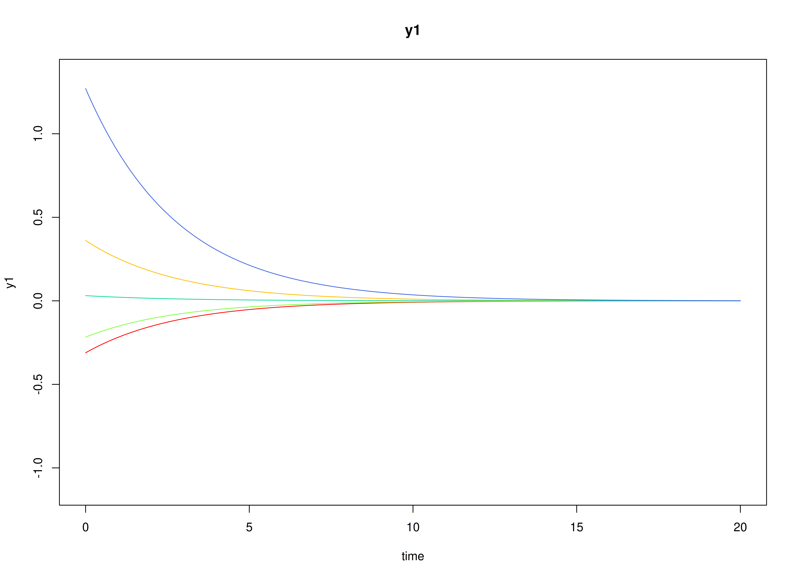

## Model

The measurement model is given by
\begin{equation}
  \mathbf{y}_{i, t}
  =
  \boldsymbol{\nu}
  +
  \boldsymbol{\Lambda}
  \boldsymbol{\eta}_{i, t}
  +
  \boldsymbol{\varepsilon}_{i, t},
  \quad
  \mathrm{with}
  \quad
  \boldsymbol{\varepsilon}_{i, t}
  \sim
  \mathcal{N}
  \left(
  \mathbf{0},
  \boldsymbol{\Theta}
  \right)
\end{equation}
where
$\mathbf{y}_{i, t}$,
$\boldsymbol{\eta}_{i, t}$,
and
$\boldsymbol{\varepsilon}_{i, t}$
are random variables
and
$\boldsymbol{\nu}$,
$\boldsymbol{\Lambda}$,
and
$\boldsymbol{\Theta}$
are model parameters.
$\mathbf{y}_{i, t}$
represents a vector of observed random variables,
$\boldsymbol{\eta}_{i, t}$
a vector of latent random variables,
and
$\boldsymbol{\varepsilon}_{i, t}$
a vector of random measurement errors,
at time $t$ and individual $i$.
$\boldsymbol{\nu}$
denotes a vector of intercepts,
$\boldsymbol{\Lambda}$
a matrix of factor loadings,
and
$\boldsymbol{\Theta}$
the covariance matrix of
$\boldsymbol{\varepsilon}$.

An alternative representation of the measurement error
is given by
\begin{equation}
  \boldsymbol{\varepsilon}_{i, t}
  =
  \boldsymbol{\Theta}^{\frac{1}{2}}
  \mathbf{z}_{i, t},
  \quad
  \mathrm{with}
  \quad
  \mathbf{z}_{i, t}
  \sim
  \mathcal{N}
  \left(
  \mathbf{0},
  \mathbf{I}
  \right)
\end{equation}
where
$\mathbf{z}_{i, t}$ is a vector of
independent standard normal random variables and
$\left( \boldsymbol{\Theta}^{\frac{1}{2}} \right) \left( \boldsymbol{\Theta}^{\frac{1}{2}} \right)^{\prime} = \boldsymbol{\Theta}$ .

The dynamic structure is given by
\begin{equation}
  \mathrm{d} \boldsymbol{\eta}_{i, t}
  =
  \boldsymbol{\Phi}
  \left(
  \boldsymbol{\eta}_{i, t}
  -
  \boldsymbol{\mu}
  \right)
  \mathrm{d}t
  +
  \boldsymbol{\Sigma}^{\frac{1}{2}}
  \mathrm{d}
  \mathbf{W}_{i, t}
\end{equation}
where
$\boldsymbol{\mu}$
is the long-term mean or equilibrium level,
$\boldsymbol{\Phi}$
is the rate of mean reversion,
determining how quickly the variable returns to its mean,
$\boldsymbol{\Sigma}$
is the matrix of volatility
or randomness in the process, and
$\mathrm{d}\boldsymbol{W}$
is a Wiener process or Brownian motion,
which represents random fluctuations.

## Data Generation

### Notation

Let $t = 500$ be the number of time points and $n = 50$ be the number of individuals.

Let the measurement model intecept vector $\boldsymbol{\nu}$ be given by

\begin{equation}
\boldsymbol{\nu}
=
\left(
\begin{array}{c}
  0 \\
  0 \\
  0 \\
\end{array}
\right) .
\end{equation}

Let the factor loadings matrix $\boldsymbol{\Lambda}$ be given by

\begin{equation}
\boldsymbol{\Lambda}
=
\left(
\begin{array}{ccc}
  1 & 0 & 0 \\
  0 & 1 & 0 \\
  0 & 0 & 1 \\
\end{array}
\right) .
\end{equation}

Let the measurement error covariance matrix $\boldsymbol{\Theta}$ be given by

\begin{equation}
\boldsymbol{\Theta}
=
\left(
\begin{array}{ccc}
  0.2 & 0 & 0 \\
  0 & 0.2 & 0 \\
  0 & 0 & 0.2 \\
\end{array}
\right) .
\end{equation}

Let the initial condition
$\boldsymbol{\eta}_{0}$
be given by

\begin{equation}
\boldsymbol{\eta}_{0} \sim \mathcal{N} \left( \boldsymbol{\mu}_{\boldsymbol{\eta} \mid 0}, \boldsymbol{\Sigma}_{\boldsymbol{\eta} \mid 0} \right)
\end{equation}

\begin{equation}
\boldsymbol{\mu}_{\boldsymbol{\eta} \mid 0}
=
\left(
\begin{array}{c}
  0 \\
  0 \\
  0 \\
\end{array}
\right)
\end{equation}

\begin{equation}
\boldsymbol{\Sigma}_{\boldsymbol{\eta} \mid 0}
=
\left(
\begin{array}{ccc}
  1 & 0.2 & 0.2 \\
  0.2 & 1 & 0.2 \\
  0.2 & 0.2 & 1 \\
\end{array}
\right) .
\end{equation}

Let the long-term mean vector $\boldsymbol{\mu}$ be given by

\begin{equation}
\boldsymbol{\mu}
=
\left(
\begin{array}{c}
  0 \\
  0 \\
  0 \\
\end{array}
\right) .
\end{equation}

Let the rate of mean reversion matrix $\boldsymbol{\Phi}$ be given by

\begin{equation}
\boldsymbol{\Phi}
=
\left(
\begin{array}{ccc}
  -0.357 & 0 & 0 \\
  0.771 & -0.511 & 0 \\
  -0.45 & 0.729 & -0.693 \\
\end{array}
\right) .
\end{equation}

Let the dynamic process noise covariance matrix $\boldsymbol{\Sigma}$ be given by

\begin{equation}
\boldsymbol{\Sigma}
=
\left(
\begin{array}{ccc}
  0.2445556 & 0.0220159 & -0.0500476 \\
  0.0220159 & 0.070678 & 0.0153946 \\
  -0.0500476 & 0.0153946 & 0.0755306 \\
\end{array}
\right) .
\end{equation}

Let $\Delta t = 0.1$.

### R Function Arguments


``` r
n
#> [1] 50
time
#> [1] 500
delta_t
#> [1] 0.1
mu0
#> [1] 0 0 0
sigma0
#>      [,1] [,2] [,3]
#> [1,]  1.0  0.2  0.2
#> [2,]  0.2  1.0  0.2
#> [3,]  0.2  0.2  1.0
sigma0_l # sigma0_l <- t(chol(sigma0))
#>      [,1]      [,2]      [,3]
#> [1,]  1.0 0.0000000 0.0000000
#> [2,]  0.2 0.9797959 0.0000000
#> [3,]  0.2 0.1632993 0.9660918
mu
#> [1] 0 0 0
phi
#>        [,1]   [,2]   [,3]
#> [1,] -0.357  0.000  0.000
#> [2,]  0.771 -0.511  0.000
#> [3,] -0.450  0.729 -0.693
sigma
#>             [,1]       [,2]        [,3]
#> [1,]  0.24455556 0.02201587 -0.05004762
#> [2,]  0.02201587 0.07067800  0.01539456
#> [3,] -0.05004762 0.01539456  0.07553061
sigma_l # sigma_l <- t(chol(sigma))
#>             [,1]      [,2]     [,3]
#> [1,]  0.49452559 0.0000000 0.000000
#> [2,]  0.04451917 0.2620993 0.000000
#> [3,] -0.10120330 0.0759256 0.243975
nu
#> [1] 0 0 0
lambda
#>      [,1] [,2] [,3]
#> [1,]    1    0    0
#> [2,]    0    1    0
#> [3,]    0    0    1
theta
#>      [,1] [,2] [,3]
#> [1,]  0.2  0.0  0.0
#> [2,]  0.0  0.2  0.0
#> [3,]  0.0  0.0  0.2
theta_l # theta_l <- t(chol(theta))
#>           [,1]      [,2]      [,3]
#> [1,] 0.4472136 0.0000000 0.0000000
#> [2,] 0.0000000 0.4472136 0.0000000
#> [3,] 0.0000000 0.0000000 0.4472136
```

### Visualizing the Dynamics Without Measurement Error and Process Noise (n = 5 with Different Initial Condition)



### Using the `SimSSMOUFixed` Function from the `simStateSpace` Package to Simulate Data


``` r
library(simStateSpace)
sim <- SimSSMOUFixed(
  n = n,
  time = time,
  delta_t = delta_t,
  mu0 = mu0,
  sigma0_l = sigma0_l,
  mu = mu,
  phi = phi,
  sigma_l = sigma_l,
  nu = nu,
  lambda = lambda,
  theta_l = theta_l,
  type = 0
)
data <- as.data.frame(sim)
head(data)
#>   id time          y1          y2        y3
#> 1  1  0.0  0.29937539 -1.37581548 1.3779071
#> 2  1  0.1 -0.98770381 -0.03632195 0.8363080
#> 3  1  0.2  0.33221051 -0.40321664 1.2054318
#> 4  1  0.3 -0.09485392 -0.82030556 1.0272653
#> 5  1  0.4 -1.50322069 -0.36841853 0.1821731
#> 6  1  0.5 -0.75049839  0.35752476 0.2862544
summary(data)
#>        id            time             y1                 y2          
#>  Min.   : 1.0   Min.   : 0.00   Min.   :-3.43020   Min.   :-3.76175  
#>  1st Qu.:13.0   1st Qu.:12.47   1st Qu.:-0.51467   1st Qu.:-0.62341  
#>  Median :25.5   Median :24.95   Median :-0.01729   Median :-0.02113  
#>  Mean   :25.5   Mean   :24.95   Mean   :-0.01776   Mean   :-0.03914  
#>  3rd Qu.:38.0   3rd Qu.:37.42   3rd Qu.: 0.48557   3rd Qu.: 0.56106  
#>  Max.   :50.0   Max.   :49.90   Max.   : 3.38433   Max.   : 3.40767  
#>        y3          
#>  Min.   :-2.81108  
#>  1st Qu.:-0.52248  
#>  Median :-0.03141  
#>  Mean   :-0.03462  
#>  3rd Qu.: 0.45101  
#>  Max.   : 2.79539
plot(sim)
```


## Model Fitting

### Prepare Data


``` r
dynr_data <- dynr::dynr.data(
  dataframe = data,
  id = "id",
  time = "time",
  observed = c("y1", "y2", "y3")
)
```

### Prepare Initial Condition


``` r
dynr_initial <- dynr::prep.initial(
  values.inistate = mu0,
  params.inistate = c("mu0_1_1", "mu0_2_1", "mu0_3_1"),
  values.inicov = sigma0,
  params.inicov = matrix(
    data = c(
      "sigma0_1_1", "sigma0_2_1", "sigma0_3_1",
      "sigma0_2_1", "sigma0_2_2", "sigma0_3_2",
      "sigma0_3_1", "sigma0_3_2", "sigma0_3_3"
    ),
    nrow = 3
  )
)
```

### Prepare Measurement Model


``` r
dynr_measurement <- dynr::prep.measurement(
  values.load = diag(3),
  params.load = matrix(data = "fixed", nrow = 3, ncol = 3),
  state.names = c("eta_1", "eta_2", "eta_3"),
  obs.names = c("y1", "y2", "y3")
)
```

### Prepare Dynamic Process


``` r
dynr_dynamics <- dynr::prep.formulaDynamics(
  formula = list(  
    eta_1 ~ (phi_1_1 * (eta_1 - mu_1_1)) + (phi_1_2 * (eta_2 - mu_2_1)) + (phi_1_3 * (eta_3 - mu_3_1)),
    eta_2 ~ (phi_2_1 * (eta_1 - mu_1_1)) + (phi_2_2 * (eta_2 - mu_2_1)) + (phi_2_3 * (eta_3 - mu_3_1)),
    eta_3 ~ (phi_3_1 * (eta_1 - mu_1_1)) + (phi_3_2 * (eta_2 - mu_2_1)) + (phi_3_3 * (eta_3 - mu_3_1))
  ),
  startval = c(
    mu_1_1 = mu[1], mu_2_1 = mu[2], mu_3_1 = mu[3],
    phi_1_1 = phi[1, 1], phi_1_2 = phi[1, 2], phi_1_3 = phi[1, 3],
    phi_2_1 = phi[2, 1], phi_2_2 = phi[2, 2], phi_2_3 = phi[2, 3],
    phi_3_1 = phi[3, 1], phi_3_2 = phi[3, 2], phi_3_3 = phi[3, 3]
  ),
  isContinuousTime = TRUE
)
```

### Prepare Process Noise


``` r
dynr_noise <- dynr::prep.noise(
  values.latent = sigma,
  params.latent = matrix(
    data = c(
      "sigma_1_1", "sigma_2_1", "sigma_3_1",
      "sigma_2_1", "sigma_2_2", "sigma_3_2",
      "sigma_3_1", "sigma_3_2", "sigma_3_3"
    ),
    nrow = 3
  ),
  values.observed = theta,
  params.observed = matrix(
    data = c(
      "theta_1_1", "fixed", "fixed",
      "fixed", "theta_2_2", "fixed",
      "fixed", "fixed", "theta_3_3"
    ),
    nrow = 3
  )
)
```

### Prepare the Model


``` r
model <- dynr::dynr.model(
  data = dynr_data,
  initial = dynr_initial,
  measurement = dynr_measurement,
  dynamics = dynr_dynamics,
  noise = dynr_noise,
  outfile = "ou.c"
)
```

Add lower and upper bounds to aid in the optimization.


``` r
model$lb[
  c(
    "phi_1_1",
    "phi_1_2",
    "phi_1_3",
    "phi_2_1",
    "phi_2_2",
    "phi_2_3",
    "phi_3_1",
    "phi_3_2",
    "phi_3_3"
  )
] <- -1.5
model$ub[
  c(
    "phi_1_1",
    "phi_1_2",
    "phi_1_3",
    "phi_2_1",
    "phi_2_2",
    "phi_2_3",
    "phi_3_1",
    "phi_3_2",
    "phi_3_3"
  )
] <- +1.5
```


### Fit the Model


``` r
results <- dynr::dynr.cook(
  model,
  debug_flag = TRUE,
  verbose = FALSE
)
#> [1] "Get ready!!!!"
#> using C compiler: ‘gcc (Ubuntu 13.3.0-6ubuntu2~24.04) 13.3.0’
#> Optimization function called.
#> Starting Hessian calculation ...
#> Finished Hessian calculation.
#> Original exit flag:  3 
#> Modified exit flag:  3 
#> Optimization terminated successfully: ftol_rel or ftol_abs was reached. 
#> Original fitted parameters:  -0.001420295 -0.005838632 -0.007557553 -0.2551225 
#> -0.07899069 0.06239216 0.7769871 -0.5215315 0.02589599 -0.3906858 0.6741356 
#> -0.6539482 -1.512388 0.08310503 -0.2541519 -2.601535 0.2224333 -2.900622 
#> -1.604566 -1.632304 -1.59198 -0.2681781 -0.1148499 -0.02765107 -0.2898913 
#> 0.4209157 0.3103798 0.0640219 0.2616248 -0.09837609 
#> 
#> Transformed fitted parameters:  -0.001420295 -0.005838632 -0.007557553 
#> -0.2551225 -0.07899069 0.06239216 0.7769871 -0.5215315 0.02589599 -0.3906858 
#> 0.6741356 -0.6539482 0.2203831 0.01831494 -0.05601077 0.07568174 0.01184081 
#> 0.07289339 0.2009767 0.1954787 0.2035222 -0.2681781 -0.1148499 -0.02765107 
#> 0.7483449 0.3149901 0.2322712 1.1987 0.3766889 1.051373 
#> 
#> Doing end processing
#> Successful trial
#> Total Time: 34.00677 
#> Backend Time: 33.99607
```

## Summary


``` r
summary(results)
#> Coefficients:
#>             Estimate Std. Error t value  ci.lower  ci.upper Pr(>|t|)    
#> mu_1_1     -0.001420   0.029690  -0.048 -0.059611  0.056771   0.4809    
#> mu_2_1     -0.005839   0.048300  -0.121 -0.100506  0.088828   0.4519    
#> mu_3_1     -0.007558   0.031573  -0.239 -0.069440  0.054325   0.4054    
#> phi_1_1    -0.255122   0.063310  -4.030 -0.379207 -0.131038   <2e-16 ***
#> phi_1_2    -0.078991   0.055415  -1.425 -0.187602  0.029621   0.0770 .  
#> phi_1_3     0.062392   0.042568   1.466 -0.021040  0.145824   0.0714 .  
#> phi_2_1     0.776987   0.040654  19.112  0.697306  0.856668   <2e-16 ***
#> phi_2_2    -0.521532   0.036285 -14.373 -0.592649 -0.450414   <2e-16 ***
#> phi_2_3     0.025896   0.028108   0.921 -0.029194  0.080986   0.1784    
#> phi_3_1    -0.390686   0.040655  -9.610 -0.470369 -0.311003   <2e-16 ***
#> phi_3_2     0.674136   0.036076  18.687  0.603428  0.744843   <2e-16 ***
#> phi_3_3    -0.653948   0.028015 -23.343 -0.708857 -0.599040   <2e-16 ***
#> sigma_1_1   0.220383   0.011951  18.440  0.196959  0.243807   <2e-16 ***
#> sigma_2_1   0.018315   0.004950   3.700  0.008613  0.028017   0.0001 ***
#> sigma_3_1  -0.056011   0.005090 -11.004 -0.065987 -0.046034   <2e-16 ***
#> sigma_2_2   0.075682   0.004146  18.256  0.067557  0.083807   <2e-16 ***
#> sigma_3_2   0.011841   0.002823   4.194  0.006308  0.017374   <2e-16 ***
#> sigma_3_3   0.072893   0.004090  17.824  0.064878  0.080909   <2e-16 ***
#> theta_1_1   0.200977   0.002319  86.671  0.196432  0.205522   <2e-16 ***
#> theta_2_2   0.195479   0.001975  98.959  0.191607  0.199350   <2e-16 ***
#> theta_3_3   0.203522   0.002044  99.592  0.199517  0.207528   <2e-16 ***
#> mu0_1_1    -0.268178   0.127651  -2.101 -0.518370 -0.017986   0.0178 *  
#> mu0_2_1    -0.114850   0.157148  -0.731 -0.422854  0.193154   0.2324    
#> mu0_3_1    -0.027651   0.148941  -0.186 -0.319570  0.264268   0.4264    
#> sigma0_1_1  0.748345   0.152225   4.916  0.449989  1.046701   <2e-16 ***
#> sigma0_2_1  0.314990   0.152338   2.068  0.016413  0.613568   0.0193 *  
#> sigma0_3_1  0.232271   0.140508   1.653 -0.043119  0.507661   0.0492 *  
#> sigma0_2_2  1.198700   0.251398   4.768  0.705969  1.691431   <2e-16 ***
#> sigma0_3_2  0.376689   0.184067   2.046  0.015924  0.737454   0.0204 *  
#> sigma0_3_3  1.051373   0.232576   4.521  0.595532  1.507214   <2e-16 ***
#> ---
#> Signif. codes:  0 '***' 0.001 '**' 0.01 '*' 0.05 '.' 0.1 ' ' 1
#> 
#> -2 log-likelihood value at convergence = 107374.44
#> AIC = 107434.44
#> BIC = 107678.23
```


```
#> [1] -0.26817807 -0.11484990 -0.02765107
```

### Parameter Estimates


``` r
mu_hat
#> [1] -0.001420295 -0.005838632 -0.007557553
phi_hat
#>            [,1]        [,2]        [,3]
#> [1,] -0.2551225 -0.07899069  0.06239216
#> [2,]  0.7769871 -0.52153151  0.02589599
#> [3,] -0.3906858  0.67413558 -0.65394822
sigma_hat
#>             [,1]       [,2]        [,3]
#> [1,]  0.22038306 0.01831494 -0.05601077
#> [2,]  0.01831494 0.07568174  0.01184081
#> [3,] -0.05601077 0.01184081  0.07289339
theta_hat
#>           [,1]      [,2]      [,3]
#> [1,] 0.2009767 0.0000000 0.0000000
#> [2,] 0.0000000 0.1954787 0.0000000
#> [3,] 0.0000000 0.0000000 0.2035222
mu0_hat
#> [1] -0.26817807 -0.11484990 -0.02765107
sigma0_hat
#>           [,1]      [,2]      [,3]
#> [1,] 0.7483449 0.3149901 0.2322712
#> [2,] 0.3149901 1.1987001 0.3766889
#> [3,] 0.2322712 0.3766889 1.0513733
beta_var1_hat <- expm::expm(phi_hat)
beta_var1_hat
#>             [,1]        [,2]       [,3]
#> [1,]  0.74853338 -0.04015444 0.03881496
#> [2,]  0.52000093  0.58212219 0.02925289
#> [3,] -0.08476551  0.38016182 0.52078780
```

## References


