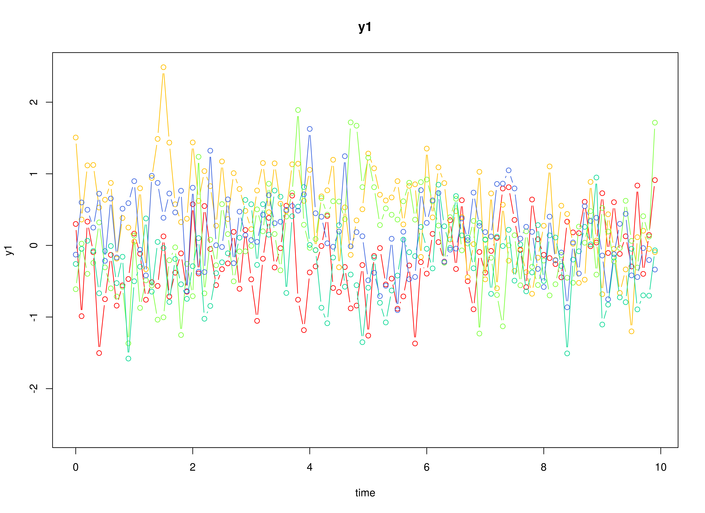

## Model

The measurement model is given by
\begin{equation}
  \mathbf{y}_{i, t}
  =
  \boldsymbol{\nu}
  +
  \boldsymbol{\Lambda}
  \boldsymbol{\eta}_{i, t}
  +
  \boldsymbol{\varepsilon}_{i, t},
  \quad
  \mathrm{with}
  \quad
  \boldsymbol{\varepsilon}_{i, t}
  \sim
  \mathcal{N}
  \left(
  \mathbf{0},
  \boldsymbol{\Theta}
  \right)
\end{equation}
where
$\mathbf{y}_{i, t}$,
$\boldsymbol{\eta}_{i, t}$,
and
$\boldsymbol{\varepsilon}_{i, t}$
are random variables
and
$\boldsymbol{\nu}$,
$\boldsymbol{\Lambda}$,
and
$\boldsymbol{\Theta}$
are model parameters.
$\mathbf{y}_{i, t}$
represents a vector of observed random variables,
$\boldsymbol{\eta}_{i, t}$
a vector of latent random variables,
and
$\boldsymbol{\varepsilon}_{i, t}$
a vector of random measurement errors,
at time $t$ and individual $i$.
$\boldsymbol{\nu}$
denotes a vector of intercepts,
$\boldsymbol{\Lambda}$
a matrix of factor loadings,
and
$\boldsymbol{\Theta}$
the covariance matrix of
$\boldsymbol{\varepsilon}$.

An alternative representation of the measurement error
is given by
\begin{equation}
  \boldsymbol{\varepsilon}_{i, t}
  =
  \boldsymbol{\Theta}^{\frac{1}{2}}
  \mathbf{z}_{i, t},
  \quad
  \mathrm{with}
  \quad
  \mathbf{z}_{i, t}
  \sim
  \mathcal{N}
  \left(
  \mathbf{0},
  \mathbf{I}
  \right)
\end{equation}
where
$\mathbf{z}_{i, t}$ is a vector of
independent standard normal random variables and
$\left( \boldsymbol{\Theta}^{\frac{1}{2}} \right) \left( \boldsymbol{\Theta}^{\frac{1}{2}} \right)^{\prime} = \boldsymbol{\Theta}$ .

The dynamic structure is given by
\begin{equation}
  \mathrm{d} \boldsymbol{\eta}_{i, t}
  =
  \boldsymbol{\Phi}
  \left(
  \boldsymbol{\eta}_{i, t}
  -
  \boldsymbol{\mu}
  \right)
  \mathrm{d}t
  +
  \boldsymbol{\Sigma}^{\frac{1}{2}}
  \mathrm{d}
  \mathbf{W}_{i, t}
\end{equation}
where
$\boldsymbol{\mu}$
is the long-term mean or equilibrium level,
$\boldsymbol{\Phi}$
is the rate of mean reversion,
determining how quickly the variable returns to its mean,
$\boldsymbol{\Sigma}$
is the matrix of volatility
or randomness in the process, and
$\mathrm{d}\boldsymbol{W}$
is a Wiener process or Brownian motion,
which represents random fluctuations.

## Data Generation

### Notation

Let $t = 100$ be the number of time points and $n = 5$ be the number of individuals.

Let the measurement model intecept vector $\boldsymbol{\nu}$ be given by

\begin{equation}
\boldsymbol{\nu}
=
\left(
\begin{array}{c}
  0 \\
  0 \\
  0 \\
\end{array}
\right) .
\end{equation}

Let the factor loadings matrix $\boldsymbol{\Lambda}$ be given by

\begin{equation}
\boldsymbol{\Lambda}
=
\left(
\begin{array}{ccc}
  1 & 0 & 0 \\
  0 & 1 & 0 \\
  0 & 0 & 1 \\
\end{array}
\right) .
\end{equation}

Let the measurement error covariance matrix $\boldsymbol{\Theta}$ be given by

\begin{equation}
\boldsymbol{\Theta}
=
\left(
\begin{array}{ccc}
  0.2 & 0 & 0 \\
  0 & 0.2 & 0 \\
  0 & 0 & 0.2 \\
\end{array}
\right) .
\end{equation}

Let the initial condition
$\boldsymbol{\eta}_{0}$
be given by

\begin{equation}
\boldsymbol{\eta}_{0} \sim \mathcal{N} \left( \boldsymbol{\mu}_{\boldsymbol{\eta} \mid 0}, \boldsymbol{\Sigma}_{\boldsymbol{\eta} \mid 0} \right)
\end{equation}

\begin{equation}
\boldsymbol{\mu}_{\boldsymbol{\eta} \mid 0}
=
\left(
\begin{array}{c}
  0 \\
  0 \\
  0 \\
\end{array}
\right)
\end{equation}

\begin{equation}
\boldsymbol{\Sigma}_{\boldsymbol{\eta} \mid 0}
=
\left(
\begin{array}{ccc}
  1 & 0.2 & 0.2 \\
  0.2 & 1 & 0.2 \\
  0.2 & 0.2 & 1 \\
\end{array}
\right) .
\end{equation}

Let the long-term mean vector $\boldsymbol{\mu}$ be given by

\begin{equation}
\boldsymbol{\mu}
=
\left(
\begin{array}{c}
  0 \\
  0 \\
  0 \\
\end{array}
\right) .
\end{equation}

Let the rate of mean reversion matrix $\boldsymbol{\Phi}$ be given by

\begin{equation}
\boldsymbol{\Phi}
=
\left(
\begin{array}{ccc}
  -0.357 & 0 & 0 \\
  0.771 & -0.511 & 0 \\
  -0.45 & 0.729 & -0.693 \\
\end{array}
\right) .
\end{equation}

Let the dynamic process noise covariance matrix $\boldsymbol{\Sigma}$ be given by

\begin{equation}
\boldsymbol{\Sigma}
=
\left(
\begin{array}{ccc}
  0.2445556 & 0.0220159 & -0.0500476 \\
  0.0220159 & 0.070678 & 0.0153946 \\
  -0.0500476 & 0.0153946 & 0.0755306 \\
\end{array}
\right) .
\end{equation}

Let $\Delta t = 0.1$.

### R Function Arguments


``` r
n
#> [1] 5
time
#> [1] 100
delta_t
#> [1] 0.1
mu0
#> [1] 0 0 0
sigma0
#>      [,1] [,2] [,3]
#> [1,]  1.0  0.2  0.2
#> [2,]  0.2  1.0  0.2
#> [3,]  0.2  0.2  1.0
mu
#> [1] 0 0 0
phi
#>        [,1]   [,2]   [,3]
#> [1,] -0.357  0.000  0.000
#> [2,]  0.771 -0.511  0.000
#> [3,] -0.450  0.729 -0.693
sigma
#>             [,1]       [,2]        [,3]
#> [1,]  0.24455556 0.02201587 -0.05004762
#> [2,]  0.02201587 0.07067800  0.01539456
#> [3,] -0.05004762 0.01539456  0.07553061
nu
#> [1] 0 0 0
lambda
#>      [,1] [,2] [,3]
#> [1,]    1    0    0
#> [2,]    0    1    0
#> [3,]    0    0    1
theta
#>      [,1] [,2] [,3]
#> [1,]  0.2  0.0  0.0
#> [2,]  0.0  0.2  0.0
#> [3,]  0.0  0.0  0.2
```

### Visualizing the Dynamics Without Measurement Error and Process Noise (n = 5 with Different Initial Condition)


### Using the `SimSSMOUFixed` Function from the `simStateSpace` Package to Simulate Data


``` r
library(simStateSpace)
sim <- SimSSMOUFixed(
  n = n,
  time = time,
  delta_t = delta_t,
  mu0 = mu0,
  sigma0_l = sigma0_l,
  mu = mu,
  phi = phi,
  sigma_l = sigma_l,
  nu = nu,
  lambda = lambda,
  theta_l = theta_l,
  type = 0
)
data <- as.data.frame(sim)
head(data)
#>   id time          y1          y2        y3
#> 1  1  0.0  0.29937539 -1.37581548 1.3779071
#> 2  1  0.1 -0.98770381 -0.03632195 0.8363080
#> 3  1  0.2  0.33221051 -0.40321664 1.2054318
#> 4  1  0.3 -0.09485392 -0.82030556 1.0272653
#> 5  1  0.4 -1.50322069 -0.36841853 0.1821731
#> 6  1  0.5 -0.75049839  0.35752476 0.2862544
plot(sim)
```



## Model Fitting

### Prepare Data


``` r
dynr_data <- dynr::dynr.data(
  dataframe = data,
  id = "id",
  time = "time",
  observed = c("y1", "y2", "y3")
)
```

### Prepare Initial Condition


``` r
dynr_initial <- dynr::prep.initial(
  values.inistate = mu0,
  params.inistate = c("mu0_1", "mu0_2", "mu0_3"),
  values.inicov = sigma0,
  params.inicov = matrix(
    data = c(
      "sigma0_11", "sigma0_12", "sigma0_13",
      "sigma0_12", "sigma0_22", "sigma0_23",
      "sigma0_13", "sigma0_23", "sigma0_33"
    ),
    nrow = 3
  )
)
```

### Prepare Measurement Model


``` r
dynr_measurement <- dynr::prep.measurement(
  values.load = diag(3),
  params.load = matrix(data = "fixed", nrow = 3, ncol = 3),
  state.names = c("eta_1", "eta_2", "eta_3"),
  obs.names = c("y1", "y2", "y3")
)
```

### Prepare Dynamic Process


``` r
dynr_dynamics <- dynr::prep.formulaDynamics(
  formula = list(  
    eta_1 ~ (phi_11 * (eta_1 - mu_1)) + (phi_12 * (eta_2 - mu_2)) + (phi_13 * (eta_3 - mu_3)),
    eta_2 ~ (phi_21 * (eta_1 - mu_1)) + (phi_22 * (eta_2 - mu_2)) + (phi_23 * (eta_3 - mu_3)),
    eta_3 ~ (phi_31 * (eta_1 - mu_1)) + (phi_32 * (eta_2 - mu_2)) + (phi_33 * (eta_3 - mu_3))
  ),
  startval = c(
    mu_1 = mu[1], mu_2 = mu[2], mu_3 = mu[3],
    phi_11 = phi[1, 1], phi_12 = phi[1, 2], phi_13 = phi[1, 3],
    phi_21 = phi[2, 1], phi_22 = phi[2, 2], phi_23 = phi[2, 3],
    phi_31 = phi[3, 1], phi_32 = phi[3, 2], phi_33 = phi[3, 3]
  ),
  isContinuousTime = TRUE
)
```

### Prepare Process Noise


``` r
dynr_noise <- dynr::prep.noise(
  values.latent = sigma,
  params.latent = matrix(
    data = c(
      "sigma_11", "sigma_12", "sigma_13",
      "sigma_12", "sigma_22", "sigma_23",
      "sigma_13", "sigma_23", "sigma_33"
    ),
    nrow = 3
  ),
  values.observed = theta,
  params.observed = matrix(
    data = c(
      "theta_11", "fixed", "fixed",
      "fixed", "theta_22", "fixed",
      "fixed", "fixed", "theta_33"
    ),
    nrow = 3
  )
)
```

### Prepare the Model


``` r
model <- dynr::dynr.model(
  data = dynr_data,
  initial = dynr_initial,
  measurement = dynr_measurement,
  dynamics = dynr_dynamics,
  noise = dynr_noise,
  outfile = "ou.c"
)
```

Add lower and upper bounds to aid in the optimization.


``` r
model$lb[
  c(
    "phi_11",
    "phi_12",
    "phi_13",
    "phi_21",
    "phi_22",
    "phi_23",
    "phi_31",
    "phi_32",
    "phi_33"
  )
] <- -1.5
model$ub[
  c(
    "phi_11",
    "phi_12",
    "phi_13",
    "phi_21",
    "phi_22",
    "phi_23",
    "phi_31",
    "phi_32",
    "phi_33"
  )
] <- +1.5
```


### Fit the Model


``` r
results <- dynr::dynr.cook(
  model,
  debug_flag = TRUE,
  verbose = FALSE
)
#> [1] "Get ready!!!!"
#> using C compiler: ‘gcc (Ubuntu 11.4.0-1ubuntu1~22.04) 11.4.0’
#> Optimization function called.
#> Starting Hessian calculation ...
#> Finished Hessian calculation.
#> Original exit flag:  3 
#> Modified exit flag:  3 
#> Optimization terminated successfully: ftol_rel or ftol_abs was reached. 
#> Original fitted parameters:  0.05485508 0.1965643 0.1128741 -0.2600789 
#> -0.2739033 0.02599312 0.7412146 -1.002955 0.2049504 -0.9824316 1.5 -1.091145 
#> -2.16558 0.136935 0.1205414 -3.228083 0.03768175 -3.136257 -1.525 -1.617376 
#> -1.617815 0.00709613 -0.08813477 0.1935501 -1.572232 -0.3089991 0.7340692 
#> -0.8959006 -1.792513 -19.50141 
#> 
#> Transformed fitted parameters:  0.05485508 0.1965643 0.1128741 -0.2600789 
#> -0.2739033 0.02599312 0.7412146 -1.002955 0.2049504 -0.9824316 1.5 -1.091145 
#> 0.1146834 0.01570417 0.0138241 0.04178387 0.00338646 0.04516774 0.2176211 
#> 0.1984187 0.1983315 0.00709613 -0.08813477 0.1935501 0.2075814 -0.06414248 
#> 0.1523791 0.4280597 -0.77886 1.423573 
#> 
#> Doing end processing
#> Successful trial
#> Total Time: 39.88833 
#> Backend Time: 38.41751
```

## Summary


``` r
summary(results)
#> Coefficients:
#>            Estimate Std. Error t value  ci.lower  ci.upper Pr(>|t|)    
#> mu_1       0.054855   0.106843   0.513 -0.154553  0.264263   0.3040    
#> mu_2       0.196564   0.096103   2.045  0.008206  0.384922   0.0207 *  
#> mu_3       0.112874   0.081002   1.393 -0.045887  0.271636   0.0821 .  
#> phi_11    -0.260079   0.288449  -0.902 -0.825429  0.305271   0.1839    
#> phi_12    -0.273903   0.336724  -0.813 -0.933871  0.386064   0.2082    
#> phi_13     0.025993   0.243637   0.107 -0.451527  0.503513   0.4575    
#> phi_21     0.741215   0.207314   3.575  0.334886  1.147543   0.0002 ***
#> phi_22    -1.002955   0.235309  -4.262 -1.464152 -0.541759   <2e-16 ***
#> phi_23     0.204950   0.195284   1.050 -0.177799  0.587700   0.1472    
#> phi_31    -0.982432   0.270797  -3.628 -1.513183 -0.451680   0.0002 ***
#> phi_32     1.500000   0.314170   4.774  0.884239  2.115761   <2e-16 ***
#> phi_33    -1.091145   0.261629  -4.171 -1.603929 -0.578361   <2e-16 ***
#> sigma_11   0.114683   0.045973   2.495  0.024578  0.204789   0.0065 ** 
#> sigma_12   0.015704   0.020884   0.752 -0.025228  0.056636   0.2262    
#> sigma_13   0.013824   0.028060   0.493 -0.041173  0.068821   0.3112    
#> sigma_22   0.041784   0.020201   2.068  0.002191  0.081376   0.0196 *  
#> sigma_23   0.003386   0.020034   0.169 -0.035880  0.042653   0.4329    
#> sigma_33   0.045168   0.039734   1.137 -0.032709  0.123045   0.1281    
#> theta_11   0.217621   0.016232  13.407  0.185808  0.249434   <2e-16 ***
#> theta_22   0.198419   0.013582  14.609  0.171798  0.225039   <2e-16 ***
#> theta_33   0.198331   0.014609  13.576  0.169699  0.226964   <2e-16 ***
#> mu0_1      0.007096   0.230499   0.031 -0.444673  0.458866   0.4877    
#> mu0_2     -0.088135   0.308570  -0.286 -0.692920  0.516650   0.3876    
#> mu0_3      0.193550   0.545562   0.355 -0.875733  1.262833   0.3615    
#> sigma0_11  0.207581   0.166826   1.244 -0.119392  0.534555   0.1070    
#> sigma0_12 -0.064142   0.165005  -0.389 -0.387546  0.259261   0.3488    
#> sigma0_13  0.152379   0.299302   0.509 -0.434242  0.739000   0.3055    
#> sigma0_22  0.428060   0.317935   1.346 -0.195081  1.051201   0.0894 .  
#> sigma0_23 -0.778860   0.527014  -1.478 -1.811789  0.254069   0.0701 .  
#> sigma0_33  1.423573   0.958355   1.485 -0.454769  3.301915   0.0690 .  
#> ---
#> Signif. codes:  0 '***' 0.001 '**' 0.01 '*' 0.05 '.' 0.1 ' ' 1
#> 
#> -2 log-likelihood value at convergence = 2088.54
#> AIC = 2148.54
#> BIC = 2274.97
```


```
#> [1]  0.00709613 -0.08813477  0.19355010
```

### Parameter Estimates


``` r
mu_hat
#> [1] 0.05485508 0.19656425 0.11287414
phi_hat
#>            [,1]       [,2]        [,3]
#> [1,] -0.2600789 -0.2739033  0.02599312
#> [2,]  0.7412146 -1.0029554  0.20495044
#> [3,] -0.9824316  1.5000000 -1.09114528
sigma_hat
#>            [,1]       [,2]       [,3]
#> [1,] 0.11468339 0.01570417 0.01382410
#> [2,] 0.01570417 0.04178387 0.00338646
#> [3,] 0.01382410 0.00338646 0.04516774
mu0_hat
#> [1]  0.00709613 -0.08813477  0.19355010
sigma0_hat
#>             [,1]        [,2]       [,3]
#> [1,]  0.20758142 -0.06414248  0.1523791
#> [2,] -0.06414248  0.42805975 -0.7788600
#> [3,]  0.15237912 -0.77885999  1.4235727
beta_var1_hat <- expm::expm(phi_hat)
beta_var1_hat
#>            [,1]       [,2]         [,3]
#> [1,]  0.7085379 -0.1409335 0.0006110088
#> [2,]  0.3590317  0.3792895 0.0770292410
#> [3,] -0.2586161  0.5936354 0.3894688545
```

## References


