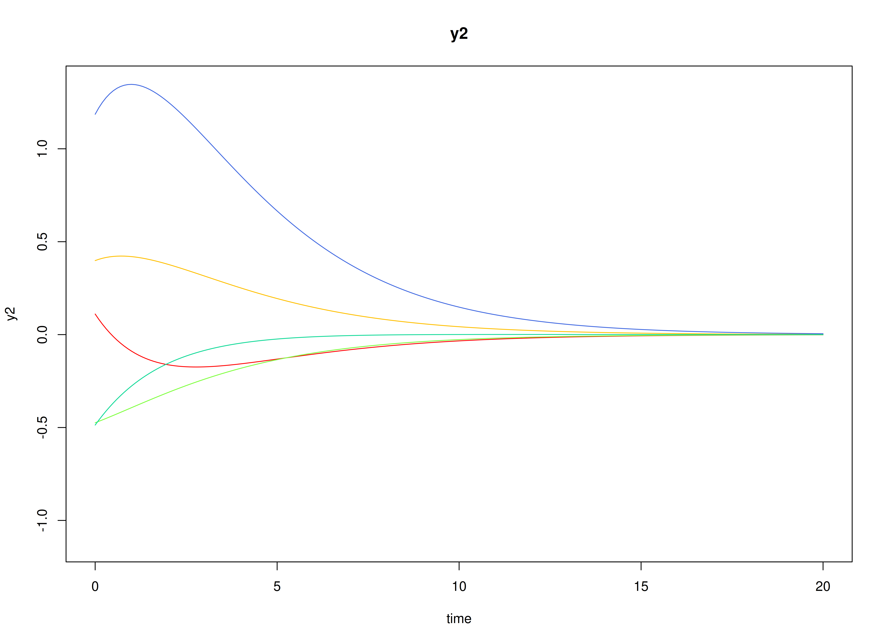

## Model

The measurement model is given by
\begin{equation}
  \mathbf{y}_{i, t}
  =
  \boldsymbol{\nu}
  +
  \boldsymbol{\Lambda}
  \boldsymbol{\eta}_{i, t}
  +
  \boldsymbol{\varepsilon}_{i, t},
  \quad
  \mathrm{with}
  \quad
  \boldsymbol{\varepsilon}_{i, t}
  \sim
  \mathcal{N}
  \left(
  \mathbf{0},
  \boldsymbol{\Theta}
  \right)
\end{equation}
where
$\mathbf{y}_{i, t}$,
$\boldsymbol{\eta}_{i, t}$,
and
$\boldsymbol{\varepsilon}_{i, t}$
are random variables
and
$\boldsymbol{\nu}$,
$\boldsymbol{\Lambda}$,
and
$\boldsymbol{\Theta}$
are model parameters.
$\mathbf{y}_{i, t}$
represents a vector of observed random variables,
$\boldsymbol{\eta}_{i, t}$
a vector of latent random variables,
and
$\boldsymbol{\varepsilon}_{i, t}$
a vector of random measurement errors,
at time $t$ and individual $i$.
$\boldsymbol{\nu}$
denotes a vector of intercepts,
$\boldsymbol{\Lambda}$
a matrix of factor loadings,
and
$\boldsymbol{\Theta}$
the covariance matrix of
$\boldsymbol{\varepsilon}$.

An alternative representation of the measurement error
is given by
\begin{equation}
  \boldsymbol{\varepsilon}_{i, t}
  =
  \boldsymbol{\Theta}^{\frac{1}{2}}
  \mathbf{z}_{i, t},
  \quad
  \mathrm{with}
  \quad
  \mathbf{z}_{i, t}
  \sim
  \mathcal{N}
  \left(
  \mathbf{0},
  \mathbf{I}
  \right)
\end{equation}
where
$\mathbf{z}_{i, t}$ is a vector of
independent standard normal random variables and
$\left( \boldsymbol{\Theta}^{\frac{1}{2}} \right) \left( \boldsymbol{\Theta}^{\frac{1}{2}} \right)^{\prime} = \boldsymbol{\Theta}$ .

The dynamic structure is given by
\begin{equation}
  \mathrm{d} \boldsymbol{\eta}_{i, t}
  =
  \boldsymbol{\Phi}
  \left(
  \boldsymbol{\eta}_{i, t}
  -
  \boldsymbol{\mu}
  \right)
  \mathrm{d}t
  +
  \boldsymbol{\Sigma}^{\frac{1}{2}}
  \mathrm{d}
  \mathbf{W}_{i, t}
\end{equation}
where
$\boldsymbol{\mu}$
is the long-term mean or equilibrium level,
$\boldsymbol{\Phi}$
is the rate of mean reversion,
determining how quickly the variable returns to its mean,
$\boldsymbol{\Sigma}$
is the matrix of volatility
or randomness in the process, and
$\mathrm{d}\boldsymbol{W}$
is a Wiener process or Brownian motion,
which represents random fluctuations.

## Data Generation

### Notation

Let $t = 1000$ be the number of time points and $n = 200$ be the number of individuals.

Let the measurement model intecept vector $\boldsymbol{\nu}$ be given by

\begin{equation}
\boldsymbol{\nu}
=
\left(
\begin{array}{c}
  0 \\
  0 \\
  0 \\
\end{array}
\right) .
\end{equation}

Let the factor loadings matrix $\boldsymbol{\Lambda}$ be given by

\begin{equation}
\boldsymbol{\Lambda}
=
\left(
\begin{array}{ccc}
  1 & 0 & 0 \\
  0 & 1 & 0 \\
  0 & 0 & 1 \\
\end{array}
\right) .
\end{equation}

Let the measurement error covariance matrix $\boldsymbol{\Theta}$ be given by

\begin{equation}
\boldsymbol{\Theta}
=
\left(
\begin{array}{ccc}
  0.2 & 0 & 0 \\
  0 & 0.2 & 0 \\
  0 & 0 & 0.2 \\
\end{array}
\right) .
\end{equation}

Let the initial condition
$\boldsymbol{\eta}_{0}$
be given by

\begin{equation}
\boldsymbol{\eta}_{0} \sim \mathcal{N} \left( \boldsymbol{\mu}_{\boldsymbol{\eta} \mid 0}, \boldsymbol{\Sigma}_{\boldsymbol{\eta} \mid 0} \right)
\end{equation}

\begin{equation}
\boldsymbol{\mu}_{\boldsymbol{\eta} \mid 0}
=
\left(
\begin{array}{c}
  0 \\
  0 \\
  0 \\
\end{array}
\right)
\end{equation}

\begin{equation}
\boldsymbol{\Sigma}_{\boldsymbol{\eta} \mid 0}
=
\left(
\begin{array}{ccc}
  1 & 0.2 & 0.2 \\
  0.2 & 1 & 0.2 \\
  0.2 & 0.2 & 1 \\
\end{array}
\right) .
\end{equation}

Let the long-term mean vector $\boldsymbol{\mu}$ be given by

\begin{equation}
\boldsymbol{\mu}
=
\left(
\begin{array}{c}
  0 \\
  0 \\
  0 \\
\end{array}
\right) .
\end{equation}

Let the rate of mean reversion matrix $\boldsymbol{\Phi}$ be given by

\begin{equation}
\boldsymbol{\Phi}
=
\left(
\begin{array}{ccc}
  -0.357 & 0 & 0 \\
  0.771 & -0.511 & 0 \\
  -0.45 & 0.729 & -0.693 \\
\end{array}
\right) .
\end{equation}

Let the dynamic process noise covariance matrix $\boldsymbol{\Sigma}$ be given by

\begin{equation}
\boldsymbol{\Sigma}
=
\left(
\begin{array}{ccc}
  0.2445556 & 0.0220159 & -0.0500476 \\
  0.0220159 & 0.070678 & 0.0153946 \\
  -0.0500476 & 0.0153946 & 0.0755306 \\
\end{array}
\right) .
\end{equation}

Let $\Delta t = 0.1$.

### R Function Arguments


``` r
n
#> [1] 200
time
#> [1] 1000
delta_t
#> [1] 0.1
mu0
#> [1] 0 0 0
sigma0
#>      [,1] [,2] [,3]
#> [1,]  1.0  0.2  0.2
#> [2,]  0.2  1.0  0.2
#> [3,]  0.2  0.2  1.0
sigma0_l # sigma0_l <- t(chol(sigma0))
#>      [,1]      [,2]      [,3]
#> [1,]  1.0 0.0000000 0.0000000
#> [2,]  0.2 0.9797959 0.0000000
#> [3,]  0.2 0.1632993 0.9660918
mu
#> [1] 0 0 0
phi
#>        [,1]   [,2]   [,3]
#> [1,] -0.357  0.000  0.000
#> [2,]  0.771 -0.511  0.000
#> [3,] -0.450  0.729 -0.693
sigma
#>             [,1]       [,2]        [,3]
#> [1,]  0.24455556 0.02201587 -0.05004762
#> [2,]  0.02201587 0.07067800  0.01539456
#> [3,] -0.05004762 0.01539456  0.07553061
sigma_l # sigma_l <- t(chol(sigma))
#>             [,1]      [,2]     [,3]
#> [1,]  0.49452559 0.0000000 0.000000
#> [2,]  0.04451917 0.2620993 0.000000
#> [3,] -0.10120330 0.0759256 0.243975
nu
#> [1] 0 0 0
lambda
#>      [,1] [,2] [,3]
#> [1,]    1    0    0
#> [2,]    0    1    0
#> [3,]    0    0    1
theta
#>      [,1] [,2] [,3]
#> [1,]  0.2  0.0  0.0
#> [2,]  0.0  0.2  0.0
#> [3,]  0.0  0.0  0.2
theta_l # theta_l <- t(chol(theta))
#>           [,1]      [,2]      [,3]
#> [1,] 0.4472136 0.0000000 0.0000000
#> [2,] 0.0000000 0.4472136 0.0000000
#> [3,] 0.0000000 0.0000000 0.4472136
```

### Visualizing the Dynamics Without Measurement Error and Process Noise (n = 5 with Different Initial Condition)



### Using the `SimSSMOUFixed` Function from the `simStateSpace` Package to Simulate Data


``` r
library(simStateSpace)
sim <- SimSSMOUFixed(
  n = n,
  time = time,
  delta_t = delta_t,
  mu0 = mu0,
  sigma0_l = sigma0_l,
  mu = mu,
  phi = phi,
  sigma_l = sigma_l,
  nu = nu,
  lambda = lambda,
  theta_l = theta_l,
  type = 0
)
data <- as.data.frame(sim)
head(data)
#>   id time          y1          y2        y3
#> 1  1  0.0  0.29937539 -1.37581548 1.3779071
#> 2  1  0.1 -0.98770381 -0.03632195 0.8363080
#> 3  1  0.2  0.33221051 -0.40321664 1.2054318
#> 4  1  0.3 -0.09485392 -0.82030556 1.0272653
#> 5  1  0.4 -1.50322069 -0.36841853 0.1821731
#> 6  1  0.5 -0.75049839  0.35752476 0.2862544
summary(data)
#>        id              time             y1                 y2          
#>  Min.   :  1.00   Min.   : 0.00   Min.   :-3.98174   Min.   :-4.00519  
#>  1st Qu.: 50.75   1st Qu.:24.98   1st Qu.:-0.49138   1st Qu.:-0.57912  
#>  Median :100.50   Median :49.95   Median : 0.01242   Median : 0.02468  
#>  Mean   :100.50   Mean   :49.95   Mean   : 0.01203   Mean   : 0.02172  
#>  3rd Qu.:150.25   3rd Qu.:74.92   3rd Qu.: 0.51866   3rd Qu.: 0.62401  
#>  Max.   :200.00   Max.   :99.90   Max.   : 3.44725   Max.   : 4.07203  
#>        y3          
#>  Min.   :-3.01407  
#>  1st Qu.:-0.47005  
#>  Median : 0.01713  
#>  Mean   : 0.01740  
#>  3rd Qu.: 0.50573  
#>  Max.   : 3.29603
plot(sim)
```


## Model Fitting

### Prepare Data


``` r
dynr_data <- dynr::dynr.data(
  dataframe = data,
  id = "id",
  time = "time",
  observed = c("y1", "y2", "y3")
)
```

### Prepare Initial Condition


``` r
dynr_initial <- dynr::prep.initial(
  values.inistate = mu0,
  params.inistate = c("mu0_1_1", "mu0_2_1", "mu0_3_1"),
  values.inicov = sigma0,
  params.inicov = matrix(
    data = c(
      "sigma0_1_1", "sigma0_2_1", "sigma0_3_1",
      "sigma0_2_1", "sigma0_2_2", "sigma0_3_2",
      "sigma0_3_1", "sigma0_3_2", "sigma0_3_3"
    ),
    nrow = 3
  )
)
```

### Prepare Measurement Model


``` r
dynr_measurement <- dynr::prep.measurement(
  values.load = diag(3),
  params.load = matrix(data = "fixed", nrow = 3, ncol = 3),
  state.names = c("eta_1", "eta_2", "eta_3"),
  obs.names = c("y1", "y2", "y3")
)
```

### Prepare Dynamic Process


``` r
dynr_dynamics <- dynr::prep.formulaDynamics(
  formula = list(  
    eta_1 ~ (phi_1_1 * (eta_1 - mu_1_1)) + (phi_1_2 * (eta_2 - mu_2_1)) + (phi_1_3 * (eta_3 - mu_3_1)),
    eta_2 ~ (phi_2_1 * (eta_1 - mu_1_1)) + (phi_2_2 * (eta_2 - mu_2_1)) + (phi_2_3 * (eta_3 - mu_3_1)),
    eta_3 ~ (phi_3_1 * (eta_1 - mu_1_1)) + (phi_3_2 * (eta_2 - mu_2_1)) + (phi_3_3 * (eta_3 - mu_3_1))
  ),
  startval = c(
    mu_1_1 = mu[1], mu_2_1 = mu[2], mu_3_1 = mu[3],
    phi_1_1 = phi[1, 1], phi_1_2 = phi[1, 2], phi_1_3 = phi[1, 3],
    phi_2_1 = phi[2, 1], phi_2_2 = phi[2, 2], phi_2_3 = phi[2, 3],
    phi_3_1 = phi[3, 1], phi_3_2 = phi[3, 2], phi_3_3 = phi[3, 3]
  ),
  isContinuousTime = TRUE
)
```

### Prepare Process Noise


``` r
dynr_noise <- dynr::prep.noise(
  values.latent = sigma,
  params.latent = matrix(
    data = c(
      "sigma_1_1", "sigma_2_1", "sigma_3_1",
      "sigma_2_1", "sigma_2_2", "sigma_3_2",
      "sigma_3_1", "sigma_3_2", "sigma_3_3"
    ),
    nrow = 3
  ),
  values.observed = theta,
  params.observed = matrix(
    data = c(
      "theta_1_1", "fixed", "fixed",
      "fixed", "theta_2_2", "fixed",
      "fixed", "fixed", "theta_3_3"
    ),
    nrow = 3
  )
)
```

### Prepare the Model


``` r
model <- dynr::dynr.model(
  data = dynr_data,
  initial = dynr_initial,
  measurement = dynr_measurement,
  dynamics = dynr_dynamics,
  noise = dynr_noise,
  outfile = "ou.c"
)
```

Add lower and upper bounds to aid in the optimization.


``` r
model$lb[
  c(
    "phi_1_1",
    "phi_1_2",
    "phi_1_3",
    "phi_2_1",
    "phi_2_2",
    "phi_2_3",
    "phi_3_1",
    "phi_3_2",
    "phi_3_3"
  )
] <- -1.5
model$ub[
  c(
    "phi_1_1",
    "phi_1_2",
    "phi_1_3",
    "phi_2_1",
    "phi_2_2",
    "phi_2_3",
    "phi_3_1",
    "phi_3_2",
    "phi_3_3"
  )
] <- +1.5
```


### Fit the Model


``` r
results <- dynr::dynr.cook(
  model,
  debug_flag = TRUE,
  verbose = FALSE
)
#> [1] "Get ready!!!!"
#> using C compiler: ‘gcc (Ubuntu 13.3.0-6ubuntu2~24.04) 13.3.0’
#> Optimization function called.
#> Starting Hessian calculation ...
#> Finished Hessian calculation.
#> Original exit flag:  3 
#> Modified exit flag:  3 
#> Optimization terminated successfully: ftol_rel or ftol_abs was reached. 
#> Original fitted parameters:  0.0074423 0.01604336 0.01480638 -0.3456251 
#> 0.005419537 -0.009033402 0.7838956 -0.5201802 0.01062685 -0.4662945 0.7365343 
#> -0.6943721 -1.412437 0.08649705 -0.1973169 -2.657512 0.270102 -2.83898 
#> -1.613181 -1.614047 -1.607751 0.006358062 -0.08593105 0.07062106 -0.05884295 
#> 0.2155056 0.3158868 -0.02382553 0.09879116 -0.1320492 
#> 
#> Transformed fitted parameters:  0.0074423 0.01604336 0.01480638 -0.3456251 
#> 0.005419537 -0.009033402 0.7838956 -0.5201802 0.01062685 -0.4662945 0.7365343 
#> -0.6943721 0.243549 0.02106627 -0.04805634 0.07194466 0.01478349 0.07308339 
#> 0.1992528 0.1990803 0.2003376 0.006358062 -0.08593105 0.07062106 0.9428548 
#> 0.2031905 0.2978354 1.020245 0.1606504 0.97991 
#> 
#> Doing end processing
#> Successful trial
#> Total Time: 4.844021 
#> Backend Time: 4.843844
```

## Summary


``` r
summary(results)
#> Coefficients:
#>              Estimate Std. Error t value   ci.lower   ci.upper Pr(>|t|)    
#> mu_1_1      0.0074423  0.0104213   0.714 -0.0129831  0.0278677   0.2376    
#> mu_2_1      0.0160434  0.0168909   0.950 -0.0170622  0.0491490   0.1711    
#> mu_3_1      0.0148064  0.0109045   1.358 -0.0065660  0.0361787   0.0873 .  
#> phi_1_1    -0.3456251  0.0244777 -14.120 -0.3936005 -0.2976496   <2e-16 ***
#> phi_1_2     0.0054195  0.0211028   0.257 -0.0359412  0.0467803   0.3987    
#> phi_1_3    -0.0090334  0.0159691  -0.566 -0.0403322  0.0222654   0.2858    
#> phi_2_1     0.7838956  0.0151567  51.719  0.7541889  0.8136023   <2e-16 ***
#> phi_2_2    -0.5201802  0.0133680 -38.912 -0.5463811 -0.4939793   <2e-16 ***
#> phi_2_3     0.0106269  0.0101655   1.045 -0.0092972  0.0305509   0.1479    
#> phi_3_1    -0.4662945  0.0162766 -28.648 -0.4981961 -0.4343928   <2e-16 ***
#> phi_3_2     0.7365343  0.0144639  50.922  0.7081856  0.7648831   <2e-16 ***
#> phi_3_3    -0.6943721  0.0110700 -62.725 -0.7160689 -0.6726752   <2e-16 ***
#> sigma_1_1   0.2435490  0.0047823  50.927  0.2341758  0.2529222   <2e-16 ***
#> sigma_2_1   0.0210663  0.0018487  11.395  0.0174429  0.0246897   <2e-16 ***
#> sigma_3_1  -0.0480563  0.0019356 -24.828 -0.0518500 -0.0442626   <2e-16 ***
#> sigma_2_2   0.0719447  0.0013768  52.254  0.0692461  0.0746432   <2e-16 ***
#> sigma_3_2   0.0147835  0.0009727  15.199  0.0128771  0.0166899   <2e-16 ***
#> sigma_3_3   0.0730834  0.0014914  49.002  0.0701602  0.0760065   <2e-16 ***
#> theta_1_1   0.1992528  0.0008287 240.429  0.1976285  0.2008771   <2e-16 ***
#> theta_2_2   0.1990803  0.0007072 281.507  0.1976942  0.2004664   <2e-16 ***
#> theta_3_3   0.2003376  0.0007154 280.023  0.1989354  0.2017399   <2e-16 ***
#> mu0_1_1     0.0063581  0.0714920   0.089 -0.1337637  0.1464799   0.4646    
#> mu0_2_1    -0.0859310  0.0766155  -1.122 -0.2360947  0.0642326   0.1310    
#> mu0_3_1     0.0706211  0.0745239   0.948 -0.0754430  0.2166852   0.1717    
#> sigma0_1_1  0.9428548  0.0956240   9.860  0.7554352  1.1302745   <2e-16 ***
#> sigma0_2_1  0.2031905  0.0784331   2.591  0.0494644  0.3569166   0.0048 ** 
#> sigma0_3_1  0.2978354  0.0773625   3.850  0.1462076  0.4494632   0.0001 ***
#> sigma0_2_2  1.0202447  0.1057198   9.650  0.8130378  1.2274517   <2e-16 ***
#> sigma0_3_2  0.1606504  0.0784965   2.047  0.0068002  0.3145007   0.0203 *  
#> sigma0_3_3  0.9799100  0.1063247   9.216  0.7715174  1.1883027   <2e-16 ***
#> ---
#> Signif. codes:  0 '***' 0.001 '**' 0.01 '*' 0.05 '.' 0.1 ' ' 1
#> 
#> -2 log-likelihood value at convergence = 858547.55
#> AIC = 858607.55
#> BIC = 858913.73
```


```
#> [1]  0.006358062 -0.085931049  0.070621064
```

### Parameter Estimates


``` r
mu_hat
#> [1] 0.00744230 0.01604336 0.01480638
phi_hat
#>            [,1]         [,2]         [,3]
#> [1,] -0.3456251  0.005419537 -0.009033402
#> [2,]  0.7838956 -0.520180200  0.010626851
#> [3,] -0.4662945  0.736534343 -0.694372077
sigma_hat
#>             [,1]       [,2]        [,3]
#> [1,]  0.24354898 0.02106627 -0.04805634
#> [2,]  0.02106627 0.07194466  0.01478349
#> [3,] -0.04805634 0.01478349  0.07308339
theta_hat
#>           [,1]      [,2]      [,3]
#> [1,] 0.1992528 0.0000000 0.0000000
#> [2,] 0.0000000 0.1990803 0.0000000
#> [3,] 0.0000000 0.0000000 0.2003376
mu0_hat
#> [1]  0.006358062 -0.085931049  0.070621064
sigma0_hat
#>           [,1]      [,2]      [,3]
#> [1,] 0.9428548 0.2031905 0.2978354
#> [2,] 0.2031905 1.0202447 0.1606504
#> [3,] 0.2978354 0.1606504 0.9799100
beta_var1_hat <- expm::expm(phi_hat)
beta_var1_hat
#>            [,1]        [,2]         [,3]
#> [1,]  0.7099882 0.001542857 -0.005393942
#> [2,]  0.5088274 0.597433599  0.003699307
#> [3,] -0.1070466 0.402079274  0.502151924
```

## References


