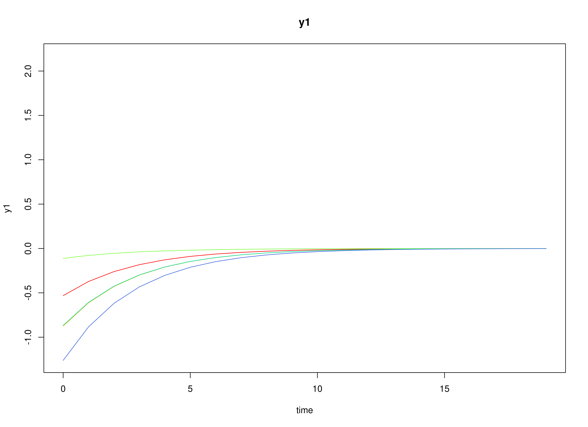
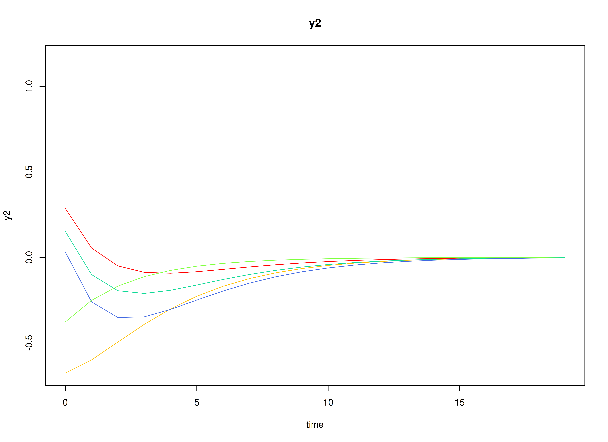
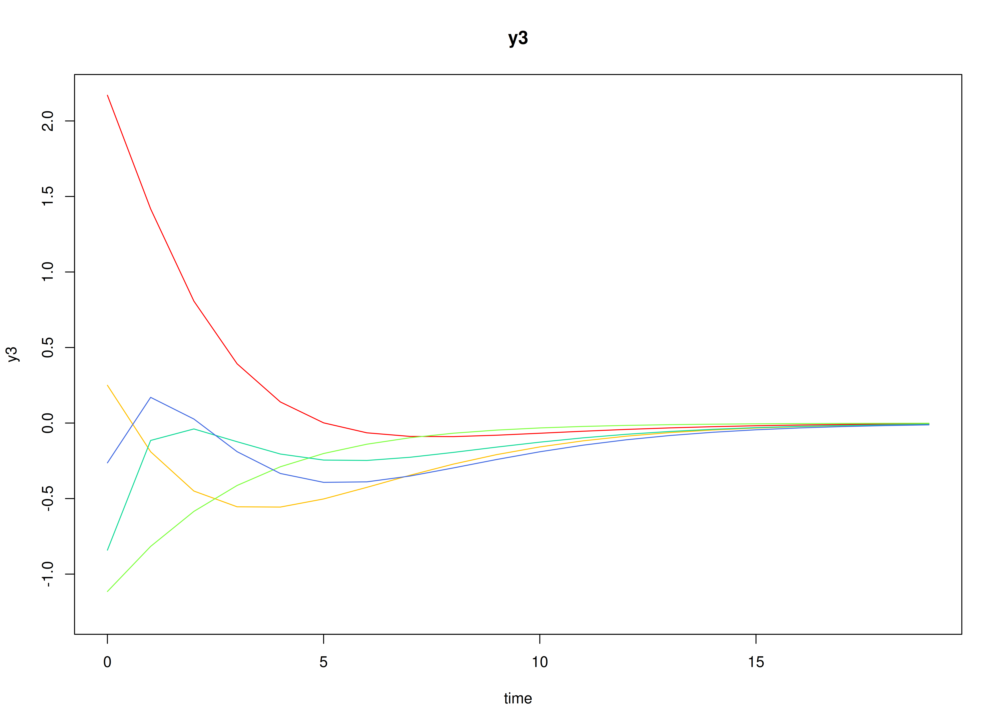
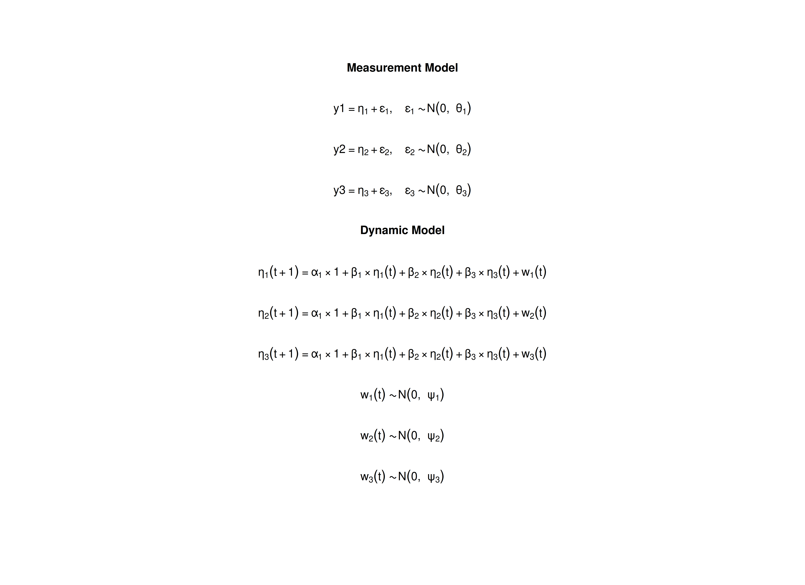

## Model

The measurement model is given by
\begin{equation}
  \mathbf{y}_{i, t}
  =
  \boldsymbol{\nu}
  +
  \boldsymbol{\Lambda}
  \boldsymbol{\eta}_{i, t}
  +
  \boldsymbol{\varepsilon}_{i, t},
  \quad
  \mathrm{with}
  \quad
  \boldsymbol{\varepsilon}_{i, t}
  \sim
  \mathcal{N}
  \left(
  \mathbf{0},
  \boldsymbol{\Theta}
  \right)
\end{equation}
where
$\mathbf{y}_{i, t}$,
$\boldsymbol{\eta}_{i, t}$,
and
$\boldsymbol{\varepsilon}_{i, t}$
are random variables
and
$\boldsymbol{\nu}$,
$\boldsymbol{\Lambda}$,
and
$\boldsymbol{\Theta}$
are model parameters.
$\mathbf{y}_{i, t}$
represents a vector of observed random variables,
$\boldsymbol{\eta}_{i, t}$
a vector of latent random variables,
and
$\boldsymbol{\varepsilon}_{i, t}$
a vector of random measurement errors,
at time $t$ and individual $i$.
$\boldsymbol{\nu}$
denotes a vector of intercepts,
$\boldsymbol{\Lambda}$
a matrix of factor loadings,
and
$\boldsymbol{\Theta}$
the covariance matrix of
$\boldsymbol{\varepsilon}$.

An alternative representation of the measurement error
is given by
\begin{equation}
  \boldsymbol{\varepsilon}_{i, t}
  =
  \boldsymbol{\Theta}^{\frac{1}{2}}
  \mathbf{z}_{i, t},
  \quad
  \mathrm{with}
  \quad
  \mathbf{z}_{i, t}
  \sim
  \mathcal{N}
  \left(
  \mathbf{0},
  \mathbf{I}
  \right)
\end{equation}
where
$\mathbf{z}_{i, t}$ is a vector of
independent standard normal random variables and
$\left( \boldsymbol{\Theta}^{\frac{1}{2}} \right) \left( \boldsymbol{\Theta}^{\frac{1}{2}} \right)^{\prime} = \boldsymbol{\Theta}$ .

The dynamic structure is given by
\begin{equation}
  \boldsymbol{\eta}_{i, t}
  =
  \boldsymbol{\alpha}
  +
  \boldsymbol{\beta}
  \boldsymbol{\eta}_{i, t - 1}
  +
  \boldsymbol{\zeta}_{i, t},
  \quad
  \mathrm{with}
  \quad
  \boldsymbol{\zeta}_{i, t}
  \sim
  \mathcal{N}
  \left(
  \mathbf{0},
  \boldsymbol{\Psi}
  \right)
\end{equation}
where
$\boldsymbol{\eta}_{i, t}$,
$\boldsymbol{\eta}_{i, t - 1}$,
and
$\boldsymbol{\zeta}_{i, t}$
are random variables,
and
$\boldsymbol{\alpha}$,
$\boldsymbol{\beta}$,
and
$\boldsymbol{\Psi}$
are model parameters.
Here,
$\boldsymbol{\eta}_{i, t}$
is a vector of latent variables
at time $t$ and individual $i$,
$\boldsymbol{\eta}_{i, t - 1}$
represents a vector of latent variables
at time $t - 1$ and individual $i$,
and
$\boldsymbol{\zeta}_{i, t}$
represents a vector of dynamic noise
at time $t$ and individual $i$.
$\boldsymbol{\alpha}$
denotes a vector of intercepts,
$\boldsymbol{\beta}$
a matrix of autoregression
and cross regression coefficients,
and
$\boldsymbol{\Psi}$
the covariance matrix of
$\boldsymbol{\zeta}_{i, t}$.

An alternative representation of the dynamic noise
is given by
\begin{equation}
  \boldsymbol{\zeta}_{i, t}
  =
  \boldsymbol{\Psi}^{\frac{1}{2}}
  \mathbf{z}_{i, t},
  \quad
  \mathrm{with}
  \quad
  \mathbf{z}_{i, t}
  \sim
  \mathcal{N}
  \left(
  \mathbf{0},
  \mathbf{I}
  \right)
\end{equation}
where
$\left( \boldsymbol{\Psi}^{\frac{1}{2}} \right) \left( \boldsymbol{\Psi}^{\frac{1}{2}} \right)^{\prime} = \boldsymbol{\Psi}$ .

## Data Generation

### Notation

Let $t = 1000$ be the number of time points and $n = 100$ be the number of individuals.

Let the measurement model intecept vector $\boldsymbol{\nu}$ be given by

\begin{equation}
\boldsymbol{\nu}
=
\left(
\begin{array}{c}
  0 \\
  0 \\
  0 \\
\end{array}
\right) .
\end{equation}

Let the factor loadings matrix $\boldsymbol{\Lambda}$ be given by

\begin{equation}
\boldsymbol{\Lambda}
=
\left(
\begin{array}{ccc}
  1 & 0 & 0 \\
  0 & 1 & 0 \\
  0 & 0 & 1 \\
\end{array}
\right) .
\end{equation}

Let the measurement error covariance matrix $\boldsymbol{\Theta}$ be given by

\begin{equation}
\boldsymbol{\Theta}
=
\left(
\begin{array}{ccc}
  0.2 & 0 & 0 \\
  0 & 0.2 & 0 \\
  0 & 0 & 0.2 \\
\end{array}
\right) .
\end{equation}

Let the initial condition
$\boldsymbol{\eta}_{0}$
be given by

\begin{equation}
\boldsymbol{\eta}_{0} \sim \mathcal{N} \left( \boldsymbol{\mu}_{\boldsymbol{\eta} \mid 0}, \boldsymbol{\Sigma}_{\boldsymbol{\eta} \mid 0} \right)
\end{equation}

\begin{equation}
\boldsymbol{\mu}_{\boldsymbol{\eta} \mid 0}
=
\left(
\begin{array}{c}
  0 \\
  0 \\
  0 \\
\end{array}
\right)
\end{equation}

\begin{equation}
\boldsymbol{\Sigma}_{\boldsymbol{\eta} \mid 0}
=
\left(
\begin{array}{ccc}
  0.1960784 & 0.1183232 & 0.0298539 \\
  0.1183232 & 0.3437711 & 0.1381855 \\
  0.0298539 & 0.1381855 & 0.2663828 \\
\end{array}
\right) .
\end{equation}

Let the constant vector $\boldsymbol{\alpha}$ be given by

\begin{equation}
\boldsymbol{\alpha}
=
\left(
\begin{array}{c}
  0 \\
  0 \\
  0 \\
\end{array}
\right) .
\end{equation}

Let the transition matrix $\boldsymbol{\beta}$ be given by

\begin{equation}
\boldsymbol{\beta}
=
\left(
\begin{array}{ccc}
  0.7 & 0 & 0 \\
  0.5 & 0.6 & 0 \\
  -0.1 & 0.4 & 0.5 \\
\end{array}
\right) .
\end{equation}

Let the dynamic process noise $\boldsymbol{\Psi}$ be given by

\begin{equation}
\boldsymbol{\Psi}
=
\left(
\begin{array}{ccc}
  0.1 & 0 & 0 \\
  0 & 0.1 & 0 \\
  0 & 0 & 0.1 \\
\end{array}
\right) .
\end{equation}

### R Function Arguments


``` r
n
#> [1] 100
time
#> [1] 1000
mu0
#> [1] 0 0 0
sigma0
#>            [,1]      [,2]       [,3]
#> [1,] 0.19607843 0.1183232 0.02985385
#> [2,] 0.11832319 0.3437711 0.13818551
#> [3,] 0.02985385 0.1381855 0.26638284
sigma0_l # sigma0_l <- t(chol(sigma0))
#>            [,1]      [,2]     [,3]
#> [1,] 0.44280744 0.0000000 0.000000
#> [2,] 0.26721139 0.5218900 0.000000
#> [3,] 0.06741949 0.2302597 0.456966
alpha
#> [1] 0 0 0
beta
#>      [,1] [,2] [,3]
#> [1,]  0.7  0.0  0.0
#> [2,]  0.5  0.6  0.0
#> [3,] -0.1  0.4  0.5
psi
#>      [,1] [,2] [,3]
#> [1,]  0.1  0.0  0.0
#> [2,]  0.0  0.1  0.0
#> [3,]  0.0  0.0  0.1
psi_l # psi_l <- t(chol(psi))
#>           [,1]      [,2]      [,3]
#> [1,] 0.3162278 0.0000000 0.0000000
#> [2,] 0.0000000 0.3162278 0.0000000
#> [3,] 0.0000000 0.0000000 0.3162278
nu
#> [1] 0 0 0
lambda
#>      [,1] [,2] [,3]
#> [1,]    1    0    0
#> [2,]    0    1    0
#> [3,]    0    0    1
theta
#>      [,1] [,2] [,3]
#> [1,]  0.2  0.0  0.0
#> [2,]  0.0  0.2  0.0
#> [3,]  0.0  0.0  0.2
theta_l # theta_l <- t(chol(theta))
#>           [,1]      [,2]      [,3]
#> [1,] 0.4472136 0.0000000 0.0000000
#> [2,] 0.0000000 0.4472136 0.0000000
#> [3,] 0.0000000 0.0000000 0.4472136
```

### Visualizing the Dynamics Without Process Noise (n = 5 with Different Initial Condition)



### Using the `SimSSMFixed` Function from the `simStateSpace` Package to Simulate Data


``` r
library(simStateSpace)
sim <- SimSSMFixed(
  n = n,
  time = time,
  mu0 = mu0,
  sigma0_l = sigma0_l,
  alpha = alpha,
  beta = beta,
  psi_l = psi_l,
  nu = nu,
  lambda = lambda,
  theta_l = theta_l,
  type = 0
)
data <- as.data.frame(sim)
head(data)
#>   id time          y1         y2         y3
#> 1  1    0 -0.66908807 0.16178434  0.2955693
#> 2  1    1 -0.23021811 0.22873073 -0.2540210
#> 3  1    2  0.93689389 0.09496693 -0.9267506
#> 4  1    3  0.04445794 0.67521289 -0.1792168
#> 5  1    4  0.15413707 0.82591676  0.8976536
#> 6  1    5 -0.09943698 0.67154173  0.2853507
summary(data)
#>        id              time             y1                   y2            
#>  Min.   :  1.00   Min.   :  0.0   Min.   :-2.8405340   Min.   :-3.1732718  
#>  1st Qu.: 25.75   1st Qu.:249.8   1st Qu.:-0.4213725   1st Qu.:-0.4999526  
#>  Median : 50.50   Median :499.5   Median :-0.0007939   Median : 0.0031390  
#>  Mean   : 50.50   Mean   :499.5   Mean   : 0.0001801   Mean   : 0.0009951  
#>  3rd Qu.: 75.25   3rd Qu.:749.2   3rd Qu.: 0.4236361   3rd Qu.: 0.4990295  
#>  Max.   :100.00   Max.   :999.0   Max.   : 2.6029049   Max.   : 3.2748708  
#>        y3           
#>  Min.   :-3.029883  
#>  1st Qu.:-0.455867  
#>  Median : 0.003032  
#>  Mean   : 0.003844  
#>  3rd Qu.: 0.465214  
#>  Max.   : 3.016221
plot(sim)
```


## Model Fitting

### Prepare Data


``` r
dynr_data <- dynr::dynr.data(
  data = data,
  id = "id",
  time = "time",
  observed = c("y1", "y2", "y3")
)
```

### Prepare Initial Condition


``` r
dynr_initial <- dynr::prep.initial(
  values.inistate = mu0,
  params.inistate = c("mu0_1_1", "mu0_2_1", "mu0_3_1"),
  values.inicov = sigma0,
  params.inicov = matrix(
    data = c(
      "sigma0_1_1", "sigma0_2_1", "sigma0_3_1",
      "sigma0_2_1", "sigma0_2_2", "sigma0_3_2",
      "sigma0_3_1", "sigma0_3_2", "sigma0_3_3"
    ),
    nrow = 3
  )
)
```

### Prepare Measurement Model


``` r
dynr_measurement <- dynr::prep.measurement(
  values.load = diag(3),
  params.load = matrix(data = "fixed", nrow = 3, ncol = 3),
  state.names = c("eta_1", "eta_2", "eta_3"),
  obs.names = c("y1", "y2", "y3")
)
```

### Prepare Dynamic Process


``` r
dynr_dynamics <- dynr::prep.formulaDynamics(
  formula = list(
    eta_1 ~ alpha_1_1 * 1 + beta_1_1 * eta_1 + beta_1_2 * eta_2 + beta_1_3 * eta_3,
    eta_2 ~ alpha_2_1 * 1 + beta_2_1 * eta_1 + beta_2_2 * eta_2 + beta_2_3 * eta_3,
    eta_3 ~ alpha_3_1 * 1 + beta_3_1 * eta_1 + beta_3_2 * eta_2 + beta_3_3 * eta_3
  ),
  startval = c(
    alpha_1_1 = alpha[1], alpha_2_1 = alpha[2], alpha_3_1 = alpha[3],
    beta_1_1 = beta[1, 1], beta_1_2 = beta[1, 2], beta_1_3 = beta[1, 3],
    beta_2_1 = beta[2, 1], beta_2_2 = beta[2, 2], beta_2_3 = beta[2, 3],
    beta_3_1 = beta[3, 1], beta_3_2 = beta[3, 2], beta_3_3 = beta[3, 3]
  ),
  isContinuousTime = FALSE
)
```

### Prepare Process Noise


``` r
dynr_noise <- dynr::prep.noise(
  values.latent = psi,
  params.latent = matrix(
    data = c(
      "psi_1_1", "psi_2_1", "psi_3_1",
      "psi_2_1", "psi_2_2", "psi_3_2",
      "psi_3_1", "psi_3_2", "psi_3_3"
    ),
    nrow = 3
  ),
  values.observed = theta,
  params.observed = matrix(
    data = c(
      "theta_1_1", "fixed", "fixed",
      "fixed", "theta_2_2", "fixed",
      "fixed", "fixed", "theta_3_3"
    ),
    nrow = 3
  )
)
```

### Prepare the Model


``` r
model <- dynr::dynr.model(
  data = dynr_data,
  initial = dynr_initial,
  measurement = dynr_measurement,
  dynamics = dynr_dynamics,
  noise = dynr_noise,
  outfile = "ssm.c"
)
```



### Fit the Model


``` r
results <- dynr::dynr.cook(
  model,
  debug_flag = TRUE,
  verbose = FALSE
)
#> [1] "Get ready!!!!"
#> using C compiler: ‘gcc (Ubuntu 13.3.0-6ubuntu2~24.04) 13.3.0’
#> Optimization function called.
#> Starting Hessian calculation ...
#> Finished Hessian calculation.
#> Original exit flag:  3 
#> Modified exit flag:  3 
#> Optimization terminated successfully: ftol_rel or ftol_abs was reached. 
#> Original fitted parameters:  8.62508e-05 0.0004086114 0.001471604 0.7080791 
#> 0.0006374101 1.947167e-05 0.5065289 0.5921055 0.004164589 -0.1007597 0.3952978 
#> 0.5017908 -2.338339 -0.002554279 -0.003423718 -2.267178 -0.001514528 -2.321312 
#> -1.602984 -1.621672 -1.596002 -0.02756063 -0.0856014 0.01939697 -1.476967 
#> 0.5750841 0.2698643 -1.120811 0.2716346 -1.630752 
#> 
#> Transformed fitted parameters:  8.62508e-05 0.0004086114 0.001471604 0.7080791 
#> 0.0006374101 1.947167e-05 0.5065289 0.5921055 0.004164589 -0.1007597 0.3952978 
#> 0.5017908 0.09648776 -0.0002464567 -0.0003303469 0.1036048 -0.0001560676 
#> 0.09814614 0.201295 0.1975681 0.2027053 -0.02756063 -0.0856014 0.01939697 
#> 0.2283291 0.1313084 0.06161786 0.4015287 0.1239925 0.2364659 
#> 
#> Doing end processing
#> Successful trial
#> Total Time: 26.6226 
#> Backend Time: 26.61607
```

## Summary


``` r
summary(results)
#> Coefficients:
#>              Estimate Std. Error t value   ci.lower   ci.upper Pr(>|t|)    
#> alpha_1_1   8.625e-05  1.067e-03   0.081 -2.006e-03  2.178e-03   0.4678    
#> alpha_2_1   4.086e-04  1.373e-03   0.298 -2.282e-03  3.100e-03   0.3830    
#> alpha_3_1   1.472e-03  1.348e-03   1.092 -1.171e-03  4.114e-03   0.1375    
#> beta_1_1    7.081e-01  9.681e-03  73.138  6.891e-01  7.271e-01   <2e-16 ***
#> beta_1_2    6.374e-04  5.969e-03   0.107 -1.106e-02  1.234e-02   0.4575    
#> beta_1_3    1.947e-05  4.376e-03   0.004 -8.557e-03  8.596e-03   0.4982    
#> beta_2_1    5.065e-01  1.047e-02  48.388  4.860e-01  5.270e-01   <2e-16 ***
#> beta_2_2    5.921e-01  8.077e-03  73.310  5.763e-01  6.079e-01   <2e-16 ***
#> beta_2_3    4.165e-03  5.685e-03   0.733 -6.978e-03  1.531e-02   0.2319    
#> beta_3_1   -1.008e-01  7.507e-03 -13.423 -1.155e-01 -8.605e-02   <2e-16 ***
#> beta_3_2    3.953e-01  7.344e-03  53.823  3.809e-01  4.097e-01   <2e-16 ***
#> beta_3_3    5.018e-01  7.052e-03  71.158  4.880e-01  5.156e-01   <2e-16 ***
#> psi_1_1     9.649e-02  3.070e-03  31.434  9.047e-02  1.025e-01   <2e-16 ***
#> psi_2_1    -2.465e-04  1.110e-03  -0.222 -2.422e-03  1.929e-03   0.4121    
#> psi_3_1    -3.303e-04  1.035e-03  -0.319 -2.358e-03  1.697e-03   0.3747    
#> psi_2_2     1.036e-01  2.633e-03  39.352  9.844e-02  1.088e-01   <2e-16 ***
#> psi_3_2    -1.561e-04  1.053e-03  -0.148 -2.219e-03  1.907e-03   0.4411    
#> psi_3_3     9.815e-02  3.054e-03  32.140  9.216e-02  1.041e-01   <2e-16 ***
#> theta_1_1   2.013e-01  2.587e-03  77.799  1.962e-01  2.064e-01   <2e-16 ***
#> theta_2_2   1.976e-01  2.577e-03  76.658  1.925e-01  2.026e-01   <2e-16 ***
#> theta_3_3   2.027e-01  3.084e-03  65.730  1.967e-01  2.087e-01   <2e-16 ***
#> mu0_1_1    -2.756e-02  5.858e-02  -0.470 -1.424e-01  8.725e-02   0.3190    
#> mu0_2_1    -8.560e-02  7.367e-02  -1.162 -2.300e-01  5.880e-02   0.1226    
#> mu0_3_1     1.940e-02  6.387e-02   0.304 -1.058e-01  1.446e-01   0.3807    
#> sigma0_1_1  2.283e-01  4.760e-02   4.797  1.350e-01  3.216e-01   <2e-16 ***
#> sigma0_2_1  1.313e-01  4.267e-02   3.077  4.768e-02  2.149e-01   0.0010 ***
#> sigma0_3_1  6.162e-02  3.722e-02   1.655 -1.134e-02  1.346e-01   0.0489 *  
#> sigma0_2_2  4.015e-01  7.667e-02   5.237  2.513e-01  5.518e-01   <2e-16 ***
#> sigma0_3_2  1.240e-01  4.858e-02   2.552  2.877e-02  2.192e-01   0.0054 ** 
#> sigma0_3_3  2.365e-01  5.800e-02   4.077  1.228e-01  3.502e-01   <2e-16 ***
#> ---
#> Signif. codes:  0 '***' 0.001 '**' 0.01 '*' 0.05 '.' 0.1 ' ' 1
#> 
#> -2 log-likelihood value at convergence = 530766.20
#> AIC = 530826.20
#> BIC = 531111.59
```


### Parameter Estimates


``` r
alpha_hat
#> [1] 0.0000862508 0.0004086114 0.0014716036
beta_hat
#>            [,1]         [,2]         [,3]
#> [1,]  0.7080791 0.0006374101 1.947167e-05
#> [2,]  0.5065289 0.5921054757 4.164589e-03
#> [3,] -0.1007597 0.3952978050 5.017908e-01
psi_hat
#>               [,1]          [,2]          [,3]
#> [1,]  0.0964877589 -0.0002464567 -0.0003303469
#> [2,] -0.0002464567  0.1036047736 -0.0001560676
#> [3,] -0.0003303469 -0.0001560676  0.0981461366
theta_hat
#>          [,1]      [,2]      [,3]
#> [1,] 0.201295 0.0000000 0.0000000
#> [2,] 0.000000 0.1975681 0.0000000
#> [3,] 0.000000 0.0000000 0.2027053
mu0_hat
#> [1] -0.02756063 -0.08560140  0.01939697
sigma0_hat
#>            [,1]      [,2]       [,3]
#> [1,] 0.22832906 0.1313084 0.06161786
#> [2,] 0.13130842 0.4015287 0.12399248
#> [3,] 0.06161786 0.1239925 0.23646587
```

## References


