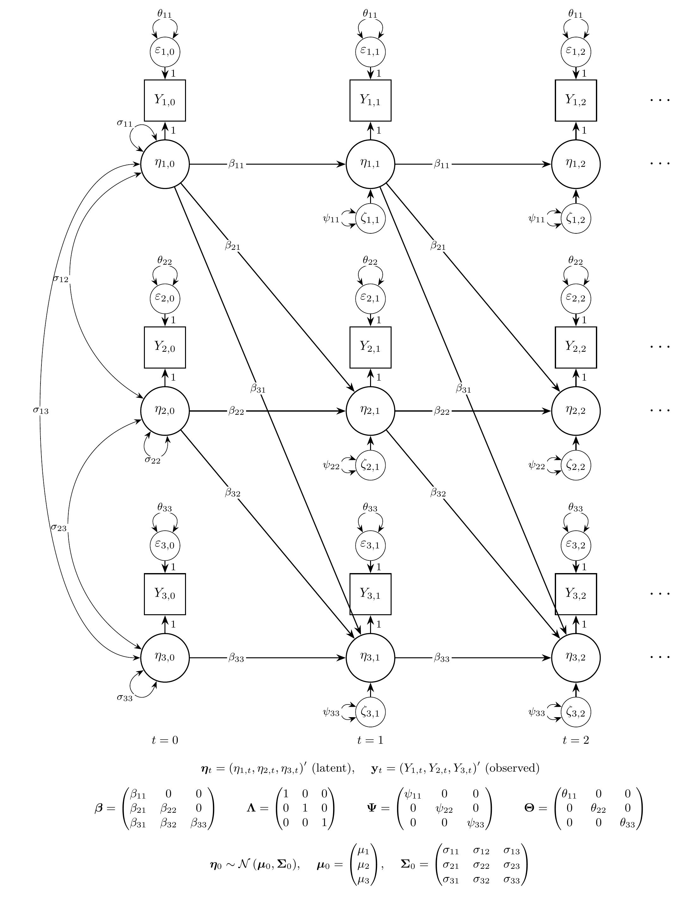
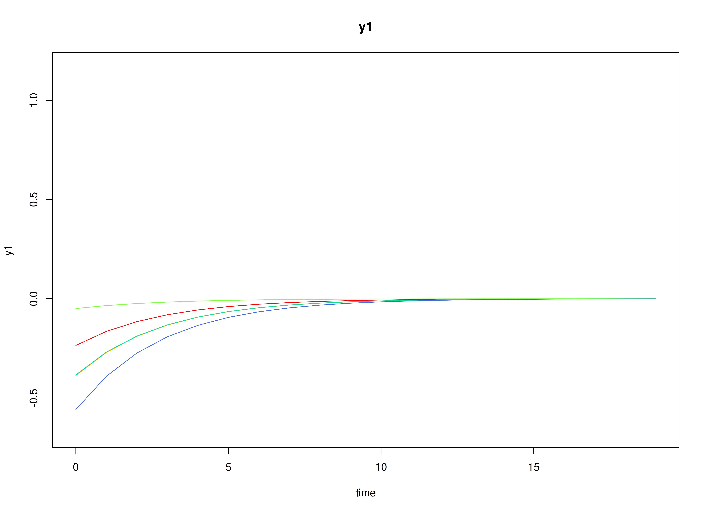
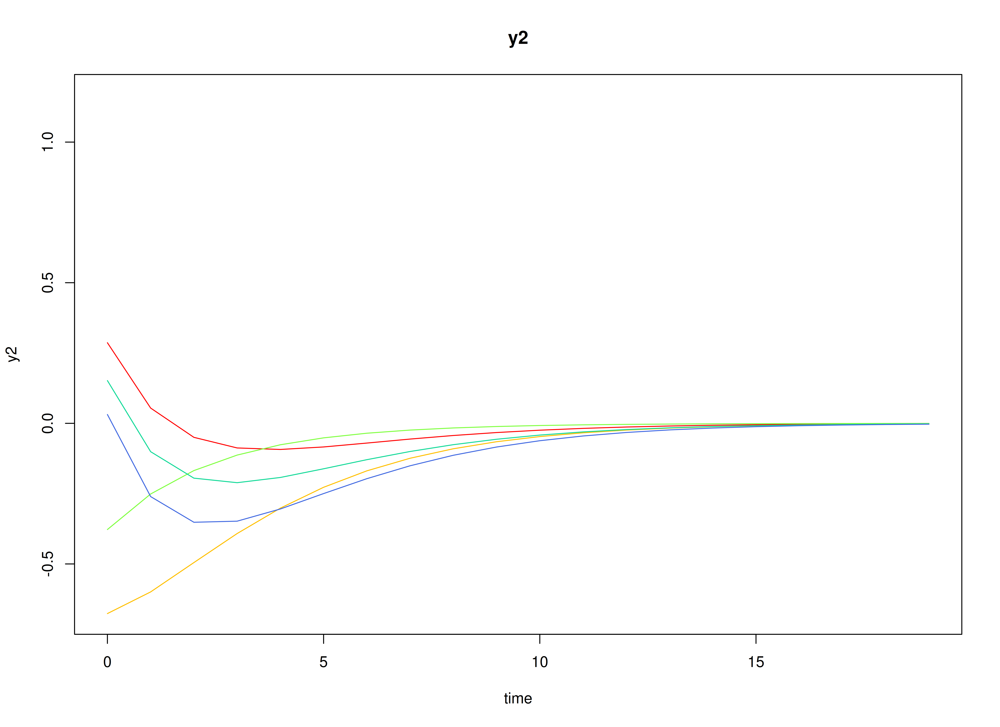
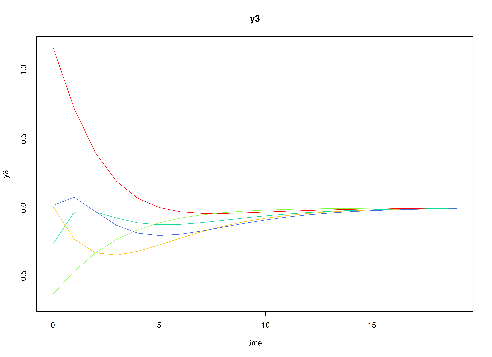
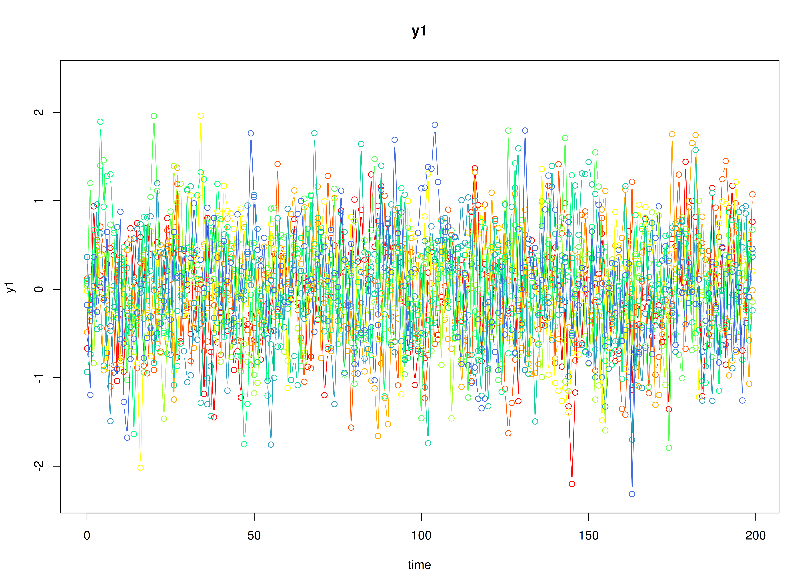
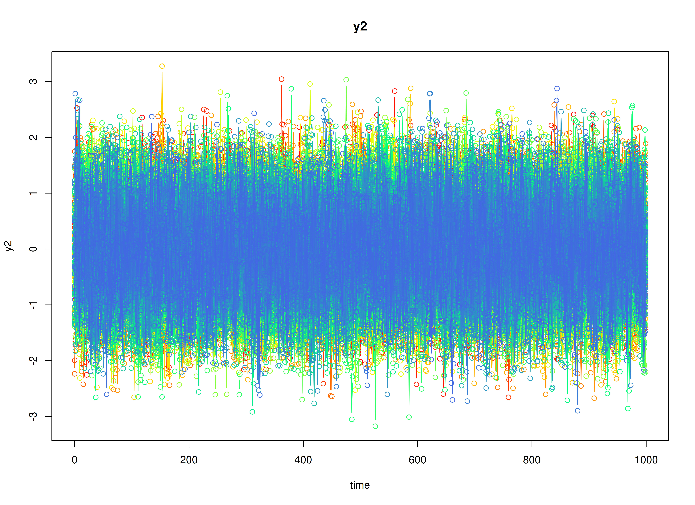
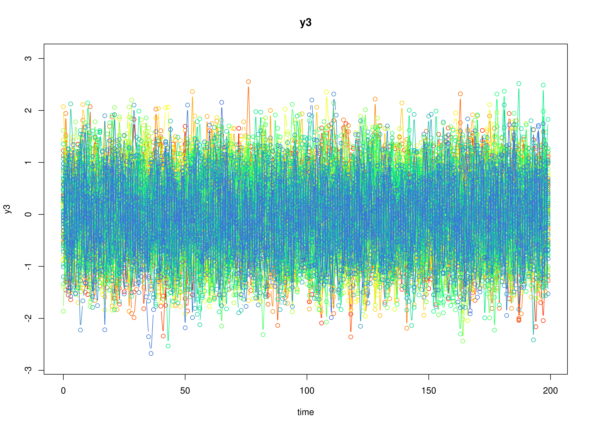
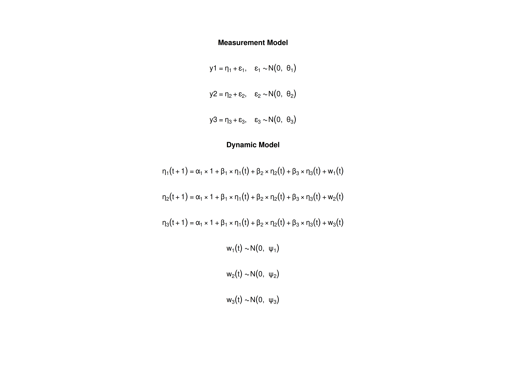

## Overview

A state space model describes variables that we cannot observe directly
(latent states) and how they change over time,
using repeated, error-prone measurements of them.
It has two parts:
a measurement model that links the observed variables to the latent states,
and a dynamic model that describes how the latent states
carry over and influence each other from one occasion to the next.

This tutorial does three things:

1. It writes a state space model
   with a first-order vector autoregressive dynamic model.
2. It simulates data from the model with `SimSSMFixed()`,
   with every individual sharing the same parameters.
3. It fits the model to the simulated data
   with the `dynr` and `OpenMx` packages
   and compares both sets of estimates with the values used to simulate the data.

No prior knowledge of state space models is needed.
If the model without measurement error is enough for you,
see the vignette on the vector autoregressive model.


## Model

The measurement model is given by
$$
  \mathbf{y}_{i, t}
  =
  \boldsymbol{\nu}
  +
  \boldsymbol{\Lambda}
  \boldsymbol{\eta}_{i, t}
  +
  \boldsymbol{\varepsilon}_{i, t},
  \quad
  \mathrm{with}
  \quad
  \boldsymbol{\varepsilon}_{i, t}
  \sim
  \mathcal{N}
  \left(
  \mathbf{0},
  \boldsymbol{\Theta}
  \right)
$$
where
$\mathbf{y}_{i, t}$,
$\boldsymbol{\eta}_{i, t}$,
and
$\boldsymbol{\varepsilon}_{i, t}$
are random variables
and
$\boldsymbol{\nu}$,
$\boldsymbol{\Lambda}$,
and
$\boldsymbol{\Theta}$
are model parameters.
$\mathbf{y}_{i, t}$
represents a vector of observed random variables,
$\boldsymbol{\eta}_{i, t}$
a vector of latent random variables,
and
$\boldsymbol{\varepsilon}_{i, t}$
a vector of random measurement errors,
at time $t$ and individual $i$.
$\boldsymbol{\nu}$
denotes a vector of intercepts,
$\boldsymbol{\Lambda}$
a matrix of factor loadings,
and
$\boldsymbol{\Theta}$
the covariance matrix of
$\boldsymbol{\varepsilon}$.

In words,
each observed variable is an intercept
plus a weighted combination of the latent variables
plus measurement error.
The latent variables $\boldsymbol{\eta}_{i, t}$
are the quantities we care about (for example, a person's true stress level),
and the observed variables $\mathbf{y}_{i, t}$
are noisy measurements of them.
Separating measurement error from true change is
the main reason to use a state space model:
measurement error affects only the occasion it occurs on,
while changes in the latent variables carry over in time.

An alternative representation of the measurement error
is given by
$$
  \boldsymbol{\varepsilon}_{i, t}
  =
  \boldsymbol{\Theta}^{\frac{1}{2}}
  \mathbf{z}_{i, t},
  \quad
  \mathrm{with}
  \quad
  \mathbf{z}_{i, t}
  \sim
  \mathcal{N}
  \left(
  \mathbf{0},
  \mathbf{I}
  \right)
$$
where
$\mathbf{z}_{i, t}$ is a vector of
independent standard normal random variables and
$\left( \boldsymbol{\Theta}^{\frac{1}{2}} \right) \left( \boldsymbol{\Theta}^{\frac{1}{2}} \right)^{\prime} = \boldsymbol{\Theta}$ .

The dynamic structure is given by
$$
  \boldsymbol{\eta}_{i, t}
  =
  \boldsymbol{\alpha}
  +
  \boldsymbol{\beta}
  \boldsymbol{\eta}_{i, t - 1}
  +
  \boldsymbol{\zeta}_{i, t},
  \quad
  \mathrm{with}
  \quad
  \boldsymbol{\zeta}_{i, t}
  \sim
  \mathcal{N}
  \left(
  \mathbf{0},
  \boldsymbol{\Psi}
  \right)
$$
where
$\boldsymbol{\eta}_{i, t}$,
$\boldsymbol{\eta}_{i, t - 1}$,
and
$\boldsymbol{\zeta}_{i, t}$
are random variables,
and
$\boldsymbol{\alpha}$,
$\boldsymbol{\beta}$,
and
$\boldsymbol{\Psi}$
are model parameters.
Here,
$\boldsymbol{\eta}_{i, t}$
is a vector of latent variables
at time $t$ and individual $i$,
$\boldsymbol{\eta}_{i, t - 1}$
represents a vector of latent variables
at time $t - 1$ and individual $i$,
and
$\boldsymbol{\zeta}_{i, t}$
represents a vector of dynamic noise
at time $t$ and individual $i$.
$\boldsymbol{\alpha}$
denotes a vector of intercepts,
$\boldsymbol{\beta}$
a matrix of autoregression
and cross regression coefficients,
and
$\boldsymbol{\Psi}$
the covariance matrix of
$\boldsymbol{\zeta}_{i, t}$.

In words,
each latent variable at time $t$ is a weighted sum of all the latent variables
at time $t - 1$, plus an intercept and a random shock.
The weights are the elements of $\boldsymbol{\beta}$:

- A diagonal element $\beta_{jj}$ is the autoregressive effect,
  how much of variable $j$ carries over to the next occasion.
  Values closer to 1 mean the variable changes slowly (high inertia).
- An off-diagonal element $\beta_{jk}$ is the cross-lagged effect
  of variable $k$ at time $t - 1$ on variable $j$ at time $t$.
  Note the order: the row is the outcome, the column is the predictor.

The shocks $\boldsymbol{\zeta}_{i, t}$ stand for everything
that moves the latent variables that the model does not explain.
Unlike measurement error, a shock carries over to later occasions
through $\boldsymbol{\beta}$.
For the process to settle around a stable mean,
all eigenvalues of $\boldsymbol{\beta}$ must have modulus less than 1.

An alternative representation of the dynamic noise
is given by
$$
  \boldsymbol{\zeta}_{i, t}
  =
  \boldsymbol{\Psi}^{\frac{1}{2}}
  \mathbf{z}_{i, t},
  \quad
  \mathrm{with}
  \quad
  \mathbf{z}_{i, t}
  \sim
  \mathcal{N}
  \left(
  \mathbf{0},
  \mathbf{I}
  \right)
$$
where
$\left( \boldsymbol{\Psi}^{\frac{1}{2}} \right) \left( \boldsymbol{\Psi}^{\frac{1}{2}} \right)^{\prime} = \boldsymbol{\Psi}$ .
This is how both kinds of noise are simulated:
independent standard normal draws are multiplied by
a square root of the covariance matrix.
The functions in `simStateSpace` take this square root,
the lower triangular Cholesky factor,
as the arguments `psi_l` (for $\boldsymbol{\Psi}$)
and `theta_l` (for $\boldsymbol{\Theta}$).

### Diagram


{width=100%}

The model in state space form, for the first three occasions ($t = 0, 1, 2$), with every element of the state drawn.
Squares are observed variables and circles are latent variables.
Each latent variable $\eta_{j, t}$ has one indicator $Y_{j, t}$ with a loading of 1, and measurement error $\varepsilon_{j, t}$ with variance $\theta_{jj}$.
The horizontal arrows are the autoregressive effects and the diagonal arrows the cross-lagged effects, the elements of $\boldsymbol{\beta}$; only the nonzero elements in this example are drawn ($\eta_{1}$ affects $\eta_{2}$ and $\eta_{3}$, and $\eta_{2}$ affects $\eta_{3}$).
$\zeta_{j, t}$ is the process noise, with variance $\psi_{jj}$, from $t = 1$ on.
A loop on a variable is its variance and a curved two-headed arrow a covariance.
At $t = 0$, the initial condition $\boldsymbol{\eta}_{0} \sim \mathcal{N} \left( \boldsymbol{\mu}_{0}, \boldsymbol{\Sigma}_{0} \right)$ gives the variances $\sigma_{jj}$ and covariances $\sigma_{jk}$ of the latent variables.
Below the diagram, all the latent variables at one occasion form the state vector $\boldsymbol{\eta}_{t}$, and all the observed variables form $\mathbf{y}_{t}$:
$\boldsymbol{\beta}$ carries the state from one occasion to the next, $\boldsymbol{\Lambda}$ maps the state to the observed variables, $\boldsymbol{\Psi}$ is the covariance matrix of the process noise $\boldsymbol{\zeta}_{t}$, and $\boldsymbol{\Theta}$ the covariance matrix of the measurement error $\boldsymbol{\varepsilon}_{t}$.
`SimSSMFixed()` takes `beta`, `lambda`, `mu0`, and the Cholesky factors of $\boldsymbol{\Psi}$, $\boldsymbol{\Theta}$, and $\boldsymbol{\Sigma}_{0}$ (`psi_l`, `theta_l`, and `sigma0_l`).

## Data Generation

### Notation

Let $t = 1000$ be the number of time points and $n = 100$ be the number of individuals.

Let the measurement model intercept vector $\boldsymbol{\nu}$ be given by

$$
\boldsymbol{\nu}
=
\left(
\begin{array}{c}
  0 \\
  0 \\
  0 \\
\end{array}
\right) .
$$

Let the factor loadings matrix $\boldsymbol{\Lambda}$ be given by

$$
\boldsymbol{\Lambda}
=
\left(
\begin{array}{ccc}
  1 & 0 & 0 \\
  0 & 1 & 0 \\
  0 & 0 & 1 \\
\end{array}
\right) .
$$

Let the measurement error covariance matrix $\boldsymbol{\Theta}$ be given by

$$
\boldsymbol{\Theta}
=
\left(
\begin{array}{ccc}
  0.2 & 0 & 0 \\
  0 & 0.2 & 0 \\
  0 & 0 & 0.2 \\
\end{array}
\right) .
$$

With $\boldsymbol{\nu} = \mathbf{0}$ and $\boldsymbol{\Lambda} = \mathbf{I}$,
each observed variable measures one latent variable,
and $\boldsymbol{\Theta}$ adds measurement error with variance
0.2 to each.

Let the initial condition
$\boldsymbol{\eta}_{0}$
be given by

$$
\boldsymbol{\eta}_{0} \sim \mathcal{N} \left( \boldsymbol{\mu}_{0}, \boldsymbol{\Sigma}_{0} \right)
$$

$$
\boldsymbol{\mu}_{0}
=
\left(
\begin{array}{c}
  0 \\
  0 \\
  0 \\
\end{array}
\right)
$$

$$
\boldsymbol{\Sigma}_{0}
=
\left(
\begin{array}{ccc}
  0.1960784 & 0.1183232 & 0.0298539 \\
  0.1183232 & 0.3437711 & 0.1381855 \\
  0.0298539 & 0.1381855 & 0.2663828 \\
\end{array}
\right) .
$$

Let the constant vector $\boldsymbol{\alpha}$ be given by

$$
\boldsymbol{\alpha}
=
\left(
\begin{array}{c}
  0 \\
  0 \\
  0 \\
\end{array}
\right) .
$$

Let the transition matrix $\boldsymbol{\beta}$ be given by

$$
\boldsymbol{\beta}
=
\left(
\begin{array}{ccc}
  0.7 & 0 & 0 \\
  0.5 & 0.6 & 0 \\
  -0.1 & 0.4 & 0.5 \\
\end{array}
\right) .
$$

Read the columns as predictors and the rows as outcomes.
Each variable carries over to the next occasion
(autoregressive effects
0.7, 0.6, and 0.5).
In addition, $\eta_{1}$ predicts later $\eta_{2}$ (0.5),
$\eta_{2}$ predicts later $\eta_{3}$ (0.4),
and $\eta_{1}$ has a small negative effect on later $\eta_{3}$ (-0.1).
Because $\boldsymbol{\beta}$ is lower triangular,
its eigenvalues are its diagonal elements, all less than 1,
so the process is stable.

Let the dynamic process noise $\boldsymbol{\Psi}$ be given by

$$
\boldsymbol{\Psi}
=
\left(
\begin{array}{ccc}
  0.1 & 0 & 0 \\
  0 & 0.1 & 0 \\
  0 & 0 & 0.1 \\
\end{array}
\right) .
$$

The initial condition describes where each individual starts.
Here, the mean vector and covariance matrix of $\boldsymbol{\eta}_{0}$
are the model-implied mean and covariance of the stable process,
computed with `SSMMeanEta()` and `SSMCovEta()`,
so the data are stationary from the first time point.

### R Function Arguments

The simulation functions take covariance matrices
as lower triangular Cholesky factors (the arguments ending in `_l`).


``` r
n
#> [1] 100
time
#> [1] 1000
mu0
#> [1] 0 0 0
sigma0
#>            [,1]      [,2]       [,3]
#> [1,] 0.19607843 0.1183232 0.02985385
#> [2,] 0.11832319 0.3437711 0.13818551
#> [3,] 0.02985385 0.1381855 0.26638284
sigma0_l # sigma0_l <- t(chol(sigma0))
#>            [,1]      [,2]     [,3]
#> [1,] 0.44280744 0.0000000 0.000000
#> [2,] 0.26721139 0.5218900 0.000000
#> [3,] 0.06741949 0.2302597 0.456966
alpha
#> [1] 0 0 0
beta
#>      [,1] [,2] [,3]
#> [1,]  0.7  0.0  0.0
#> [2,]  0.5  0.6  0.0
#> [3,] -0.1  0.4  0.5
psi
#>      [,1] [,2] [,3]
#> [1,]  0.1  0.0  0.0
#> [2,]  0.0  0.1  0.0
#> [3,]  0.0  0.0  0.1
psi_l # psi_l <- t(chol(psi))
#>           [,1]      [,2]      [,3]
#> [1,] 0.3162278 0.0000000 0.0000000
#> [2,] 0.0000000 0.3162278 0.0000000
#> [3,] 0.0000000 0.0000000 0.3162278
nu
#> [1] 0 0 0
lambda
#>      [,1] [,2] [,3]
#> [1,]    1    0    0
#> [2,]    0    1    0
#> [3,]    0    0    1
theta
#>      [,1] [,2] [,3]
#> [1,]  0.2  0.0  0.0
#> [2,]  0.0  0.2  0.0
#> [3,]  0.0  0.0  0.2
theta_l # theta_l <- t(chol(theta))
#>           [,1]      [,2]      [,3]
#> [1,] 0.4472136 0.0000000 0.0000000
#> [2,] 0.0000000 0.4472136 0.0000000
#> [3,] 0.0000000 0.0000000 0.4472136
```

### Visualizing the Dynamics Without Process Noise (n = 5 with Different Initial Condition)

To see what $\boldsymbol{\beta}$ alone does,
we first simulate five individuals with the process noise
and the measurement error set to zero.
Each individual starts at a different point,
and the trajectories return to the mean at a speed set by $\boldsymbol{\beta}$.



### Using the `SimSSMFixed` Function from the `simStateSpace` Package to Simulate Data

Now we add the process noise and the measurement error
and simulate the full data set.
`as.data.frame()` returns the data in long format,
one row per individual and time point,
with the columns `id`, `time`, `y1`, `y2`, and `y3`.


``` r
library(simStateSpace)
sim <- SimSSMFixed(
  n = n,
  time = time,
  mu0 = mu0,
  sigma0_l = sigma0_l,
  alpha = alpha,
  beta = beta,
  psi_l = psi_l,
  nu = nu,
  lambda = lambda,
  theta_l = theta_l,
  type = 0
)
data <- as.data.frame(sim)
head(data)
#>   id time          y1         y2         y3
#> 1  1    0 -0.66908807 0.16178434  0.2955693
#> 2  1    1 -0.23021811 0.22873073 -0.2540210
#> 3  1    2  0.93689389 0.09496693 -0.9267506
#> 4  1    3  0.04445794 0.67521289 -0.1792168
#> 5  1    4  0.15413707 0.82591676  0.8976536
#> 6  1    5 -0.09943698 0.67154173  0.2853507
summary(data)
#>        id              time             y1                   y2            
#>  Min.   :  1.00   Min.   :  0.0   Min.   :-2.8405340   Min.   :-3.1732718  
#>  1st Qu.: 25.75   1st Qu.:249.8   1st Qu.:-0.4213725   1st Qu.:-0.4999526  
#>  Median : 50.50   Median :499.5   Median :-0.0007939   Median : 0.0031390  
#>  Mean   : 50.50   Mean   :499.5   Mean   : 0.0001801   Mean   : 0.0009951  
#>  3rd Qu.: 75.25   3rd Qu.:749.2   3rd Qu.: 0.4236361   3rd Qu.: 0.4990295  
#>  Max.   :100.00   Max.   :999.0   Max.   : 2.6029049   Max.   : 3.2748708  
#>        y3           
#>  Min.   :-3.029883  
#>  1st Qu.:-0.455867  
#>  Median : 0.003032  
#>  Mean   : 0.003844  
#>  3rd Qu.: 0.465214  
#>  Max.   : 3.016221
plot(sim)
```



## Model Fitting

The same simulated data are fitted with two programs
that estimate state space models by maximum likelihood
with the Kalman filter: `dynr` and `OpenMx`.
The section Population Values and Estimates
compares their estimates with the population values.

### dynr

We fit the model with `dynr`,
which estimates state space models by maximum likelihood
using the Kalman filter.
The Kalman filter estimates the latent states occasion by occasion,
weighing the model's prediction against the new measurement.

A `dynr` model is built from pieces that match the equations above:
the data, the initial condition, the measurement model,
the dynamic model, and the noise.
Each parameter gets a name (for example, `beta_2_1` for $\beta_{21}$),
and the same name used in two places means one shared parameter.
The starting values are set to the population values for convenience;
with real data, they would be rough guesses.

#### Prepare Data

Tell `dynr` which columns hold the individual, the time, and the observed variables.


``` r
dynr_data <- dynr::dynr.data(
  data = data,
  id = "id",
  time = "time",
  observed = c("y1", "y2", "y3")
)
```

#### Prepare Initial Condition

The mean $\boldsymbol{\mu}_{0}$
and covariance $\boldsymbol{\Sigma}_{0}$
of the initial state are estimated.
The covariance matrix is symmetric,
so `sigma0_2_1` appears both above and below the diagonal.


``` r
dynr_initial <- dynr::prep.initial(
  values.inistate = mu0,
  params.inistate = c("mu0_1_1", "mu0_2_1", "mu0_3_1"),
  values.inicov = sigma0,
  params.inicov = matrix(
    data = c(
      "sigma0_1_1", "sigma0_2_1", "sigma0_3_1",
      "sigma0_2_1", "sigma0_2_2", "sigma0_3_2",
      "sigma0_3_1", "sigma0_3_2", "sigma0_3_3"
    ),
    nrow = 3
  )
)
```

#### Prepare Measurement Model

The loadings $\boldsymbol{\Lambda}$ are an identity matrix
with no free parameters (`"fixed"`).


``` r
dynr_measurement <- dynr::prep.measurement(
  values.load = diag(3),
  params.load = matrix(data = "fixed", nrow = 3, ncol = 3),
  state.names = c("eta_1", "eta_2", "eta_3"),
  obs.names = c("y1", "y2", "y3")
)
```

#### Prepare Dynamic Process

Each formula is one row of the dynamic equation:
the intercept $\alpha_{j}$ plus the effects $\beta_{jk}$ of the three latent variables
at the previous occasion.
`isContinuousTime = FALSE` makes this a discrete-time model.


``` r
dynr_dynamics <- dynr::prep.formulaDynamics(
  formula = list(
    eta_1 ~ alpha_1_1 * 1 + beta_1_1 * eta_1 + beta_1_2 * eta_2 + beta_1_3 * eta_3,
    eta_2 ~ alpha_2_1 * 1 + beta_2_1 * eta_1 + beta_2_2 * eta_2 + beta_2_3 * eta_3,
    eta_3 ~ alpha_3_1 * 1 + beta_3_1 * eta_1 + beta_3_2 * eta_2 + beta_3_3 * eta_3
  ),
  startval = c(
    alpha_1_1 = alpha[1], alpha_2_1 = alpha[2], alpha_3_1 = alpha[3],
    beta_1_1 = beta[1, 1], beta_1_2 = beta[1, 2], beta_1_3 = beta[1, 3],
    beta_2_1 = beta[2, 1], beta_2_2 = beta[2, 2], beta_2_3 = beta[2, 3],
    beta_3_1 = beta[3, 1], beta_3_2 = beta[3, 2], beta_3_3 = beta[3, 3]
  ),
  isContinuousTime = FALSE
)
```

#### Prepare Process Noise

The process noise covariance $\boldsymbol{\Psi}$ is estimated in full.
The measurement error covariance $\boldsymbol{\Theta}$ is diagonal:
the three error variances are estimated,
and the error covariances are fixed at zero.


``` r
dynr_noise <- dynr::prep.noise(
  values.latent = psi,
  params.latent = matrix(
    data = c(
      "psi_1_1", "psi_2_1", "psi_3_1",
      "psi_2_1", "psi_2_2", "psi_3_2",
      "psi_3_1", "psi_3_2", "psi_3_3"
    ),
    nrow = 3
  ),
  values.observed = theta,
  params.observed = matrix(
    data = c(
      "theta_1_1", "fixed", "fixed",
      "fixed", "theta_2_2", "fixed",
      "fixed", "fixed", "theta_3_3"
    ),
    nrow = 3
  )
)
```

#### Prepare the Model

The pieces are put together into one model.
`dynr` writes the model as C code to `outfile` and compiles it.


``` r
model <- dynr::dynr.model(
  data = dynr_data,
  initial = dynr_initial,
  measurement = dynr_measurement,
  dynamics = dynr_dynamics,
  noise = dynr_noise,
  outfile = "ssm.c"
)
```

The plot below shows the model equations with the parameter names.



#### Fit the Model


``` r
results <- dynr::dynr.cook(
  model,
  debug_flag = TRUE,
  verbose = FALSE
)
#> [1] "Get ready!!!!"
#> using C compiler: ‘gcc (Ubuntu 15.2.0-16ubuntu1) 15.2.0’
#> Optimization function called.
#> Starting Hessian calculation ...
#> Finished Hessian calculation.
#> Original exit flag:  3 
#> Modified exit flag:  3 
#> Optimization terminated successfully: ftol_rel or ftol_abs was reached. 
#> Original fitted parameters:  0.00008625105 0.0004086113 0.001471603 0.7080791 
#> 0.0006374173 0.00001946859 0.5065289 0.5921055 0.004164592 -0.1007597 0.3952978 
#> 0.5017908 -2.338339 -0.002554286 -0.00342373 -2.267178 -0.001514531 -2.321312 
#> -1.602984 -1.621672 -1.596002 -0.02756059 -0.08560146 0.01939691 -1.476967 
#> 0.5750841 0.269864 -1.120811 0.2716346 -1.630752 
#> 
#> Transformed fitted parameters:  0.00008625105 0.0004086113 0.001471603 
#> 0.7080791 0.0006374173 0.00001946859 0.5065289 0.5921055 0.004164592 -0.1007597 
#> 0.3952978 0.5017908 0.09648776 -0.0002464574 -0.000330348 0.1036048 
#> -0.0001560678 0.09814614 0.201295 0.1975681 0.2027053 -0.02756059 -0.08560146 
#> 0.01939691 0.2283291 0.1313084 0.06161779 0.4015287 0.1239924 0.2364658 
#> 
#> Doing end processing
#> Successful trial
#> Total Time: 24.56916 
#> Backend Time: 24.55796
```

#### Summary

The summary lists each estimate with its standard error,
$t$ value, confidence interval, and $p$ value.


``` r
summary(results)
#> Coefficients:
#>               Estimate  Std. Error t value    ci.lower    ci.upper
#> alpha_1_1   0.00008625  0.00106731   0.081 -0.00200563  0.00217813
#> alpha_2_1   0.00040861  0.00137288   0.298 -0.00228219  0.00309941
#> alpha_3_1   0.00147160  0.00134818   1.092 -0.00117077  0.00411398
#> beta_1_1    0.70807911  0.00948552  74.648  0.68948782  0.72667039
#> beta_1_2    0.00063742  0.00588291   0.108 -0.01089288  0.01216771
#> beta_1_3    0.00001947  0.00435669   0.004 -0.00851950  0.00855843
#> beta_2_1    0.50652887  0.01034061  48.984  0.48626164  0.52679609
#> beta_2_2    0.59210547  0.00801839  73.843  0.57638972  0.60782122
#> beta_2_3    0.00416459  0.00567567   0.734 -0.00695952  0.01528871
#> beta_3_1   -0.10075974  0.00748914 -13.454 -0.11543818 -0.08608130
#> beta_3_2    0.39529780  0.00730401  54.121  0.38098220  0.40961340
#> beta_3_3    0.50179084  0.00699272  71.759  0.48808537  0.51549631
#> psi_1_1     0.09648776  0.00300222  32.139  0.09060352  0.10237200
#> psi_2_1    -0.00024646  0.00110706  -0.223 -0.00241625  0.00192333
#> psi_3_1    -0.00033035  0.00103558  -0.319 -0.00236005  0.00169935
#> psi_2_2     0.10360478  0.00262521  39.465  0.09845946  0.10875010
#> psi_3_2    -0.00015607  0.00104800  -0.149 -0.00221011  0.00189797
#> psi_3_3     0.09814614  0.00301334  32.571  0.09224010  0.10405217
#> theta_1_1   0.20129500  0.00254190  79.191  0.19631298  0.20627703
#> theta_2_2   0.19756809  0.00256709  76.962  0.19253669  0.20259948
#> theta_3_3   0.20270526  0.00304558  66.557  0.19673605  0.20867448
#> mu0_1_1    -0.02756059  0.05920469  -0.466 -0.14359966  0.08847848
#> mu0_2_1    -0.08560146  0.07429398  -1.152 -0.23121497  0.06001206
#> mu0_3_1     0.01939691  0.06467747   0.300 -0.10736859  0.14616242
#> sigma0_1_1  0.22832906  0.04921841   4.639  0.13186275  0.32479537
#> sigma0_2_1  0.13130841  0.04730066   2.776  0.03860081  0.22401600
#> sigma0_3_1  0.06161779  0.03861865   1.596 -0.01407337  0.13730896
#> sigma0_2_2  0.40152865  0.08081435   4.969  0.24313544  0.55992187
#> sigma0_3_2  0.12399243  0.05004087   2.478  0.02591413  0.22207073
#> sigma0_3_3  0.23646577  0.06004556   3.938  0.11877863  0.35415292
#>                       Pr(>|t|)    
#> alpha_1_1               0.4678    
#> alpha_2_1               0.3830    
#> alpha_3_1               0.1375    
#> beta_1_1   <0.0000000000000002 ***
#> beta_1_2                0.4569    
#> beta_1_3                0.4982    
#> beta_2_1   <0.0000000000000002 ***
#> beta_2_2   <0.0000000000000002 ***
#> beta_2_3                0.2315    
#> beta_3_1   <0.0000000000000002 ***
#> beta_3_2   <0.0000000000000002 ***
#> beta_3_3   <0.0000000000000002 ***
#> psi_1_1    <0.0000000000000002 ***
#> psi_2_1                 0.4119    
#> psi_3_1                 0.3749    
#> psi_2_2    <0.0000000000000002 ***
#> psi_3_2                 0.4408    
#> psi_3_3    <0.0000000000000002 ***
#> theta_1_1  <0.0000000000000002 ***
#> theta_2_2  <0.0000000000000002 ***
#> theta_3_3  <0.0000000000000002 ***
#> mu0_1_1                 0.3208    
#> mu0_2_1                 0.1246    
#> mu0_3_1                 0.3821    
#> sigma0_1_1 <0.0000000000000002 ***
#> sigma0_2_1              0.0028 ** 
#> sigma0_3_1              0.0553 .  
#> sigma0_2_2 <0.0000000000000002 ***
#> sigma0_3_2              0.0066 ** 
#> sigma0_3_3 <0.0000000000000002 ***
#> ---
#> Signif. codes:  0 '***' 0.001 '**' 0.01 '*' 0.05 '.' 0.1 ' ' 1
#> 
#> -2 log-likelihood value at convergence = 530766.20
#> AIC = 530826.20
#> BIC = 531111.59
```

### OpenMx: State Space Model

`OpenMx` [@Neale-Hunter-Pritikin-etal-2016] fits the same state space model
with its own Kalman filter (`OpenMx::mxExpectationStateSpace()`; @Hunter-2018).
Its matrices have the names used in engineering:
`A` is the transition matrix $\boldsymbol{\beta}$,
`B` holds the intercepts of the dynamic model,
`C` is the loading matrix $\boldsymbol{\Lambda}$,
`D` holds the intercepts of the measurement model,
`Q` is the process noise covariance matrix,
and `R` is the measurement error covariance matrix.
The parameter labels are the dynr names;
as in dynr, a label used in two places is one shared parameter,
and the starting values are the population values.

Two details differ from dynr.
First, OpenMx reads the data as a single time series.
To start the filter again at the first occasion of every individual,
each individual gets a group,
and all groups use the matrices of one parent model,
so every individual has the same parameters.
Second, OpenMx starts the filter one occasion before the first row,
so the first row has the state mean $\mathbf{A} \mathbf{x}_{0} + \mathbf{B} \mathbf{u}$
and the state covariance $\mathbf{A} \mathbf{P}_{0} \mathbf{A}^{\prime} + \mathbf{Q}$,
with the constant input $\mathbf{u} = 1$.
Setting
$\mathbf{x}_{0} = \mathbf{A}^{-1} \left( \boldsymbol{\mu}_{0} - \mathbf{B} \mathbf{u} \right)$
and
$\mathbf{P}_{0} = \mathbf{A}^{-1} \left( \boldsymbol{\Sigma}_{0} - \mathbf{Q} \right) \left( \mathbf{A}^{-1} \right)^{\prime}$
gives the first occasion the initial condition of the model,
so the likelihood is the same as in dynr.
This needs an invertible $\mathbf{A}$, which holds here.

The two helper functions below are the same in every vignette of the package.
`MxMat()` makes an OpenMx matrix from values and dynr-style labels
(`"fixed"` marks a fixed element),
and `FitMxSSM()` builds the groups and fits the model.


``` r
MxMat <- function(values, labels, name) {
  values <- as.matrix(values)
  labels <- matrix(
    data = labels,
    nrow = nrow(values),
    ncol = ncol(values)
  )
  free <- labels != "fixed"
  labels[!free] <- NA
  OpenMx::mxMatrix(
    type = "Full",
    values = values,
    free = free,
    labels = labels,
    name = name
  )
}
FitMxSSM <- function(data, observed, matrices, name) {
  # the groups refer to the matrices of the parent model
  shared <- function(x) {
    paste0(name, ".", x)
  }
  expectation <- OpenMx::mxExpectationStateSpace(
    A = shared("A"),
    B = shared("B"),
    C = shared("C"),
    D = shared("D"),
    Q = shared("Q"),
    R = shared("R"),
    x0 = shared("x0"),
    P0 = shared("P0"),
    u = shared("u")
  )
  # OpenMx needs the names of the observed variables and of the states on C
  for (i in seq_along(matrices)) {
    if (matrices[[i]]$name == "C") {
      dimnames(matrices[[i]]) <- list(
        observed,
        paste0("eta_", seq_len(ncol(matrices[[i]]$values)))
      )
    }
  }
  persons <- split(
    x = data[, observed, drop = FALSE],
    f = data[, "id"]
  )
  groups <- paste0("id_", names(persons))
  submodels <- lapply(
    X = seq_along(persons),
    FUN = function(i) {
      OpenMx::mxModel(
        name = groups[i],
        expectation,
        OpenMx::mxFitFunctionML(),
        OpenMx::mxData(
          observed = persons[[i]],
          type = "raw"
        )
      )
    }
  )
  model <- OpenMx::mxModel(
    name = name,
    matrices,
    OpenMx::mxMatrix(
      type = "Unit",
      nrow = 1,
      ncol = 1,
      name = "u"
    ),
    # the first occasion gets the initial condition of the model
    OpenMx::mxAlgebra(
      expression = solve(A) %*% (mu0 - B %*% u),
      name = "x0"
    ),
    OpenMx::mxAlgebra(
      expression = solve(A) %*% (sigma0 - Q) %*% t(solve(A)),
      name = "P0"
    ),
    submodels,
    OpenMx::mxFitFunctionMultigroup(groups = groups)
  )
  # retries from perturbed starting values only if the first run fails
  OpenMx::mxTryHard(
    model = model,
    extraTries = 5,
    silent = TRUE
  )
}
```

The matrices of the model, with the dynr labels.


``` r
labels_beta <- matrix(
  data = c(
    "beta_1_1", "beta_2_1", "beta_3_1",
    "beta_1_2", "beta_2_2", "beta_3_2",
    "beta_1_3", "beta_2_3", "beta_3_3"
  ),
  nrow = 3
)
labels_psi <- matrix(
  data = c(
    "psi_1_1", "psi_2_1", "psi_3_1",
    "psi_2_1", "psi_2_2", "psi_3_2",
    "psi_3_1", "psi_3_2", "psi_3_3"
  ),
  nrow = 3
)
labels_theta <- matrix(
  data = c(
    "theta_1_1", "fixed", "fixed",
    "fixed", "theta_2_2", "fixed",
    "fixed", "fixed", "theta_3_3"
  ),
  nrow = 3
)
labels_sigma0 <- matrix(
  data = c(
    "sigma0_1_1", "sigma0_2_1", "sigma0_3_1",
    "sigma0_2_1", "sigma0_2_2", "sigma0_3_2",
    "sigma0_3_1", "sigma0_3_2", "sigma0_3_3"
  ),
  nrow = 3
)
mx_matrices <- list(
  MxMat(values = beta, labels = labels_beta, name = "A"),
  MxMat(
    values = alpha,
    labels = c("alpha_1_1", "alpha_2_1", "alpha_3_1"),
    name = "B"
  ),
  MxMat(values = lambda, labels = "fixed", name = "C"),
  MxMat(values = nu, labels = "fixed", name = "D"),
  MxMat(values = psi, labels = labels_psi, name = "Q"),
  MxMat(values = theta, labels = labels_theta, name = "R"),
  MxMat(
    values = mu0,
    labels = c("mu0_1_1", "mu0_2_1", "mu0_3_1"),
    name = "mu0"
  ),
  MxMat(values = sigma0, labels = labels_sigma0, name = "sigma0")
)
```


``` r
fit_mx_ssm <- FitMxSSM(
  data = data,
  observed = c("y1", "y2", "y3"),
  matrices = mx_matrices,
  name = "ssm"
)
#> 
Beginning initial fit attempt
Fit attempt 0, fit=530766.196230886, new current best! (was 530781.853350924)
                                                                             
#> 
#>  Solution found!  Final fit=530766.2 (started at 530781.85)  (1 attempt(s): 1 valid, 0 errors)
summary(fit_mx_ssm)
#> Summary of ssm 
#>  
#> free parameters:
#>          name matrix row col       Estimate   Std.Error A
#> 1    beta_1_1      A   1   1  0.70820600495 0.009506777  
#> 2    beta_2_1      A   2   1  0.50653273042 0.010333789  
#> 3    beta_3_1      A   3   1 -0.10082567410 0.007427159  
#> 4    beta_1_2      A   1   2  0.00059307014 0.005894001  
#> 5    beta_2_2      A   2   2  0.59221126132 0.007984456  
#> 6    beta_3_2      A   3   2  0.39540216239 0.007257315  
#> 7    beta_1_3      A   1   3  0.00004381968 0.004357350  
#> 8    beta_2_3      A   2   3  0.00410472783 0.005652296  
#> 9    beta_3_3      A   3   3  0.50176087727 0.006967038  
#> 10  alpha_1_1      B   1   1  0.00012368270 0.001067073  
#> 11  alpha_2_1      B   2   1  0.00043130621 0.001372620  
#> 12  alpha_3_1      B   3   1  0.00151562714 0.001348151  
#> 13    psi_1_1      Q   1   1  0.09644858831 0.003008886  
#> 14    psi_2_1      Q   2   1 -0.00024483333 0.001103263  
#> 15    psi_3_1      Q   3   1 -0.00032642196 0.001028791  
#> 16    psi_2_2      Q   2   2  0.10355436288 0.002600437  
#> 17    psi_3_2      Q   3   2 -0.00015537353 0.001047698  
#> 18    psi_3_3      Q   3   3  0.09812572669 0.003010370  
#> 19  theta_1_1      R   1   1  0.20133014880 0.002546586  
#> 20  theta_2_2      R   2   2  0.19761653706 0.002546708  
#> 21  theta_3_3      R   3   3  0.20272812146 0.003043331  
#> 22    mu0_1_1    mu0   1   1 -0.02745063651 0.058750657  
#> 23    mu0_2_1    mu0   2   1 -0.08479258792 0.073412453  
#> 24    mu0_3_1    mu0   3   1  0.01894864509 0.063921608  
#> 25 sigma0_1_1 sigma0   1   1  0.22860264958 0.049158485  
#> 26 sigma0_2_1 sigma0   2   1  0.13137531397 0.044923230  
#> 27 sigma0_3_1 sigma0   3   1  0.06185999854 0.038335447  
#> 28 sigma0_2_2 sigma0   2   2  0.40213865074 0.076999197 !
#> 29 sigma0_3_2 sigma0   3   2  0.12399082263 0.048536265  
#> 30 sigma0_3_3 sigma0   3   3  0.23591513868 0.057781967 !
#> 
#> Model Statistics: 
#>                |  Parameters  |  Degrees of Freedom  |  Fit (-2lnL units)
#>        Model:             30                 299970              530766.2
#>    Saturated:             NA                     NA                    NA
#> Independence:             NA                     NA                    NA
#> Number of observations/statistics: 100000/300000
#> 
#> Information Criteria: 
#>       |  df Penalty  |  Parameters Penalty  |  Sample-Size Adjusted
#> AIC:       -69173.8               530826.2                 530826.2
#> BIC:     -2922766.1               531111.6                 531016.2
#> To get additional fit indices, see help(mxRefModels)
#> timestamp: 2026-11-05 07:15:58 
#> Wall clock time: 607.9137 secs 
#> optimizer:  SLSQP 
#> OpenMx version number: 2.22.11 
#> Need help?  See help(mxSummary)
```

## Population Values and Estimates

Each table below puts the population values used to simulate the data
next to the estimates of one method.
Bias is the estimate minus the population value.
Because each model is fitted to a single simulated data set,
this is the error of one estimate, not a Monte Carlo bias,
which would average over many replications.
The 95% confidence interval is the Wald interval,
$\hat{\theta} \pm 1.96 \times \mathrm{SE}$,
unless the caption says otherwise,
and `Covers` shows whether it contains the population value.
The parameter names are the dynr names in every table.


``` r
EstimatesTable <- function(population, estimate, se, ll = NULL, ul = NULL) {
  z <- stats::qnorm(p = 0.975)
  if (is.null(ll)) {
    ll <- estimate - z * se
  }
  if (is.null(ul)) {
    ul <- estimate + z * se
  }
  data.frame(
    Parameter = names(population),
    Population = unname(population),
    Estimate = unname(estimate),
    SE = unname(se),
    Bias = unname(estimate - population),
    `2.5%` = unname(ll),
    `97.5%` = unname(ul),
    Covers = unname(population >= ll & population <= ul),
    check.names = FALSE
  )
}
```


``` r
# the population value for each dynr parameter name,
# for example, "beta_1_2" is beta[1, 2] and "mu0_2_1" is mu0[2]
population <- vapply(
  X = strsplit(x = names(coef(results)), split = "_"),
  FUN = function(x) {
    as.matrix(get(x[1]))[as.integer(x[2]), as.integer(x[3])]
  },
  FUN.VALUE = numeric(1)
)
names(population) <- names(coef(results))
```

### dynr


``` r
dynr_est <- coef(results)
dynr_se <- sqrt(diag(vcov(results)))
knitr::kable(
  x = EstimatesTable(
    population = population,
    estimate = dynr_est[names(population)],
    se = dynr_se[names(population)]
  ),
  digits = 3,
  caption = "Population values and dynr estimates (one simulated data set)"
)
```


Table: Population values and dynr estimates (one simulated data set)

|Parameter  | Population| Estimate|    SE|   Bias|   2.5%|  97.5%|Covers |
|:----------|----------:|--------:|-----:|------:|------:|------:|:------|
|alpha_1_1  |      0.000|    0.000| 0.001|  0.000| -0.002|  0.002|TRUE   |
|alpha_2_1  |      0.000|    0.000| 0.001|  0.000| -0.002|  0.003|TRUE   |
|alpha_3_1  |      0.000|    0.001| 0.001|  0.001| -0.001|  0.004|TRUE   |
|beta_1_1   |      0.700|    0.708| 0.009|  0.008|  0.689|  0.727|TRUE   |
|beta_1_2   |      0.000|    0.001| 0.006|  0.001| -0.011|  0.012|TRUE   |
|beta_1_3   |      0.000|    0.000| 0.004|  0.000| -0.009|  0.009|TRUE   |
|beta_2_1   |      0.500|    0.507| 0.010|  0.007|  0.486|  0.527|TRUE   |
|beta_2_2   |      0.600|    0.592| 0.008| -0.008|  0.576|  0.608|TRUE   |
|beta_2_3   |      0.000|    0.004| 0.006|  0.004| -0.007|  0.015|TRUE   |
|beta_3_1   |     -0.100|   -0.101| 0.007| -0.001| -0.115| -0.086|TRUE   |
|beta_3_2   |      0.400|    0.395| 0.007| -0.005|  0.381|  0.410|TRUE   |
|beta_3_3   |      0.500|    0.502| 0.007|  0.002|  0.488|  0.515|TRUE   |
|psi_1_1    |      0.100|    0.096| 0.003| -0.004|  0.091|  0.102|TRUE   |
|psi_2_1    |      0.000|    0.000| 0.001|  0.000| -0.002|  0.002|TRUE   |
|psi_3_1    |      0.000|    0.000| 0.001|  0.000| -0.002|  0.002|TRUE   |
|psi_2_2    |      0.100|    0.104| 0.003|  0.004|  0.098|  0.109|TRUE   |
|psi_3_2    |      0.000|    0.000| 0.001|  0.000| -0.002|  0.002|TRUE   |
|psi_3_3    |      0.100|    0.098| 0.003| -0.002|  0.092|  0.104|TRUE   |
|theta_1_1  |      0.200|    0.201| 0.003|  0.001|  0.196|  0.206|TRUE   |
|theta_2_2  |      0.200|    0.198| 0.003| -0.002|  0.193|  0.203|TRUE   |
|theta_3_3  |      0.200|    0.203| 0.003|  0.003|  0.197|  0.209|TRUE   |
|mu0_1_1    |      0.000|   -0.028| 0.059| -0.028| -0.144|  0.088|TRUE   |
|mu0_2_1    |      0.000|   -0.086| 0.074| -0.086| -0.231|  0.060|TRUE   |
|mu0_3_1    |      0.000|    0.019| 0.065|  0.019| -0.107|  0.146|TRUE   |
|sigma0_1_1 |      0.196|    0.228| 0.049|  0.032|  0.132|  0.325|TRUE   |
|sigma0_2_1 |      0.118|    0.131| 0.047|  0.013|  0.039|  0.224|TRUE   |
|sigma0_3_1 |      0.030|    0.062| 0.039|  0.032| -0.014|  0.137|TRUE   |
|sigma0_2_2 |      0.344|    0.402| 0.081|  0.058|  0.243|  0.560|TRUE   |
|sigma0_3_2 |      0.138|    0.124| 0.050| -0.014|  0.026|  0.222|TRUE   |
|sigma0_3_3 |      0.266|    0.236| 0.060| -0.030|  0.119|  0.354|TRUE   |


### OpenMx: State Space Model


``` r
mx_ssm_est <- OpenMx::omxGetParameters(fit_mx_ssm)
mx_ssm_se <- fit_mx_ssm$output$standardErrors[, 1]
knitr::kable(
  x = EstimatesTable(
    population = population,
    estimate = mx_ssm_est[names(population)],
    se = mx_ssm_se[names(population)]
  ),
  digits = 3,
  caption = paste(
    "Population values and OpenMx state space estimates",
    "(one simulated data set)"
  )
)
```


Table: Population values and OpenMx state space estimates (one simulated data set)

|Parameter  | Population| Estimate|    SE|   Bias|   2.5%|  97.5%|Covers |
|:----------|----------:|--------:|-----:|------:|------:|------:|:------|
|alpha_1_1  |      0.000|    0.000| 0.001|  0.000| -0.002|  0.002|TRUE   |
|alpha_2_1  |      0.000|    0.000| 0.001|  0.000| -0.002|  0.003|TRUE   |
|alpha_3_1  |      0.000|    0.002| 0.001|  0.002| -0.001|  0.004|TRUE   |
|beta_1_1   |      0.700|    0.708| 0.010|  0.008|  0.690|  0.727|TRUE   |
|beta_1_2   |      0.000|    0.001| 0.006|  0.001| -0.011|  0.012|TRUE   |
|beta_1_3   |      0.000|    0.000| 0.004|  0.000| -0.008|  0.009|TRUE   |
|beta_2_1   |      0.500|    0.507| 0.010|  0.007|  0.486|  0.527|TRUE   |
|beta_2_2   |      0.600|    0.592| 0.008| -0.008|  0.577|  0.608|TRUE   |
|beta_2_3   |      0.000|    0.004| 0.006|  0.004| -0.007|  0.015|TRUE   |
|beta_3_1   |     -0.100|   -0.101| 0.007| -0.001| -0.115| -0.086|TRUE   |
|beta_3_2   |      0.400|    0.395| 0.007| -0.005|  0.381|  0.410|TRUE   |
|beta_3_3   |      0.500|    0.502| 0.007|  0.002|  0.488|  0.515|TRUE   |
|psi_1_1    |      0.100|    0.096| 0.003| -0.004|  0.091|  0.102|TRUE   |
|psi_2_1    |      0.000|    0.000| 0.001|  0.000| -0.002|  0.002|TRUE   |
|psi_3_1    |      0.000|    0.000| 0.001|  0.000| -0.002|  0.002|TRUE   |
|psi_2_2    |      0.100|    0.104| 0.003|  0.004|  0.098|  0.109|TRUE   |
|psi_3_2    |      0.000|    0.000| 0.001|  0.000| -0.002|  0.002|TRUE   |
|psi_3_3    |      0.100|    0.098| 0.003| -0.002|  0.092|  0.104|TRUE   |
|theta_1_1  |      0.200|    0.201| 0.003|  0.001|  0.196|  0.206|TRUE   |
|theta_2_2  |      0.200|    0.198| 0.003| -0.002|  0.193|  0.203|TRUE   |
|theta_3_3  |      0.200|    0.203| 0.003|  0.003|  0.197|  0.209|TRUE   |
|mu0_1_1    |      0.000|   -0.027| 0.059| -0.027| -0.143|  0.088|TRUE   |
|mu0_2_1    |      0.000|   -0.085| 0.073| -0.085| -0.229|  0.059|TRUE   |
|mu0_3_1    |      0.000|    0.019| 0.064|  0.019| -0.106|  0.144|TRUE   |
|sigma0_1_1 |      0.196|    0.229| 0.049|  0.033|  0.132|  0.325|TRUE   |
|sigma0_2_1 |      0.118|    0.131| 0.045|  0.013|  0.043|  0.219|TRUE   |
|sigma0_3_1 |      0.030|    0.062| 0.038|  0.032| -0.013|  0.137|TRUE   |
|sigma0_2_2 |      0.344|    0.402| 0.077|  0.058|  0.251|  0.553|TRUE   |
|sigma0_3_2 |      0.138|    0.124| 0.049| -0.014|  0.029|  0.219|TRUE   |
|sigma0_3_3 |      0.266|    0.236| 0.058| -0.030|  0.123|  0.349|TRUE   |


### All Methods

The estimates of every method side by side.
The methods maximize the same likelihood,
so their estimates should agree closely.


``` r
knitr::kable(
  x = data.frame(
    Parameter = names(population),
    Population = unname(population),
    `dynr` = unname(dynr_est[names(population)]),
    `OpenMx (SSM)` = unname(mx_ssm_est[names(population)]),
    check.names = FALSE
  ),
  digits = 3,
  caption = "Population values and the estimates of every method"
)
```


Table: Population values and the estimates of every method

|Parameter  | Population|   dynr| OpenMx (SSM)|
|:----------|----------:|------:|------------:|
|alpha_1_1  |      0.000|  0.000|        0.000|
|alpha_2_1  |      0.000|  0.000|        0.000|
|alpha_3_1  |      0.000|  0.001|        0.002|
|beta_1_1   |      0.700|  0.708|        0.708|
|beta_1_2   |      0.000|  0.001|        0.001|
|beta_1_3   |      0.000|  0.000|        0.000|
|beta_2_1   |      0.500|  0.507|        0.507|
|beta_2_2   |      0.600|  0.592|        0.592|
|beta_2_3   |      0.000|  0.004|        0.004|
|beta_3_1   |     -0.100| -0.101|       -0.101|
|beta_3_2   |      0.400|  0.395|        0.395|
|beta_3_3   |      0.500|  0.502|        0.502|
|psi_1_1    |      0.100|  0.096|        0.096|
|psi_2_1    |      0.000|  0.000|        0.000|
|psi_3_1    |      0.000|  0.000|        0.000|
|psi_2_2    |      0.100|  0.104|        0.104|
|psi_3_2    |      0.000|  0.000|        0.000|
|psi_3_3    |      0.100|  0.098|        0.098|
|theta_1_1  |      0.200|  0.201|        0.201|
|theta_2_2  |      0.200|  0.198|        0.198|
|theta_3_3  |      0.200|  0.203|        0.203|
|mu0_1_1    |      0.000| -0.028|       -0.027|
|mu0_2_1    |      0.000| -0.086|       -0.085|
|mu0_3_1    |      0.000|  0.019|        0.019|
|sigma0_1_1 |      0.196|  0.228|        0.229|
|sigma0_2_1 |      0.118|  0.131|        0.131|
|sigma0_3_1 |      0.030|  0.062|        0.062|
|sigma0_2_2 |      0.344|  0.402|        0.402|
|sigma0_3_2 |      0.138|  0.124|        0.124|
|sigma0_3_3 |      0.266|  0.236|        0.236|


## References


