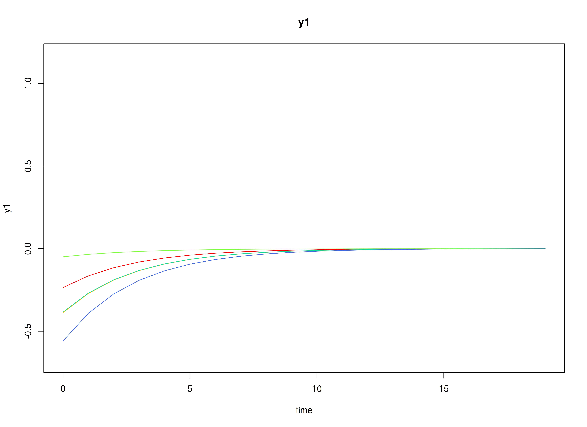

## Model

The measurement model is given by
\begin{equation}
  \mathbf{y}_{i, t}
  =
  \boldsymbol{\nu}
  +
  \boldsymbol{\Lambda}
  \boldsymbol{\eta}_{i, t}
  +
  \boldsymbol{\varepsilon}_{i, t},
  \quad
  \mathrm{with}
  \quad
  \boldsymbol{\varepsilon}_{i, t}
  \sim
  \mathcal{N}
  \left(
  \mathbf{0},
  \boldsymbol{\Theta}
  \right)
\end{equation}
where
$\mathbf{y}_{i, t}$,
$\boldsymbol{\eta}_{i, t}$,
and
$\boldsymbol{\varepsilon}_{i, t}$
are random variables
and
$\boldsymbol{\nu}$,
$\boldsymbol{\Lambda}$,
and
$\boldsymbol{\Theta}$
are model parameters.
$\mathbf{y}_{i, t}$
represents a vector of observed random variables,
$\boldsymbol{\eta}_{i, t}$
a vector of latent random variables,
and
$\boldsymbol{\varepsilon}_{i, t}$
a vector of random measurement errors,
at time $t$ and individual $i$.
$\boldsymbol{\nu}$
denotes a vector of intercepts,
$\boldsymbol{\Lambda}$
a matrix of factor loadings,
and
$\boldsymbol{\Theta}$
the covariance matrix of
$\boldsymbol{\varepsilon}$.

An alternative representation of the measurement error
is given by
\begin{equation}
  \boldsymbol{\varepsilon}_{i, t}
  =
  \boldsymbol{\Theta}^{\frac{1}{2}}
  \mathbf{z}_{i, t},
  \quad
  \mathrm{with}
  \quad
  \mathbf{z}_{i, t}
  \sim
  \mathcal{N}
  \left(
  \mathbf{0},
  \mathbf{I}
  \right)
\end{equation}
where
$\mathbf{z}_{i, t}$ is a vector of
independent standard normal random variables and
$\left( \boldsymbol{\Theta}^{\frac{1}{2}} \right) \left( \boldsymbol{\Theta}^{\frac{1}{2}} \right)^{\prime} = \boldsymbol{\Theta}$ .

The dynamic structure is given by
\begin{equation}
  \boldsymbol{\eta}_{i, t}
  =
  \boldsymbol{\alpha}
  +
  \boldsymbol{\beta}
  \boldsymbol{\eta}_{i, t - 1}
  +
  \boldsymbol{\zeta}_{i, t},
  \quad
  \mathrm{with}
  \quad
  \boldsymbol{\zeta}_{i, t}
  \sim
  \mathcal{N}
  \left(
  \mathbf{0},
  \boldsymbol{\Psi}
  \right)
\end{equation}
where
$\boldsymbol{\eta}_{i, t}$,
$\boldsymbol{\eta}_{i, t - 1}$,
and
$\boldsymbol{\zeta}_{i, t}$
are random variables,
and
$\boldsymbol{\alpha}$,
$\boldsymbol{\beta}$,
and
$\boldsymbol{\Psi}$
are model parameters.
Here,
$\boldsymbol{\eta}_{i, t}$
is a vector of latent variables
at time $t$ and individual $i$,
$\boldsymbol{\eta}_{i, t - 1}$
represents a vector of latent variables
at time $t - 1$ and individual $i$,
and
$\boldsymbol{\zeta}_{i, t}$
represents a vector of dynamic noise
at time $t$ and individual $i$.
$\boldsymbol{\alpha}$
denotes a vector of intercepts,
$\boldsymbol{\beta}$
a matrix of autoregression
and cross regression coefficients,
and
$\boldsymbol{\Psi}$
the covariance matrix of
$\boldsymbol{\zeta}_{i, t}$.

An alternative representation of the dynamic noise
is given by
\begin{equation}
  \boldsymbol{\zeta}_{i, t}
  =
  \boldsymbol{\Psi}^{\frac{1}{2}}
  \mathbf{z}_{i, t},
  \quad
  \mathrm{with}
  \quad
  \mathbf{z}_{i, t}
  \sim
  \mathcal{N}
  \left(
  \mathbf{0},
  \mathbf{I}
  \right)
\end{equation}
where
$\left( \boldsymbol{\Psi}^{\frac{1}{2}} \right) \left( \boldsymbol{\Psi}^{\frac{1}{2}} \right)^{\prime} = \boldsymbol{\Psi}$ .

## Data Generation

### Notation

Let $t = 100$ be the number of time points and $n = 50$ be the number of individuals.

Let the measurement model intecept vector $\boldsymbol{\nu}$ be given by

\begin{equation}
\boldsymbol{\nu}
=
\left(
\begin{array}{c}
  0 \\
  0 \\
  0 \\
\end{array}
\right) .
\end{equation}

Let the factor loadings matrix $\boldsymbol{\Lambda}$ be given by

\begin{equation}
\boldsymbol{\Lambda}
=
\left(
\begin{array}{ccc}
  1 & 0 & 0 \\
  0 & 1 & 0 \\
  0 & 0 & 1 \\
\end{array}
\right) .
\end{equation}

Let the measurement error covariance matrix $\boldsymbol{\Theta}$ be given by

\begin{equation}
\boldsymbol{\Theta}
=
\left(
\begin{array}{ccc}
  0.2 & 0 & 0 \\
  0 & 0.2 & 0 \\
  0 & 0 & 0.2 \\
\end{array}
\right) .
\end{equation}

Let the initial condition
$\boldsymbol{\eta}_{0}$
be given by

\begin{equation}
\boldsymbol{\eta}_{0} \sim \mathcal{N} \left( \boldsymbol{\mu}_{\boldsymbol{\eta} \mid 0}, \boldsymbol{\Sigma}_{\boldsymbol{\eta} \mid 0} \right)
\end{equation}

\begin{equation}
\boldsymbol{\mu}_{\boldsymbol{\eta} \mid 0}
=
\left(
\begin{array}{c}
  0 \\
  0 \\
  0 \\
\end{array}
\right)
\end{equation}

\begin{equation}
\boldsymbol{\Sigma}_{\boldsymbol{\eta} \mid 0}
=
\left(
\begin{array}{ccc}
  1 & 0.2 & 0.2 \\
  0.2 & 1 & 0.2 \\
  0.2 & 0.2 & 1 \\
\end{array}
\right) .
\end{equation}

Let the constant vector $\boldsymbol{\alpha}$ be given by

\begin{equation}
\boldsymbol{\alpha}
=
\left(
\begin{array}{c}
  0 \\
  0 \\
  0 \\
\end{array}
\right) .
\end{equation}

Let the transition matrix $\boldsymbol{\beta}$ be given by

\begin{equation}
\boldsymbol{\beta}
=
\left(
\begin{array}{ccc}
  0.7 & 0 & 0 \\
  0.5 & 0.6 & 0 \\
  -0.1 & 0.4 & 0.5 \\
\end{array}
\right) .
\end{equation}

Let the dynamic process noise $\boldsymbol{\Psi}$ be given by

\begin{equation}
\boldsymbol{\Psi}
=
\left(
\begin{array}{ccc}
  0.1 & 0 & 0 \\
  0 & 0.1 & 0 \\
  0 & 0 & 0.1 \\
\end{array}
\right) .
\end{equation}

### R Function Arguments


``` r
n
#> [1] 50
time
#> [1] 100
mu0
#> [1] 0 0 0
sigma0
#>      [,1] [,2] [,3]
#> [1,]  1.0  0.2  0.2
#> [2,]  0.2  1.0  0.2
#> [3,]  0.2  0.2  1.0
sigma0_l # sigma0_l <- t(chol(sigma0))
#>      [,1]      [,2]      [,3]
#> [1,]  1.0 0.0000000 0.0000000
#> [2,]  0.2 0.9797959 0.0000000
#> [3,]  0.2 0.1632993 0.9660918
alpha
#> [1] 0 0 0
beta
#>      [,1] [,2] [,3]
#> [1,]  0.7  0.0  0.0
#> [2,]  0.5  0.6  0.0
#> [3,] -0.1  0.4  0.5
psi
#>      [,1] [,2] [,3]
#> [1,]  0.1  0.0  0.0
#> [2,]  0.0  0.1  0.0
#> [3,]  0.0  0.0  0.1
psi_l # psi_l <- t(chol(psi))
#>           [,1]      [,2]      [,3]
#> [1,] 0.3162278 0.0000000 0.0000000
#> [2,] 0.0000000 0.3162278 0.0000000
#> [3,] 0.0000000 0.0000000 0.3162278
nu
#> [1] 0 0 0
lambda
#>      [,1] [,2] [,3]
#> [1,]    1    0    0
#> [2,]    0    1    0
#> [3,]    0    0    1
theta
#>      [,1] [,2] [,3]
#> [1,]  0.2  0.0  0.0
#> [2,]  0.0  0.2  0.0
#> [3,]  0.0  0.0  0.2
theta_l # theta_l <- t(chol(theta))
#>           [,1]      [,2]      [,3]
#> [1,] 0.4472136 0.0000000 0.0000000
#> [2,] 0.0000000 0.4472136 0.0000000
#> [3,] 0.0000000 0.0000000 0.4472136
```

### Visualizing the Dynamics Without Process Noise (n = 5 with Different Initial Condition)



### Using the `SimSSMFixed` Function from the `simStateSpace` Package to Simulate Data


``` r
library(simStateSpace)
sim <- SimSSMFixed(
  n = n,
  time = time,
  mu0 = mu0,
  sigma0_l = sigma0_l,
  alpha = alpha,
  beta = beta,
  psi_l = psi_l,
  nu = nu,
  lambda = lambda,
  theta_l = theta_l,
  type = 0
)
data <- as.data.frame(sim)
head(data)
#>   id time          y1          y2         y3
#> 1  1    0 -0.68686529 -0.23269186  0.5864176
#> 2  1    1 -0.24266216 -0.01684359 -0.2646096
#> 3  1    2  0.92818305 -0.05859969 -1.0290302
#> 4  1    3  0.03836036  0.57871750 -0.2909122
#> 5  1    4  0.14986876  0.76497073  0.8038175
#> 6  1    5 -0.10242480  0.63283996  0.2144810
summary(data)
#>        id            time             y1                  y2          
#>  Min.   : 1.0   Min.   : 0.00   Min.   :-2.574919   Min.   :-2.74045  
#>  1st Qu.:13.0   1st Qu.:24.75   1st Qu.:-0.424957   1st Qu.:-0.50176  
#>  Median :25.5   Median :49.50   Median : 0.013475   Median : 0.02757  
#>  Mean   :25.5   Mean   :49.50   Mean   : 0.003891   Mean   : 0.01761  
#>  3rd Qu.:38.0   3rd Qu.:74.25   3rd Qu.: 0.422422   3rd Qu.: 0.53153  
#>  Max.   :50.0   Max.   :99.00   Max.   : 2.469916   Max.   : 3.08925  
#>        y3          
#>  Min.   :-2.37543  
#>  1st Qu.:-0.42417  
#>  Median : 0.02841  
#>  Mean   : 0.02645  
#>  3rd Qu.: 0.47438  
#>  Max.   : 2.81589
plot(sim)
```


## Model Fitting

### Prepare Data


``` r
dynr_data <- dynr::dynr.data(
  data = data,
  id = "id",
  time = "time",
  observed = c("y1", "y2", "y3")
)
```

### Prepare Initial Condition


``` r
dynr_initial <- dynr::prep.initial(
  values.inistate = mu0,
  params.inistate = c("mu0_1_1", "mu0_2_1", "mu0_3_1"),
  values.inicov = sigma0,
  params.inicov = matrix(
    data = c(
      "sigma0_1_1", "sigma0_2_1", "sigma0_3_1",
      "sigma0_2_1", "sigma0_2_2", "sigma0_3_2",
      "sigma0_3_1", "sigma0_3_2", "sigma0_3_3"
    ),
    nrow = 3
  )
)
```

### Prepare Measurement Model


``` r
dynr_measurement <- dynr::prep.measurement(
  values.load = diag(3),
  params.load = matrix(data = "fixed", nrow = 3, ncol = 3),
  state.names = c("eta_1", "eta_2", "eta_3"),
  obs.names = c("y1", "y2", "y3")
)
```

### Prepare Dynamic Process


``` r
dynr_dynamics <- dynr::prep.formulaDynamics(
  formula = list(
    eta_1 ~ alpha_1_1 * 1 + beta_1_1 * eta_1 + beta_1_2 * eta_2 + beta_1_3 * eta_3,
    eta_2 ~ alpha_2_1 * 1 + beta_2_1 * eta_1 + beta_2_2 * eta_2 + beta_2_3 * eta_3,
    eta_3 ~ alpha_3_1 * 1 + beta_3_1 * eta_1 + beta_3_2 * eta_2 + beta_3_3 * eta_3
  ),
  startval = c(
    alpha_1_1 = alpha[1], alpha_2_1 = alpha[2], alpha_3_1 = alpha[3],
    beta_1_1 = beta[1, 1], beta_1_2 = beta[1, 2], beta_1_3 = beta[1, 3],
    beta_2_1 = beta[2, 1], beta_2_2 = beta[2, 2], beta_2_3 = beta[2, 3],
    beta_3_1 = beta[3, 1], beta_3_2 = beta[3, 2], beta_3_3 = beta[3, 3]
  ),
  isContinuousTime = FALSE
)
```

### Prepare Process Noise


``` r
dynr_noise <- dynr::prep.noise(
  values.latent = psi,
  params.latent = matrix(
    data = c(
      "psi_1_1", "psi_2_1", "psi_3_1",
      "psi_2_1", "psi_2_2", "psi_3_2",
      "psi_3_1", "psi_3_2", "psi_3_3"
    ),
    nrow = 3
  ),
  values.observed = theta,
  params.observed = matrix(
    data = c(
      "theta_1_1", "fixed", "fixed",
      "fixed", "theta_2_2", "fixed",
      "fixed", "fixed", "theta_3_3"
    ),
    nrow = 3
  )
)
```

### Prepare the Model


``` r
model <- dynr::dynr.model(
  data = dynr_data,
  initial = dynr_initial,
  measurement = dynr_measurement,
  dynamics = dynr_dynamics,
  noise = dynr_noise,
  outfile = "ssm.c"
)
```


### Fit the Model


``` r
results <- dynr::dynr.cook(
  model,
  debug_flag = TRUE,
  verbose = FALSE
)
#> [1] "Get ready!!!!"
#> using C compiler: ‘gcc (Ubuntu 13.3.0-6ubuntu2~24.04) 13.3.0’
#> Optimization function called.
#> Starting Hessian calculation ...
#> Finished Hessian calculation.
#> Original exit flag:  3 
#> Modified exit flag:  3 
#> Optimization terminated successfully: ftol_rel or ftol_abs was reached. 
#> Original fitted parameters:  0.00212567 0.003917621 0.006212418 0.7045635 
#> -0.01925784 0.01043198 0.4723691 0.623095 -0.002871817 -0.06974177 0.3796904 
#> 0.4633763 -2.256251 0.05724552 -0.1364068 -2.272167 0.02247916 -2.194878 
#> -1.645907 -1.653685 -1.692368 -0.0931547 0.0506706 0.1604647 -0.05011948 
#> 0.1906697 0.146632 0.4060394 -0.08903704 -0.2227357 
#> 
#> Transformed fitted parameters:  0.00212567 0.003917621 0.006212418 0.7045635 
#> -0.01925784 0.01043198 0.4723691 0.623095 -0.002871817 -0.06974177 0.3796904 
#> 0.4633763 0.1047424 0.005996034 -0.01428758 0.1034318 0.001499444 0.1133732 
#> 0.1928376 0.1913436 0.184083 -0.0931547 0.0506706 0.1604647 0.9511158 0.1813489 
#> 0.139464 1.535439 -0.1070407 0.8326744 
#> 
#> Doing end processing
#> Successful trial
#> Total Time: 4.604818 
#> Backend Time: 4.594582
```

## Summary


``` r
summary(results)
#> Coefficients:
#>             Estimate Std. Error t value  ci.lower  ci.upper Pr(>|t|)    
#> alpha_1_1   0.002126   0.004999   0.425 -0.007673  0.011924   0.3354    
#> alpha_2_1   0.003918   0.005957   0.658 -0.007759  0.015594   0.2554    
#> alpha_3_1   0.006212   0.006314   0.984 -0.006163  0.018588   0.1626    
#> beta_1_1    0.704563   0.035923  19.613  0.634156  0.774971   <2e-16 ***
#> beta_1_2   -0.019258   0.022773  -0.846 -0.063891  0.025376   0.1989    
#> beta_1_3    0.010432   0.019503   0.535 -0.027793  0.048657   0.2964    
#> beta_2_1    0.472369   0.035124  13.449  0.403528  0.541210   <2e-16 ***
#> beta_2_2    0.623095   0.027162  22.940  0.569857  0.676333   <2e-16 ***
#> beta_2_3   -0.002872   0.022706  -0.126 -0.047374  0.041631   0.4497    
#> beta_3_1   -0.069742   0.029254  -2.384 -0.127078 -0.012405   0.0086 ** 
#> beta_3_2    0.379690   0.027776  13.670  0.325251  0.434130   <2e-16 ***
#> beta_3_3    0.463376   0.030605  15.141  0.403392  0.523361   <2e-16 ***
#> psi_1_1     0.104742   0.012172   8.605  0.080885  0.128600   <2e-16 ***
#> psi_2_1     0.005996   0.004700   1.276 -0.003216  0.015208   0.1011    
#> psi_3_1    -0.014288   0.004583  -3.118 -0.023269 -0.005306   0.0009 ***
#> psi_2_2     0.103432   0.010055  10.287  0.083725  0.123139   <2e-16 ***
#> psi_3_2     0.001499   0.004595   0.326 -0.007506  0.010505   0.3721    
#> psi_3_3     0.113373   0.015329   7.396  0.083329  0.143417   <2e-16 ***
#> theta_1_1   0.192838   0.010489  18.385  0.172280  0.213395   <2e-16 ***
#> theta_2_2   0.191344   0.009770  19.584  0.172194  0.210493   <2e-16 ***
#> theta_3_3   0.184083   0.014919  12.339  0.154843  0.213323   <2e-16 ***
#> mu0_1_1    -0.093155   0.146966  -0.634 -0.381203  0.194893   0.2631    
#> mu0_2_1     0.050671   0.183094   0.277 -0.308188  0.409529   0.3910    
#> mu0_3_1     0.160465   0.141271   1.136 -0.116421  0.437350   0.1280    
#> sigma0_1_1  0.951116   0.221206   4.300  0.517560  1.384672   <2e-16 ***
#> sigma0_2_1  0.181349   0.192471   0.942 -0.195886  0.558584   0.1731    
#> sigma0_3_1  0.139464   0.148458   0.939 -0.151509  0.430437   0.1738    
#> sigma0_2_2  1.535439   0.338486   4.536  0.872018  2.198860   <2e-16 ***
#> sigma0_3_2 -0.107041   0.183971  -0.582 -0.467617  0.253536   0.2804    
#> sigma0_3_3  0.832674   0.200312   4.157  0.440071  1.225278   <2e-16 ***
#> ---
#> Signif. codes:  0 '***' 0.001 '**' 0.01 '*' 0.05 '.' 0.1 ' ' 1
#> 
#> -2 log-likelihood value at convergence = 26505.19
#> AIC = 26565.19
#> BIC = 26760.71
```


### Parameter Estimates


``` r
alpha_hat
#> [1] 0.002125670 0.003917621 0.006212418
beta_hat
#>             [,1]        [,2]         [,3]
#> [1,]  0.70456350 -0.01925784  0.010431983
#> [2,]  0.47236906  0.62309501 -0.002871817
#> [3,] -0.06974177  0.37969044  0.463376265
psi_hat
#>              [,1]        [,2]         [,3]
#> [1,]  0.104742413 0.005996034 -0.014287576
#> [2,]  0.005996034 0.103431765  0.001499444
#> [3,] -0.014287576 0.001499444  0.113373201
theta_hat
#>           [,1]      [,2]     [,3]
#> [1,] 0.1928376 0.0000000 0.000000
#> [2,] 0.0000000 0.1913436 0.000000
#> [3,] 0.0000000 0.0000000 0.184083
mu0_hat
#> [1] -0.0931547  0.0506706  0.1604647
sigma0_hat
#>           [,1]       [,2]       [,3]
#> [1,] 0.9511158  0.1813489  0.1394640
#> [2,] 0.1813489  1.5354394 -0.1070407
#> [3,] 0.1394640 -0.1070407  0.8326744
```

## References


