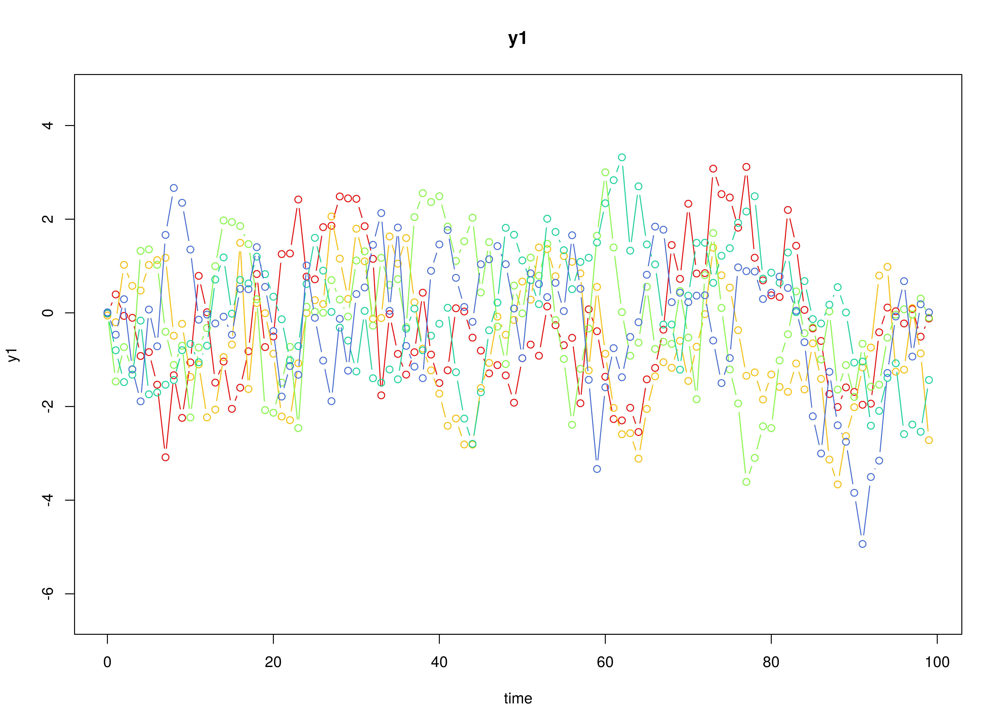
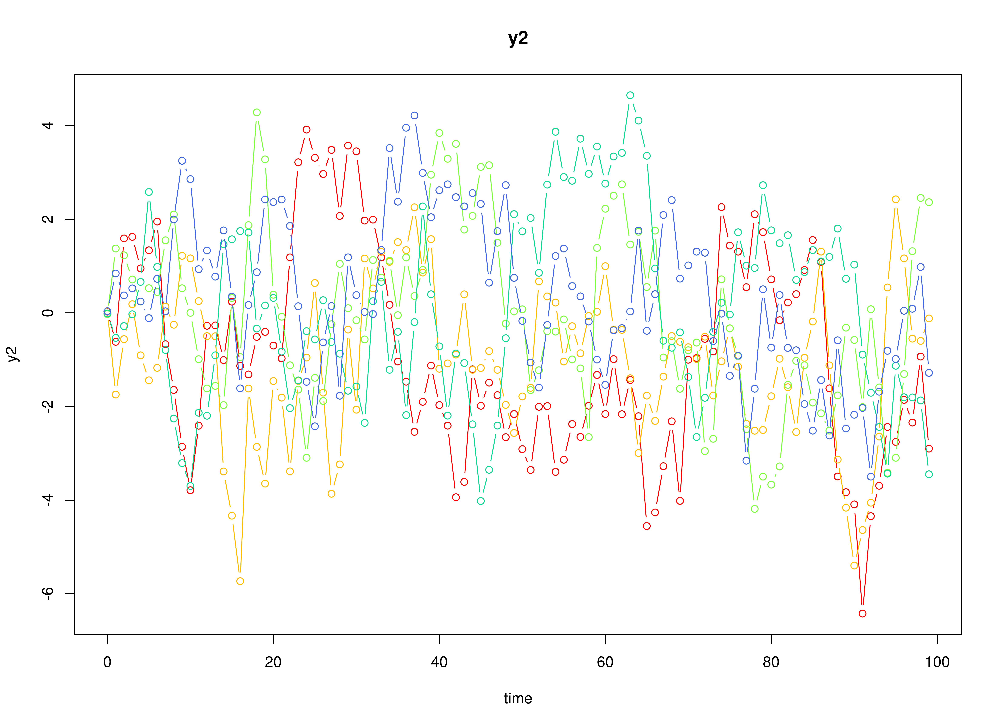
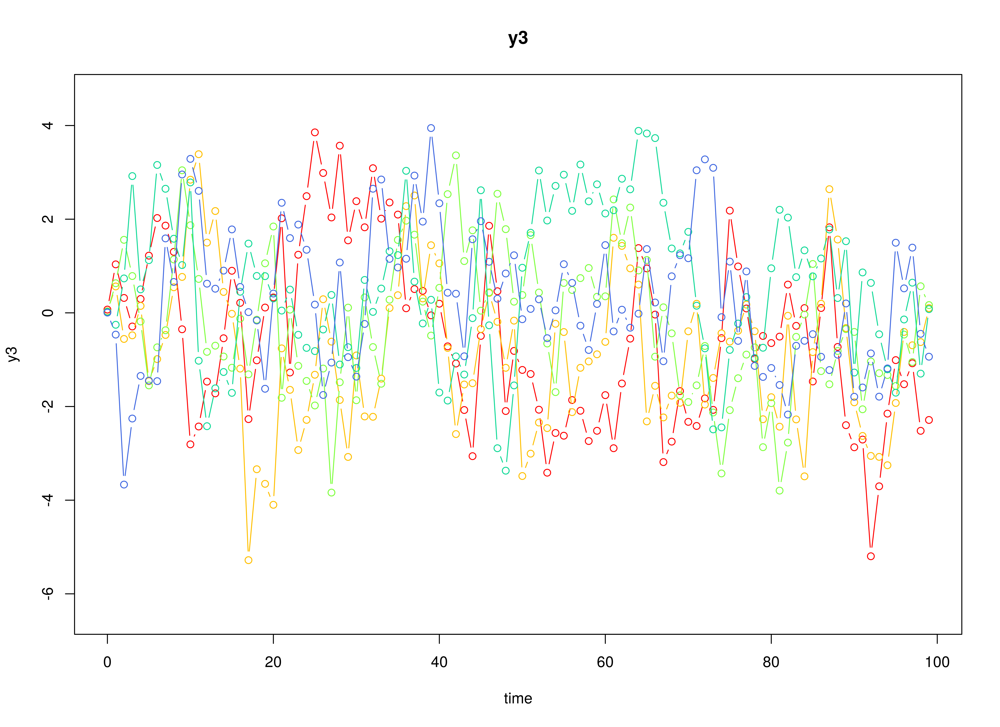
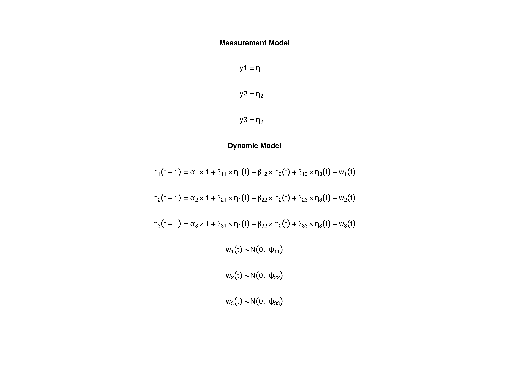

## Model

The measurement model is given by
\begin{equation}
  \mathbf{y}_{i, t}
  =
  \boldsymbol{\eta}_{i, t}
\end{equation}
where $\mathbf{y}_{i, t}$
represents a vector of observed variables
and $\boldsymbol{\eta}_{i, t}$
a vector of latent variables
for individual $i$ and time $t$.
Since the observed and latent variables are equal,
we only generate data
from the dynamic structure.

The dynamic structure is given by
\begin{equation}
  \boldsymbol{\eta}_{i, t}
  =
  \boldsymbol{\alpha}
  +
  \boldsymbol{\beta}
  \boldsymbol{\eta}_{i, t - 1}
  +
  \boldsymbol{\zeta}_{i, t},
  \quad
  \mathrm{with}
  \quad
  \boldsymbol{\zeta}_{i, t}
  \sim
  \mathcal{N}
  \left(
  \mathbf{0},
  \boldsymbol{\Psi}
  \right)
\end{equation}
where
$\boldsymbol{\eta}_{i, t}$,
$\boldsymbol{\eta}_{i, t - 1}$,
and
$\boldsymbol{\zeta}_{i, t}$
are random variables,
and
$\boldsymbol{\alpha}$,
$\boldsymbol{\beta}$,
and
$\boldsymbol{\Psi}$
are model parameters.
Here,
$\boldsymbol{\eta}_{i, t}$
is a vector of latent variables
at time $t$ and individual $i$,
$\boldsymbol{\eta}_{i, t - 1}$
represents a vector of latent variables
at time $t - 1$ and individual $i$,
and
$\boldsymbol{\zeta}_{i, t}$
represents a vector of dynamic noise
at time $t$ and individual $i$.
$\boldsymbol{\alpha}$
denotes a vector of intercepts,
$\boldsymbol{\beta}$
a matrix of autoregression
and cross regression coefficients,
and
$\boldsymbol{\Psi}$
the covariance matrix of
$\boldsymbol{\zeta}_{i, t}$.

An alternative representation of the dynamic noise
is given by
\begin{equation}
  \boldsymbol{\zeta}_{i, t}
  =
  \boldsymbol{\Psi}^{\frac{1}{2}}
  \mathbf{z}_{i, t},
  \quad
  \mathrm{with}
  \quad
  \mathbf{z}_{i, t}
  \sim
  \mathcal{N}
  \left(
  \mathbf{0},
  \mathbf{I}
  \right)
\end{equation}
where
$\left( \boldsymbol{\Psi}^{\frac{1}{2}} \right) \left( \boldsymbol{\Psi}^{\frac{1}{2}} \right)^{\prime} = \boldsymbol{\Psi}$ .

## Data Generation

### Notation

Let $t = 1000$ be the number of time points and $n = 100$ be the number of individuals.

Let the initial condition
$\boldsymbol{\eta}_{0}$
be given by

\begin{equation}
\boldsymbol{\eta}_{0} \sim \mathcal{N} \left( \boldsymbol{\mu}_{\boldsymbol{\eta} \mid 0}, \boldsymbol{\Sigma}_{\boldsymbol{\eta} \mid 0} \right)
\end{equation}

\begin{equation}
\boldsymbol{\mu}_{\boldsymbol{\eta} \mid 0}
=
\left(
\begin{array}{c}
  0 \\
  0 \\
  0 \\
\end{array}
\right)
\end{equation}

\begin{equation}
\boldsymbol{\Sigma}_{\boldsymbol{\eta} \mid 0}
=
\left(
\begin{array}{ccc}
  0.001 & 0 & 0 \\
  0 & 0.001 & 0 \\
  0 & 0 & 0.001 \\
\end{array}
\right) .
\end{equation}

Let the constant vector $\boldsymbol{\alpha}$ be given by

\begin{equation}
\boldsymbol{\alpha}
=
\left(
\begin{array}{c}
  0 \\
  0 \\
  0 \\
\end{array}
\right) .
\end{equation}

Let the transition matrix $\boldsymbol{\beta}$ be given by

\begin{equation}
\boldsymbol{\beta}
=
\left(
\begin{array}{ccc}
  0.7 & 0 & 0 \\
  0.5 & 0.6 & 0 \\
  -0.1 & 0.4 & 0.5 \\
\end{array}
\right) .
\end{equation}

Let the dynamic process noise $\boldsymbol{\Psi}$ be given by

\begin{equation}
\boldsymbol{\Psi}
=
\left(
\begin{array}{ccc}
  0.001 & 0 & 0 \\
  0 & 0.001 & 0 \\
  0 & 0 & 0.001 \\
\end{array}
\right) .
\end{equation}

### R Function Arguments


```r
n
#> [1] 100
time
#> [1] 1000
mu0
#> [1] 0 0 0
sigma0
#>       [,1]  [,2]  [,3]
#> [1,] 0.001 0.000 0.000
#> [2,] 0.000 0.001 0.000
#> [3,] 0.000 0.000 0.001
sigma0_l
#>            [,1]       [,2]       [,3]
#> [1,] 0.03162278 0.00000000 0.00000000
#> [2,] 0.00000000 0.03162278 0.00000000
#> [3,] 0.00000000 0.00000000 0.03162278
alpha
#> [1] 0 0 0
beta
#>      [,1] [,2] [,3]
#> [1,]  0.7  0.0  0.0
#> [2,]  0.5  0.6  0.0
#> [3,] -0.1  0.4  0.5
psi
#>       [,1]  [,2]  [,3]
#> [1,] 0.001 0.000 0.000
#> [2,] 0.000 0.001 0.000
#> [3,] 0.000 0.000 0.001
psi_l
#>            [,1]       [,2]       [,3]
#> [1,] 0.03162278 0.00000000 0.00000000
#> [2,] 0.00000000 0.03162278 0.00000000
#> [3,] 0.00000000 0.00000000 0.03162278
```

### Using the SimSSMVARFixed Function from the simStateSpace Package to Simulate Data


```r
library(simStateSpace)
sim <- SimSSMVARFixed(
  n = n,
  time = time,
  mu0 = mu0,
  sigma0_l = sigma0_l,
  alpha = alpha,
  beta = beta,
  psi_l = psi_l
)
data <- as.data.frame(sim)
head(data)
#>   id time           y1          y2          y3
#> 1  1    0 -0.016807560  0.02597029 0.070121917
#> 2  1    1  0.001037461 -0.01259128 0.078378714
#> 3  1    2 -0.010031429  0.04874324 0.036802970
#> 4  1    3 -0.008924644  0.04643266 0.004356867
#> 5  1    4 -0.033034363  0.02430897 0.014761300
#> 6  1    5 -0.029243334  0.03684040 0.039403861
plot(sim)
```



## Model Fitting

### Prepare Data


```r
dynr_data <- dynr::dynr.data(
  data = data,
  id = "id",
  time = "time",
  observed = c("y1", "y2", "y3")
)
```

### Prepare Initial Condition


```r
dynr_initial <- dynr::prep.initial(
  values.inistate = mu0,
  params.inistate = c("mu0_1", "mu0_2", "mu0_3"),
  values.inicov = sigma0,
  params.inicov = matrix(
    data = c(
      "sigma0_11", "sigma0_12", "sigma0_13",
      "sigma0_12", "sigma0_22", "sigma0_23",
      "sigma0_13", "sigma0_23", "sigma0_33"
    ),
    nrow = 3
  )
)
```

### Prepare Measurement Model


```r
dynr_measurement <- dynr::prep.measurement(
  values.load = diag(3),
  params.load = matrix(data = "fixed", nrow = 3, ncol = 3),
  state.names = c("eta_1", "eta_2", "eta_3"),
  obs.names = c("y1", "y2", "y3")
)
```

### Prepare Dynamic Process


```r
dynr_dynamics <- dynr::prep.formulaDynamics(
  formula = list(
    eta_1 ~ alpha_1 * 1 + beta_11 * eta_1 + beta_12 * eta_2 + beta_13 * eta_3,
    eta_2 ~ alpha_2 * 1 + beta_21 * eta_1 + beta_22 * eta_2 + beta_23 * eta_3,
    eta_3 ~ alpha_3 * 1 + beta_31 * eta_1 + beta_32 * eta_2 + beta_33 * eta_3
  ),
  startval = c(
    alpha_1 = alpha[1], alpha_2 = alpha[2], alpha_3 = alpha[3],
    beta_11 = beta[1, 1], beta_12 = beta[1, 2], beta_13 = beta[1, 3],
    beta_21 = beta[2, 1], beta_22 = beta[2, 2], beta_23 = beta[2, 3],
    beta_31 = beta[3, 1], beta_32 = beta[3, 2], beta_33 = beta[3, 3]
  ),
  isContinuousTime = FALSE
)
```

### Prepare Process Noise


```r
dynr_noise <- dynr::prep.noise(
  values.latent = psi,
  params.latent = matrix(
    data = c(
      "psi_11", "psi_12", "psi_13",
      "psi_12", "psi_22", "psi_23",
      "psi_13", "psi_23", "psi_33"
    ),
    nrow = 3
  ),
  values.observed = matrix(data = 0, nrow = 3, ncol = 3),
  params.observed = matrix(data = "fixed", nrow = 3, ncol = 3)
)
```

### Prepare the Model


```r
model <- dynr::dynr.model(
  data = dynr_data,
  initial = dynr_initial,
  measurement = dynr_measurement,
  dynamics = dynr_dynamics,
  noise = dynr_noise,
  outfile = "var.c"
)
```



### Fit the Model


```r
results <- dynr::dynr.cook(
  model,
  debug_flag = TRUE,
  verbose = FALSE
)
#> [1] "Get ready!!!!"
#> using C compiler: ‘gcc (Ubuntu 11.4.0-1ubuntu1~22.04) 11.4.0’
#> Optimization function called.
#> Starting Hessian calculation ...
#> Finished Hessian calculation.
#> Original exit flag:  4 
#> Modified exit flag:  4 
#> Optimization terminated successfully: xtol_rel or xtol_abs was reached. 
#> Original fitted parameters:  -4.474638e-05 -2.06584e-05 5.554442e-05 0.6971918 
#> 3.852938e-05 0.003523939 0.5001027 0.6008828 -0.002062889 -0.1012873 0.4030133 
#> 0.4972186 -6.908122 -0.003504474 0.000938739 -6.910144 0.002107294 -6.909182 
#> -0.001848801 0.001826069 -0.0003209764 -6.907684 0.000195054 6.760191e-05 
#> -6.907764 0.0001046609 -6.907715 
#> 
#> Transformed fitted parameters:  -4.474638e-05 -2.06584e-05 5.554442e-05 
#> 0.6971918 3.852938e-05 0.003523939 0.5001027 0.6008828 -0.002062889 -0.1012873 
#> 0.4030133 0.4972186 0.000999633 -3.503188e-06 9.383945e-07 0.0009976262 
#> 2.098978e-06 0.0009985794 -0.001848801 0.001826069 -0.0003209764 0.001000072 
#> 1.950679e-07 6.760675e-08 0.000999991 1.046731e-07 0.00100004 
#> 
#> Doing end processing
#> Successful trial
#> Total Time: 48.57227 
#> Backend Time: 48.54895
```

## Summary


```r
summary(results)
#> Coefficients:
#>             Estimate Std. Error t value   ci.lower   ci.upper Pr(>|t|)    
#> alpha_1   -4.475e-05  1.000e-04  -0.447 -2.408e-04  1.513e-04   0.3273    
#> alpha_2   -2.066e-05  9.995e-05  -0.207 -2.166e-04  1.752e-04   0.4181    
#> alpha_3    5.554e-05  1.000e-04   0.555 -1.405e-04  2.515e-04   0.2893    
#> beta_11    6.972e-01  2.557e-03 272.632  6.922e-01  7.022e-01   <2e-16 ***
#> beta_12    3.853e-05  2.157e-03   0.018 -4.189e-03  4.266e-03   0.4929    
#> beta_13    3.524e-03  2.198e-03   1.604 -7.833e-04  7.831e-03   0.0544 .  
#> beta_21    5.001e-01  2.552e-03 195.936  4.951e-01  5.051e-01   <2e-16 ***
#> beta_22    6.009e-01  2.151e-03 279.328  5.967e-01  6.051e-01   <2e-16 ***
#> beta_23   -2.063e-03  2.194e-03  -0.940 -6.362e-03  2.237e-03   0.1735    
#> beta_31   -1.013e-01  2.554e-03 -39.660 -1.063e-01 -9.628e-02   <2e-16 ***
#> beta_32    4.030e-01  2.154e-03 187.125  3.988e-01  4.072e-01   <2e-16 ***
#> beta_33    4.972e-01  2.196e-03 226.429  4.929e-01  5.015e-01   <2e-16 ***
#> psi_11     9.996e-04  4.480e-06 223.109  9.909e-04  1.008e-03   <2e-16 ***
#> psi_12    -3.503e-06  3.167e-06  -1.106 -9.710e-06  2.703e-06   0.1343    
#> psi_13     9.384e-07  3.166e-06   0.296 -5.267e-06  7.144e-06   0.3835    
#> psi_22     9.976e-04  4.477e-06 222.813  9.889e-04  1.006e-03   <2e-16 ***
#> psi_23     2.099e-06  3.169e-06   0.662 -4.112e-06  8.309e-06   0.2539    
#> psi_33     9.986e-04  4.478e-06 222.985  9.898e-04  1.007e-03   <2e-16 ***
#> mu0_1     -1.849e-03  3.165e-03  -0.584 -8.051e-03  4.354e-03   0.2795    
#> mu0_2      1.826e-03  3.165e-03   0.577 -4.377e-03  8.029e-03   0.2820    
#> mu0_3     -3.210e-04  3.164e-03  -0.101 -6.523e-03  5.881e-03   0.4596    
#> sigma0_11  1.000e-03  1.326e-04   7.543  7.402e-04  1.260e-03   <2e-16 ***
#> sigma0_12  1.951e-07  9.905e-05   0.002 -1.939e-04  1.943e-04   0.4992    
#> sigma0_13  6.761e-08  9.325e-05   0.001 -1.827e-04  1.828e-04   0.4997    
#> sigma0_22  1.000e-03  1.486e-04   6.732  7.088e-04  1.291e-03   <2e-16 ***
#> sigma0_23  1.047e-07  1.031e-04   0.001 -2.020e-04  2.022e-04   0.4996    
#> sigma0_33  1.000e-03  1.375e-04   7.272  7.305e-04  1.270e-03   <2e-16 ***
#> ---
#> Signif. codes:  0 '***' 0.001 '**' 0.01 '*' 0.05 '.' 0.1 ' ' 1
#> 
#> -2 log-likelihood value at convergence = -1221396.74
#> AIC = -1221342.74
#> BIC = -1221085.89
```


### Parameter Estimates


```r
alpha_hat
#> [1] -4.474638e-05 -2.065840e-05  5.554442e-05
beta_hat
#>            [,1]         [,2]         [,3]
#> [1,]  0.6971918 3.852938e-05  0.003523939
#> [2,]  0.5001027 6.008828e-01 -0.002062889
#> [3,] -0.1012873 4.030133e-01  0.497218617
psi_hat
#>               [,1]          [,2]         [,3]
#> [1,]  9.996330e-04 -3.503188e-06 9.383945e-07
#> [2,] -3.503188e-06  9.976262e-04 2.098978e-06
#> [3,]  9.383945e-07  2.098978e-06 9.985794e-04
mu0_hat
#> [1] -0.0018488009  0.0018260694 -0.0003209764
sigma0_hat
#>              [,1]         [,2]         [,3]
#> [1,] 1.000072e-03 1.950679e-07 6.760675e-08
#> [2,] 1.950679e-07 9.999910e-04 1.046731e-07
#> [3,] 6.760675e-08 1.046731e-07 1.000040e-03
```

## References
