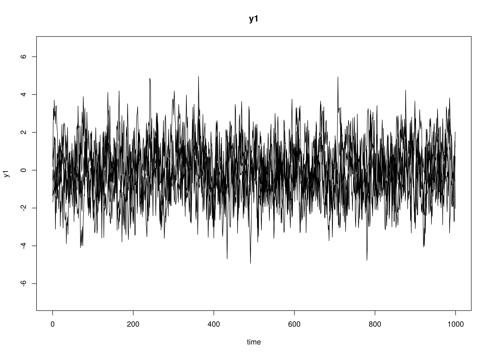
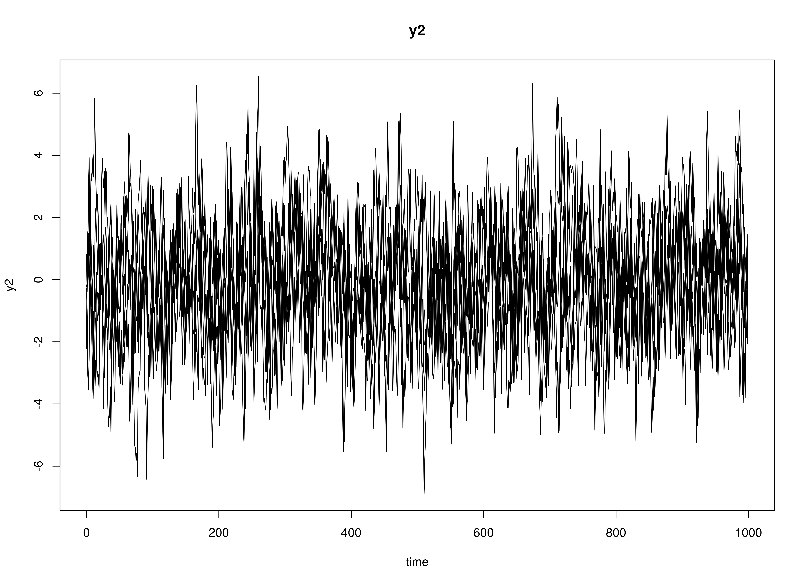
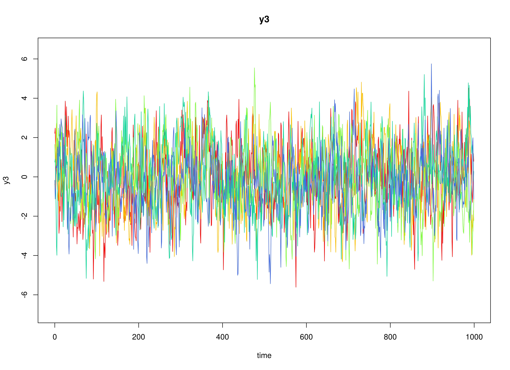

## Model

The measurement model is given by

\begin{equation}
  \mathbf{y}_{i, t}
  =
  \boldsymbol{\eta}_{i, t} .
\end{equation}

The dynamic structure is given by

\begin{equation}
  \boldsymbol{\eta}_{i, t}
  =
  \boldsymbol{\alpha}
  +
  \boldsymbol{\beta}
  \boldsymbol{\eta}_{i, t - 1}
  +
  \boldsymbol{\zeta}_{i, t}
  \quad
  \mathrm{with}
  \quad
  \boldsymbol{\zeta}_{i, t}
  \sim
  \mathcal{N}
  \left(
  \mathbf{0},
  \boldsymbol{\Psi}
  \right)
\end{equation}

where $\boldsymbol{\eta}_{i, t}$, $\boldsymbol{\eta}_{i, t - 1}$,
and $\boldsymbol{\zeta}_{i, t}$ are random variables
and $\boldsymbol{\alpha}$, $\boldsymbol{\beta}$,
and $\boldsymbol{\Psi}$ are model parameters.
$\boldsymbol{\eta}_{i, t}$ is a vector of latent variables
at time $t$ and individual $i$, $\boldsymbol{\eta}_{i, t - 1}$
is a vector of latent variables at
$t - 1$ and individual $i$,
and $\boldsymbol{\zeta}_{i, t}$ is a vector of dynamic noise
at time $t$ and individual $i$,
while $\boldsymbol{\alpha}$
is a vector of intercepts,
$\boldsymbol{\beta}$ is a matrix of autoregression
and cross regression coefficients,
and $\boldsymbol{\Psi}$ is the covariance matrix of
$\boldsymbol{\zeta}_{i, t}$.

## Data Generation

### Notation


Let $t = 1000$ be the number of time points and $n = 5$ be the number of individuals.

Let the initial condition
$\boldsymbol{\eta}_{0}$
be given by

\begin{equation}
\boldsymbol{\eta}_{0} \sim \mathcal{N} \left( \boldsymbol{\mu}_{\boldsymbol{\eta} \mid 0}, \boldsymbol{\Sigma}_{\boldsymbol{\eta} \mid 0} \right)
\end{equation}

\begin{equation}
\boldsymbol{\mu}_{\boldsymbol{\eta} \mid 0}
=
\left(
\begin{array}{c}
  0 \\
  0 \\
  0 \\
\end{array}
\right)
\end{equation}

\begin{equation}
\boldsymbol{\Sigma}_{\boldsymbol{\eta} \mid 0}
=
\left(
\begin{array}{ccc}
  1 & 0 & 0 \\
  0 & 1 & 0 \\
  0 & 0 & 1 \\
\end{array}
\right) .
\end{equation}

Let the constant vector $\boldsymbol{\alpha}$ be given by

\begin{equation}
\boldsymbol{\alpha}
=
\left(
\begin{array}{c}
  0 \\
  0 \\
  0 \\
\end{array}
\right) .
\end{equation}

Let the transition matrix $\boldsymbol{\beta}$ be given by

\begin{equation}
\boldsymbol{\beta}
=
\left(
\begin{array}{ccc}
  0.7 & 0 & 0 \\
  0.5 & 0.6 & 0 \\
  -0.1 & 0.4 & 0.5 \\
\end{array}
\right) .
\end{equation}

Let the dynamic process noise $\boldsymbol{\Psi}$ be given by

\begin{equation}
\boldsymbol{\Psi}
=
\left(
\begin{array}{ccc}
  1 & 0 & 0 \\
  0 & 1 & 0 \\
  0 & 0 & 1 \\
\end{array}
\right) .
\end{equation}

### R Function Arguments


```r
n
#> [1] 5
time
#> [1] 1000
mu0
#> [1] 0 0 0
sigma0
#>      [,1] [,2] [,3]
#> [1,]    1    0    0
#> [2,]    0    1    0
#> [3,]    0    0    1
alpha
#> [1] 0 0 0
beta
#>      [,1] [,2] [,3]
#> [1,]  0.7  0.0  0.0
#> [2,]  0.5  0.6  0.0
#> [3,] -0.1  0.4  0.5
psi
#>      [,1] [,2] [,3]
#> [1,]    1    0    0
#> [2,]    0    1    0
#> [3,]    0    0    1
```

### Using the SimSSMVARFixed Function to Simulate Data


```r
library(simStateSpace)
data <- Sim2Matrix(
  SimSSMVARFixed(
    n = n,
    mu0 = mu0,
    sigma0 = sigma0,
    alpha = alpha,
    beta = beta,
    psi = psi,
    time = time,
    burn_in = 0
  )
)
head(data)
#>               y1         y2        y3 time id
#> [1,] -0.53150173  0.8212527 2.2174497    0  1
#> [2,]  0.03280741 -0.3981712 2.4785526    1  1
#> [3,] -0.31722163  1.5413967 1.1638121    2  1
#> [4,] -0.28222201  1.4683295 0.1377762    3  1
#> [5,] -1.04463827  0.7687173 0.4667933    4  1
#> [6,] -0.92475541  1.1649958 1.2460595    5  1
```

### Plots



## Model Fitting

### Prepare Data


```r
dynr_data <- dynr::dynr.data(
  data = data,
  id = "id",
  time = "time",
  observed = c("y1", "y2", "y3")
)
```

### Prepare Initial Condition


```r
dynr_initial <- dynr::prep.initial(
  values.inistate = mu0,
  params.inistate = c("mu0_1", "mu0_2", "mu0_3"),
  values.inicov = sigma0,
  params.inicov = matrix(
    data = c(
      "sigma0_11", "sigma0_12", "sigma0_13",
      "sigma0_12", "sigma0_22", "sigma0_23",
      "sigma0_13", "sigma0_23", "sigma0_33"
    ),
    nrow = 3
  )
)
```

### Prepare Measurement Model


```r
dynr_measurement <- dynr::prep.measurement(
  values.load = diag(3),
  params.load = matrix(data = "fixed", nrow = 3, ncol = 3),
  state.names = c("eta_1", "eta_2", "eta_3"),
  obs.names = c("y1", "y2", "y3")
)
```

### Prepare Dynamic Process


```r
dynr_dynamics <- dynr::prep.formulaDynamics(
  formula = list(
    eta_1 ~ alpha_1 * 1 + beta_11 * eta_1 + beta_12 * eta_2 + beta_13 * eta_3,
    eta_2 ~ alpha_2 * 1 + beta_21 * eta_1 + beta_22 * eta_2 + beta_23 * eta_3,
    eta_3 ~ alpha_3 * 1 + beta_31 * eta_1 + beta_32 * eta_2 + beta_33 * eta_3
  ),
  startval = c(
    alpha_1 = alpha[1], alpha_2 = alpha[2], alpha_3 = alpha[3],
    beta_11 = beta[1, 1], beta_12 = beta[1, 2], beta_13 = beta[1, 3],
    beta_21 = beta[2, 1], beta_22 = beta[2, 2], beta_23 = beta[2, 3],
    beta_31 = beta[3, 1], beta_32 = beta[3, 2], beta_33 = beta[3, 3]
  ),
  isContinuousTime = FALSE
)
```

### Prepare Process Noise


```r
dynr_noise <- dynr::prep.noise(
  values.latent = psi,
  params.latent = matrix(
    data = c(
      "psi_11", "psi_12", "psi_13",
      "psi_12", "psi_22", "psi_23",
      "psi_13", "psi_23", "psi_33"
    ),
    nrow = 3
  ),
  values.observed = matrix(data = 0, nrow = 3, ncol = 3),
  params.observed = matrix(data = "fixed", nrow = 3, ncol = 3)
)
```

### Prepare the Model


```r
model <- dynr::dynr.model(
  data = dynr_data,
  initial = dynr_initial,
  measurement = dynr_measurement,
  dynamics = dynr_dynamics,
  noise = dynr_noise,
  outfile = "var.c"
)
```


### Fit the Model


```r
results <- dynr::dynr.cook(
  model,
  debug_flag = TRUE,
  verbose = FALSE
)
#> [1] "Get ready!!!!"
#> using C compiler: ‘gcc (Ubuntu 11.4.0-1ubuntu1~22.04) 11.4.0’
#> Optimization function called.
#> Starting Hessian calculation ...
#> Finished Hessian calculation.
#> Original exit flag:  3 
#> Modified exit flag:  3 
#> Optimization terminated successfully: ftol_rel or ftol_abs was reached. 
#> Original fitted parameters:  -0.01436224 -0.008084834 0.008022517 0.6906 
#> 0.01492941 -0.00319284 0.486072 0.6206747 -0.007399144 -0.113037 0.4161175 
#> 0.4941164 -0.01756573 -0.02341745 -0.01479442 0.007374806 -0.01464243 
#> -0.003880536 -0.525563 -0.2592167 0.8204044 -0.1864839 -0.7714447 0.3367576 
#> -0.4211325 -0.02244622 -0.0987352 
#> 
#> Transformed fitted parameters:  -0.01436224 -0.008084834 0.008022517 0.6906 
#> 0.01492941 -0.00319284 0.486072 0.6206747 -0.007399144 -0.113037 0.4161175 
#> 0.4941164 0.9825876 -0.02300969 -0.01453682 1.007941 -0.01441039 0.996558 
#> -0.525563 -0.2592167 0.8204044 0.829872 -0.6402003 0.2794657 1.150182 
#> -0.2303239 1.000425 
#> 
#> Doing end processing
#> Successful trial
#> Total Time: 2.048893 
#> Backend Time: 2.041412
```

## Summary


```r
summary(results)
#> Coefficients:
#>            Estimate Std. Error t value  ci.lower  ci.upper Pr(>|t|)    
#> alpha_1   -0.014362   0.014043  -1.023 -0.041886  0.013161   0.1532    
#> alpha_2   -0.008085   0.014222  -0.568 -0.035960  0.019790   0.2849    
#> alpha_3    0.008023   0.014141   0.567 -0.019694  0.035739   0.2853    
#> beta_11    0.690600   0.011350  60.845  0.668354  0.712846   <2e-16 ***
#> beta_12    0.014929   0.009421   1.585 -0.003536  0.033394   0.0566 .  
#> beta_13   -0.003193   0.009597  -0.333 -0.022002  0.015616   0.3697    
#> beta_21    0.486072   0.011496  42.281  0.463540  0.508604   <2e-16 ***
#> beta_22    0.620675   0.009541  65.051  0.601974  0.639375   <2e-16 ***
#> beta_23   -0.007399   0.009719  -0.761 -0.026447  0.011649   0.2232    
#> beta_31   -0.113037   0.011431  -9.889 -0.135441 -0.090633   <2e-16 ***
#> beta_32    0.416117   0.009488  43.855  0.397520  0.434715   <2e-16 ***
#> beta_33    0.494116   0.009664  51.127  0.475174  0.513058   <2e-16 ***
#> psi_11     0.982588   0.019656  49.990  0.944063  1.021112   <2e-16 ***
#> psi_12    -0.023010   0.014082  -1.634 -0.050611  0.004591   0.0512 .  
#> psi_13    -0.014537   0.014000  -1.038 -0.041976  0.012903   0.1496    
#> psi_22     1.007941   0.020166  49.983  0.968417  1.047465   <2e-16 ***
#> psi_23    -0.014410   0.014178  -1.016 -0.042198  0.013378   0.1547    
#> psi_33     0.996558   0.019936  49.988  0.957484  1.035632   <2e-16 ***
#> mu0_1     -0.525563   0.403929  -1.301 -1.317249  0.266123   0.0966 .  
#> mu0_2     -0.259217   0.474378  -0.546 -1.188980  0.670547   0.2924    
#> mu0_3      0.820404   0.445352   1.842 -0.052470  1.693278   0.0328 *  
#> sigma0_11  0.829872   0.522970   1.587 -0.195131  1.854875   0.0563 .  
#> sigma0_12 -0.640200   0.522709  -1.225 -1.664691  0.384290   0.1104    
#> sigma0_13  0.279466   0.426654   0.655 -0.556761  1.115692   0.2562    
#> sigma0_22  1.150182   0.730425   1.575 -0.281424  2.581789   0.0577 .  
#> sigma0_23 -0.230324   0.485827  -0.474 -1.182527  0.721880   0.3177    
#> sigma0_33  1.000425   0.636307   1.572 -0.246714  2.247565   0.0580 .  
#> ---
#> Signif. codes:  0 '***' 0.001 '**' 0.01 '*' 0.05 '.' 0.1 ' ' 1
#> 
#> -2 log-likelihood value at convergence = 42495.14
#> AIC = 42549.14
#> BIC = 42725.11
```


### Parameter Estimates


```r
alpha_hat
#> [1] -0.014362239 -0.008084834  0.008022517
beta_hat
#>           [,1]       [,2]         [,3]
#> [1,]  0.690600 0.01492941 -0.003192840
#> [2,]  0.486072 0.62067474 -0.007399144
#> [3,] -0.113037 0.41611746  0.494116356
psi_hat
#>             [,1]        [,2]        [,3]
#> [1,]  0.98258765 -0.02300969 -0.01453682
#> [2,] -0.02300969  1.00794089 -0.01441039
#> [3,] -0.01453682 -0.01441039  0.99655804
```

## References
