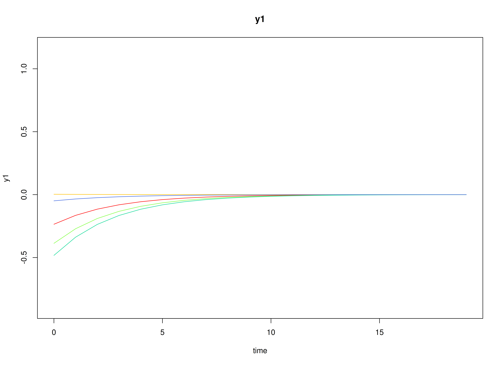
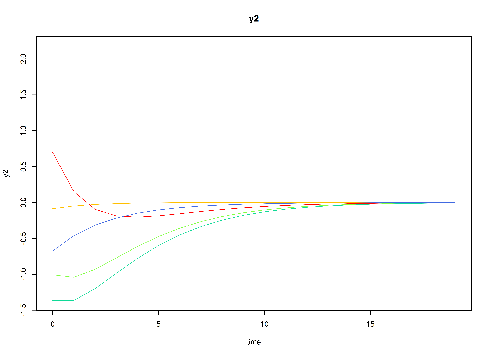
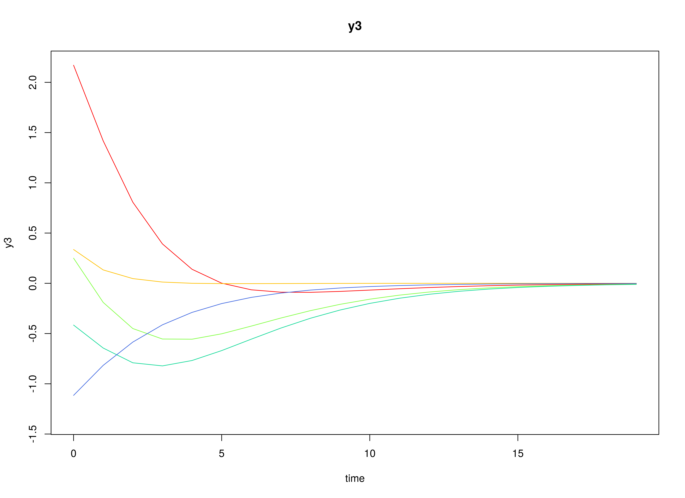
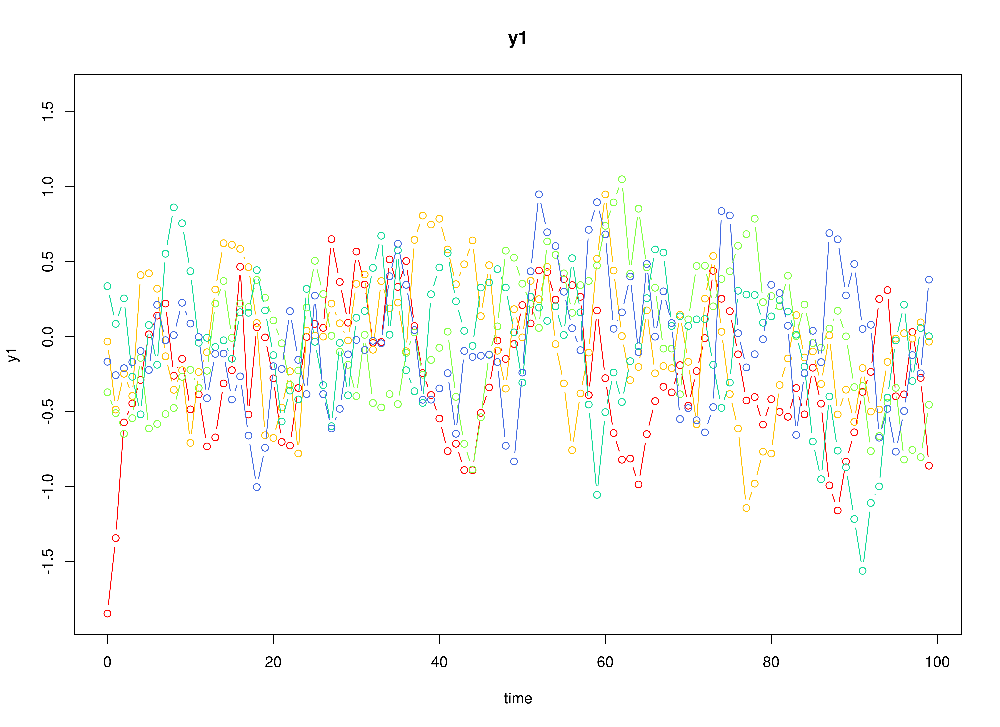
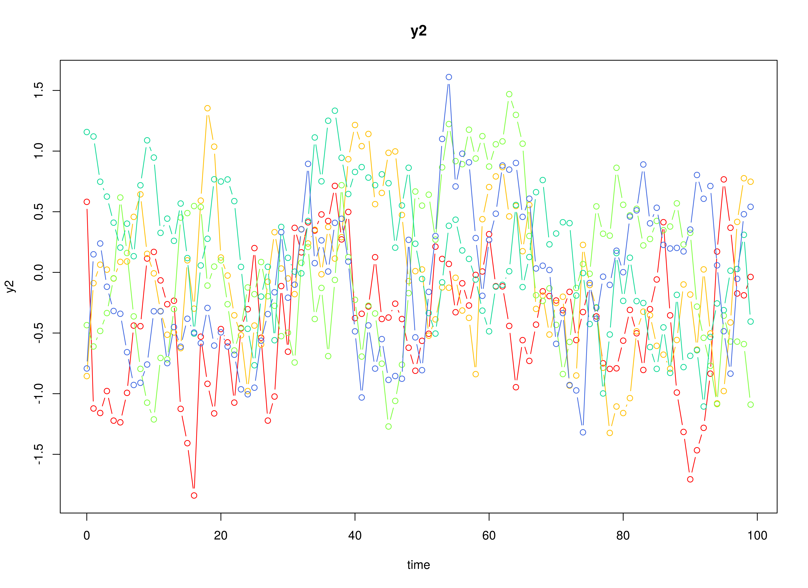
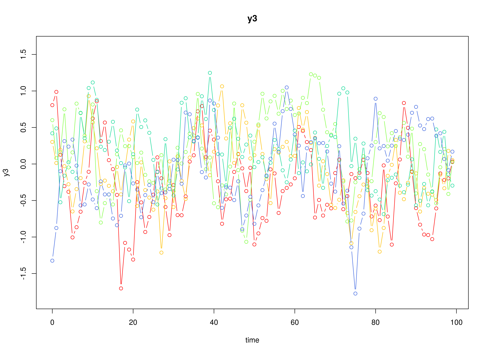
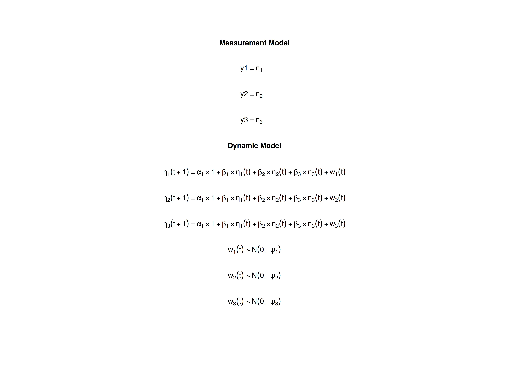

## Model

The measurement model is given by
\begin{equation}
  \mathbf{y}_{i, t}
  =
  \boldsymbol{\eta}_{i, t}
\end{equation}
where $\mathbf{y}_{i, t}$
represents a vector of observed variables
and $\boldsymbol{\eta}_{i, t}$
a vector of latent variables
for individual $i$ and time $t$.
Since the observed and latent variables are equal,
we only generate data
from the dynamic structure.

The dynamic structure is given by
\begin{equation}
  \boldsymbol{\eta}_{i, t}
  =
  \boldsymbol{\alpha}
  +
  \boldsymbol{\beta}
  \boldsymbol{\eta}_{i, t - 1}
  +
  \boldsymbol{\zeta}_{i, t},
  \quad
  \mathrm{with}
  \quad
  \boldsymbol{\zeta}_{i, t}
  \sim
  \mathcal{N}
  \left(
  \mathbf{0},
  \boldsymbol{\Psi}
  \right)
\end{equation}
where
$\boldsymbol{\eta}_{i, t}$,
$\boldsymbol{\eta}_{i, t - 1}$,
and
$\boldsymbol{\zeta}_{i, t}$
are random variables,
and
$\boldsymbol{\alpha}$,
$\boldsymbol{\beta}$,
and
$\boldsymbol{\Psi}$
are model parameters.
Here,
$\boldsymbol{\eta}_{i, t}$
is a vector of latent variables
at time $t$ and individual $i$,
$\boldsymbol{\eta}_{i, t - 1}$
represents a vector of latent variables
at time $t - 1$ and individual $i$,
and
$\boldsymbol{\zeta}_{i, t}$
represents a vector of dynamic noise
at time $t$ and individual $i$.
$\boldsymbol{\alpha}$
denotes a vector of intercepts,
$\boldsymbol{\beta}$
a matrix of autoregression
and cross regression coefficients,
and
$\boldsymbol{\Psi}$
the covariance matrix of
$\boldsymbol{\zeta}_{i, t}$.

An alternative representation of the dynamic noise
is given by
\begin{equation}
  \boldsymbol{\zeta}_{i, t}
  =
  \boldsymbol{\Psi}^{\frac{1}{2}}
  \mathbf{z}_{i, t},
  \quad
  \mathrm{with}
  \quad
  \mathbf{z}_{i, t}
  \sim
  \mathcal{N}
  \left(
  \mathbf{0},
  \mathbf{I}
  \right)
\end{equation}
where
$\left( \boldsymbol{\Psi}^{\frac{1}{2}} \right) \left( \boldsymbol{\Psi}^{\frac{1}{2}} \right)^{\prime} = \boldsymbol{\Psi}$ .

## Data Generation

### Notation

Let $t = 100$ be the number of time points and $n = 50$ be the number of individuals.

Let the initial condition
$\boldsymbol{\eta}_{0}$
be given by

\begin{equation}
\boldsymbol{\eta}_{0} \sim \mathcal{N} \left( \boldsymbol{\mu}_{\boldsymbol{\eta} \mid 0}, \boldsymbol{\Sigma}_{\boldsymbol{\eta} \mid 0} \right)
\end{equation}

\begin{equation}
\boldsymbol{\mu}_{\boldsymbol{\eta} \mid 0}
=
\left(
\begin{array}{c}
  0 \\
  0 \\
  0 \\
\end{array}
\right)
\end{equation}

\begin{equation}
\boldsymbol{\Sigma}_{\boldsymbol{\eta} \mid 0}
=
\left(
\begin{array}{ccc}
  0.1960784 & 0.1183232 & 0.0298539 \\
  0.1183232 & 0.3437711 & 0.1381855 \\
  0.0298539 & 0.1381855 & 0.2663828 \\
\end{array}
\right) .
\end{equation}

Let the constant vector $\boldsymbol{\alpha}$ be given by

\begin{equation}
\boldsymbol{\alpha}
=
\left(
\begin{array}{c}
  0 \\
  0 \\
  0 \\
\end{array}
\right) .
\end{equation}

Let the transition matrix $\boldsymbol{\beta}$ be given by

\begin{equation}
\boldsymbol{\beta}
=
\left(
\begin{array}{ccc}
  0.7 & 0 & 0 \\
  0.5 & 0.6 & 0 \\
  -0.1 & 0.4 & 0.5 \\
\end{array}
\right) .
\end{equation}

Let the dynamic process noise $\boldsymbol{\Psi}$ be given by

\begin{equation}
\boldsymbol{\Psi}
=
\left(
\begin{array}{ccc}
  0.1 & 0 & 0 \\
  0 & 0.1 & 0 \\
  0 & 0 & 0.1 \\
\end{array}
\right) .
\end{equation}

### R Function Arguments


``` r
n
#> [1] 50
time
#> [1] 100
mu0
#> [1] 0 0 0
sigma0
#>            [,1]      [,2]       [,3]
#> [1,] 0.19607843 0.1183232 0.02985385
#> [2,] 0.11832319 0.3437711 0.13818551
#> [3,] 0.02985385 0.1381855 0.26638284
sigma0_l # sigma0_l <- t(chol(sigma0))
#>            [,1]      [,2]     [,3]
#> [1,] 0.44280744 0.0000000 0.000000
#> [2,] 0.26721139 0.5218900 0.000000
#> [3,] 0.06741949 0.2302597 0.456966
alpha
#> [1] 0 0 0
beta
#>      [,1] [,2] [,3]
#> [1,]  0.7  0.0  0.0
#> [2,]  0.5  0.6  0.0
#> [3,] -0.1  0.4  0.5
psi
#>      [,1] [,2] [,3]
#> [1,]  0.1  0.0  0.0
#> [2,]  0.0  0.1  0.0
#> [3,]  0.0  0.0  0.1
psi_l # psi_l <- t(chol(psi))
#>           [,1]      [,2]      [,3]
#> [1,] 0.3162278 0.0000000 0.0000000
#> [2,] 0.0000000 0.3162278 0.0000000
#> [3,] 0.0000000 0.0000000 0.3162278
```

### Visualizing the Dynamics Without Process Noise (n = 5 with Different Initial Condition)



### Using the `SimSSMVARFixed` Function from the `simStateSpace` Package to Simulate Data


``` r
library(simStateSpace)
sim <- SimSSMVARFixed(
  n = n,
  time = time,
  mu0 = mu0,
  sigma0_l = sigma0_l,
  alpha = alpha,
  beta = beta,
  psi_l = psi_l
)
data <- as.data.frame(sim)
head(data)
#>   id time          y1          y2          y3
#> 1  1    0 -0.81728749  0.01319023  0.57975035
#> 2  1    1 -0.62264147 -0.94877859  0.54422379
#> 3  1    2 -0.06731464 -0.69530903 -0.09626706
#> 4  1    3 -0.09174342 -0.44804477 -0.27983813
#> 5  1    4 -0.04104160 -0.72769549 -0.19238403
#> 6  1    5  0.18907246 -0.81602072 -0.73831208
summary(data)
#>        id            time             y1                 y2          
#>  Min.   : 1.0   Min.   : 0.00   Min.   :-1.56057   Min.   :-2.13650  
#>  1st Qu.:13.0   1st Qu.:24.75   1st Qu.:-0.30860   1st Qu.:-0.41897  
#>  Median :25.5   Median :49.50   Median :-0.01576   Median :-0.01538  
#>  Mean   :25.5   Mean   :49.50   Mean   :-0.01268   Mean   :-0.01868  
#>  3rd Qu.:38.0   3rd Qu.:74.25   3rd Qu.: 0.27997   3rd Qu.: 0.36763  
#>  Max.   :50.0   Max.   :99.00   Max.   : 1.56537   Max.   : 2.06541  
#>        y3           
#>  Min.   :-1.774215  
#>  1st Qu.:-0.359065  
#>  Median :-0.008017  
#>  Mean   :-0.008199  
#>  3rd Qu.: 0.342621  
#>  Max.   : 1.817859
plot(sim)
```



## Model Fitting

### Prepare Data


``` r
dynr_data <- dynr::dynr.data(
  data = data,
  id = "id",
  time = "time",
  observed = c("y1", "y2", "y3")
)
```

### Prepare Initial Condition


``` r
dynr_initial <- dynr::prep.initial(
  values.inistate = mu0,
  params.inistate = c("mu0_1_1", "mu0_2_1", "mu0_3_1"),
  values.inicov = sigma0,
  params.inicov = matrix(
    data = c(
      "sigma0_1_1", "sigma0_2_1", "sigma0_3_1",
      "sigma0_2_1", "sigma0_2_2", "sigma0_3_2",
      "sigma0_3_1", "sigma0_3_2", "sigma0_3_3"
    ),
    nrow = 3
  )
)
```

### Prepare Measurement Model


``` r
dynr_measurement <- dynr::prep.measurement(
  values.load = diag(3),
  params.load = matrix(data = "fixed", nrow = 3, ncol = 3),
  state.names = c("eta_1", "eta_2", "eta_3"),
  obs.names = c("y1", "y2", "y3")
)
```

### Prepare Dynamic Process


``` r
dynr_dynamics <- dynr::prep.formulaDynamics(
  formula = list(
    eta_1 ~ alpha_1_1 * 1 + beta_1_1 * eta_1 + beta_1_2 * eta_2 + beta_1_3 * eta_3,
    eta_2 ~ alpha_2_1 * 1 + beta_2_1 * eta_1 + beta_2_2 * eta_2 + beta_2_3 * eta_3,
    eta_3 ~ alpha_3_1 * 1 + beta_3_1 * eta_1 + beta_3_2 * eta_2 + beta_3_3 * eta_3
  ),
  startval = c(
    alpha_1_1 = alpha[1], alpha_2_1 = alpha[2], alpha_3_1 = alpha[3],
    beta_1_1 = beta[1, 1], beta_1_2 = beta[1, 2], beta_1_3 = beta[1, 3],
    beta_2_1 = beta[2, 1], beta_2_2 = beta[2, 2], beta_2_3 = beta[2, 3],
    beta_3_1 = beta[3, 1], beta_3_2 = beta[3, 2], beta_3_3 = beta[3, 3]
  ),
  isContinuousTime = FALSE
)
```

### Prepare Process Noise


``` r
dynr_noise <- dynr::prep.noise(
  values.latent = psi,
  params.latent = matrix(
    data = c(
      "psi_1_1", "psi_2_1", "psi_3_1",
      "psi_2_1", "psi_2_2", "psi_3_2",
      "psi_3_1", "psi_3_2", "psi_3_3"
    ),
    nrow = 3
  ),
  values.observed = matrix(data = 0, nrow = 3, ncol = 3),
  params.observed = matrix(data = "fixed", nrow = 3, ncol = 3)
)
```

### Prepare the Model


``` r
model <- dynr::dynr.model(
  data = dynr_data,
  initial = dynr_initial,
  measurement = dynr_measurement,
  dynamics = dynr_dynamics,
  noise = dynr_noise,
  outfile = "var.c"
)
```



### Fit the Model


``` r
results <- dynr::dynr.cook(
  model,
  debug_flag = TRUE,
  verbose = FALSE
)
#> [1] "Get ready!!!!"
#> using C compiler: ‘gcc (Ubuntu 13.3.0-6ubuntu2~24.04.1) 13.3.0’
#> Optimization function called.
#> Starting Hessian calculation ...
#> Finished Hessian calculation.
#> Original exit flag:  3 
#> Modified exit flag:  3 
#> Optimization terminated successfully: ftol_rel or ftol_abs was reached. 
#> Original fitted parameters:  -0.003284365 -0.001148184 0.001494587 0.6897441 
#> 0.01137214 -0.003387579 0.4898858 0.6160575 -0.008960046 -0.1131284 0.4163746 
#> 0.4936447 -2.313902 -0.02218074 -0.01649373 -2.30124 -0.01213846 -2.302741 
#> -0.07710229 -0.03574488 0.04106656 -1.710487 0.298569 -0.008452929 -1.172653 
#> 0.2872546 -1.614795 
#> 
#> Transformed fitted parameters:  -0.003284365 -0.001148184 0.001494587 0.6897441 
#> 0.01137214 -0.003387579 0.4898858 0.6160575 -0.008960046 -0.1131284 0.4163746 
#> 0.4936447 0.09887472 -0.002193114 -0.001630813 0.1001833 -0.001179307 0.1000261 
#> -0.07710229 -0.03574488 0.04106656 0.1807777 0.05397461 -0.001528101 0.3256598 
#> 0.08846188 0.2244866 
#> 
#> Doing end processing
#> Successful trial
#> Total Time: 2.951007 
#> Backend Time: 2.942621
```

## Summary


``` r
summary(results)
#> Coefficients:
#>              Estimate Std. Error t value   ci.lower   ci.upper Pr(>|t|)    
#> alpha_1_1  -0.0032844  0.0044721  -0.734 -0.0120496  0.0054809   0.2314    
#> alpha_2_1  -0.0011482  0.0045016  -0.255 -0.0099712  0.0076749   0.3993    
#> alpha_3_1   0.0014946  0.0044981   0.332 -0.0073215  0.0103107   0.3698    
#> beta_1_1    0.6897441  0.0114346  60.321  0.6673327  0.7121555   <2e-16 ***
#> beta_1_2    0.0113721  0.0095136   1.195 -0.0072742  0.0300185   0.1160    
#> beta_1_3   -0.0033876  0.0096849  -0.350 -0.0223697  0.0155945   0.3633    
#> beta_2_1    0.4898858  0.0115100  42.562  0.4673267  0.5124449   <2e-16 ***
#> beta_2_2    0.6160575  0.0095765  64.330  0.5972880  0.6348271   <2e-16 ***
#> beta_2_3   -0.0089600  0.0097488  -0.919 -0.0280674  0.0101473   0.1790    
#> beta_3_1   -0.1131284  0.0115013  -9.836 -0.1356705 -0.0905864   <2e-16 ***
#> beta_3_2    0.4163746  0.0095691  43.513  0.3976196  0.4351296   <2e-16 ***
#> beta_3_3    0.4936447  0.0097412  50.676  0.4745522  0.5127372   <2e-16 ***
#> psi_1_1     0.0988747  0.0019874  49.750  0.0949794  0.1027700   <2e-16 ***
#> psi_2_1    -0.0021931  0.0014149  -1.550 -0.0049663  0.0005801   0.0606 .  
#> psi_3_1    -0.0016308  0.0014137  -1.154 -0.0044015  0.0011399   0.1244    
#> psi_2_2     0.1001833  0.0020137  49.750  0.0962364  0.1041301   <2e-16 ***
#> psi_3_2    -0.0011793  0.0014229  -0.829 -0.0039681  0.0016095   0.2036    
#> psi_3_3     0.1000261  0.0020106  49.750  0.0960854  0.1039668   <2e-16 ***
#> mu0_1_1    -0.0771023  0.0601294  -1.282 -0.1949537  0.0407491   0.0999 .  
#> mu0_2_1    -0.0357449  0.0807102  -0.443 -0.1939340  0.1224442   0.3289    
#> mu0_3_1     0.0410666  0.0670053   0.613 -0.0902614  0.1723945   0.2700    
#> sigma0_1_1  0.1807777  0.0361588   5.000  0.1099078  0.2516475   <2e-16 ***
#> sigma0_2_1  0.0539746  0.0351576   1.535 -0.0149329  0.1228822   0.0624 .  
#> sigma0_3_1 -0.0015281  0.0284944  -0.054 -0.0573760  0.0543198   0.4786    
#> sigma0_2_2  0.3256598  0.0651281   5.000  0.1980111  0.4533085   <2e-16 ***
#> sigma0_3_2  0.0884619  0.0402305   2.199  0.0096115  0.1673123   0.0140 *  
#> sigma0_3_3  0.2244866  0.0448956   5.000  0.1364928  0.3124804   <2e-16 ***
#> ---
#> Signif. codes:  0 '***' 0.001 '**' 0.01 '*' 0.05 '.' 0.1 ' ' 1
#> 
#> -2 log-likelihood value at convergence = 8100.72
#> AIC = 8154.72
#> BIC = 8330.69
```


### Parameter Estimates


``` r
alpha_hat
#> [1] -0.003284365 -0.001148184  0.001494587
beta_hat
#>            [,1]       [,2]         [,3]
#> [1,]  0.6897441 0.01137214 -0.003387579
#> [2,]  0.4898858 0.61605754 -0.008960046
#> [3,] -0.1131284 0.41637458  0.493644688
psi_hat
#>              [,1]         [,2]         [,3]
#> [1,]  0.098874720 -0.002193114 -0.001630813
#> [2,] -0.002193114  0.100183275 -0.001179307
#> [3,] -0.001630813 -0.001179307  0.100026085
mu0_hat
#> [1] -0.07710229 -0.03574488  0.04106656
sigma0_hat
#>              [,1]       [,2]         [,3]
#> [1,]  0.180777668 0.05397461 -0.001528101
#> [2,]  0.053974614 0.32565983  0.088461877
#> [3,] -0.001528101 0.08846188  0.224486593
```

## References


