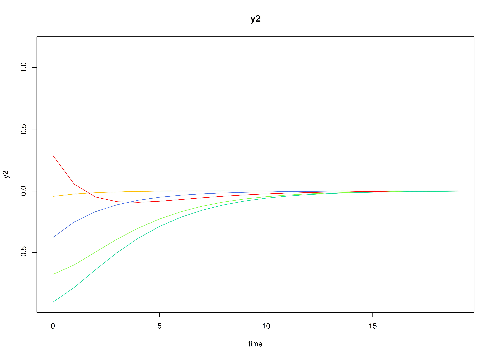

## Model

The measurement model is given by
\begin{equation}
  \mathbf{y}_{i, t}
  =
  \boldsymbol{\eta}_{i, t}
\end{equation}
where $\mathbf{y}_{i, t}$
represents a vector of observed variables
and $\boldsymbol{\eta}_{i, t}$
a vector of latent variables
for individual $i$ and time $t$.
Since the observed and latent variables are equal,
we only generate data
from the dynamic structure.

The dynamic structure is given by
\begin{equation}
  \boldsymbol{\eta}_{i, t}
  =
  \boldsymbol{\alpha}
  +
  \boldsymbol{\beta}
  \boldsymbol{\eta}_{i, t - 1}
  +
  \boldsymbol{\zeta}_{i, t},
  \quad
  \mathrm{with}
  \quad
  \boldsymbol{\zeta}_{i, t}
  \sim
  \mathcal{N}
  \left(
  \mathbf{0},
  \boldsymbol{\Psi}
  \right)
\end{equation}
where
$\boldsymbol{\eta}_{i, t}$,
$\boldsymbol{\eta}_{i, t - 1}$,
and
$\boldsymbol{\zeta}_{i, t}$
are random variables,
and
$\boldsymbol{\alpha}$,
$\boldsymbol{\beta}$,
and
$\boldsymbol{\Psi}$
are model parameters.
Here,
$\boldsymbol{\eta}_{i, t}$
is a vector of latent variables
at time $t$ and individual $i$,
$\boldsymbol{\eta}_{i, t - 1}$
represents a vector of latent variables
at time $t - 1$ and individual $i$,
and
$\boldsymbol{\zeta}_{i, t}$
represents a vector of dynamic noise
at time $t$ and individual $i$.
$\boldsymbol{\alpha}$
denotes a vector of intercepts,
$\boldsymbol{\beta}$
a matrix of autoregression
and cross regression coefficients,
and
$\boldsymbol{\Psi}$
the covariance matrix of
$\boldsymbol{\zeta}_{i, t}$.

An alternative representation of the dynamic noise
is given by
\begin{equation}
  \boldsymbol{\zeta}_{i, t}
  =
  \boldsymbol{\Psi}^{\frac{1}{2}}
  \mathbf{z}_{i, t},
  \quad
  \mathrm{with}
  \quad
  \mathbf{z}_{i, t}
  \sim
  \mathcal{N}
  \left(
  \mathbf{0},
  \mathbf{I}
  \right)
\end{equation}
where
$\left( \boldsymbol{\Psi}^{\frac{1}{2}} \right) \left( \boldsymbol{\Psi}^{\frac{1}{2}} \right)^{\prime} = \boldsymbol{\Psi}$ .

## Data Generation

### Notation

Let $t = 500$ be the number of time points and $n = 50$ be the number of individuals.

Let the initial condition
$\boldsymbol{\eta}_{0}$
be given by

\begin{equation}
\boldsymbol{\eta}_{0} \sim \mathcal{N} \left( \boldsymbol{\mu}_{\boldsymbol{\eta} \mid 0}, \boldsymbol{\Sigma}_{\boldsymbol{\eta} \mid 0} \right)
\end{equation}

\begin{equation}
\boldsymbol{\mu}_{\boldsymbol{\eta} \mid 0}
=
\left(
\begin{array}{c}
  0 \\
  0 \\
  0 \\
\end{array}
\right)
\end{equation}

\begin{equation}
\boldsymbol{\Sigma}_{\boldsymbol{\eta} \mid 0}
=
\left(
\begin{array}{ccc}
  1 & 0.2 & 0.2 \\
  0.2 & 1 & 0.2 \\
  0.2 & 0.2 & 1 \\
\end{array}
\right) .
\end{equation}

Let the constant vector $\boldsymbol{\alpha}$ be given by

\begin{equation}
\boldsymbol{\alpha}
=
\left(
\begin{array}{c}
  0 \\
  0 \\
  0 \\
\end{array}
\right) .
\end{equation}

Let the transition matrix $\boldsymbol{\beta}$ be given by

\begin{equation}
\boldsymbol{\beta}
=
\left(
\begin{array}{ccc}
  0.7 & 0 & 0 \\
  0.5 & 0.6 & 0 \\
  -0.1 & 0.4 & 0.5 \\
\end{array}
\right) .
\end{equation}

Let the dynamic process noise $\boldsymbol{\Psi}$ be given by

\begin{equation}
\boldsymbol{\Psi}
=
\left(
\begin{array}{ccc}
  0.1 & 0 & 0 \\
  0 & 0.1 & 0 \\
  0 & 0 & 0.1 \\
\end{array}
\right) .
\end{equation}

### R Function Arguments


``` r
n
#> [1] 50
time
#> [1] 500
mu0
#> [1] 0 0 0
sigma0
#>      [,1] [,2] [,3]
#> [1,]  1.0  0.2  0.2
#> [2,]  0.2  1.0  0.2
#> [3,]  0.2  0.2  1.0
sigma0_l # sigma0_l <- t(chol(sigma0))
#>      [,1]      [,2]      [,3]
#> [1,]  1.0 0.0000000 0.0000000
#> [2,]  0.2 0.9797959 0.0000000
#> [3,]  0.2 0.1632993 0.9660918
alpha
#> [1] 0 0 0
beta
#>      [,1] [,2] [,3]
#> [1,]  0.7  0.0  0.0
#> [2,]  0.5  0.6  0.0
#> [3,] -0.1  0.4  0.5
psi
#>      [,1] [,2] [,3]
#> [1,]  0.1  0.0  0.0
#> [2,]  0.0  0.1  0.0
#> [3,]  0.0  0.0  0.1
psi_l # psi_l <- t(chol(psi))
#>           [,1]      [,2]      [,3]
#> [1,] 0.3162278 0.0000000 0.0000000
#> [2,] 0.0000000 0.3162278 0.0000000
#> [3,] 0.0000000 0.0000000 0.3162278
```

### Visualizing the Dynamics Without Process Noise (n = 5 with Different Initial Condition)



### Using the `SimSSMVARFixed` Function from the `simStateSpace` Package to Simulate Data


``` r
library(simStateSpace)
sim <- SimSSMVARFixed(
  n = n,
  time = time,
  mu0 = mu0,
  sigma0_l = sigma0_l,
  alpha = alpha,
  beta = beta,
  psi_l = psi_l
)
data <- as.data.frame(sim)
head(data)
#>   id time          y1         y2         y3
#> 1  1    0 -1.84569501  0.5815402  0.8057225
#> 2  1    1 -1.34252674 -1.1219724  0.9873906
#> 3  1    2 -0.57123433 -1.1591679  0.1280274
#> 4  1    3 -0.44448720 -0.9783200 -0.3028425
#> 5  1    4 -0.28796224 -1.2222325 -0.3807219
#> 6  1    5  0.01622801 -1.2362032 -1.0056038
summary(data)
#>        id            time             y1                  y2           
#>  Min.   : 1.0   Min.   :  0.0   Min.   :-1.845695   Min.   :-2.594875  
#>  1st Qu.:13.0   1st Qu.:124.8   1st Qu.:-0.290765   1st Qu.:-0.392745  
#>  Median :25.5   Median :249.5   Median : 0.005445   Median : 0.004179  
#>  Mean   :25.5   Mean   :249.5   Mean   : 0.004639   Mean   : 0.002770  
#>  3rd Qu.:38.0   3rd Qu.:374.2   3rd Qu.: 0.301202   3rd Qu.: 0.397590  
#>  Max.   :50.0   Max.   :499.0   Max.   : 2.012563   Max.   : 2.835721  
#>        y3           
#>  Min.   :-2.507723  
#>  1st Qu.:-0.346163  
#>  Median : 0.002701  
#>  Mean   : 0.002106  
#>  3rd Qu.: 0.349838  
#>  Max.   : 2.016832
plot(sim)
```


## Model Fitting

### Prepare Data


``` r
dynr_data <- dynr::dynr.data(
  data = data,
  id = "id",
  time = "time",
  observed = c("y1", "y2", "y3")
)
```

### Prepare Initial Condition


``` r
dynr_initial <- dynr::prep.initial(
  values.inistate = mu0,
  params.inistate = c("mu0_1_1", "mu0_2_1", "mu0_3_1"),
  values.inicov = sigma0,
  params.inicov = matrix(
    data = c(
      "sigma0_1_1", "sigma0_2_1", "sigma0_3_1",
      "sigma0_2_1", "sigma0_2_2", "sigma0_3_2",
      "sigma0_3_1", "sigma0_3_2", "sigma0_3_3"
    ),
    nrow = 3
  )
)
```

### Prepare Measurement Model


``` r
dynr_measurement <- dynr::prep.measurement(
  values.load = diag(3),
  params.load = matrix(data = "fixed", nrow = 3, ncol = 3),
  state.names = c("eta_1", "eta_2", "eta_3"),
  obs.names = c("y1", "y2", "y3")
)
```

### Prepare Dynamic Process


``` r
dynr_dynamics <- dynr::prep.formulaDynamics(
  formula = list(
    eta_1 ~ alpha_1_1 * 1 + beta_1_1 * eta_1 + beta_1_2 * eta_2 + beta_1_3 * eta_3,
    eta_2 ~ alpha_2_1 * 1 + beta_2_1 * eta_1 + beta_2_2 * eta_2 + beta_2_3 * eta_3,
    eta_3 ~ alpha_3_1 * 1 + beta_3_1 * eta_1 + beta_3_2 * eta_2 + beta_3_3 * eta_3
  ),
  startval = c(
    alpha_1_1 = alpha[1], alpha_2_1 = alpha[2], alpha_3_1 = alpha[3],
    beta_1_1 = beta[1, 1], beta_1_2 = beta[1, 2], beta_1_3 = beta[1, 3],
    beta_2_1 = beta[2, 1], beta_2_2 = beta[2, 2], beta_2_3 = beta[2, 3],
    beta_3_1 = beta[3, 1], beta_3_2 = beta[3, 2], beta_3_3 = beta[3, 3]
  ),
  isContinuousTime = FALSE
)
```

### Prepare Process Noise


``` r
dynr_noise <- dynr::prep.noise(
  values.latent = psi,
  params.latent = matrix(
    data = c(
      "psi_1_1", "psi_2_1", "psi_3_1",
      "psi_2_1", "psi_2_2", "psi_3_2",
      "psi_3_1", "psi_3_2", "psi_3_3"
    ),
    nrow = 3
  ),
  values.observed = matrix(data = 0, nrow = 3, ncol = 3),
  params.observed = matrix(data = "fixed", nrow = 3, ncol = 3)
)
```

### Prepare the Model


``` r
model <- dynr::dynr.model(
  data = dynr_data,
  initial = dynr_initial,
  measurement = dynr_measurement,
  dynamics = dynr_dynamics,
  noise = dynr_noise,
  outfile = "var.c"
)
```


### Fit the Model


``` r
results <- dynr::dynr.cook(
  model,
  debug_flag = TRUE,
  verbose = FALSE
)
#> [1] "Get ready!!!!"
#> using C compiler: ‘gcc (Ubuntu 13.3.0-6ubuntu2~24.04) 13.3.0’
#> Optimization function called.
#> Starting Hessian calculation ...
#> Finished Hessian calculation.
#> Original exit flag:  3 
#> Modified exit flag:  3 
#> Optimization terminated successfully: ftol_rel or ftol_abs was reached. 
#> Original fitted parameters:  0.001317321 -0.001170956 4.044216e-05 0.6914875 
#> 0.004855469 -0.01149609 0.4928824 0.6037306 -0.0001035079 -0.1010248 0.403324 
#> 0.5027337 -2.30207 -0.004853307 0.006134204 -2.323209 0.00127836 -2.301699 
#> 0.1031406 0.008200674 0.1061838 -0.1054137 -0.1544675 0.1484146 0.03534545 
#> 0.1691991 -0.06958661 
#> 
#> Transformed fitted parameters:  0.001317321 -0.001170956 4.044216e-05 0.6914875 
#> 0.004855469 -0.01149609 0.4928824 0.6037306 -0.0001035079 -0.1010248 0.403324 
#> 0.5027337 0.1000515 -0.0004855808 0.0006137364 0.09796105 0.0001222478 
#> 0.1000925 0.1031406 0.008200674 0.1061838 0.8999521 -0.1390134 0.1335661 
#> 1.057451 0.1546548 0.9822608 
#> 
#> Doing end processing
#> Successful trial
#> Total Time: 19.01458 
#> Backend Time: 19.00579
```

## Summary


``` r
summary(results)
#> Coefficients:
#>              Estimate Std. Error t value   ci.lower   ci.upper Pr(>|t|)    
#> alpha_1_1   1.317e-03  2.003e-03   0.658 -2.608e-03  5.242e-03    0.255    
#> alpha_2_1  -1.171e-03  1.982e-03  -0.591 -5.055e-03  2.713e-03    0.277    
#> alpha_3_1   4.044e-05  2.003e-03   0.020 -3.885e-03  3.966e-03    0.492    
#> beta_1_1    6.915e-01  5.074e-03 136.270  6.815e-01  7.014e-01   <2e-16 ***
#> beta_1_2    4.855e-03  4.297e-03   1.130 -3.566e-03  1.328e-02    0.129    
#> beta_1_3   -1.150e-02  4.341e-03  -2.648 -2.000e-02 -2.989e-03    0.004 ** 
#> beta_2_1    4.929e-01  5.021e-03  98.162  4.830e-01  5.027e-01   <2e-16 ***
#> beta_2_2    6.037e-01  4.252e-03 141.992  5.954e-01  6.121e-01   <2e-16 ***
#> beta_2_3   -1.035e-04  4.295e-03  -0.024 -8.522e-03  8.315e-03    0.490    
#> beta_3_1   -1.010e-01  5.075e-03 -19.905 -1.110e-01 -9.108e-02   <2e-16 ***
#> beta_3_2    4.033e-01  4.298e-03  93.847  3.949e-01  4.117e-01   <2e-16 ***
#> beta_3_3    5.027e-01  4.342e-03 115.795  4.942e-01  5.112e-01   <2e-16 ***
#> psi_1_1     1.001e-01  8.958e-04 111.693  9.830e-02  1.018e-01   <2e-16 ***
#> psi_2_1    -4.856e-04  6.268e-04  -0.775 -1.714e-03  7.428e-04    0.219    
#> psi_3_1     6.137e-04  6.335e-04   0.969 -6.280e-04  1.855e-03    0.166    
#> psi_2_2     9.796e-02  8.771e-04 111.691  9.624e-02  9.968e-02   <2e-16 ***
#> psi_3_2     1.222e-04  6.269e-04   0.195 -1.106e-03  1.351e-03    0.423    
#> psi_3_3     1.001e-01  8.961e-04 111.692  9.834e-02  1.018e-01   <2e-16 ***
#> mu0_1_1     1.031e-01  1.343e-01   0.768 -1.600e-01  3.663e-01    0.221    
#> mu0_2_1     8.201e-03  1.457e-01   0.056 -2.773e-01  2.937e-01    0.478    
#> mu0_3_1     1.062e-01  1.402e-01   0.758 -1.685e-01  3.809e-01    0.224    
#> sigma0_1_1  9.000e-01  1.797e-01   5.009  5.478e-01  1.252e+00   <2e-16 ***
#> sigma0_2_1 -1.390e-01  1.396e-01  -0.996 -4.125e-01  1.345e-01    0.160    
#> sigma0_3_1  1.336e-01  1.343e-01   0.995 -1.296e-01  3.968e-01    0.160    
#> sigma0_2_2  1.057e+00  2.118e-01   4.993  6.424e-01  1.473e+00   <2e-16 ***
#> sigma0_3_2  1.547e-01  1.459e-01   1.060 -1.313e-01  4.406e-01    0.144    
#> sigma0_3_3  9.823e-01  1.964e-01   5.000  5.972e-01  1.367e+00   <2e-16 ***
#> ---
#> Signif. codes:  0 '***' 0.001 '**' 0.01 '*' 0.05 '.' 0.1 ' ' 1
#> 
#> -2 log-likelihood value at convergence = 40010.51
#> AIC = 40064.51
#> BIC = 40283.93
```


### Parameter Estimates


``` r
alpha_hat
#> [1]  1.317321e-03 -1.170956e-03  4.044216e-05
beta_hat
#>            [,1]        [,2]          [,3]
#> [1,]  0.6914875 0.004855469 -0.0114960850
#> [2,]  0.4928824 0.603730589 -0.0001035079
#> [3,] -0.1010248 0.403324000  0.5027336728
psi_hat
#>               [,1]          [,2]         [,3]
#> [1,]  0.1000515232 -0.0004855808 0.0006137364
#> [2,] -0.0004855808  0.0979610475 0.0001222478
#> [3,]  0.0006137364  0.0001222478 0.1000925298
mu0_hat
#> [1] 0.103140642 0.008200674 0.106183803
sigma0_hat
#>            [,1]       [,2]      [,3]
#> [1,]  0.8999521 -0.1390134 0.1335661
#> [2,] -0.1390134  1.0574506 0.1546548
#> [3,]  0.1335661  0.1546548 0.9822608
```

## References


