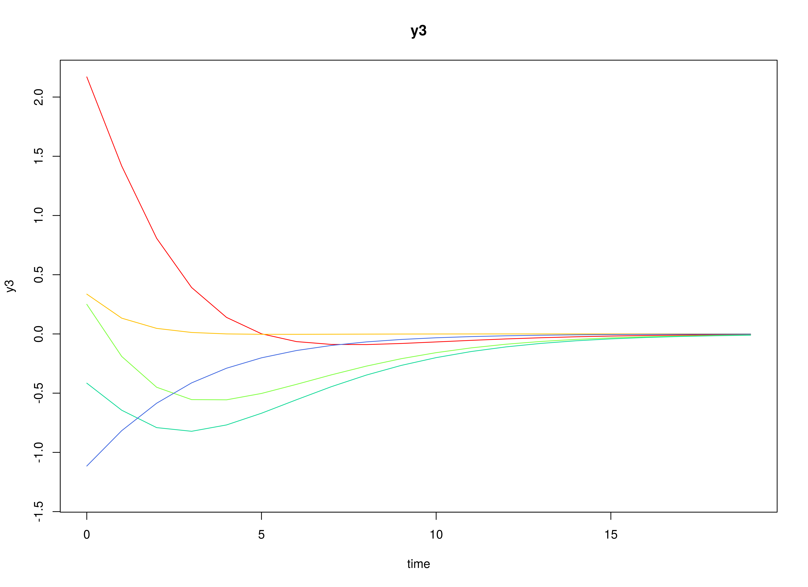

## Model

The measurement model is given by
\begin{equation}
  \mathbf{y}_{i, t}
  =
  \boldsymbol{\eta}_{i, t}
\end{equation}
where $\mathbf{y}_{i, t}$
represents a vector of observed variables
and $\boldsymbol{\eta}_{i, t}$
a vector of latent variables
for individual $i$ and time $t$.
Since the observed and latent variables are equal,
we only generate data
from the dynamic structure.

The dynamic structure is given by
\begin{equation}
  \boldsymbol{\eta}_{i, t}
  =
  \boldsymbol{\alpha}
  +
  \boldsymbol{\beta}
  \boldsymbol{\eta}_{i, t - 1}
  +
  \boldsymbol{\zeta}_{i, t},
  \quad
  \mathrm{with}
  \quad
  \boldsymbol{\zeta}_{i, t}
  \sim
  \mathcal{N}
  \left(
  \mathbf{0},
  \boldsymbol{\Psi}
  \right)
\end{equation}
where
$\boldsymbol{\eta}_{i, t}$,
$\boldsymbol{\eta}_{i, t - 1}$,
and
$\boldsymbol{\zeta}_{i, t}$
are random variables,
and
$\boldsymbol{\alpha}$,
$\boldsymbol{\beta}$,
and
$\boldsymbol{\Psi}$
are model parameters.
Here,
$\boldsymbol{\eta}_{i, t}$
is a vector of latent variables
at time $t$ and individual $i$,
$\boldsymbol{\eta}_{i, t - 1}$
represents a vector of latent variables
at time $t - 1$ and individual $i$,
and
$\boldsymbol{\zeta}_{i, t}$
represents a vector of dynamic noise
at time $t$ and individual $i$.
$\boldsymbol{\alpha}$
denotes a vector of intercepts,
$\boldsymbol{\beta}$
a matrix of autoregression
and cross regression coefficients,
and
$\boldsymbol{\Psi}$
the covariance matrix of
$\boldsymbol{\zeta}_{i, t}$.

An alternative representation of the dynamic noise
is given by
\begin{equation}
  \boldsymbol{\zeta}_{i, t}
  =
  \boldsymbol{\Psi}^{\frac{1}{2}}
  \mathbf{z}_{i, t},
  \quad
  \mathrm{with}
  \quad
  \mathbf{z}_{i, t}
  \sim
  \mathcal{N}
  \left(
  \mathbf{0},
  \mathbf{I}
  \right)
\end{equation}
where
$\left( \boldsymbol{\Psi}^{\frac{1}{2}} \right) \left( \boldsymbol{\Psi}^{\frac{1}{2}} \right)^{\prime} = \boldsymbol{\Psi}$ .

## Data Generation

### Notation

Let $t = 100$ be the number of time points and $n = 5$ be the number of individuals.

Let the initial condition
$\boldsymbol{\eta}_{0}$
be given by

\begin{equation}
\boldsymbol{\eta}_{0} \sim \mathcal{N} \left( \boldsymbol{\mu}_{\boldsymbol{\eta} \mid 0}, \boldsymbol{\Sigma}_{\boldsymbol{\eta} \mid 0} \right)
\end{equation}

\begin{equation}
\boldsymbol{\mu}_{\boldsymbol{\eta} \mid 0}
=
\left(
\begin{array}{c}
  0 \\
  0 \\
  0 \\
\end{array}
\right)
\end{equation}

\begin{equation}
\boldsymbol{\Sigma}_{\boldsymbol{\eta} \mid 0}
=
\left(
\begin{array}{ccc}
  1 & 0.2 & 0.2 \\
  0.2 & 1 & 0.2 \\
  0.2 & 0.2 & 1 \\
\end{array}
\right) .
\end{equation}

Let the constant vector $\boldsymbol{\alpha}$ be given by

\begin{equation}
\boldsymbol{\alpha}
=
\left(
\begin{array}{c}
  0 \\
  0 \\
  0 \\
\end{array}
\right) .
\end{equation}

Let the transition matrix $\boldsymbol{\beta}$ be given by

\begin{equation}
\boldsymbol{\beta}
=
\left(
\begin{array}{ccc}
  0.7 & 0 & 0 \\
  0.5 & 0.6 & 0 \\
  -0.1 & 0.4 & 0.5 \\
\end{array}
\right) .
\end{equation}

Let the dynamic process noise $\boldsymbol{\Psi}$ be given by

\begin{equation}
\boldsymbol{\Psi}
=
\left(
\begin{array}{ccc}
  0.1 & 0 & 0 \\
  0 & 0.1 & 0 \\
  0 & 0 & 0.1 \\
\end{array}
\right) .
\end{equation}

### R Function Arguments


```r
n
#> [1] 5
time
#> [1] 100
mu0
#> [1] 0 0 0
sigma0
#>      [,1] [,2] [,3]
#> [1,]  1.0  0.2  0.2
#> [2,]  0.2  1.0  0.2
#> [3,]  0.2  0.2  1.0
sigma0_l
#>      [,1]      [,2]      [,3]
#> [1,]  1.0 0.0000000 0.0000000
#> [2,]  0.2 0.9797959 0.0000000
#> [3,]  0.2 0.1632993 0.9660918
alpha
#> [1] 0 0 0
beta
#>      [,1] [,2] [,3]
#> [1,]  0.7  0.0  0.0
#> [2,]  0.5  0.6  0.0
#> [3,] -0.1  0.4  0.5
psi
#>      [,1] [,2] [,3]
#> [1,]  0.1  0.0  0.0
#> [2,]  0.0  0.1  0.0
#> [3,]  0.0  0.0  0.1
psi_l
#>           [,1]      [,2]      [,3]
#> [1,] 0.3162278 0.0000000 0.0000000
#> [2,] 0.0000000 0.3162278 0.0000000
#> [3,] 0.0000000 0.0000000 0.3162278
```

### Visualizing the Dynamics Without Process Noise ($n = 5$ with Different Initial Condition)



### Using the SimSSMVARFixed Function from the simStateSpace Package to Simulate Data


```r
library(simStateSpace)
sim <- SimSSMVARFixed(
  n = n,
  time = time,
  mu0 = mu0,
  sigma0_l = sigma0_l,
  alpha = alpha,
  beta = beta,
  psi_l = psi_l
)
data <- as.data.frame(sim)
head(data)
#>   id time          y1         y2         y3
#> 1  1    0 -1.84569501  0.5815402  0.8057225
#> 2  1    1 -1.34252674 -1.1219724  0.9873906
#> 3  1    2 -0.57123433 -1.1591679  0.1280274
#> 4  1    3 -0.44448720 -0.9783200 -0.3028425
#> 5  1    4 -0.28796224 -1.2222325 -0.3807219
#> 6  1    5  0.01622801 -1.2362032 -1.0056038
plot(sim)
```


## Model Fitting

### Prepare Data


```r
dynr_data <- dynr::dynr.data(
  data = data,
  id = "id",
  time = "time",
  observed = c("y1", "y2", "y3")
)
```

### Prepare Initial Condition


```r
dynr_initial <- dynr::prep.initial(
  values.inistate = mu0,
  params.inistate = c("mu0_1", "mu0_2", "mu0_3"),
  values.inicov = sigma0,
  params.inicov = matrix(
    data = c(
      "sigma0_11", "sigma0_12", "sigma0_13",
      "sigma0_12", "sigma0_22", "sigma0_23",
      "sigma0_13", "sigma0_23", "sigma0_33"
    ),
    nrow = 3
  )
)
```

### Prepare Measurement Model


```r
dynr_measurement <- dynr::prep.measurement(
  values.load = diag(3),
  params.load = matrix(data = "fixed", nrow = 3, ncol = 3),
  state.names = c("eta_1", "eta_2", "eta_3"),
  obs.names = c("y1", "y2", "y3")
)
```

### Prepare Dynamic Process


```r
dynr_dynamics <- dynr::prep.formulaDynamics(
  formula = list(
    eta_1 ~ alpha_1 * 1 + beta_11 * eta_1 + beta_12 * eta_2 + beta_13 * eta_3,
    eta_2 ~ alpha_2 * 1 + beta_21 * eta_1 + beta_22 * eta_2 + beta_23 * eta_3,
    eta_3 ~ alpha_3 * 1 + beta_31 * eta_1 + beta_32 * eta_2 + beta_33 * eta_3
  ),
  startval = c(
    alpha_1 = alpha[1], alpha_2 = alpha[2], alpha_3 = alpha[3],
    beta_11 = beta[1, 1], beta_12 = beta[1, 2], beta_13 = beta[1, 3],
    beta_21 = beta[2, 1], beta_22 = beta[2, 2], beta_23 = beta[2, 3],
    beta_31 = beta[3, 1], beta_32 = beta[3, 2], beta_33 = beta[3, 3]
  ),
  isContinuousTime = FALSE
)
```

### Prepare Process Noise


```r
dynr_noise <- dynr::prep.noise(
  values.latent = psi,
  params.latent = matrix(
    data = c(
      "psi_11", "psi_12", "psi_13",
      "psi_12", "psi_22", "psi_23",
      "psi_13", "psi_23", "psi_33"
    ),
    nrow = 3
  ),
  values.observed = matrix(data = 0, nrow = 3, ncol = 3),
  params.observed = matrix(data = "fixed", nrow = 3, ncol = 3)
)
```

### Prepare the Model


```r
model <- dynr::dynr.model(
  data = dynr_data,
  initial = dynr_initial,
  measurement = dynr_measurement,
  dynamics = dynr_dynamics,
  noise = dynr_noise,
  outfile = "var.c"
)
```


### Fit the Model


```r
results <- dynr::dynr.cook(
  model,
  debug_flag = TRUE,
  verbose = FALSE
)
#> [1] "Get ready!!!!"
#> using C compiler: ‘gcc (Ubuntu 11.4.0-1ubuntu1~22.04) 11.4.0’
#> Optimization function called.
#> Starting Hessian calculation ...
#> Finished Hessian calculation.
#> Original exit flag:  3 
#> Modified exit flag:  3 
#> Optimization terminated successfully: ftol_rel or ftol_abs was reached. 
#> Original fitted parameters:  -0.01780361 0.007988374 0.007653975 0.7000363 
#> 0.003324985 0.03447235 0.4709436 0.6460795 -0.01889653 -0.1191479 0.423746 
#> 0.4788747 -2.366484 -0.08040767 -0.01334399 -2.219775 -0.09185627 -2.384591 
#> -0.4153391 -0.06883323 0.1606552 -0.5715268 -0.1790723 -0.362347 -0.4746303 
#> 0.4357563 -0.9470132 
#> 
#> Transformed fitted parameters:  -0.01780361 0.007988374 0.007653975 0.7000363 
#> 0.003324985 0.03447235 0.4709436 0.6460795 -0.01889653 -0.1191479 0.423746 
#> 0.4788747 0.09380996 -0.00754304 -0.001251799 0.1092401 -0.009878017 0.09305999 
#> -0.4153391 -0.06883323 0.1606552 0.5646626 -0.1011154 -0.2046038 0.640222 
#> 0.3077294 0.5801649 
#> 
#> Doing end processing
#> Successful trial
#> Total Time: 12.20408 
#> Backend Time: 11.75416
```

## Summary


```r
summary(results)
#> Coefficients:
#>             Estimate Std. Error t value   ci.lower   ci.upper Pr(>|t|)    
#> alpha_1   -0.0178036  0.0139577  -1.276 -0.0451602  0.0095530   0.1014    
#> alpha_2    0.0079884  0.0150619   0.530 -0.0215325  0.0375092   0.2981    
#> alpha_3    0.0076540  0.0139018   0.551 -0.0195931  0.0349010   0.2911    
#> beta_11    0.7000363  0.0338300  20.693  0.6337308  0.7663418   <2e-16 ***
#> beta_12    0.0033250  0.0274008   0.121 -0.0503795  0.0570295   0.4517    
#> beta_13    0.0344723  0.0293774   1.173 -0.0231062  0.0920509   0.1206    
#> beta_21    0.4709436  0.0365064  12.900  0.3993924  0.5424948   <2e-16 ***
#> beta_22    0.6460795  0.0295684  21.850  0.5881265  0.7040324   <2e-16 ***
#> beta_23   -0.0188965  0.0317015  -0.596 -0.0810303  0.0432373   0.2757    
#> beta_31   -0.1191479  0.0336946  -3.536 -0.1851881 -0.0531076   0.0002 ***
#> beta_32    0.4237460  0.0272911  15.527  0.3702565  0.4772356   <2e-16 ***
#> beta_33    0.4788747  0.0292598  16.366  0.4215266  0.5362228   <2e-16 ***
#> psi_11     0.0938100  0.0059629  15.732  0.0821229  0.1054970   <2e-16 ***
#> psi_12    -0.0075430  0.0045626  -1.653 -0.0164855  0.0013994   0.0495 *  
#> psi_13    -0.0012518  0.0041999  -0.298 -0.0094835  0.0069799   0.3829    
#> psi_22     0.1092401  0.0069437  15.732  0.0956306  0.1228495   <2e-16 ***
#> psi_23    -0.0098780  0.0045535  -2.169 -0.0188026 -0.0009534   0.0153 *  
#> psi_33     0.0930600  0.0059153  15.732  0.0814662  0.1046538   <2e-16 ***
#> mu0_1     -0.4153391  0.3360264  -1.236 -1.0739387  0.2432605   0.1085    
#> mu0_2     -0.0688332  0.3578281  -0.192 -0.7701635  0.6324970   0.4238    
#> mu0_3      0.1606552  0.3406037   0.472 -0.5069158  0.8282263   0.3187    
#> sigma0_11  0.5646626  0.3570622   1.581 -0.1351665  1.2644918   0.0572 .  
#> sigma0_12 -0.1011154  0.2726400  -0.371 -0.6354801  0.4332492   0.3554    
#> sigma0_13 -0.2046038  0.2717841  -0.753 -0.7372909  0.3280832   0.2260    
#> sigma0_22  0.6402220  0.4047781   1.582 -0.1531286  1.4335726   0.0572 .  
#> sigma0_23  0.3077294  0.3052610   1.008 -0.2905712  0.9060300   0.1570    
#> sigma0_33  0.5801649  0.3667936   1.582 -0.1387374  1.2990671   0.0572 .  
#> ---
#> Signif. codes:  0 '***' 0.001 '**' 0.01 '*' 0.05 '.' 0.1 ' ' 1
#> 
#> -2 log-likelihood value at convergence = 796.37
#> AIC = 850.37
#> BIC = 964.17
```


### Parameter Estimates


```r
alpha_hat
#> [1] -0.017803606  0.007988374  0.007653975
beta_hat
#>            [,1]        [,2]        [,3]
#> [1,]  0.7000363 0.003324985  0.03447235
#> [2,]  0.4709436 0.646079473 -0.01889653
#> [3,] -0.1191479 0.423746033  0.47887469
psi_hat
#>              [,1]         [,2]         [,3]
#> [1,]  0.093809960 -0.007543040 -0.001251799
#> [2,] -0.007543040  0.109240060 -0.009878017
#> [3,] -0.001251799 -0.009878017  0.093059988
mu0_hat
#> [1] -0.41533909 -0.06883323  0.16065523
sigma0_hat
#>            [,1]       [,2]       [,3]
#> [1,]  0.5646626 -0.1011154 -0.2046038
#> [2,] -0.1011154  0.6402220  0.3077294
#> [3,] -0.2046038  0.3077294  0.5801649
```

## References


